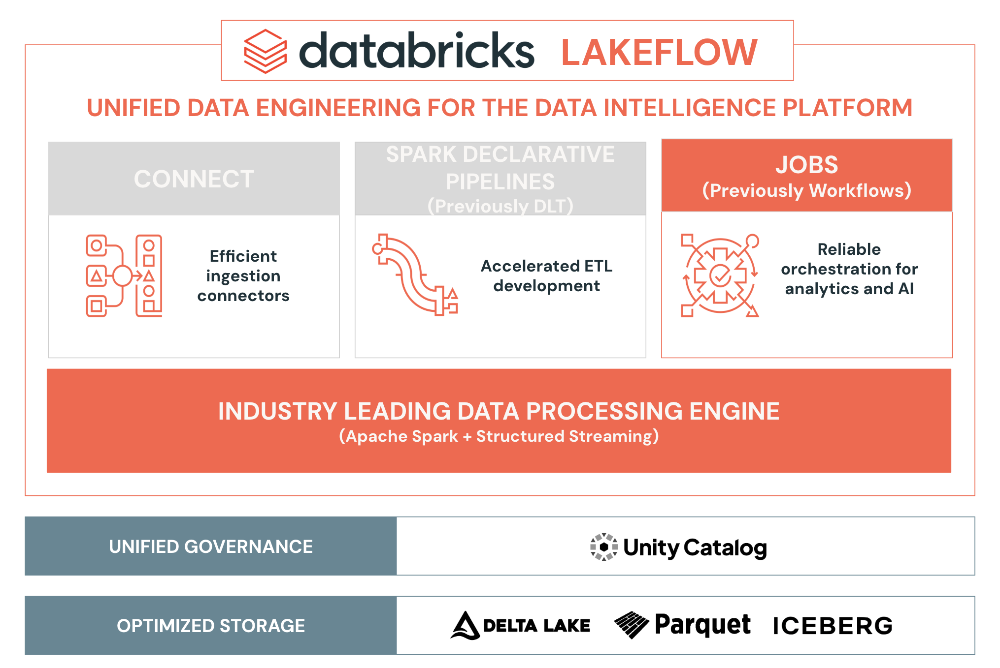

## A. Data Engineering in Databricks

### A1. Überblick über die Data-Engineering-Plattform

Alles beginnt mit optimiertem Speicher auf Basis von Delta Lake, Parquet oder Iceberg. Darauf baut eine einheitliche Governance mit Unity Catalog auf, und Lakeflow sorgt für durchgängiges, hochwertiges Data Engineering für Analytics und KI.

**databricks** **LAKEFLOW****EINHEITLICHES DATA ENGINEERING FÜR DIE DATA INTELLIGENCE PLATFORM****CONNECTEffiziente Ingestion-Connectors****APACHE SPARK DECLARATIVE PIPELINES (SDP)Beschleunigte ETL-Entwicklung****JOBSZuverlässige Orchestrierung für Analytics und KI****BRANCHENFÜHRENDE DATENVERARBEITUNGS-ENGINE(Apache Spark + Structured Streaming)****EINHEITLICHE GOVERNANCEUnity Catalog****OPTIMIERTER SPEICHER**Delta Lake|Parquet|Iceberg

##### Zusätzliche Hinweise
Alles beginnt mit optimiertem Speicher auf Basis von Delta Lake, Parquet oder Iceberg.

Auf dieser Speicherschicht baut eine einheitliche Governance mit Unity Catalog auf. Unity Catalog ist ein zentraler Datenkatalog, der Zugriffskontrolle, Auditing, Data Lineage, Qualitätsüberwachung und Datenerkennung über Databricks-Workspaces hinweg bereitstellt.

Databricks bietet dann Lakeflow an, eine End-to-End-Lösung für Data Engineering, mit der Data Engineers, Softwareentwickler, SQL-Entwickler, Analysten und Data Scientists hochwertige Daten für nachgelagerte Analytics-, KI- und operative Anwendungen bereitstellen können. Lakeflow bietet eine einheitliche Plattform für Daten-Ingestion, Transformation und Orchestrierung und umfasst die folgenden Komponenten:

- **Lakeflow Connect**: Eine Reihe effizienter Ingestion-Connectors, die das Ingestieren von Daten aus gängigen Unternehmensanwendungen, Datenbanken, Cloud-Speicher, Message Buses und lokalen Dateien vereinfachen.

- **Apache Spark Declarative Pipelines**: Ein Framework zum Erstellen von Batch- und Streaming-Daten-Pipelines mit SQL und Python, das die ETL-Entwicklung beschleunigen soll.

- **Lakeflow Jobs**: Ein Tool zur Workflow-Automatisierung für Databricks, das Datenverarbeitungs-Tasks und Workflows orchestriert. Es ermöglicht die Koordination mehrerer Tasks innerhalb komplexer Workflows und damit die Planung, Optimierung und Verwaltung wiederholbarer Prozesse.

### A2. Lakeflow Jobs

In diesem Kurs konzentrieren wir uns speziell auf Lakeflow Jobs – die Orchestrierungskomponente.

  

##### Zusätzliche Hinweise
Mit Lakeflow Jobs können Sie jede Art von Workload in Databricks orchestrieren, darunter Notebooks, SQL-Abfragen, Dashboards, Pipelines und vieles mehr. 

Genau dieser einheitliche Ansatz macht Lakeflow Jobs so leistungsfähig.

