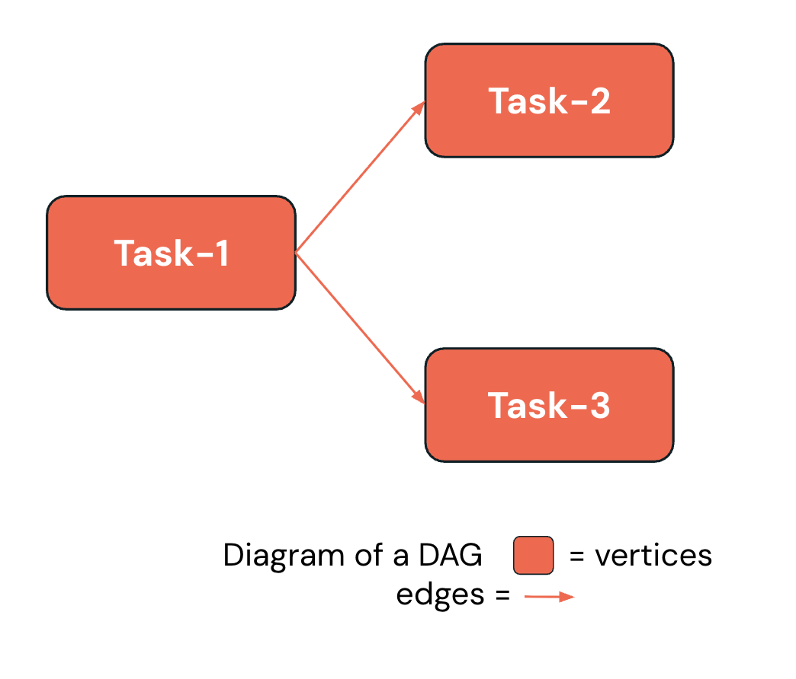
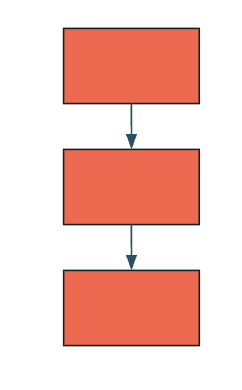
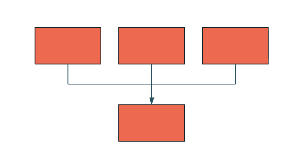
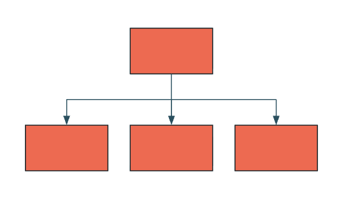

## B. Task-Orchestrierung

### B1. Was ist ein DAG?

Ein DAG ist eine **konzeptionelle Darstellung** einer Abfolge von Aktivitäten, einschließlich Datenverarbeitungsabläufen.

- **D**irected (gerichtet) – eindeutige Richtung für jede Kante
- **A**cyclic (azyklisch) – enthält keine Zyklen
- **G**raph – Menge von Knoten, die durch Kanten verbunden sind.

Das Diagramm zeigt einen einfachen DAG, bei dem **Task-1** sowohl zu **Task-2** als auch zu **Task-3** führt und so den Ausführungsfluss darstellt.

### B2. Task-Orchestrierung im Überblick

### Databricks Jobs unterstützt Task-Orchestrierung

#### Mehrere Tasks ausführen

   Die Möglichkeit, mehrere Tasks als **Directed Acyclic Graph (DAG)** auszuführen.

#### Tasks orchestrieren

   Orchestrieren Sie Tasks über die **Databricks-UI**, die **API**, das **SDK** oder **Databricks Asset Bundles**.

 Sie können die **Ausführungsreihenfolge der Tasks** in einem Job festlegen, indem Sie Task-Abhängigkeiten konfigurieren und so einen **DAG der Task-Ausführung** erstellen.

 Task-1

 Depends On: Task-1
 Task-2
 Task-3
 Depends On: Task-1

 Task-4
 Depends On: 

Task-2, Task-3

##### Zusätzliche Hinweise
Databricks Jobs unterstützt Task-Orchestrierung, indem mehrere Tasks als Directed Acyclic Graph (DAG) ausgeführt werden können. Sie können Tasks über die Databricks-UI, die API, das SDK oder Databricks Asset Bundles orchestrieren.

Das Beispiel zeigt: Task-4 hängt von Task-1 ab, Task-4 hängt von Task-2 und Task-3 ab, und Task-3 hängt von Task-1 ab. Sie legen die Ausführungsreihenfolge fest, indem Sie diese Task-Abhängigkeiten konfigurieren und so einen DAG der Task-Ausführung erstellen.

Mit diesem Ansatz können Sie komplexe Workflows erstellen und dabei eine klare Ausführungsreihenfolge und klare Abhängigkeiten beibehalten.

### B3. Gängige Workload-Muster

**Sequence (Sequenz)**

- Datentransformation/-verarbeitung/-bereinigung
- Bronze-/Silber-/Gold-Tabellen

**Funnel (Trichter)**

- Mehrere Datenquellen
- Datensammlung

**Fan-out**

- Fan-out, Sternmuster
- Einzelne Datenquelle
- Daten-Ingestion und -Verteilung

##### Zusätzliche Hinweise
Es gibt drei gängige Workflow-Muster, denen Sie begegnen werden:
- Das Sequence-Muster wird für Datentransformation, -verarbeitung, -bereinigung und den Aufbau von Bronze-/Silber-/Gold-Tabellen in einer Medallion-Architektur verwendet.
- Das Funnel-Muster führt mehrere Datenquellen zur Datensammlung und Konsolidierung zusammen.
- Das Fan-out- bzw. Sternmuster nimmt eine einzelne Datenquelle und verteilt sie zur Daten-Ingestion und Verteilung an mehrere nachgelagerte Systeme.

Das Verständnis dieser Muster hilft Ihnen, effektive Workflows für Ihre spezifischen Anwendungsfälle zu entwerfen.

