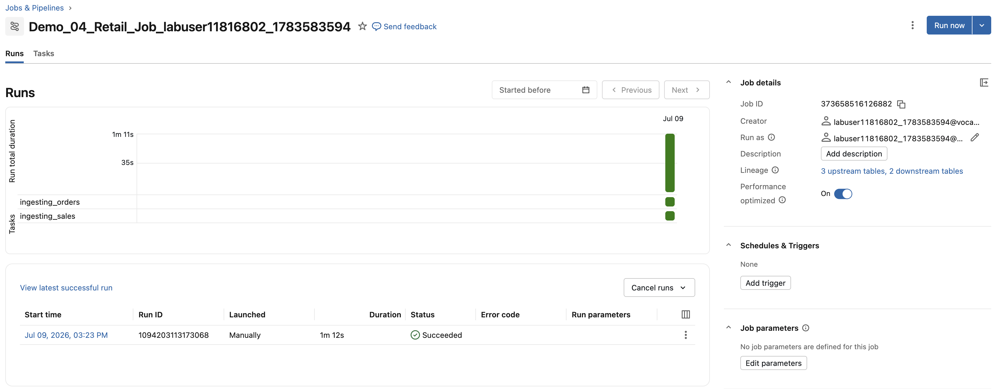

## F. Den Job-Run überprüfen

1. Klicken Sie auf der Seite Job Details oben links auf den Tab **Runs** (derzeit sollten Sie sich im Tab **Tasks** befinden).

2. Im Tab Runs Ihres Jobs sehen Sie detaillierte Informationen zu jedem Run.
   Oben befindet sich ein zeitbasiertes Balkendiagramm, bei dem:

   - die X-Achse jeden Run darstellt.
   - die Y-Achse die Dauer jedes Tasks innerhalb dieses Runs zeigt.
3. Farbcodierung
   -    Legende: grün = erfolgreich
   -    rot = fehlgeschlagen
   -    gelb = wartend/Wiederholung, 
   -    pink = übersprungen,
   -    grau = ausstehend/abgebrochen/Timeout.

Unter dem Diagramm finden Sie eine tabellarische Matrixansicht, die dieselben Informationen im Detail darstellt. Diese Tabelle beginnt mit dem Zeitstempel und enthält Felder wie run_id, Run-Status, Dauer und weitere relevante Details zu jedem Run.

4. Öffnen Sie die Ausgabedetails, indem Sie auf den Zeitstempel in der Spalte **Start time** klicken:

   - Wenn **der Job noch läuft**, sehen Sie im rechten Bereich den aktiven Zustand mit dem **Status** **Pending** oder **Running**.

   - Wenn **der Job abgeschlossen ist**, sehen Sie im rechten Bereich die vollständigen Ausführungsergebnisse mit dem **Status** **Succeeded** oder **Failed**.
