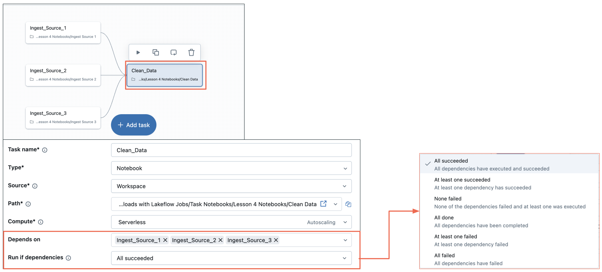

## B. Run if Conditional Task Dependencies

Run-if Conditional Dependencies ermöglichen eine feingranulare Steuerung der Task-Ausführung auf Basis der Ergebnisse vorgelagerter Tasks. Sie können bestimmte Bedingungen festlegen, die erfüllt sein müssen, damit ein Task ausgeführt wird.

### B1. Verfügbare Abhängigkeitsbedingungen

Task-Ausführung auf Basis der Ergebnisse vorgelagerter Tasks steuern

Unterstützt verschiedene Abhängigkeitsbedingungen wie:

- All succeeded
- At least one succeeded
- None failed
- Und mehr

**Beispiel – At Least One Succeeded**

In diesem Szenario läuft Task-4 auch dann, wenn Task-3 fehlschlägt.

Run if Conditional Task Dependencies
Task-1

Depends On: Task-1
Task-2
Task-3
Depends On: Task-1

Task-4
Depends On:

- Task-2
- Task-3

At least one succeeded

In diesem Szenario läuft Task-4 auch dann, wenn Task-3 fehlschlägt

##### Zusätzliche Hinweise
Run-if Conditional Dependencies ermöglichen eine feingranulare Steuerung der Task-Ausführung auf Basis der Ergebnisse vorgelagerter Tasks. Sie können bestimmte Bedingungen festlegen, die erfüllt sein müssen, damit ein Task ausgeführt wird.
**Verfügbare Abhängigkeitsbedingungen**

- **All succeeded:** Diese klassische Abhängigkeit erfordert, dass alle vorgelagerten Tasks erfolgreich abgeschlossen sind, bevor der nächste Task laufen kann.
- **At least one succeeded:** Diese Bedingung ist nützlich, wenn Sie redundante Datenquellen oder Verarbeitungspfade haben; der Workflow kann fortfahren, sobald auch nur einer der erforderlichen vorgelagerten Tasks erfolgreich ist.
- **None failed:** Damit kann ein Task auch dann ausgeführt werden, wenn einige vorgelagerte Tasks übersprungen wurden, solange keiner der vorgelagerten Tasks explizit fehlgeschlagen ist.
- **Benutzerdefinierte Kombinationen:** Diese Option ermöglicht die Umsetzung komplexer Geschäftslogik, die bestimmte Kombinationen von Task-Ergebnissen erfordert.

**Vorteile bedingter Abhängigkeiten**
Diese Abhängigkeiten erhöhen die Robustheit von Workflows und ermöglichen anspruchsvolle Geschäftslogik. Wenn beispielsweise Task-4 so eingestellt ist, dass er läuft, wenn „mindestens einer“ seiner Vorgänger (Task-2 oder Task-3) erfolgreich ist, kann er auch dann ausgeführt werden, wenn Task-3 fehlschlägt, während Task-2 erfolgreich abgeschlossen wird. Das verhindert Kaskadenfehler und ermöglicht es Workflows, die Verarbeitung fortzusetzen, auch wenn einige Komponenten ausfallen. Es hilft außerdem, reale Geschäftsprozesse abzubilden, bei denen es mehrere Wege zum Erfolg gibt und Teilausfälle nicht den gesamten Vorgang stoppen.
**So konfigurieren Sie es**
Sie können diese Abhängigkeitsbedingungen für einen Task in dessen Konfigurationseinstellungen im Abschnitt „run-if dependencies“ auswählen. Das sehen wir uns als Nächstes an.

### B2. Die visuelle Darstellung bedingter Abhängigkeiten verstehen

Die visuelle Darstellung bedingter Abhängigkeiten im Job-DAG vermittelt sofort ein Verständnis der Workflow-Logik.

### Visualisierung von Abhängigkeiten
Unterschiedliche Linienstile und Farben kennzeichnen unterschiedliche Abhängigkeitstypen, sodass komplexe Logik auf einen Blick verständlich wird.
### Vorteile bei der Fehlerbehebung
Wenn Fehler auftreten, zeigt die visuelle Darstellung sofort, welche Tasks betroffen waren und welche weiterlaufen konnten.
### Kommunikation im Team
Visuelle Workflows dienen als lebendige Dokumentation, die sowohl technische als auch fachliche Stakeholder verstehen können.

##### Zusätzliche Hinweise
Die visuelle Darstellung bedingter Abhängigkeiten im Job-DAG vermittelt sofort ein Verständnis der Workflow-Logik:

- **Visualisierung von Abhängigkeiten:** Unterschiedliche Linienstile und Farben kennzeichnen unterschiedliche Abhängigkeitstypen, sodass komplexe Logik auf einen Blick verständlich wird.
- **Vorteile bei der Fehlerbehebung:** Wenn Fehler auftreten, zeigt die visuelle Darstellung sofort, welche Tasks betroffen waren und welche weiterlaufen konnten, was die Ursachenanalyse beschleunigt.
- **Kommunikation im Team:** Visuelle Workflows dienen als lebendige Dokumentation, die sowohl technische als auch fachliche Stakeholder verstehen können, und verbessern so Zusammenarbeit und Change Management.

### B3. Diagramm des Ausführungsablaufs

Das Diagramm des Ausführungsablaufs veranschaulicht, wie bedingte Abhängigkeiten in der Praxis funktionieren.

1. Job-Initialisierung

Die ersten drei Tasks werden ausgeführt2. Warten, bis alle Tasks abgeschlossen sind

(All succeeded)3. Abhängiger Task gestartet

### Job-Initialisierung
Das System wertet alle Task-Abhängigkeiten aus und bestimmt die anfängliche Ausführungsmenge. 

Beachten Sie, dass alle Tasks gleichzeitig laufen.
### Auswertung der Bedingungen
Während Tasks abgeschlossen werden, prüft das System fortlaufend neu, welche nachgelagerten Tasks auf Basis ihrer Abhängigkeitsbedingungen ausgeführt werden können. 

Beachten Sie, dass 'Ingest_Source_2' und 'Ingest_Source_3' abgeschlossen sind und darauf warten, dass "Ingest_Source_1" fertig wird, bevor es mit dem Task 'All_Data_Ingested' weitergeht.
### Dynamische Ausführung
So entstehen wirklich dynamische Workflows, bei denen der Ausführungspfad nicht vorab festgelegt ist, sondern sich an die tatsächlichen Verarbeitungsergebnisse anpasst. 

Beachten Sie, dass der letzte Task gestartet ist, sobald alle drei Tasks abgeschlossen sind.

##### Zusätzliche Hinweise
Das Diagramm des Ausführungsablaufs veranschaulicht, wie bedingte Abhängigkeiten in der Praxis funktionieren:

- **Job-Initialisierung:** Das System wertet alle Task-Abhängigkeiten aus und bestimmt die anfängliche Ausführungsmenge. Beachten Sie, dass alle Tasks gleichzeitig laufen.
- **Auswertung der Bedingungen:** Während Tasks abgeschlossen werden (erfolgreich oder mit Fehlern), prüft das System fortlaufend neu, welche nachgelagerten Tasks auf Basis ihrer Abhängigkeitsbedingungen ausgeführt werden können. Beachten Sie, dass 'Ingest_Source_2' und 'Ingest_Source_3' abgeschlossen sind und darauf warten, dass "Ingest_Source_1" fertig wird, bevor es mit dem Task 'All_Data_Ingested' weitergeht.
- **Dynamische Ausführung:** So entstehen wirklich dynamische Workflows, bei denen der Ausführungspfad nicht vorab festgelegt ist, sondern sich an die tatsächlichen Verarbeitungsergebnisse anpasst. Beachten Sie, dass der letzte Task gestartet ist, sobald alle drei Tasks abgeschlossen sind.

