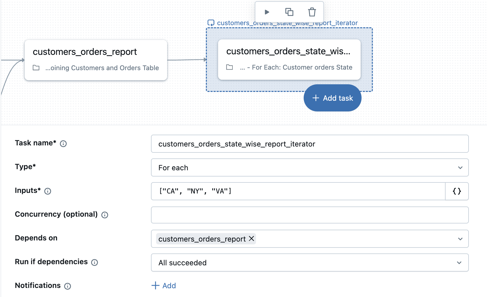

## D. For-Each-Task

For-Each-Tasks ermöglichen leistungsfähige iterative Verarbeitungsmuster, die die Vorteile der visuellen Workflow-Verwaltung beibehalten und gleichzeitig wiederkehrende Operationen effizient abarbeiten.

For Each iteriert über ein Eingabe-Array und führt für jedes Element denselben verschachtelten Task aus, wobei das Element als **{{input}}** übergeben wird.
Iterationen können mit konfigurierbarer Parallelität gleichzeitig laufen, um die Ausführung zu beschleunigen.
Nachgelagerte Abhängigkeiten werden an den For-Each-Container geknüpft, nicht an den verschachtelten Task.

##### Zusätzliche Hinweise
For-Each-Tasks bieten ausgefeilte Iterationsmöglichkeiten:

- **Verarbeitung der Eingabe:** Der Task iteriert über ein Eingabe-Array und übergibt jedes Element als {{input}} an den verschachtelten Task. So entsteht eine saubere, parametrisierte Verarbeitung, bei der dieselbe Logik unterschiedliche Datenpartitionen verarbeitet.
- **Parallele Ausführung:** Konfigurierbare Parallelität ermöglicht es, mehrere Iterationen gleichzeitig auszuführen, was die Performance bei unabhängigen Verarbeitungsaufgaben erheblich verbessert.
- **Abhängigkeitsverwaltung:** Nachgelagerte Tasks hängen vom Abschluss des gesamten For-Each-Containers ab, nicht von einzelnen Iterationen. Das vereinfacht die Abhängigkeitsverwaltung und stellt sicher, dass alle Iterationen abgeschlossen sind, bevor die nachgelagerte Verarbeitung beginnt.

**Beispiele für Anwendungsfälle:**

- Geografische Verarbeitung: Daten für jedes Bundesland/jede Region parallel verarbeiten
- Verarbeitung nach Zeiträumen: Unterschiedliche Datumsbereiche mit derselben Logik verarbeiten
- Verarbeitung nach Kundensegmenten: Dieselbe Analyse auf unterschiedliche Kundensegmente anwenden
- Dateiverarbeitung: Mehrere Dateien mit identischer Logik verarbeiten

Das Container-Konzept ist entscheidend für das Verständnis des Verhaltens von For-Each-Tasks:

- **Container-Verwaltung:** Der For-Each-Task fungiert als eine einzelne logische Einheit in Ihrem Workflow, auch wenn er intern mehrere Iterationen ausführt.
- **Vereinfachte Abhängigkeiten:** Nachgelagerte Tasks müssen nur vom For-Each-Container abhängen, nicht von jeder einzelnen Iteration, wodurch Workflow-Diagramme übersichtlich und handhabbar bleiben.
- **Ressourcenverwaltung:** Der Container verwaltet die Ressourcenzuweisung über die Iterationen hinweg, optimiert die Cluster-Auslastung und verhindert Ressourcenkonflikte.

### D1. For-Each-Task

Die Implementierung von For-Each-Tasks erfordert das Verständnis zweier unterschiedlicher Komponenten:

1. For-Each-Task2. Verschachtelter Task

### Der For-Each-Task
Der übergeordnete Container-Task, der die Schleife verwaltet.
### Ein verschachtelter Task
Der eigentliche Task, der für jede Iteration ausgeführt wird.

##### Zusätzliche Hinweise
Die Implementierung von For-Each-Tasks erfordert das Verständnis zweier unterschiedlicher Komponenten:

- **Der For-Each-Container:** Dieser übergeordnete Task verwaltet die Iterationslogik, die Verarbeitung des Eingabe-Arrays, die Parallelitätseinstellungen und die Ressourcenzuweisung. Er legt fest, wie viele Iterationen parallel laufen und wie das Eingabe-Array verarbeitet wird.
- **Der verschachtelte Task:** Das ist die eigentliche Arbeit, die für jede Iteration ausgeführt wird. Es kann jeder Task-Typ sein – Notebook, SQL, Python-Skript usw. Der verschachtelte Task erhält jedes Array-Element als `{{input}}` und verarbeitet es gemäß Ihrer Geschäftslogik.
- **Flexible Konfiguration:** Diese Trennung ermöglicht es, das Iterationsverhalten unabhängig von der Verarbeitungslogik zu konfigurieren, wodurch For-Each-Tasks sowohl leistungsfähig als auch wartbar sind.

