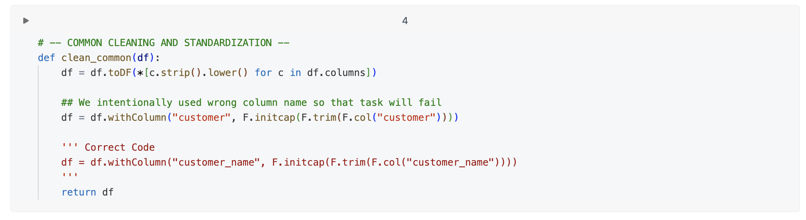

## G. Job-Runs reparieren

Sie können die in einem Task verwendeten Notebooks einschließlich ihrer Ausgabe als Teil eines Job-Runs ansehen. Das hilft bei der Fehlerdiagnose. Außerdem können Sie bestimmte Tasks in einem fehlgeschlagenen Job-Run erneut ausführen.

Betrachten Sie dieses Beispiel:

Sie entwickeln einen Job mit mehreren Notebooks. Während eines Job-Runs schlägt einer der Tasks fehl. Sie können den Code in diesem Notebook aktualisieren und den fehlgeschlagenen Task sowie alle davon abhängigen Tasks erneut ausführen. Sie können auch Task-Parameter ändern und den Task erneut ausführen. Gehen wir diesen Prozess durch:

1. Klicken Sie oben rechts auf **Repair run**.

2. Öffnen Sie [Task Files/Lesson 12 Files/12.1 - Transforming Customers Orders State Wise Data]($./Task Files/Lesson 12 Files/12.1 - Transforming Customers Orders State Wise Data) und beachten Sie, dass die Funktion `def clean_common` einen falschen Spaltennamen verwendet.

3. Ändern Sie im Code-Skript den Spaltennamen von `customer` in `customer_name`.

4. Kehren Sie zu Ihrem Job-Run zurück. Klicken Sie oben rechts auf **Repair run**. Stellen Sie sicher, dass der Task **transforming_customers_orders_data** ausgewählt ist.

5. Die „1“ in der Schaltfläche **Repair run** zeigt an, dass Databricks sowohl den fehlgeschlagenen als auch den abhängigen Task ausgewählt hat. Sie können beliebige Tasks, die Sie erneut ausführen möchten, aus- oder abwählen.

6. Warten Sie, bis der Run abgeschlossen ist.
