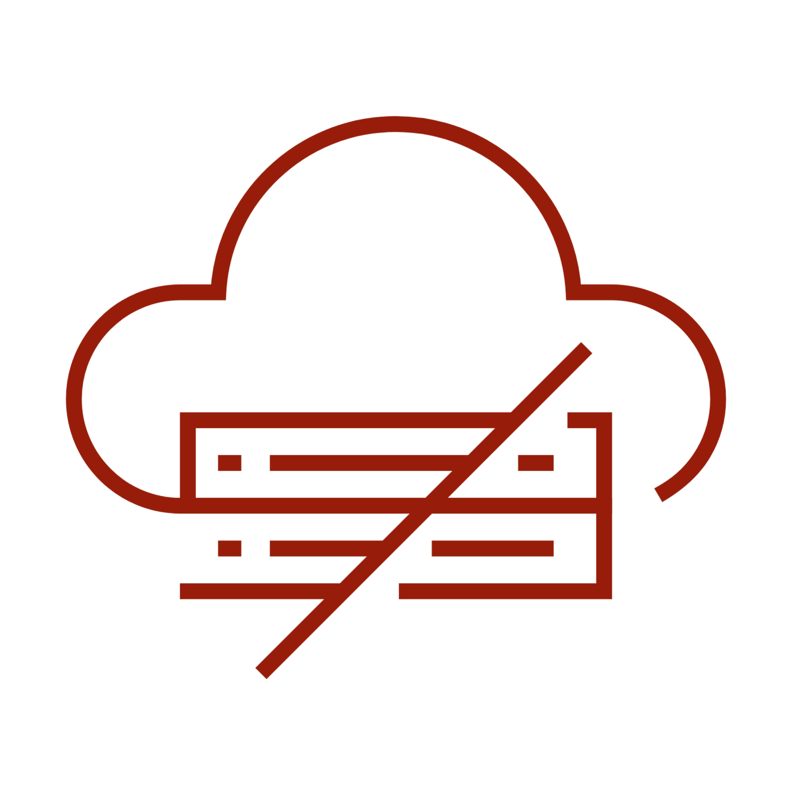
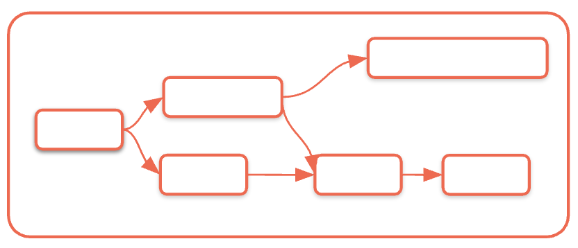
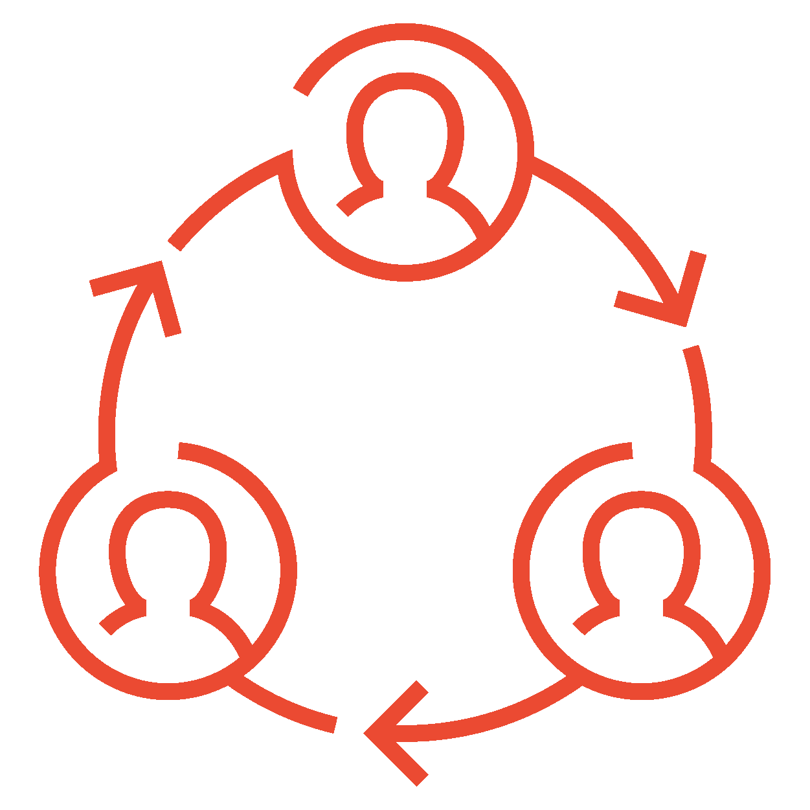
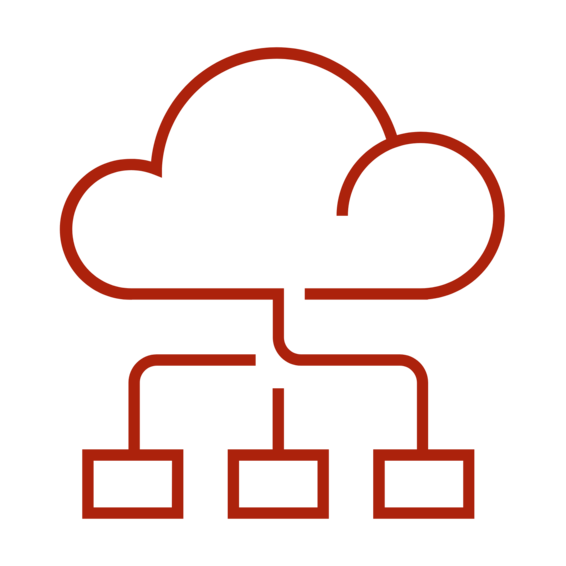
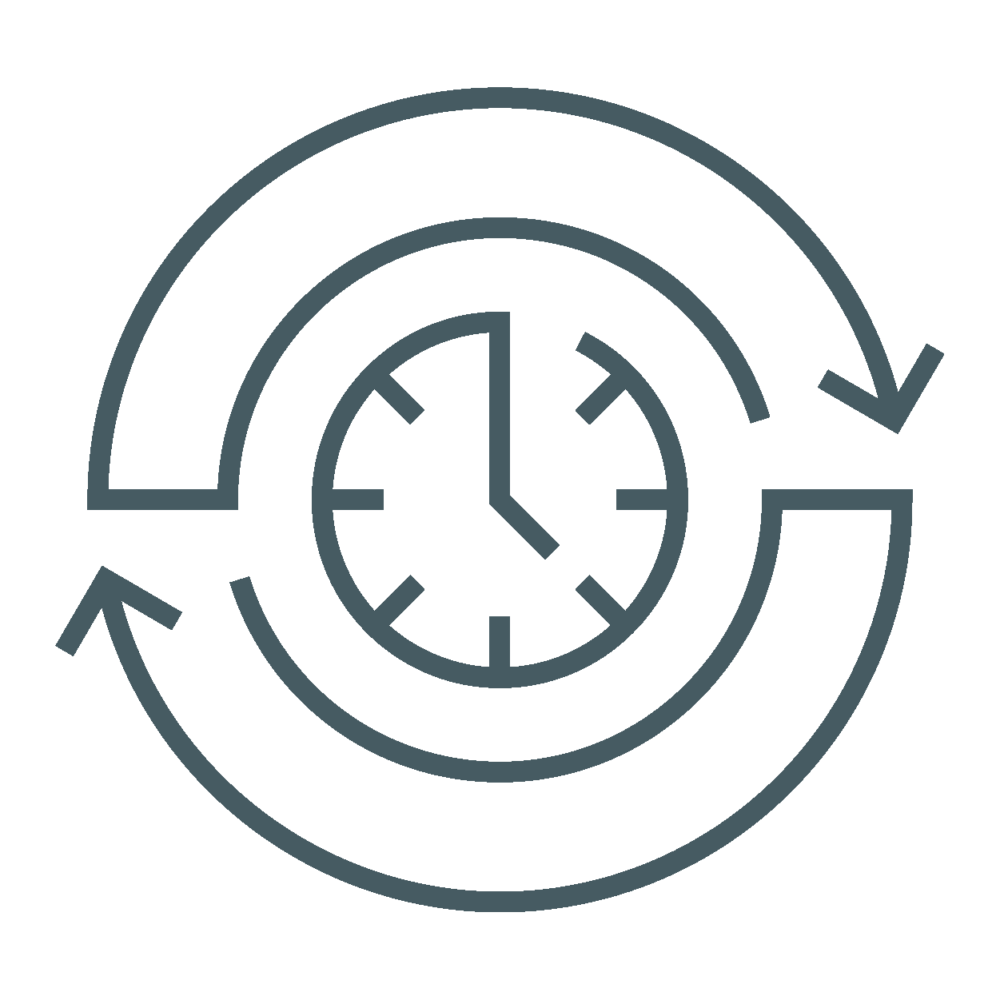

## A. Gängige Best Practices

Der Übergang von der Entwicklung in die Produktion erfordert das Verständnis, wie Lakeflow Jobs im Unternehmensmaßstab mit angemessener Governance, Sicherheit und Betriebspraxis entworfen, bereitgestellt und betrieben werden.

### Compute
Die richtigen Compute-Optionen für Performance-, Kosten- und Betriebsanforderungen auswählen.

### Modulares Design
Architekturmuster umsetzen, die Wartbarkeit, Wiederverwendbarkeit und Zusammenarbeit im Team unterstützen.

### Git
Versionskontroll- und Deployment-Praktiken, die Konsistenz sicherstellen und CI/CD-Workflows ermöglichen.

##### Zusätzliche Hinweise
Produktions-Deployments erfordern Aufmerksamkeit in vier kritischen Bereichen:

- **Compute-Strategie:** Die richtigen Compute-Optionen für Performance-, Kosten- und Betriebsanforderungen auswählen.
- **Modulares Design:** Architekturmuster umsetzen, die Wartbarkeit, Wiederverwendbarkeit und Zusammenarbeit im Team unterstützen.
- **Git-Integration:** Versionskontroll- und Deployment-Praktiken, die Konsistenz sicherstellen und CI/CD-Workflows ermöglichen.
- **Performance-Monitoring:** Proaktive Monitoring- und Optimierungsstrategien, die die Einhaltung von SLAs und Kosteneffizienz sicherstellen.

### A1. Compute auswählen

### Interactive Clusters

- Am besten für Ad-hoc-Analysen, Datenexploration oder Entwicklung, aber nicht für die Produktion
- Teuer für Job-Runs
- Begrenzte Skalierbarkeit
- Die Verfügbarkeit kann aufgrund paralleler Nutzung ein Problem sein

### Job Clusters

- Günstiger, da sie beim Ende des Jobs beendet werden und so Ressourcenverbrauch und Kosten senken
- Startlatenz
- Abhängig von der Startzeit des Cloud-Anbieters
- Wartungsaufwand

Serverless Compute**Einfachheit**Sie müssen den VM-Typ nicht mehr auswählen. Kunden benötigen keine speziell ausgebildeten DevOps-Mitarbeiter.**Hohe Effizienz**Photon ist standardmäßig aktiviert.**Schnellerer Start**VMs laufen im Databricks-Konto. Wir stellen auf Basis historischer Daten und ML sicher, dass genügend Knoten verfügbar sind.**Zuverlässigkeit**Abgeschirmt gegen Störungen in der Cloud.

##### Zusätzliche Hinweise
Das Verständnis der Compute-Optionen ist entscheidend für den Erfolg in der Produktion:

- **Interactive Clusters** sind ideal für Entwicklung und Ad-hoc-Analysen, bringen aber erhebliche Herausforderungen für den Produktionseinsatz mit sich: **Kostenprobleme:** Interaktive Cluster laufen weiter, auch wenn keine Jobs ausgeführt werden, was zu unnötigen Kosten führt
- **Begrenzte Skalierbarkeit:** Gemeinsam genutzte Ressourcen können zu Konkurrenz und unvorhersehbarer Performance führen
- **Verfügbarkeitsprobleme:** Wenn mehrere Benutzer Cluster teilen, kann es zu Ressourcenkonflikten und Job-Verzögerungen kommen
**Job Clusters** bieten bessere Eigenschaften für die Produktion:
- **Kosteneffizienz:** Cluster werden beendet, wenn Jobs abgeschlossen sind, wodurch Kosten für ungenutzte Ressourcen entfallen
- **Dedizierte Ressourcen:** Jeder Job erhält dedizierte Compute-Ressourcen, was eine vorhersehbare Performance sicherstellt
- **Startlatenz:** Startzeiten der Cloud-Anbieter können die Job-Ausführung verzögern und müssen bei der SLA-Planung berücksichtigt werden
- **Wartungsaufwand:** Erfordert mehr Konfiguration und Verwaltung als Serverless-Optionen
**Serverless Compute** ist für die meisten Produktions-Workloads die optimale Wahl, da es operative Einfachheit, Performance-Optimierung, Zuverlässigkeit und Geschwindigkeit sowie Unabhängigkeit von der Cloud bietet.

### A2. Preisstruktur

Das klassische Preismodell umfasst mehrere Kostenkomponenten, während Serverless das Kostenmodell grundlegend vereinfacht.

##### Wählen Sie unten die einzelnen Tabs aus, um die Preise von Classic und Serverless zu vergleichen.

Classic
Serverless

Classic

DBUs (an Databricks gezahlt)
Infrastrukturkosten (an den Cloud-Anbieter gezahlt)
Betriebskosten (auf Organisationsebene anfallend)

Kosten für VMs für Cluster
Kosten für das Netzwerk (FW / NAT)
Kosten für Sicherheit, Auslastungsmonitoring
Zeitaufwand für Deployment, Automatisierung und Wartung der Infrastruktur
Zeitaufwand für das Management von Kosten, Effizienz und Auslastung

Serverless

TCO-Einsparungen
DBUs (eine einzige Rechnung, die

Infrastruktur- und Betriebs-

kosten enthält)

Mehrwert
Vollständig verwalteter Dienst – operativ einfacher, zuver-

lässiger
Schnelle Cluster, Auto-Scaling – bessere Benutzererfahrung, geringere

Kosten
Sofort verfügbare Performance und Optimierungen – niedrigere

Gesamt-TCO

##### Zusätzliche Hinweise
Das klassische Preismodell umfasst mehrere Kostenkomponenten:

- **Direkte Kosten:** An Databricks gezahlte DBUs plus direkt an Cloud-Anbieter gezahlte Infrastrukturkosten (VMs, Netzwerk, Sicherheitsdienste).
- **Operativer Aufwand:** Oft übersehene, aber erhebliche Kosten, darunter der Zeitaufwand für Infrastruktur-Deployment, Automatisierungsentwicklung, Wartungsarbeiten, Kostenmonitoring und Effizienzoptimierung.
- **Versteckte Komplexität:** Verwaltung mehrerer Abrechnungsbeziehungen, Optimierung über verschiedene Kostenkategorien hinweg und Aufrechterhaltung von Know-how im Management von Cloud-Infrastruktur.

Serverless vereinfacht das Kostenmodell grundlegend:

- **Einheitliche Abrechnung:** Ein einziger DBU-Preis, der Infrastruktur- und Betriebskosten enthält, sodass keine mehreren Anbieterbeziehungen und Kostenoptimierungsstrategien verwaltet werden müssen.
- **Nutzenversprechen:** Der vollständig verwaltete Dienst bietet operative Einfachheit und Verbesserungen der Zuverlässigkeit, die höhere Kosten pro Einheit durch geringeren operativen Aufwand oft rechtfertigen.
- **Performance-Vorteile:** Auto-Scaling und sofort verfügbare Optimierungen liefern oft eine bessere Performance zu geringeren Gesamtkosten als selbst verwaltete Alternativen.
- **TCO-Vorteile:** Wenn man den operativen Aufwand einrechnet, sind die Gesamtbetriebskosten (TCO) mit Serverless in der Regel niedriger, insbesondere für Organisationen ohne eigene Platform-Engineering-Teams.

