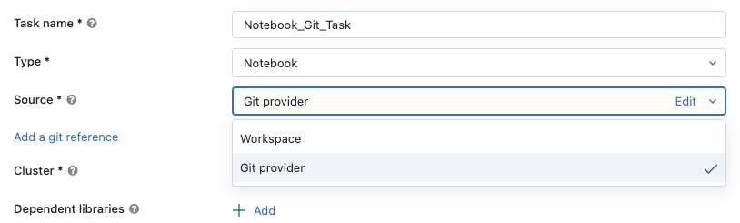
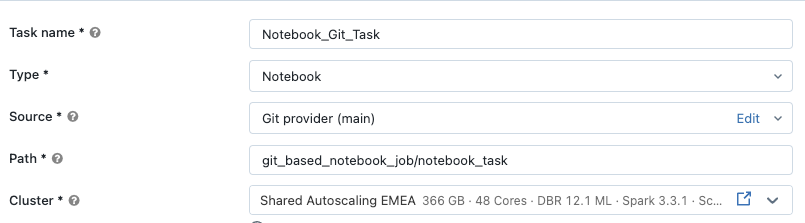

## C. Jobs und Git

↓**Job**
**Jobs unterstützen die Ausführung von Notebooks aus Git.**
### Unbeabsichtigte Änderungen verhindern
Dies verhindert unbeabsichtigte Änderungen an Ihrem Produktions-Job, zum Beispiel wenn ein anderer Benutzer lokale Änderungen in einem „Prod“-Repo vornimmt oder den Branch wechselt.
### Single Source of Truth
Vereinfacht die Job-Definition durch eine einzige verbindliche Quelle.
### CI/CD-Deployment
Erleichtert das Deployment von Notebooks über CI/CD.
### Unterstützung von Git-Plattformen
Benutzer können sich mit verschiedenen Git-Plattformen verbinden, da Databricks GitHub, GitLab, AWS CodeCommit und andere Git-Anbieter unterstützt.

##### Zusätzliche Hinweise
Die Git-Integration bietet wesentliche Funktionen für die Verwaltung produktiver Workflows:

- **Change Management:** Verhindert unbeabsichtigte Änderungen an Produktions-Jobs, indem sichergestellt wird, dass alle Änderungen ordnungsgemäße Versionskontrollprozesse durchlaufen.
- **Single Source of Truth:** Beseitigt Unklarheiten darüber, welche Codeversion in der Produktion läuft, da immer committeter Code aus bestimmten Branches oder Tags ausgeführt wird.
- **CI/CD-Integration:** Ermöglicht automatisierte Test- und Deployment-Pipelines, die Änderungen validieren können, bevor sie Produktionsumgebungen erreichen.
- **Plattformunterstützung:** Die breite Kompatibilität mit GitHub, GitLab, AWS CodeCommit und anderen Git-Anbietern stellt sicher, dass Sie sich unabhängig von Ihrer gewählten Plattform in bestehende Entwicklungs-Workflows integrieren können.
- **Vorteile für die Zusammenarbeit:** Mehrere Entwickler können mithilfe standardmäßiger Git-Workflows (Branches, Pull Requests, Code Reviews) gemeinsam an der Workflow-Entwicklung arbeiten, während die Stabilität der Produktion erhalten bleibt.

### C1. Konfigurationsschritte für Jobs und Git

1
### Task mit Git-Anbieter als Quelle erstellen
Erstellen Sie Tasks mit einem Git-Anbieter als Quelle und geben Sie Repository, Branch/Tag und Anmeldeinformationen an.
2
### Pfad zum Haupt-Notebook unter dem Repository-Root konfigurieren
Konfigurieren Sie den Pfad zu Ihrem Haupt-Notebook unter dem Repository-Root, damit der Job den richtigen Einstiegspunkt Ihres Workflows finden und ausführen kann.

##### Zusätzliche Hinweise
Die Umsetzung der Git-Integration umfasst zwei einfache Schritte:

- **Schritt 1 – Konfiguration der Quelle:** Erstellen Sie Tasks mit einem Git-Anbieter als Quelle und geben Sie Repository, Branch/Tag und Anmeldeinformationen an. So stellen Sie sicher, dass Ihr Job immer die committete Version Ihres Codes ausführt.
- **Schritt 2 – Konfiguration des Pfads:** Konfigurieren Sie den Pfad zu Ihrem Haupt-Notebook unter dem Repository-Root, damit der Job den richtigen Einstiegspunkt Ihres Workflows finden und ausführen kann.
- **Best Practices:** Verwenden Sie für die Produktion bestimmte Branches oder Tags statt sich ständig ändernder Main-Branches, führen Sie vor dem Mergen in Produktions-Branches ordentliche Code-Review-Prozesse durch und dokumentieren Sie klar, welche Repositories und Pfade Code für Produktions-Jobs enthalten.

