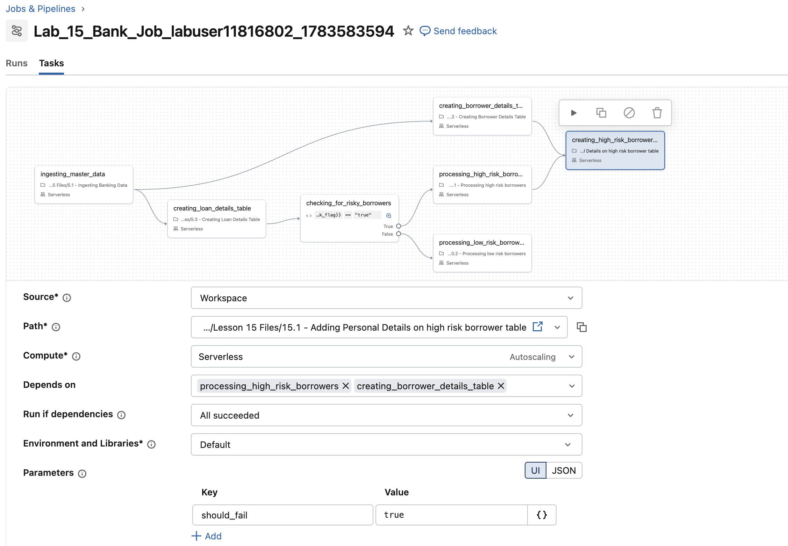

## E. Neue Tasks zum Master-Job hinzufügen

Als Nächstes fügen Sie Ihrem Master-Job sowohl einen Notebook-Task als auch einen Run-Job-Task hinzu.

#### E1. Einen Notebook-Task hinzufügen

1. Rufen Sie unter **Jobs & Pipelines** alle Jobs auf und wählen Sie Ihren Master-Job namens **Lab_15<-your schema name->**.

2. Klicken Sie auf **Add Task**, wählen Sie **Notebook** und konfigurieren Sie den Task wie folgt:

| Einstellung  | Anweisungen |
|--------------|--------------|
| Task name    | Geben Sie **creating_high_risk_borrower_gold_table** ein |
| Type         | Wählen Sie **Notebook** |
| Source       | Wählen Sie **Workspace** |
| Path         | Geben Sie mit dem Navigator den Pfad [Task Files/Lesson 15 Files/15.1 - Adding Personal Details on high risk borrower table]($./Task Files/Lesson 15 Files/15.1 - Adding Personal Details on high risk borrower table) unter **Lesson 15 Files** an |
| Compute      | Wählen Sie **Serverless** |
| Depends on   | Wählen Sie **processing_high_risk_borrowers** und **creating_borrower_details_table** |
| Run if dependencies | Wählen Sie **All Succeeded** |
| Parameters   | Klicken Sie auf **Add**. Geben Sie als Schlüssel **should_fail** und als Wert **"true"** ein |

3. Klicken Sie auf **Create task**.

#### E2. Einen Run-Job-Task hinzufügen

1. Klicken Sie in der linken Navigationsleiste mit der rechten Maustaste auf **Jobs and Pipelines** und öffnen Sie den Link in einem neuen Tab.

2. Wechseln Sie zum Master-Job namens **Lab_15<-your schema name->**.

3. Klicken Sie auf **Add Task**, wählen Sie **Run Job** und konfigurieren Sie den Task wie folgt:

| Einstellung  | Anweisungen |
|--------------|--------------|
| Task name    | Geben Sie **creating_low_risk_borrower_gold_table** ein |
| Type         | Stellen Sie sicher, dass **Run Job** ausgewählt ist |
| Job       | Wählen Sie **Lab_15_Run_Job** |
| Depends      | Wählen Sie **processing_low_risk_borrowers** und **creating_borrower_details_table** |
| Run if dependencies | Wählen Sie **All Succeeded** |

4. Klicken Sie auf **Create task**.

5. Klicken Sie auf **Run Now**, um den gesamten Job auszuführen.
