# Workloads mit Lakeflow Jobs bereitstellen (Deploy Workloads with Lakeflow Jobs)

[Website](https://customer-academy.databricks.com/learn/learning-plans/10/data-engineer-learning-plan/courses/1365/deploy-workloads-with-lakeflow-jobs/lessons)

Kursmaterial und Code unter: [Further Learning](https://customer-academy.databricks.com/learn/courses/2978/Deploy%20Workloads%20with%20Lakeflow%20Jobs)

[Vocareum](https://labs.vocareum.com/main/vnav.php?m=vnb&mode=s&asnid=4635210&stepid=4635211&hideNavBar=1#)

# 1_Einführung in Data Engineering in Databricks

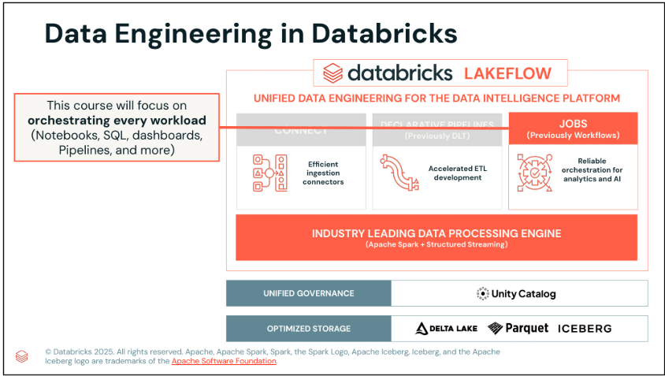

Das folgende Diagramm zeigt eine grundlegende Herausforderung moderner Datenarchitekturen:
die Wahl des richtigen Orchestrierungsansatzes für Lakehouse-Workloads. 

- Der linke Bereich zeigt mehrere Optionen, darunter Open-Source-Lösungen (Apache Airflow, Prefect, Dagster, dbt), Cloud-native Dienste (AWS, Azure, Google Cloud) und eigene interne Frameworks.

- Das Diagramm rechts zeigt einen typischen Daten-Workflow mit mehreren Schritten: Ingestion von Sessions- und Clicks-Daten, deren Verknüpfung (Join), Featurisierung und Aggregation, Analyse und Modelltraining. Anschließend gibt es verschiedene nachgelagerte Verwendungen, darunter BI & Data Warehousing, Data Streaming sowie Data Science & ML.

Das Fragezeichen steht hier für eine zentrale Herausforderung: Es gibt viele Möglichkeiten, diese Workloads zu orchestrieren – aber welcher Ansatz ist der beste?

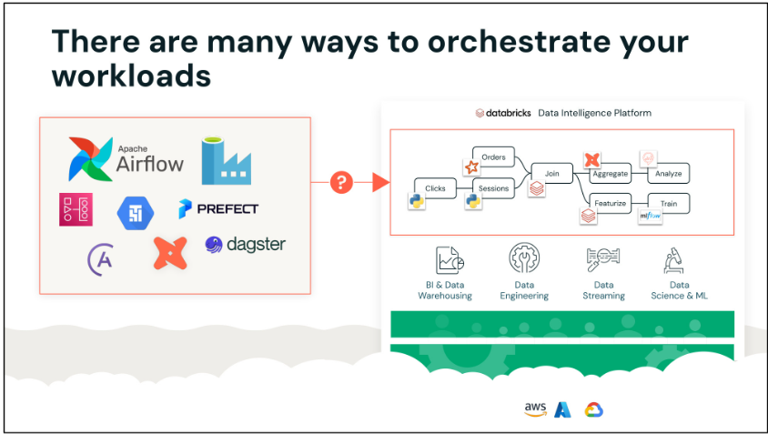

**Externe Orchestratoren bringen Herausforderungen mit sich**

Viele Organisationen verwenden externe Orchestrierungstools, was jedoch erhebliche Herausforderungen mit sich bringt. 

- Datenteams werden weniger produktiv, da diese Tools für viele Anwender schwer zu bedienen sind. Schlechte Datenqualität mindert den Wert nachgelagerter Anwendungen.
- Außerdem haben Sie höhere Betriebskosten und eine geringere Zuverlässigkeit. Wenn Probleme auftreten, ist es schwierig, die Ursache zu verstehen. Die komplexe Architektur wird schwer zu verwalten und zu warten.
- Vor allem sind diese externen Tools nicht in Ihr Lakehouse integriert, was zu Integrationsproblemen und Datensilos führt.

**Was ist Lakeflow Jobs?**

Hier kommt Lakeflow Jobs ins Spiel. Es bietet eine einheitliche Orchestrierung für Daten-, Analytics- und KI-Workloads direkt auf der Data Intelligence Platform.

Die wichtigsten Vorteile sind einfache Erstellung, umsetzbare Erkenntnisse und bewährte Zuverlässigkeit. Da es nativ in die Plattform integriert ist, arbeitet es nahtlos mit Daten-Ingestion & -Transformation, der Verarbeitungs-Engine (Photon), Governance (Unity Catalog), Speicher (Delta Lake), Data Warehousing und Machine-Learning-Funktionen zusammen.

Der hier gezeigte Workflow – von Sessions und Clicks über Join, Featurize, Aggregate, Analyze bis Train – läuft vollständig nativ innerhalb derselben Plattform und beseitigt die Integrationsprobleme externer Tools.

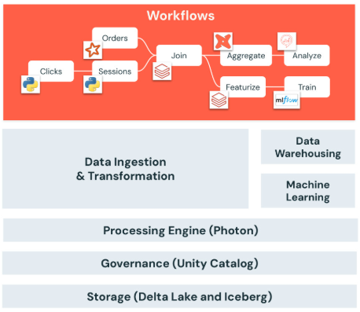  

- Diese Folie zeigt die vollständige Architektur von Lakeflow Jobs. Im Zentrum steht die Workflow-Engine, die alles koordiniert.
- Die Compute-Schicht unterstützt verschiedene Workload-Typen: ETL-, ML/KI- und Analytics/BI-Operationen.
- Es gibt mehrere Trigger-Typen: Scheduled (zeitbasiert), Continuous (dauerhaft laufend), File Arrival (ereignisgesteuert) und Table Updates.
- Zwei zentrale Komponenten unterstützen das gesamte System: 
  - Observability für Monitoring und Fehlerbehebung
  - Control Flow für die Verwaltung von Task-Abhängigkeiten und Ausführungsreihenfolge.
- 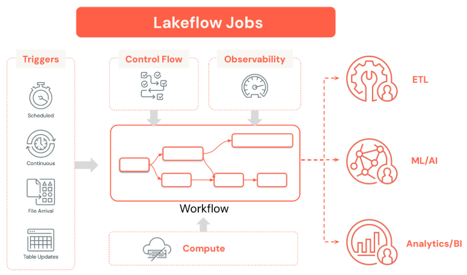

# 2_Kernkomponenten von Lakeflow Jobs

## 2_1_Bausteine von Lakeflow Jobs

- Ein Job ist die zentrale Ressource für:
  - Planung (Scheduling)
  - Koordination
  - Ausführung von Operationen wie Datenverarbeitung, ETL, Analytics und Machine-Learning-Workloads
in der Databricks-Umgebung.
- Ein Task ist eine einzelne Arbeitseinheit innerhalb eines Jobs, die einen bestimmten Workload ausführt, z. B. ein Notebook,
  ein Skript, eine Abfrage und mehr.
- Jeder Job besteht aus einem oder mehreren Tasks, den einzelnen Arbeitseinheiten, aus denen sich der Job zusammensetzt

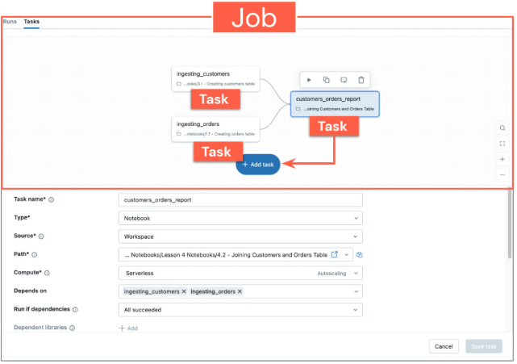

**Task-Typen**

Jobs bestehen aus einem oder mehreren Tasks, und es stehen viele verschiedene Task-Typen zur Verfügung. 

Sie können verwenden: 

- Databricks-Notebooks in jeder unterstützten Sprache, 
- Python-Skripte, 
- Python Wheels für paketierten Code, 
- SQL-Dateien und -Abfragen für Datentransformationen, 
- DLT (Declarative Pipelines), 
- dbt für Datentransformationen, 
- Java-JAR-Dateien, 
- Spark-Submit-Jobs für ältere Spark-Anwendungen, 
- AI/BI-Dashboards zur Visualisierung, 
- und sogar eine Power-BI-Integration.

Diese Vielfalt stellt sicher, dass Sie praktisch jede Art von Workload innerhalb Ihres Jobs orchestrieren können.

**Control Flows**

- Sequenziell
- Parallel
- Bedingt
- Run Job
- For each


**Job-Trigger**

- Scheduled (Cron)
- API-Trigger
- File Arrival Trigger
- Table Trigger
- Continuous (Streaming)
- Manueller Trigger

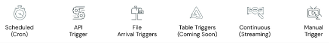

**Compute**

Jobs können auf verschiedenen Compute-Typen ausgeführt werden, und die Wahl des richtigen Computes ist sowohl für die Performance als auch für die Kosten entscheidend:

- **Interactive Clusters** können von mehreren Benutzern gemeinsam genutzt werden und eignen sich am besten für Ad-hoc-Analysen, Datenexploration oder Entwicklung. Sie sollten jedoch nicht in der Produktion eingesetzt werden, da sie nicht kosteneffizient sind.

- **Job Clusters** sind etwa 50 % günstiger, da sie beim Ende des Jobs beendet werden und so Ressourcenverbrauch und Kosten senken. Sie sind ideal für Produktions-Workloads, unterliegen aber den Startzeiten der Cloud-Anbieter. Mit Databricks Jobs können Sie denselben Cluster für mehrere Tasks wiederverwenden und so ein besseres Preis-Leistungs-Verhältnis erzielen.

- **Serverless** bietet einen vollständig verwalteten Dienst, der operativ einfacher und zuverlässiger ist. Er bietet schnellere Cluster und Auto-Scaling-Funktionen und damit eine bessere Benutzererfahrung zu geringeren Kosten. Dank sofort verfügbarer Performance-Optimierungen bietet Serverless insgesamt niedrigere TCO.

  - Für Serverless-Tasks können Sie mit der Einstellung Performance optimized zwischen geringeren Kosten und schnellerer Ausführung wählen.

Der Standardmodus konzentriert sich auf Kosteneffizienz mit längerer Startzeit (typischerweise 4–6 Minuten) und eignet sich daher am besten für nicht dringende Workloads mit flexiblem Zeitrahmen.

Der optimierte Modus ermöglicht einen schnelleren Job-Start und eine schnellere Ausführung und ist daher ideal für zeitkritische Workloads. Diese Einstellung gilt nur für Tasks mit Serverless-Compute in Ihrem Job.

- **SQL Warehouse** ist speziell für SQL-Abfragen, Dashboards und BI entwickelt und standardmäßig serverless. Es bietet hohe Parallelität und Autoscaling über Intelligent Workload Management sowie Auto-Start/Auto-Stop und anpassbare Clustergrößen, um die Kosten zu kontrollieren.

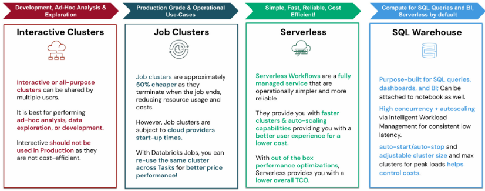

**Compute pro Task**

- Ein Job kann einen oder mehrere Tasks enthalten
- Jedem Task kann eine eigene Compute-Ressource zugewiesen werden
- Tasks im selben Job können entweder:
  - dasselbe Compute teilen oder
  - je nach Bedarf unterschiedliches Compute verwenden

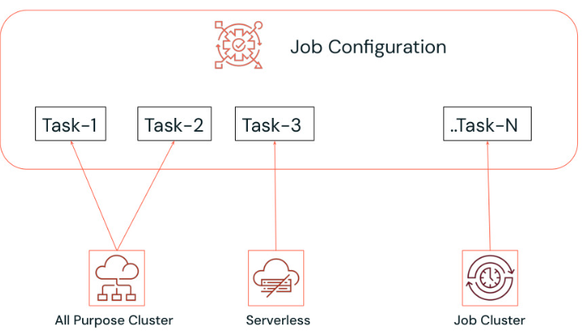

## 2_2_Task-Orchestrierung

Was ist ein DAG?

Ein DAG ist eine konzeptionelle Darstellung einer Abfolge von Aktivitäten, einschließlich Datenverarbeitungsabläufen. Schlüsseln wir das Akronym auf:

- **Directed** (gerichtet) bedeutet, dass jede Kante eine eindeutige Richtung hat – Tasks fließen in eine bestimmte Richtung.
- **Acyclic** (azyklisch) bedeutet, dass er keine Zyklen enthält – es darf keine zirkulären Abhängigkeiten geben, bei denen Task A von Task B abhängt, der wiederum von Task A abhängt.
- **Graph** bedeutet, dass es sich um eine Menge von Knoten handelt, die durch Kanten verbunden sind – in unserem Fall stehen Knoten für Tasks und Kanten für Abhängigkeiten.

Das Diagramm zeigt einen einfachen DAG, bei dem Task-1 sowohl zu Task-2 als auch zu Task-3 führt und so den Ausführungsfluss darstellt.

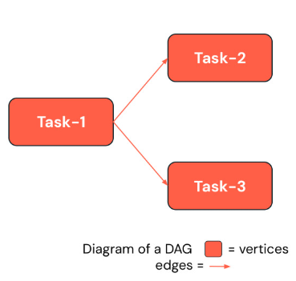  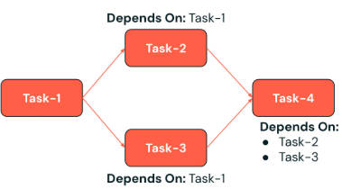

**Gängige Workload-Muster**

Es gibt drei gängige Workflow-Muster, denen Sie begegnen werden:

- Das **Sequence-Muster** wird verwendet für 
  - Datentransformation, -verarbeitung, -bereinigung 
  - und den Aufbau von Bronze-/Silber-/Gold-Tabellen in einer Medallion-Architektur.
- Das **Funnel-Muster** führt mehrere Datenquellen zur Datensammlung und Konsolidierung zusammen.
- Das **Fan-out- bzw. Sternmuster** nimmt eine einzelne Datenquelle und verteilt sie zur Daten-Ingestion und Verteilung an mehrere nachgelagerte Systeme.

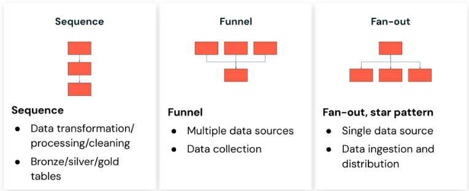

##  2_3_Überblick über das Kursprojekt

In dieser Lektion erhalten Sie einen Überblick über das Kursprojekt, in dem Sie aus einem Einzelhandelsdatensatz mithilfe verschiedener in Lakeflow Jobs verfügbarer Tasks eine Retail-Pipeline aufbauen.

Dieses Diagramm zeigt die vollständige Architektur unseres Kursprojekts. Wir bauen eine Pipeline zur Verarbeitung von Einzelhandelsdaten, die alle Konzepte veranschaulicht, die wir lernen.

Ausgehend von Einzelhandelsdaten im Cloud-Speicher ingestieren wir Kunden-, Verkaufs- und Bestelldaten mit unterschiedlichen Task-Typen. Mit Notebook-Tasks verknüpfen wir Kunden & Bestellungen sowie Kunden & Verkäufe. Der Workflow enthält einen If/Else-Block zur Duplikatprüfung mit True- und False-Bedingungen.

Wir implementieren einen For-Each-Task für eine Iteration nach Bundesstaaten über die Kundenbestelldaten. Schließlich erstellen wir mit einem Dashboard-Task ein Retail-Dashboard.

Dieses Projekt umfasst SQL-Tasks, Notebook-Tasks, bedingte Logik, iterative Verarbeitung und Dashboard-Erstellung – und vermittelt Ihnen so praktische Erfahrung mit allen wichtigen Funktionen von Lakeflow Jobs.

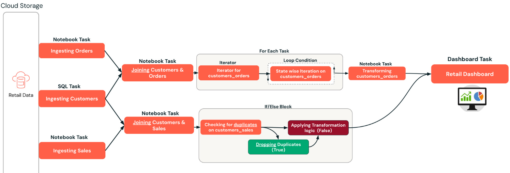

# 3_Jobs erstellen und planen

## 3_1_Gängige Konfigurationsoptionen für Tasks

Ich stelle Ihnen die drei Hauptkategorien von Konfigurationsoptionen für Tasks vor (alle können auf Job-Ebene oder auf Ebene einzelner Tasks gesetzt werden):

**Parameter & Dynamic Value References** sind die Grundlage flexibler Workflows. Sie können nur auf Task-Ebene gesetzt werden und ermöglichen wiederverwendbare, anpassbare Tasks, die sich je nach Eingabewerten oder Laufzeitkontext unterschiedlich verhalten.

**Retries** sind Ihre erste Verteidigungslinie gegen vorübergehende Fehler. Sie können das Wiederholungsverhalten sowohl auf Job- als auch auf Task-Ebene konfigurieren und so je nach Kritikalität und erwarteten Fehlermustern der verschiedenen Teile Ihres Workflows unterschiedliche Retry-Strategien verwenden.

**Notification Alerts** halten Ihr Team auf dem Laufenden und ermöglichen eine schnelle Reaktion auf Probleme. Wie Retries können sie sowohl auf Job- als auch auf Task-Ebene konfiguriert werden, sodass Sie genau steuern können, wer über welche Ereignisse benachrichtigt wird.

**Task Parameters:** Das Verständnis der Parameter-Hierarchie ist für ein effektives Job-Design entscheidend:

- **Task Parameters** sind Schlüssel-Wert-Paare oder JSON-Arrays, die auf der Ebene des einzelnen Tasks definiert werden. Sie sind spezifisch für jeden Task und ermöglichen eine feingranulare Steuerung des Task-Verhaltens.
- **Job Parameters** werden auf Job-Ebene definiert und automatisch an alle Tasks innerhalb dieses Jobs weitergegeben. So entsteht ein leistungsfähiges
  Vererbungsmodell, bei dem Sie gemeinsame Standardwerte festlegen und dennoch taskspezifische Überschreibungen zulassen können.

- **Job Parameters überschreiben immer Task Parameters, wenn derselbe Schlüssel existiert.** Dieses Designmuster ermöglicht es, sinnvolle Standardwerte auf Job-Ebene festzulegen und gleichzeitig die Flexibilität zu behalten, einzelne Tasks bei Bedarf anzupassen.

### 3_1_1_Task Parameters

Task Parameters sind weit mehr als einfache Konfigurationswerte – sie sind die Bausteine intelligenter Workflows. Diese Schlüssel-Wert-Paare ermöglichen anspruchsvolle Orchestrierungsmuster:

- Bedingte Ausführung: Verwenden Sie Parameter, um zu steuern, welche Zweige Ihres Workflows basierend auf Datenbedingungen, Umgebungseinstellungen oder Geschäftsregeln ausgeführt werden.
- Schleifen: Parameter können Iterationszahlen steuern, Arrays für For-each-Schleifen definieren und komplexe Verarbeitungsszenarien verwalten.
- Weitergabe von Kontext: Teilen Sie Informationen zwischen Tasks, indem Sie Parameter setzen, die nachgelagerte Tasks lesen können – so entsteht ein Datenfluss
  neben Ihrem Kontrollfluss.

Die eigentliche Stärke entsteht durch die Kombination von Parametern mit Dynamic Value References, wodurch sich Ihre Workflows intelligent an sich ändernde Bedingungen und Dateneigenschaften anpassen.

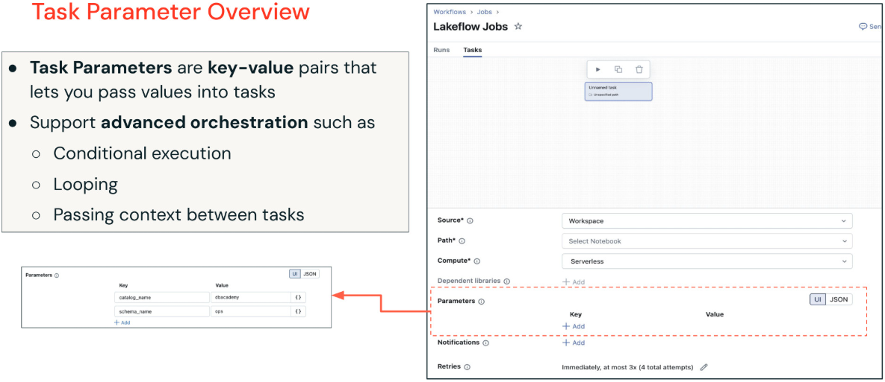

### 3_1_2_Job Parameters

Job Parameters bilden die Grundlage für konsistente, wartbare Workflows. Es sind Schlüssel-Wert-Paare, die Standardwerte für Ihren gesamten Workflow bereitstellen und so Konsistenz über alle Tasks hinweg sicherstellen.

Das macht sie so leistungsfähig:

- Automatische Anwendung: Jeder Task im Job erhält diese Parameter automatisch, sodass gemeinsame Einstellungen nicht manuell für mehrere Tasks konfiguriert werden müssen.
- Überschreibungsmöglichkeit: Tasks können weiterhin eigene Parameter mit denselben Schlüsselnamen definieren, aber Job Parameters haben Vorrang und ermöglichen Ihnen so eine zentrale Steuerung.
- Flexibilität zur Laufzeit: Sie können Job Parameters beim Auslösen von Job-Runs überschreiben, sodass sich dieselbe Job-Definition in unterschiedlichen Szenarien unterschiedlich verhalten kann – etwa für verschiedene Umgebungen, Datumsbereiche oder Verarbeitungsmodi.

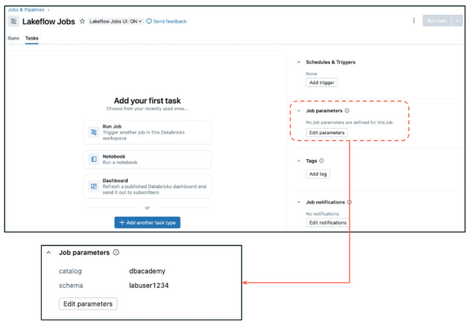

**Parameter setzen und abrufen:** Sehen wir uns die praktische Umsetzung von Parametern an:

- Job Parameters setzen: Navigieren Sie zum Abschnitt Parameters Ihres Jobs und fügen Sie Schlüssel-Wert-Paare auf Job-Ebene hinzu. Diese stehen automatisch allen Tasks zur Verfügung. Typische Beispiele sind Katalognamen, Schemanamen, Umgebungseinstellungen und Verarbeitungsdaten.
- Task Parameters setzen: Fügen Sie in der Konfiguration jedes Tasks (neben den Einstellungen für Task-Name, Typ und Pfad) taskspezifische Schlüssel-Wert-Paare hinzu. Diese eignen sich perfekt für taskspezifische Pfade, Verarbeitungsoptionen oder Überschreibungswerte.
- Abruf in Notebook-Tasks: Verwenden Sie `dbutils.widgets.get("parameter_name")`, um sowohl auf Job- als auch auf Task-Parameter zuzugreifen. Das System behandelt den Vorrang automatisch – wenn sowohl ein Job- als auch ein Task-Parameter mit demselben Schlüssel existieren, erhalten Sie den Wert des Job-Parameters
- Sprachspezifischer Abruf: Denken Sie daran, dass die Methoden zum Abrufen von Parametern je nach Task-Typ variieren. SQL-Tasks greifen anders auf Parameter zu als Python-Wheel- oder JAR-Tasks. Prüfen Sie immer die Dokumentation für Ihren jeweiligen Task-Typ.

```python
# Task Values dynamisch per Code setzen
dbutils.jobs.taskValues.set(key = "catalog_name", value = "dbacademy")

# Auf einen Parameter aus einem anderen Task zugreifen
dbutils. jobs. taskValues. get(taskKey="task-name", key="catalog_name")
```

**Dynamic Value Reference**

Dynamic Value References mit der `{{}}`-Notation eröffnen leistungsfähige Laufzeitfunktionen, die Workflows wirklich anpassungsfähig machen:

- Referenzen auf den Job-Kontext:
  - `{{job.start_time.day}}` – Zugriff auf den Ausführungszeitpunkt für datumsbasierte Verarbeitung
  - `{{job. run_id}}` – Eindeutige Kennung für Nachverfolgung und Logging
  - `{{job. parameters . environment}}` – Dynamischer Zugriff auf Parameter auf Job-Ebene
- Referenzen auf den Task-Kontext:
  - `{{task. name}}` – Nützlich für Logging und dynamische Pfadgenerierung
  - `{{task. retry_count}}` – Wiederholungsversuche für das Debugging nachverfolgen 
- Kommunikation zwischen Tasks:
  - `{{tasks.data-validation. values. record_count}}` – Zugriff auf berechnete Ergebnisse vorgelagerter Tasks
  - `{{tasks.file-processor.values.output_path}}` – Von anderen Tasks generierte dynamische Pfade verwenden

Fortgeschrittene Muster: Diese Referenzen ermöglichen Workflows, die sich an unterschiedliche Ausführungsumgebungen anpassen, variierende Datenmengen verarbeiten und auf Basis vorgelagerter Ergebnisse intelligente Entscheidungen treffen.

**Benachrichtigungen (Notification Alerts)**

Benachrichtigungen sind ein zentraler Bestandteil operativer Exzellenz, und das Verständnis der Konfigurationsebenen hilft Ihnen, effektive Alerting-Strategien zu entwickeln:

- **Benachrichtigungen auf Job-Ebene**: Job-Benachrichtigungen werden gesendet, nachdem der gesamte Job erfolgreich abgeschlossen wurde. Das ist ideal für Stakeholder, die wissen müssen, wann vollständige Workflows fertig sind – etwa Fachanwender, die auf tägliche Reports warten, oder nachgelagerte Systeme, die von den Ausgaben Ihres Jobs abhängen.
- **Benachrichtigungen auf Task-Ebene**: Jeder Task kann eine eigene Benachrichtigungskonfiguration haben, was granulare Alerting-Strategien ermöglicht. Das ist wichtig, wenn verschiedene Tasks unterschiedliche Stakeholder haben oder bestimmte Tasks kritischer sind als andere. Beispielsweise möchten Sie bei fehlgeschlagener Datenvalidierung sofort benachrichtigt werden, bei routinemäßigen Aufräum-Tasks aber nur zusammenfassende Benachrichtigungen erhalten.

Strategische Überlegungen: Gestalten Sie Ihre Benachrichtigungsstrategie nach operativen Anforderungen, nicht nach technischer Bequemlichkeit. Überlegen Sie, wer was wissen muss, wann er es wissen muss und welche Maßnahmen er aufgrund der Benachrichtigung ergreifen kann.

Moderne Produktionsumgebungen erfordern ausgefeilte Benachrichtigungsstrategien:

- Mehrere Ziele: Die Unterstützung für E-Mail, Microsoft Teams, PagerDuty, Slack und Webhooks bedeutet, dass Sie Ihre vorhandenen operativen Tools und Kommunikationswege integrieren können. Verschiedene Teams bevorzugen möglicherweise unterschiedliche Kanäle – Entwickler möchten vielleicht Slack-Benachrichtigungen, während Operations-Teams die PagerDuty-Integration bevorzugen.
- Anpassung pro Task: Jeder Task in einem Job kann eine völlig andere Benachrichtigungskonfiguration haben. Ihre Ingestion-Tasks könnten Alerts an das Data-Engineering-Team senden, während Ihre Reporting-Tasks Fach-Stakeholder benachrichtigen.

Erweiterte Auslösebedingungen: Über einfachen Erfolg/Fehlschlag hinaus können Sie Benachrichtigungen konfigurieren für:

- Verspätete Jobs: Warnungen bei Überschreiten eines Dauer-Schwellenwerts und Timeout-Alerts helfen, Performance-Einbußen frühzeitig zu erkennen
- Streaming-Backlog: Entscheidend für Streaming-Workloads, bei denen ein Rückstand zu größeren Problemen eskalieren kann
- Benutzerdefinierte Bedingungen: Webhook-Integrationen ermöglichen komplexe individuelle Logik für Benachrichtigungsentscheidungen

Lebenszyklus-Benachrichtigungen: Jobs können Benachrichtigungen auslösen, wenn Tasks starten (nützlich bei lang laufenden Prozessen), erfolgreich abgeschlossen werden (Bestätigung des Abschlusses) oder fehlschlagen (sofortige Reaktion erforderlich).

**Retry-Richtlinie**

Eine gut durchdachte Retry-Richtlinie ist für robuste Workflows unerlässlich. Die Richtlinie bestimmt nicht nur, wie oft wiederholt wird, sondern auch unter welchen Bedingungen und mit welchem zeitlichen Muster.

Berücksichtigen Sie Faktoren wie:

- Fehlertyp: Vorübergehende Netzwerkprobleme rechtfertigen möglicherweise sofortige Wiederholungen, Datenqualitätsprobleme hingegen nicht
- Auswirkung auf Ressourcen: Zu aggressives Wiederholen ressourcenintensiver Tasks kann zu Ressourcenkonflikten im Cluster führen
- Nachgelagerte Abhängigkeiten: Fehlgeschlagene Tasks können andere Workflows beeinträchtigen, sodass das Timing der Wiederholungen entscheidend ist
- Geschäftliche SLAs: Manche Prozesse haben strenge Zeitvorgaben, die die Wiederholungsfenster begrenzen

## 3_2_Job-Zeitpläne und Trigger

Ein Trigger ist im Grunde eine Regel-Engine, die die Job-Ausführung automatisch auf Basis bestimmter Bedingungen oder Zeitpläne startet. Dabei geht es nicht nur um Bequemlichkeit – es geht darum, zuverlässige, reaktionsfähige Datensysteme zu bauen, die autonom arbeiten können.

Trigger-Kategorien:

- **Zeitbasierte Zeitpläne**: Klassische Planung im Cron-Stil für vorhersehbare, wiederkehrende Workloads
- **Kontinuierliche Ausführung**: Dauerhafte Verarbeitung für Streaming-Szenarien
- **Datei-Eingangsereignisse**: Ereignisgesteuerte Verarbeitung, die sofort auf neue Daten reagiert
- **Manuelle Trigger**: Ausführung bei Bedarf für Entwicklung, Debugging und Ad-hoc-Analysen. Können mit anderen Trigger-Typen kombiniert werden.
- **Table Update**: Ermöglicht die automatisierte Job-Ausführung, sobald bestimmte Tabellen aktualisiert werden.

# 4_Fortgeschrittene Funktionen von Lakeflow Jobs

## 4_1_Bedingte und iterative Tasks

### 4_1_1_Bedingte Task-Abhängigkeiten

- **All succeeded**: Diese klassische Abhängigkeit erfordert, dass alle vorgelagerten Tasks erfolgreich abgeschlossen sind, bevor der nächste Task laufen kann.
- **At least one succeeded**: Diese Bedingung ist nützlich, wenn Sie redundante Datenquellen oder Verarbeitungspfade haben; der Workflow kann fortfahren, sobald auch nur einer der erforderlichen vorgelagerten Tasks erfolgreich ist.
- **None failed**: Damit kann ein Task auch dann ausgeführt werden, wenn einige vorgelagerte Tasks übersprungen wurden, solange keiner der vorgelagerten Tasks explizit fehlgeschlagen ist. 
- **Benutzerdefinierte Kombinationen**: Diese Option ermöglicht die Umsetzung komplexer Geschäftslogik, die bestimmte Kombinationen von Task-Ergebnissen erfordert.

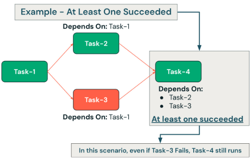

### 4_1_2_If/Else-Abhängigkeiten

Beispiele für Geschäftslogik:

- Datenqualitäts-Gates: Verzweigung basierend auf Datensatzanzahlen, Null-Anteilen oder Validierungsergebnissen
- Entscheidungen nach Verarbeitungsvolumen: Unterschiedliche Verarbeitungsstrategien für große vs. kleine Datensätze verwenden
- Umgebungsspezifische Logik: Je nach Umgebungsparametern unterschiedliche Tasks ausführen
- Umsetzung von Geschäftsregeln: Komplexe Geschäftsregeln direkt in der Workflow-Logik implementieren

Ausführungsvoraussetzungen: Die Bedingung „If none of dependency failed and at least one task executed“ stellt sicher, dass die bedingte Auswertung nur dann erfolgt, wenn aussagekräftige vorgelagerte Ergebnisse vorliegen.

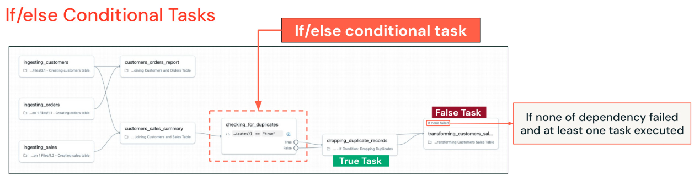

### 4_1_3_For Each

Beispiele für Anwendungsfälle:

- Geografische Verarbeitung: Daten für jedes Bundesland/jede Region parallel verarbeiten
- Verarbeitung nach Zeiträumen: Unterschiedliche Datumsbereiche mit derselben Logik verarbeiten
- Verarbeitung nach Kundensegmenten: Dieselbe Analyse auf unterschiedliche Kundensegmente anwenden
- Dateiverarbeitung: Mehrere Dateien mit identischer Logik verarbeiten

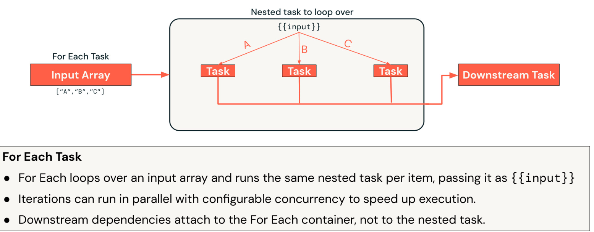

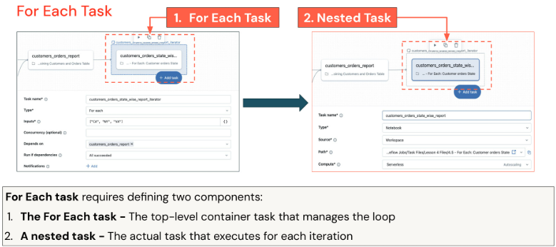

## 4_2_Umgang mit Task-Fehlern

**Repair-Funktion**

Die Repair-Funktion steht für einen ausgefeilten Ansatz zur Fehlerbehebung:

Gezielte Wiederherstellung: Anstatt ganze Workflows neu zu starten, können Sie bestimmte fehlgeschlagene Tasks ändern und nur das Nötige erneut ausführen. Das spart erheblich Zeit und Rechenressourcen.

Überschreiben von Parametern: Die Möglichkeit, Parameter während Repair-Runs zu ändern, erlaubt es Ihnen, Konfigurationsprobleme zu beheben, die Ressourcenzuweisung anzupassen oder die Verarbeitungslogik zu ändern, ohne den gesamten Job neu aufzubauen.

Wiederherstellungsszenarien:

- Konfigurationskorrekturen: Parameterwerte korrigieren, die Task-Fehler verursacht haben 
- Ressourcenanpassungen: Arbeitsspeicher oder Compute-Ressourcen für Tasks erhöhen, die aufgrund von Ressourcenengpässen fehlgeschlagen sind
- Code-Updates: Korrekturen für Logikfehler bereitstellen und nur betroffene Tasks erneut ausführen
- Datenqualitätsprobleme: Die Verarbeitungslogik anpassen, um während der Ausführung entdeckte Datenqualitätsprobleme zu behandeln

Kosteneffizienz: Indem Sie nur fehlgeschlagene Tasks erneut ausführen, minimieren Sie unnötige Berechnungen und senken die Kosten – besonders wichtig bei großen, komplexen Workflows.

Beachten Sie, dass das Reparieren eines Tasks nicht das Reparieren des Jobs bedeutet. Beispiel: Wenn Sie einen falschen Parameter übergeben und ihn mit der Repair-Run-Funktion korrigieren, müssen Sie ihn trotzdem noch in Ihrem Job anpassen.

## 4_3_Job-Performance überwachen

**Systemtabellen**

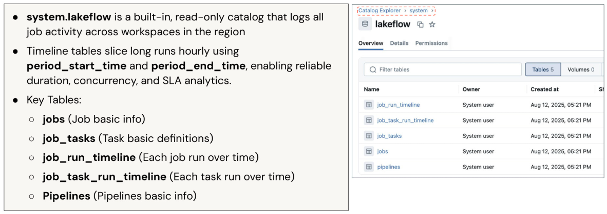

**Spark UI**

Die Spark UI bietet detaillierte Performance-Einblicke zur Optimierung:

- **Timeline-Analyse**: Die Ausführungs-Timeline hebt sofort Task-Dauer, Überschneidungen und Engpässe hervor und ermöglicht so eine schnelle Identifizierung von Performance-Problemen.
- **Details auf Task-Ebene**: Ein Klick auf einzelne Tasks zeigt umfassende Informationen wie Ausführungszeitstempel, Ressourcennutzung, Cluster-Konfiguration, Logs und I/O-Statistiken.
- **Details zur Abfrage-Performance**: Eine detaillierte Abfrageanalyse zeigt Ausführungspläne, Optimierungsentscheidungen, Dateizugriffsmuster, Partitionsinformationen und Details zu Daten-Spills – unverzichtbar für das Performance-Tuning.

Umsetzbare Erkenntnisse:

- Hohe Planungszeit: Weist auf den Bedarf an besseren Partitionierungsstrategien oder Metadaten-Optimierung hin
- Hohe Ausführungszeit: Deutet auf Optimierungsmöglichkeiten bei Joins, Broadcast-Strategien oder der Behandlung von Skew hin
- Ressourcenengpässe: Identifiziert Speicher-, CPU- oder I/O-Engpässe, die Anpassungen der Cluster-Konfiguration erfordern

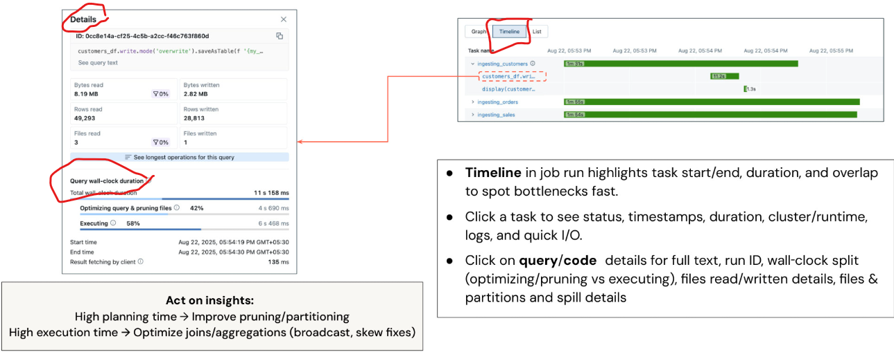

## 4_4_Lakeflow Jobs in der Produktion

Der Übergang von der Entwicklung in die Produktion erfordert das Verständnis, wie Lakeflow Jobs im Unternehmensmaßstab mit angemessener Governance, Sicherheit und Betriebspraxis entworfen, bereitgestellt und betrieben werden.

### 4_4_1_Compute

Produktions-Deployments erfordern Aufmerksamkeit in vier kritischen Bereichen:

- Compute-Strategie: Die richtigen Compute-Optionen für Performance-, Kosten- und Betriebsanforderungen auswählen.
- Modulares Design: Architekturmuster umsetzen, die Wartbarkeit, Wiederverwendbarkeit und Zusammenarbeit im Team unterstützen.
- Git-Integration: Versionskontroll- und Deployment-Praktiken, die Konsistenz sicherstellen und CI/CD-Workflows ermöglichen.
- Performance-Monitoring: Proaktive Monitoring- und Optimierungsstrategien, die die Einhaltung von SLAs und Kosteneffizienz sicherstellen.

Das Verständnis der Compute-Optionen ist entscheidend für den Erfolg in der Produktion:

**Interactive Clusters** sind ideal für Entwicklung und Ad-hoc-Analysen, bringen aber erhebliche Herausforderungen für den Produktionseinsatz mit sich:

- Kostenprobleme: Interaktive Cluster laufen weiter, auch wenn keine Jobs ausgeführt werden, was zu unnötigen Kosten führt
- Begrenzte Skalierbarkeit: Gemeinsam genutzte Ressourcen können zu Konkurrenz und unvorhersehbarer Performance führen
- Verfügbarkeitsprobleme: Wenn mehrere Benutzer Cluster teilen, kann es zu Ressourcenkonflikten und Job-Verzögerungen kommen

**Job Clusters** bieten bessere Eigenschaften für die Produktion:

- Kosteneffizienz: Cluster werden beendet, wenn Jobs abgeschlossen sind, wodurch Kosten für ungenutzte Ressourcen entfallen

**Serverless Compute** ist für die meisten Produktions-Workloads die optimale Wahl:

- Operative Einfachheit: Infrastrukturverwaltung, Auswahl des VM-Typs und Kapazitätsplanung entfallen. Dadurch werden weniger spezialisierte DevOps-Kenntnisse benötigt, und Teams können sich auf die Geschäftslogik statt auf die Infrastruktur konzentrieren.
- Performance-Optimierung: Die Photon-Beschleunigung ist standardmäßig aktiviert und bringt deutliche Performance-Verbesserungen ohne zusätzliche Konfiguration oder Kosten.
- Zuverlässigkeit und Geschwindigkeit: VMs laufen im von Databricks verwalteten Konto mit vorausschauender Skalierung auf Basis historischer Nutzungsmuster und Machine-Learning-Algorithmen, sodass Ressourcen verfügbar sind, wenn sie benötigt werden.
- Unabhängigkeit von der Cloud: Serverless schützt Sie vor Störungen beim Cloud-Anbieter und Infrastrukturproblemen und bietet eine höhere Zuverlässigkeit als selbst verwaltete Cluster.

### 

**Preisstruktur**: Das klassische Preismodell umfasst mehrere Kostenkomponenten:

- Direkte Kosten: An Databricks gezahlte DBUs plus direkt an Cloud-Anbieter gezahlte Infrastrukturkosten (VMs, Netzwerk, Sicherheitsdienste).
- Operativer Aufwand: Oft übersehene, aber erhebliche Kosten, darunter der Zeitaufwand für Infrastruktur-Deployment, Automatisierungsentwicklung, Wartungsarbeiten, Kostenmonitoring und Effizienzoptimierung.
- Versteckte Komplexität: Verwaltung mehrerer Abrechnungsbeziehungen, Optimierung über verschiedene Kostenkategorien hinweg und Aufrechterhaltung von Know-how im Management von Cloud-Infrastruktur.

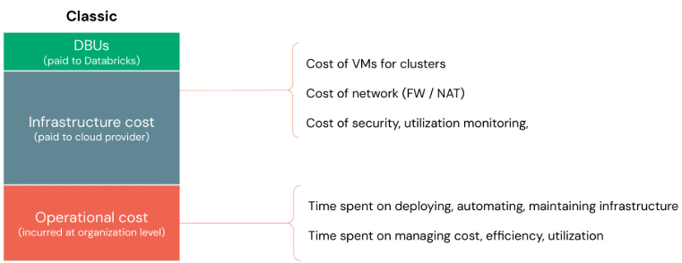

Serverless vereinfacht das Kostenmodell grundlegend:

- Einheitliche Abrechnung: Ein einziger DBU-Preis, der Infrastruktur- und Betriebskosten enthält, sodass keine mehreren Anbieterbeziehungen und Kostenoptimierungsstrategien verwaltet werden müssen.
- Nutzenversprechen: Der vollständig verwaltete Dienst bietet operative Einfachheit und Verbesserungen der Zuverlässigkeit, die höhere Kosten pro Einheit durch geringeren operativen Aufwand oft rechtfertigen.
- Performance-Vorteile: Auto-Scaling und sofort verfügbare Optimierungen liefern oft eine bessere Performance zu geringeren Gesamtkosten als selbst verwaltete Alternativen.
- TCO-Vorteile: Wenn man den operativen Aufwand einrechnet, sind die Gesamtbetriebskosten (TCO) mit Serverless in der Regel niedriger, insbesondere für Organisationen ohne eigene Platform-Engineering-Teams.

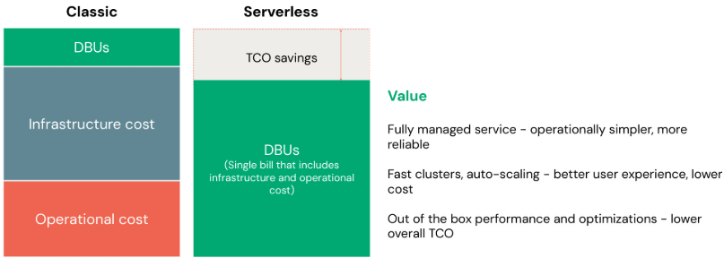

### 4_4_3_Modulares Design

Produktions-Deployments erfordern Aufmerksamkeit in vier kritischen Bereichen:

- Compute-Strategie: Die richtigen Compute-Optionen für Performance-, Kosten- und Betriebsanforderungen auswählen.
- Modulares Design: Architekturmuster umsetzen, die Wartbarkeit, Wiederverwendbarkeit und Zusammenarbeit im Team unterstützen.
- Git-Integration: Versionskontroll- und Deployment-Praktiken, die Konsistenz sicherstellen und CI/CD-Workflows ermöglichen.
- Performance-Monitoring: Proaktive Monitoring- und Optimierungsstrategien, die die Einhaltung von SLAs und Kosteneffizienz sicherstellen.

Modulare Orchestrierung verwandelt große, monolithische Workflows in wartbare, wiederverwendbare Komponenten:

Zerlegungsstrategie: Zerlegen Sie komplexe DAGs in logische Geschäftseinheiten statt in technische Komponenten. Jedes Modul sollte eine zusammenhängende Geschäftsfunktion abbilden, die unabhängig entwickelt, getestet und bereitgestellt werden kann.

Parent-Child-Beziehungen: Parent-Jobs orchestrieren Child-Jobs und schaffen so eine klare Trennung der Zuständigkeiten, während die übergreifende Workflow-Koordination erhalten bleibt.

Nutzen:

- Wartbarkeit: Kleinere Jobs sind leichter zu verstehen, zu ändern und zu debuggen
- Wiederverwendbarkeit: Child-Jobs können in mehreren Parent-Workflows wiederverwendet werden
- Zusammenarbeit im Team: Verschiedene Teams können unterschiedliche Module verantworten und gemeinsam am Gesamt-Workflow arbeiten
- Testen: Einzelne Module können unabhängig getestet werden, was die Qualität verbessert und das Deployment-Risiko senkt

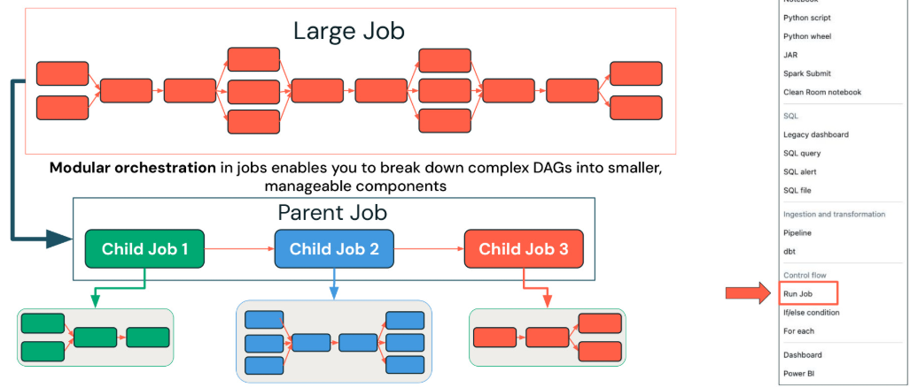

### 4_4_4_Git

Produktions-Deployments erfordern Aufmerksamkeit in vier kritischen Bereichen:

- Compute-Strategie: Die richtigen Compute-Optionen für Performance-, Kosten- und Betriebsanforderungen auswählen.
- Modulares Design: Architekturmuster umsetzen, die Wartbarkeit, Wiederverwendbarkeit und Zusammenarbeit im Team unterstützen.
- Git-Integration: Versionskontroll- und Deployment-Praktiken, die Konsistenz sicherstellen und CI/CD-Workflows ermöglichen.
- Performance-Monitoring: Proaktive Monitoring- und Optimierungsstrategien, die die Einhaltung von SLAs und Kosteneffizienz sicherstellen.

Die Git-Integration bietet wesentliche Funktionen für die Verwaltung produktiver Workflows:

- Change Management: Verhindert unbeabsichtigte Änderungen an Produktions-Jobs, indem sichergestellt wird, dass alle Änderungen ordnungsgemäße Versionskontrollprozesse durchlaufen.
- Single Source of Truth: Beseitigt Unklarheiten darüber, welche Codeversion in der Produktion läuft, da immer committeter Code aus bestimmten Branches oder Tags ausgeführt wird.
- CI/CD-Integration: Ermöglicht automatisierte Test- und Deployment-Pipelines, die Änderungen validieren können, bevor sie Produktionsumgebungen erreichen.
- Plattformunterstützung: Die breite Kompatibilität mit GitHub, GitLab, AWS CodeCommit und anderen Git-Anbietern stellt sicher, dass Sie sich unabhängig von Ihrer gewählten Plattform in bestehende Entwicklungs-Workflows integrieren können.
- Vorteile für die Zusammenarbeit: Mehrere Entwickler können mithilfe standardmäßiger Git-Workflows (Branches, Pull Requests, Code Reviews) gemeinsam an der Workflow-Entwicklung arbeiten, während die Stabilität der Produktion erhalten bleibt.

Die Umsetzung der Git-Integration umfasst zwei einfache Schritte:

- Schritt 1 – Konfiguration der Quelle: Erstellen Sie Tasks mit einem Git-Anbieter als Quelle und geben Sie Repository, Branch/Tag und Anmeldeinformationen an. So stellen Sie sicher, dass Ihr Job immer die committete Version Ihres Codes ausführt.
- Schritt 2 – Konfiguration des Pfads: Konfigurieren Sie den Pfad zu Ihrem Haupt-Notebook unter dem Repository-Root, damit der Job den richtigen Einstiegspunkt Ihres Workflows finden und ausführen kann.
- Best Practices: Verwenden Sie für die Produktion bestimmte Branches oder Tags statt sich ständig ändernder Main-Branches, führen Sie vor dem Mergen in Produktions-Branches ordentliche Code-Review-Prozesse durch und dokumentieren Sie klar, welche Repositories und Pfade Code für Produktions-Jobs enthalten.

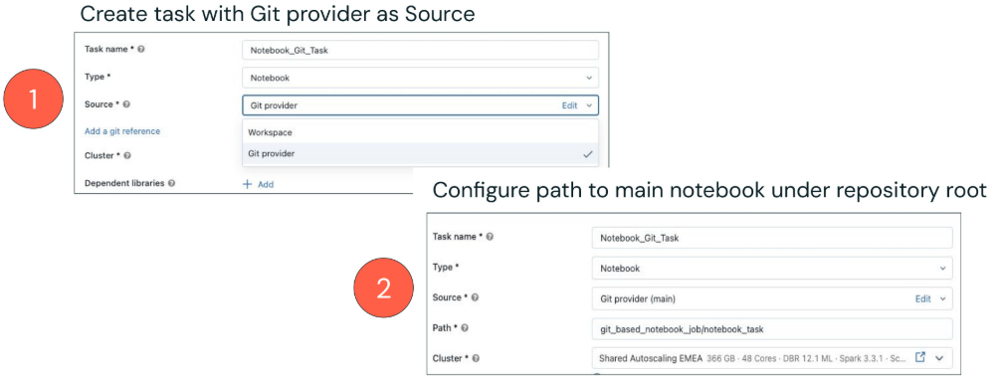

## 4_5_Best Practices

Legen wir die umfassenden Best Practices fest, die den Erfolg in der Produktion über alle Aspekte der Implementierung von Lakeflow Jobs hinweg sicherstellen.

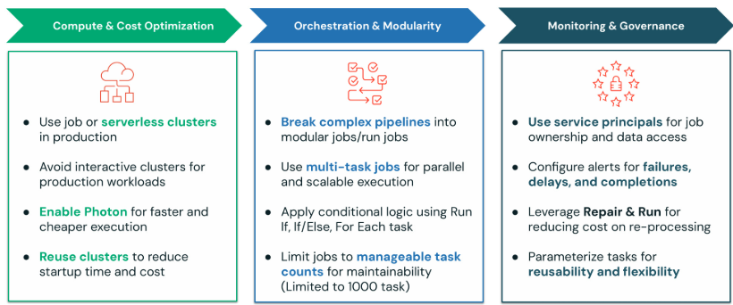

**Praktiken zur Compute- & Kostenoptimierung:**

- Produktions-Compute: Verwenden Sie in Produktionsumgebungen immer Job-Cluster oder Serverless Compute, um Kosteneffizienz und Ressourcenisolation sicherzustellen
- Interaktive Cluster vermeiden: Reservieren Sie interaktive Cluster ausschließlich für Entwicklung und Ad-hoc-Analysen, um Kostenüberschreitungen und Ressourcenkonflikte in der Produktion zu vermeiden
- Photon aktivieren: Aktivieren Sie die Photon-Beschleunigung für alle geeigneten Workloads, um deutliche Performance-Verbesserungen und Kostensenkungen zu erzielen 
- Cluster wiederverwenden: Gestalten Sie Workflows so, dass Cluster nach Möglichkeit über Tasks hinweg wiederverwendet werden, um den Start-Overhead zu verringern und die Kosteneffizienz zu verbessern

**Praktiken zu Orchestrierung & Modularität:**

- Modulare Architektur: Zerlegen Sie komplexe Pipelines mithilfe des Run-Job-Task-Musters in logische, wartbare Module, um die
  Wartbarkeit und Zusammenarbeit im Team zu verbessern
- Multi-Task-Design: Nutzen Sie Multi-Task-Jobs für parallele Ausführung und eine bessere Ressourcennutzung, während der Workflow übersichtlich bleibt
- Fortgeschrittene Logik: Setzen Sie anspruchsvolle Geschäftslogik mit Run-If-, If/Else- und For-Each-Tasks um, um komplexe reale Szenarien zu bewältigen 
- Task-Limits: Halten Sie einzelne Jobs unter 1000 Tasks, um Handhabbarkeit und Performance zu wahren, und nutzen Sie modulares Design für größere Workflows

**Praktiken zu Monitoring & Governance:**

- Nutzung von Service Principals: Verwenden Sie Service Principals statt persönlicher Konten als Job-Eigentümer und für den Datenzugriff, um Kontinuität und eine ordnungsgemäße Zugriffskontrolle sicherzustellen
- Umfassendes Alerting: Konfigurieren Sie Alerts für Fehler, Verzögerungen und Abschlüsse mit geeigneten Eskalations- und Benachrichtigungsstrategien
- Optimierte Wiederherstellung: Nutzen Sie die Repair-&-Run-Funktionen, um Kosten und Wiederherstellungszeit bei Fehlern zu minimieren
- Parametrisierung: Gestalten Sie Tasks mit sinnvoller Parametrisierung für maximale Wiederverwendbarkeit und Flexibilität über Umgebungen und Anwendungsfälle hinweg
