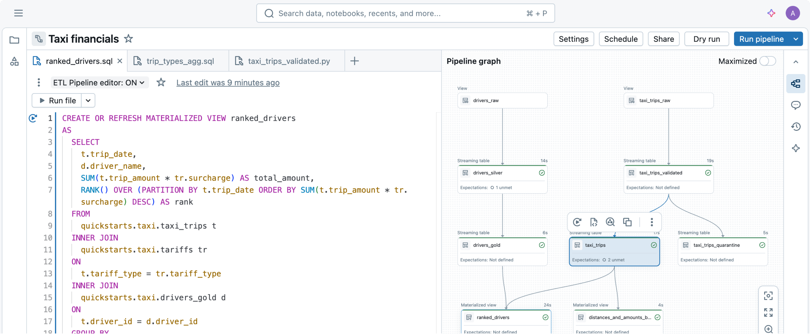
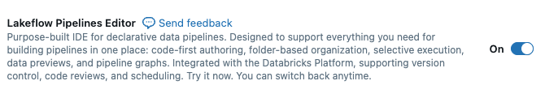
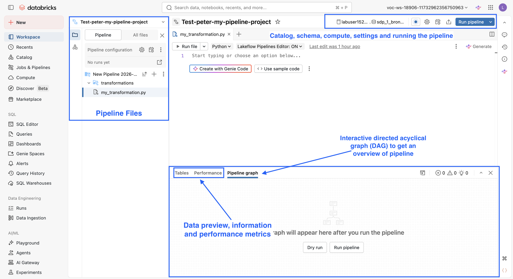

Erstellen Sie eine klassische ETL-Pipeline mit JSON-Dateien als Datenquelle und lernen Sie anschließend, wie Sie eine Beispiel-Pipeline mit Apache Spark™ Declarative Pipelines (SDP) erstellen.

Klassischerweise würden Sie eine ETL-Pipeline so aufbauen, dass bei **jedem Pipeline-Lauf alle Dateien an einem Cloud-Speicherort gelesen werden. Mit wachsender Datenmenge wird diese Methode ineffizient, teurer und zeitaufwendiger.**

```sql
CREATE OR REPLACE TABLE sdp_1_bronze.orders_bronze
AS SELECT *,
  current_timestamp() AS processing_time,
  _metadata.file_name AS source_file
FROM read_files(source_volume_path || "/orders", format =>"json");

CREATE OR REPLACE TABLE sdp_1_bronze.orders_silver
AS SELECT
  order_id,
  timestamp(order_timestamp) AS order_timestamp,
  customer_id,
  notifications
FROM sdp_1_bronze.orders_bronze;

CREATE OR REPLACE VIEW sdp_1_bronze.orders_by_date_vw
AS SELECT
  date(order_timestamp) AS order_date,
  count(*) AS total_daily_orders
FROM sdp_1_bronze.orders_silver
GROUP BY date(order_timestamp);
```

Grenzen klassischer Batch-Pipelines – warum dieser ETL-Ansatz bei wachsenden Datenmengen an seine Grenzen stößt: 

- Bronze: Vollständiges erneutes Lesen bei jedem Lauf (Effizienz); Jede Ausführung liest alle Dateien aus dem Cloud-Speicher, nicht nur neue. Kosten und Laufzeit wachsen mit jeder hinzugefügten Datei.

- Silber: Verarbeitet immer alle Zeilen neu (Effizienz); Die Silber-Schicht liest bei jedem Lauf die gesamte Bronze-Tabelle. Keine inkrementelle Verarbeitung. Jedes Mal ein vollständiger Scan.

- Views werden bei jedem Aufruf neu ausgeführt (Performance); **orders_by_date_vw** führt die zugrunde liegende Abfrage bei jeder Referenzierung aus. Kein Caching, keine Optimierung bei wachsenden Datenmengen.

- Datenqualität erfordert zusätzlichen Code (Qualität); Die Prüfung auf ungültige oder fehlende Werte bedeutet, zusätzliche Validierungslogik außerhalb der Pipeline zu schreiben und zu pflegen.

- Das Monitoring von Läufen ist schwierig (Observability);  Die Nachverfolgung von Erfolg, Fehlern und Zeilenanzahlen über Läufe hinweg erfordert eigenes Logging. Es gibt keine eingebaute Transparenz.

- Keine UI zum Untersuchen oder Beheben von Problemen (Observability); Wenn etwas schiefgeht, gibt es keine einfache Oberfläche, um Probleme von Lauf zu Lauf zu untersuchen, zu debuggen oder zu beheben.

### C5. Grenzen klassischer Structured-Streaming-Pipelines

- „Aber können wir nicht einfach Structured Streaming verwenden?“
Inkrementelle Verarbeitung ist möglich, geht aber auf Kosten der Komplexität

- Sie könnten die Pipeline durch spark.readStream ersetzen, um eine inkrementelle Ingestion zu erhalten. Das bedeutet jedoch, Ihre Pipeline mit deutlich mehr Code und operativem Aufwand neu zu schreiben.

- Checkpoint-Verwaltung (Komplexität); Jeder Stream benötigt einen eigenen Checkpoint-Speicherort. Sie müssen diese Pfade für jede Schicht der Pipeline konfigurieren und pflegen.

- foreachBatch + MERGE für Upserts (Komplexität); Einfache Überschreibungen werden zu mehrstufiger Logik: Funktion definieren, temporäre View erstellen, MERGE-Anweisung schreiben und in foreachBatch einbinden.

- Trigger- und Schema-Konfiguration (Komplexität); Sie müssen Trigger-Modi wählen, Schema-Speicherorte für Auto Loader definieren und den Stream-Lebenszyklus verwalten (Start, Stopp, Warten auf Beendigung).

- Weiterhin keine eingebaute Qualität oder Observability (Lücke);  Structured Streaming löst die inkrementelle Verarbeitung, aber Sie haben weiterhin keine Datenqualitäts-Constraints, keine Pipeline-UI und keine Lineage-Ansicht.

**Fazit:** Structured Streaming löst das Problem „alles neu lesen“, aber nicht die Themen Datenqualität, Observability oder operative Einfachheit. Sie erhalten inkrementelle Verarbeitung um den Preis, deutlich mehr Infrastruktur-Code schreiben und pflegen zu müssen. Spark Declarative Pipelines bieten Ihnen inkrementelle Verarbeitung und alles andere – deklarativ.

### Was Structured Streaming tatsächlich erfordert

Um die obige Batch-Pipeline in eine inkrementelle Streaming-Pipeline umzuwandeln, sähen die Bronze- und Silber-Schichten so aus:

```python
# Bronze: readStream + writeStream + Trigger + Checkpoint
(spark.readStream
    .format("cloudFiles")
    .option("cloudFiles.format", "json")
    .option("cloudFiles.schemaLocation", "/Volumes/bronze_schema")
    .load(source_path)
    .writeStream
    .option("checkpointLocation", "/Volumes/bronze")
    .trigger(availableNow=True)
    .toTable("bronze_orders")
)

# Silber: readStream aus Bronze + foreachBatch für die Merge-Logik
def upsert_to_silver(batch_df, batch_id):
    batch_df.createOrReplaceTempView("updates")
    batch_df.sparkSession.sql("""
        MERGE INTO silver_orders AS target
        USING updates AS source
        ON target.order_id = source.order_id
        WHEN MATCHED THEN UPDATE SET *
        WHEN NOT MATCHED THEN INSERT *
    """)

(spark.readStream
    .table("bronze_orders")
    .writeStream
    .foreachBatch(upsert_to_silver)
    .option("checkpointLocation", "/Volumes/silver")
    .trigger(availableNow=True)
    .start()
)
```

### Checkpoint-Verwaltung

- Jede Streaming-Abfrage benötigt einen eindeutigen, persistenten Checkpoint-Speicherort.
- Checkpoints halten fest, welche Daten bisher verarbeitet wurden, damit der Stream dort weitermachen kann, wo er aufgehört hat.
- Wird der Checkpoint gelöscht oder beschädigt, verarbeitet der Stream entweder alles neu oder schlägt fehl.
- In einer mehrschichtigen Pipeline (Bronze, Silber, Gold) verwalten Sie für jede Schicht einen eigenen Checkpoint-Pfad.

### foreachBatch + MERGE für Upserts

- Die Standard-Ausgabemodi von Structured Streaming (append, complete, update) unterstützen MERGE-/Upsert-Logik nicht direkt.
- Für inkrementelle Upserts benötigen Sie `foreachBatch`: eine Callback-Funktion, die jeden Micro-Batch als DataFrame erhält.
- Innerhalb dieser Funktion registrieren Sie eine temporäre View und führen manuell eine SQL-MERGE-Anweisung aus.
- Das ist Boilerplate-Code, den jede Silber-/Gold-Streaming-Schicht benötigt. In Spark Declarative Pipelines schreiben Sie einfach die Abfrage, und das Framework übernimmt die inkrementellen Updates.

> **Hinweis zur Terminologie (überprüft anhand der [Databricks-Dokumentation „Use foreachBatch to write to arbitrary data sinks“](https://docs.databricks.com/aws/en/structured-streaming/foreach)):** „Callback-Funktion“ ist hier der allgemeine Informatikbegriff für eine Funktion, die an eine andere Funktion übergeben und später aufgerufen wird. Die Databricks-Dokumentation selbst verwendet „Callback“ nicht – sie nennt die an `foreachBatch` übergebene Funktion eine **„batch function“**, die einen Micro-Batch-`DataFrame` und eine Batch-ID entgegennimmt, und stellt fest: „You must use `foreachBatch` for Delta Lake merge operations in Structured Streaming.“

### Trigger- und Schema-Konfiguration

- `trigger(availableNow=True)` verarbeitet alle verfügbaren Daten und stoppt dann. Weitere Optionen sind `processingTime` für intervallbasierte Trigger und `continuous` für niedrige Latenz.
- Auto Loader (`cloudFiles`) benötigt eine `schemaLocation`, um das abgeleitete Schema im Zeitverlauf nachzuverfolgen und weiterzuentwickeln.
- Sie müssen `.start()` oder `.toTable()` korrekt aufrufen und optional `.awaitTermination()`, um zu blockieren, bis der Stream beendet ist.
- Fehler bei einem dieser Punkte führen zu unbemerkten Ausfällen oder zu Streams, die nie enden.

### Was Streaming weiterhin nicht löst

- **Datenqualität:** Keine eingebaute Möglichkeit, Expectations oder Constraints zu definieren. Sie schreiben weiterhin eigene Validierungslogik.
- **Observability:** Keine Pipeline-UI, kein Lineage-Graph, keine Zeilenanzahlen oder Datenqualitätskennzahlen pro Tabelle out of the box.
- **Fehlerbehandlung:** Wenn fehlerhafte Daten eintreffen, benötigen Sie eigene Logik, um sie zu isolieren oder zu überspringen. Es gibt kein „expect“- oder „drop“-Muster.
- **Operativer Aufwand:** Sie verwalten Stream-Zustand, Checkpoint-Bereinigung, Schema Evolution und Fehlerwiederherstellung selbst.

**Übergang zu SDP:** Spark Declarative Pipelines übernimmt all das für Sie. Sie deklarieren Ihre Tabellen, schreiben Ihre Transformationslogik, und das Framework verwaltet inkrementelle Verarbeitung, Checkpoints, Datenqualitäts-Expectations und die Pipeline-UI automatisch. Kein `foreachBatch`, keine Checkpoint-Pfade, keine Trigger-Konfiguration.

## D. Einführung in Apache Spark™ Declarative Pipelines




Effiziente Ingestion

- **Daten aus jeder von Apache Spark unterstützten Quelle** auf Databricks laden
- Unterstützung für **Batch-, Streaming- und CDC**-Ingestion-Muster

Intelligente Transformation

- Optimiert automatisch auf **Kosten oder Performance**

Automatisierter Betrieb

- Setzt **Best Practices für Pipelines** out of the box um
- Automatisiert **Abhängigkeitsverwaltung, Skalierung, Wiederherstellung und Datenqualitätsregeln**
- Ermöglicht es Engineers, sich auf die **Bereitstellung hochwertiger Daten** zu konzentrieren statt auf die Verwaltung der Infrastruktur

Wandeln Sie Ihre klassische Batch-Pipeline in **Spark Declarative Pipelines (SDP)** um und erhalten Sie inkrementelle Verarbeitung, Durchsetzung der Datenqualität, Infrastrukturverwaltung und vollständige Transparenz über die Pipeline.

[Apache Spark™ DECLARATIVE PIPELINES](https://www.databricks.com/product/data-engineering/spark-declarative-pipelines)

### D1. Den Lakeflow Pipelines Editor aktivieren

In diesem Abschnitt erstellen Sie eine Spark Declarative Pipeline mit dem neuen Lakeflow Pipelines Editor.

1. Führen Sie die folgenden Schritte aus, um den **Lakeflow Pipelines Editor** zu aktivieren:

a. Wählen Sie oben rechts Ihr Benutzersymbol

b. Klicken Sie mit der rechten Maustaste auf **Settings** und wählen Sie **Open in New Tab**.

c. Wählen Sie **Developer**.

d. Scrollen Sie nach unten, aktivieren Sie **Lakeflow Pipelines Editor**, falls noch nicht aktiviert, und wählen Sie **Enable tabs for notebooks and files**.



e. Aktualisieren Sie Ihren Browser, um die Änderungen zu übernehmen.

### D2. Eine Pipeline über den Datei-Explorer erstellen

1. Führen Sie die folgenden Schritte aus, um eine Spark Declarative Pipeline über den linken Navigationsbereich zu erstellen:

   a. Wählen Sie in der linken Navigationsleiste das Symbol **Folder** , um die Workspace-Navigation zu öffnen.

   b. Navigieren Sie zum Ordner **Build Data Pipelines with Apache Spark™ Declarative Pipelines**.

   c. **HINWEIS:** Um diesen Anweisungen leichter folgen zu können, öffnen Sie dieses Notebook in einem zweiten Browser-Tab. 
- Klicken Sie mit der rechten Maustaste auf das Notebook **02 Demo - Course Setup and Creating a Pipeline** und wählen Sie **Open in new browser tab**.

   d. Wählen Sie im anderen Tab das Drei-Punkte-Symbol  in der Ordner-Navigationsleiste.

   e. Wählen Sie **Create** -> **ETL Pipeline**. Dadurch gelangen Sie zum **Lakeflow Pipeline Editor**.

**Hinweis**
   Wenn Sie den **Lakeflow Pipelines Editor** noch nicht aktiviert haben, erscheint möglicherweise ein Pop-up, das Sie zur Aktivierung auffordert. Wählen Sie **Enable** oder führen Sie zuerst den vorherigen Schritt aus.

   f. Wählen Sie **Settings** und verwenden Sie Folgendes:

   | Einstellung | Wert / Aktion |
   |---|---|
   | **Name** | `Test - yourfirstname-my-pipeline-project` |
   | **Default catalog** | Wählen Sie Ihren **labuser**-Katalog |
   | **Default schema** | Wählen Sie Ihr Schema (Ihre Datenbank) **sdp_1_bronze** |

2. Das Projekt wird im **Lakeflow Pipelines Editor** geöffnet und sieht wie folgt aus:

   

   *Überblick über die UI des Lakeflow Pipelines Editors:* [AWS](https://docs.databricks.com/aws/en/ldp/multi-file-editor#overview-of-the-lakeflow-pipelines-editor-ui) |
   [Azure](https://learn.microsoft.com/en-us/azure/databricks/ldp/multi-file-editor#overview-of-the-lakeflow-pipelines-editor-ui) |
   [GCP](https://docs.databricks.com/gcp/en/ldp/multi-file-editor#overview-of-the-lakeflow-pipelines-editor-ui)

   a. Ihre Spark Declarative Pipeline wird im **Lakeflow Pipelines Editor** geöffnet.

   b. Standardmäßig wird ein Ordner mit einer `py`-Datei erstellt; diese müssen wir in eine `sql`-Datei ändern.

   c. Erkunden Sie den **Lakeflow Pipelines Editor** und beachten Sie Folgendes:
- Die Spark Declarative Pipeline befindet sich im Tab **Pipeline**.

- Um zu all Ihren Dateien und Ordnern zurückzunavigieren, wählen Sie **All Files**.

- Schreiben Sie Ihren Code im Datei-Editor.

- Zeigen Sie den Bereich **Pipeline graph** an, indem Sie das Symbol  auswählen.

- Das untere Fenster zeigt Informationen zum Pipeline-Lauf, Datenvorschauen und Performance-Details.

   d. Schließen Sie den Tab.

**HINWEIS:** In der nächsten Demonstration erkunden Sie den Pipeline-Editor ausführlich und führen eine Pipeline aus.

### D3. Eine Pipeline über die Pipeline-UI erstellen

1. Sie können eine Spark Declarative Pipeline auch über die linke Hauptnavigationsleiste unter **Jobs & Pipelines** erstellen. 

   a. Klicken Sie in der Navigationsleiste ganz links mit der rechten Maustaste auf **Jobs and Pipelines** und wählen Sie **Open Link in New Tab**.

   b. Wählen Sie die blaue Schaltfläche **Create**.

   c. Hier können Sie **ETL pipeline** auswählen. **Für diese Demonstration muss keine weitere Pipeline erstellt werden.**

## E. Fazit

In dieser Demonstration haben Sie:

1. die Kursumgebung initialisiert und Ihren Katalog, Ihre Schemas und Ihr Quell-Volume überprüft.
2. rohe JSON-Bestelldaten mit der Funktion `read_files` in einer Vorschau angesehen.
3. eine klassische ETL-Pipeline über Bronze-, Silber- und Gold-Schichten aufgebaut und ihre wichtigsten Grenzen bei großem Datenvolumen identifiziert.
4. untersucht, wie Apache Spark™ Declarative Pipelines diese Grenzen durch effiziente Ingestion, intelligente Transformation und automatisierten Betrieb überwinden.
5. eine Spark Declarative Pipeline sowohl über den Datei-Explorer als auch über die Pipeline-UI erstellt.

### Nächste Schritte

In der nächsten Demonstration öffnen Sie den Lakeflow Pipelines Editor, schreiben Ihren ersten deklarativen Pipeline-Code und führen die Pipeline aus, um die inkrementelle Verarbeitung und den Pipeline-Graphen in Aktion zu sehen.

©  Databricks, Inc. Alle Rechte vorbehalten.
Apache, Apache Spark, Spark, das Spark-Logo, Apache Iceberg, Iceberg und das Apache-Iceberg-Logo sind Marken der [Apache Software Foundation](https://www.apache.org/).

[Datenschutzrichtlinie](https://databricks.com/privacy-policy) | [Nutzungsbedingungen](https://databricks.com/terms-of-use) | [Support](https://help.databricks.com/)

