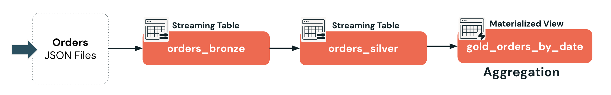
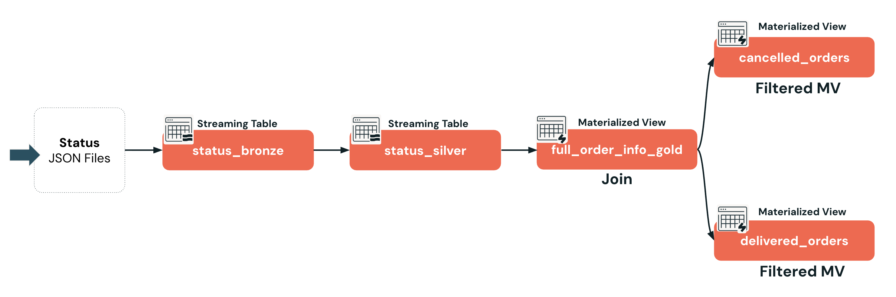
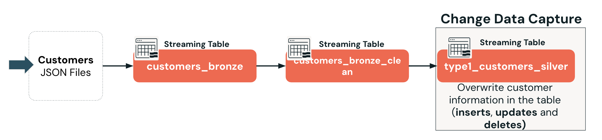

Wie Streaming Tables, Materialized Views und Views in **Apache Spark™ Declarative Pipelines** verwendet werden.



```sql
CREATE OR REFRESH STREAMING TABLE 1_bronze_db.orders_bronze AS
SELECT
  *,
  current_timestamp() AS processing_time,
  _metadata.file_name AS source_file
FROM STREAM read_files("{{source_path}}/orders",  format => 'JSON');

CREATE OR REFRESH STREAMING TABLE 2_silver_db.orders_silver AS
SELECT
  order_id,
  timestamp(order_timestamp) AS order_timestamp,
  customer_id,
  notifications
FROM STREAM 1_bronze_db.orders_bronze;

CREATE OR REFRESH MATERIALIZED VIEW 3_gold_db.gold_orders_by_date AS
SELECT
  date(order_timestamp) AS order_date,
  count(*) AS total_daily_orders
FROM 2_silver_db.orders_silver
GROUP BY date(order_timestamp);

CREATE TEMPORARY VIEW orders_active AS
SELECT *
FROM 2_silver_db.orders_silver
WHERE notifications = 'Y';


CREATE VIEW 3_gold_db.orders_active_view AS
SELECT *
FROM 2_silver_db.orders_silver
WHERE notifications = 'Y';

```






**Lakeflow Declarative Pipelines** unterstützen drei Haupttypen von Datasets:


**Streaming Tables (ST)**: Streaming Tables sind speziell für Streaming- oder inkrementelle Datenverarbeitung konzipiert. Das bedeutet, dass sie nur neue Daten verarbeiten, sobald diese eintreffen, anstatt bei jedem Pipeline-Lauf alles neu zu verarbeiten. Dieser Ansatz steigert die Effizienz erheblich und senkt die Kosten, insbesondere bei großen oder häufig aktualisierten Daten.

- SQL-Syntax zum Erstellen von Streaming Tables: `CREATE OR REFRESH STREAMING TABLE`
- Es muss `FROM STREAM read_files()` verwendet werden, um inkrementelle Streaming-Lesevorgänge mit Checkpointing zu ermöglichen
  - In der `FROM`-Klausel:
    - Das Schlüsselwort `STREAM` weist die Pipeline an, Streaming-Semantik zu verwenden, d. h. neue Dateien inkrementell zu verarbeiten, sobald sie eintreffen.
    - Die Funktion `read_files()` verweist auf den Speicherort Ihrer Quelldateien. Sie liest die Dateien und gibt die Inhalte in tabellarischer Form zurück.
- Diese Syntax nutzt Databricks Auto Loader, der neue Dateien automatisch nachverfolgt und eine zuverlässige, inkrementelle Ingestion sicherstellt.


**Materialized Views (MV)**

- Verwenden Sie die Syntax `CREATE OR REFRESH MATERIALIZED VIEW`
- Wo möglich, werden die Ergebnisse inkrementell aktualisiert, sodass beim Eintreffen neuer Daten kein vollständiger Neuaufbau nötig ist. Auf Serverless Compute unterstützt.


**Views**

- Erstellt eine virtuelle Tabelle ohne physische Daten auf Basis der Abfrage in Ihren Declarative Pipelines
- View-Typen:  Temporary View
- View

## D. Materialized Views

### D1. Materialized Views im Überblick

Materialized Views verarbeiten Datensätze nach Bedarf, um auf Basis des aktuellen Zustands Ihrer Streaming Tables korrekte Ergebnisse zu liefern. Sie sind darauf ausgelegt, die Ergebnisse automatisch aktuell zu halten, wenn neue Daten durch vorgelagerte Tabellen fließen.


**Materialized Views im Überblick**

**1. Dynamische Neuberechnung der Abfrage**
  Bei jeder Aktualisierung einer Materialized View werden die Abfrageergebnisse neu berechnet, um Änderungen in vorgelagerten Datasets widerzuspiegeln

**2. Pflege durch die Pipeline**
  Werden automatisch von der Pipeline erstellt und aktualisiert

**3. Verwendung per SQL-Befehl**
  Verwenden Sie die Syntax `CREATE OR REFRESH MATERIALIZED VIEW`

**4. Flexible Platzierung in der Pipeline**
  Können überall in Ihrer Pipeline verwendet werden, nicht nur in der Gold-Schicht

**5. Inkrementelle Aktualisierung**
  Wo möglich, werden die Ergebnisse inkrementell aktualisiert, sodass beim Eintreffen neuer Daten kein vollständiger Neuaufbau nötig ist. Auf Serverless Compute unterstützt.

**6. Kostenbasierte Optimierung**
  Die inkrementelle Aktualisierung wird von einem kostenbasierten Optimizer gesteuert, um schnelle und effiziente Transformationen auf Serverless Compute zu ermöglichen

##### Dokumentation

Im Hintergrund entscheidet ein kostenbasierter Optimizer, ob die View inkrementell aktualisiert oder vollständig neu berechnet wird. Details finden Sie unter [Incremental refresh for materialized views](https://docs.databricks.com/aws/en/optimizations/incremental-refresh).


## E. Temporary Views und Views

### E1. Views im Überblick und ihre Einschränkungen

Views erstellen virtuelle Tabellen, die keine physischen Daten speichern. Stattdessen sind sie lediglich logische Darstellungen auf Basis der in Ihrer Pipeline definierten SQL-Abfrage. 

Es gibt zwei Typen: **Temporary Views**, die nur für die Dauer eines Pipeline-Laufs existieren, und **Views**, die als Objekte in Unity Catalog registriert sind und über den Lauf hinaus bestehen bleiben.


**1. Temporär und auf die Pipeline beschränkt**
  Existiert nur während des Pipeline-Laufs und ist nicht in Unity Catalog registriert

**1. Virtuelle Tabellen ohne Speicherung**
  Werden aus SQL-Abfrageergebnissen erstellt, ohne physische Daten zu speichern

**2. SQL-basierte Zwischenschicht**
  Wird mit `CREATE TEMPORARY VIEW` erstellt und für interne, nicht für Benutzer bestimmte Abfragen verwendet

**2. Im Katalog registrierte Views**
  Werden in Unity Catalog gespeichert und mit `CREATE VIEW` erstellt

**Einschränkungen von Views**

- Die Pipeline muss eine **Unity-Catalog-Pipeline** sein.
- Views **können keine Streaming-Abfragen enthalten** und nicht als Streaming-Quelle für eine Pipeline verwendet werden.


