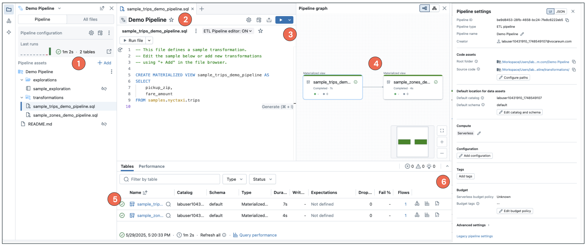
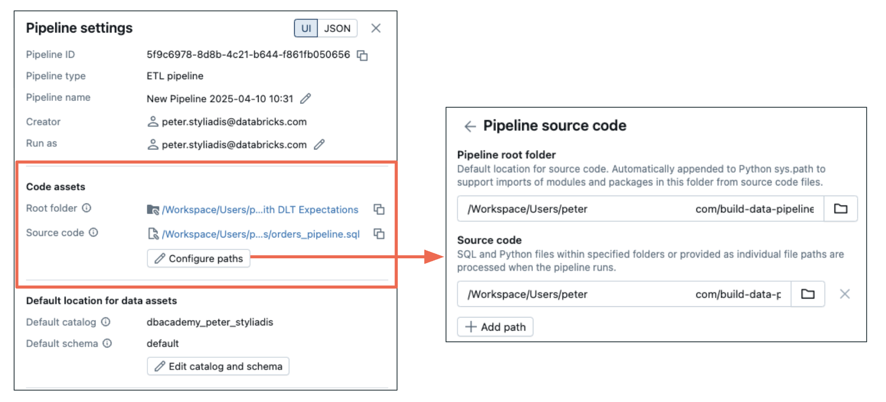
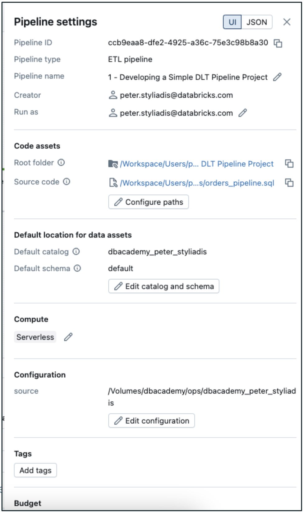

 Wie der Multi-File-Editor die Entwicklung und das Debugging von Pipelines vereinfacht und wie gängige Pipeline-Einstellungen die Pipeline-Ausführung anpassen.

Der Multi-File-Editor in Apache Spark™ Declarative Pipelines macht die Entwicklung und das Debugging Ihrer ETL-Pipelines einfacher und effizienter.

Anstatt eine einzige große Datei zu verwalten, ist Ihre Pipeline als Satz von Dateien organisiert, die im Pipeline-Asset-Browser sichtbar sind. So können Sie Code bearbeiten und Ihre Pipeline-Komponenten an einem Ort konfigurieren.



### B2. Compute

Beginnen wir mit Compute – hier wählen Sie die Ressourcen und die Umgebung aus, in der Ihre Pipeline ausgeführt wird. 

##### Klicken Sie auf die einzelnen Tabs, um die beiden für Ihre Pipeline verfügbaren Compute-Optionen zu erkunden.

  Serverless (empfohlen)
  Classic (feste Größe)

**Serverless Compute
**VON DATABRICKS EMPFOHLEN

**Optimierte Kosten & Performance**
Serverless optimiert die Kosten bei gleichzeitig starker Performance.

**Fokus auf Code statt Infrastruktur**
Sie können sich vollständig auf Ihren Code konzentrieren, ohne Infrastruktur verwalten oder bereitstellen zu müssen.

**Inkrementelle Aktualisierung für MVs**
Unterstützung für die inkrementelle Aktualisierung von Materialized Views.

**Kostenbasierter Optimizer**
Ein kostenbasierter Optimizer, der schnelle und effiziente Transformationen von Materialized Views ermöglicht und so Effizienz und Geschwindigkeit der Pipeline verbessert.

**Einstellung Performance Optimized:** Für zeitkritische Lakeflow Jobs gibt es eine optionale Einstellung **Serverless Performance Optimized**, um die Reaktionsfähigkeit zu erhöhen.

**Classic Compute (feste Größe)**

**Cluster mit fester Größe**
Classic Compute verwendet Cluster mit fester Größe. Benutzer benötigen entsprechende Berechtigungen, um Compute-Ressourcen für Declarative Pipelines zu erstellen.

**Steuerung über Berechtigungen & Richtlinien**
Workspace-Administratoren können Cluster-Richtlinien einrichten, um den Zugriff der Benutzer auf Compute-Ressourcen zu steuern und bereitzustellen.

**Enhanced Autoscaling – standardmäßig aktiviert**
Enhanced Autoscaling ist für alle neuen Pipelines mit Classic Compute standardmäßig aktiviert. Es passt die Clustergröße automatisch an das Workload-Volumen an, optimiert die Ressourcennutzung und hilft, Kosten ohne manuelles Eingreifen zu kontrollieren.

##### Dokumentation
- [Serverless Performance Optimized](https://docs.databricks.com/aws/en/dlt/serverless-dlt#select-a-performance-mode)
- [Serverless Pipeline Features](https://docs.databricks.com/aws/en/dlt/serverless-dlt#serverless-pipeline-features)

### B3. Code Assets

Code Assets verwalten die Dateien und Code-Module, aus denen Ihre Pipeline besteht.
.

  

**Pipeline Root Folder**

Der **Pipeline Root Folder** wird automatisch festgelegt und umfasst alle relevanten Dateien in diesem Ordner für Ihr Pipeline-Projekt (sofern vom Benutzer nicht anders angegeben). 

Dies kann ein **Git-Ordner** sein, was eine einfache Versionskontrolle und Zusammenarbeit ermöglicht.

**Abschnitt Source Code**

Im Abschnitt **Source Code** legen Sie fest, welche Unterordner oder einzelnen Dateien in Ihre Pipeline aufgenommen werden – typischerweise Unterordner und Dateien innerhalb des Root-Ordners.

Das können sein:

Python-Skripte | SQL-Dateien | Notebooks | usw.

##### Zusätzliche Hinweise
Die Einstellung Code Assets steuert, welche Code-Dateien Ihre Pipeline während der Ausführung verwendet.

Zusammen stellen diese Einstellungen sicher, dass Ihre Pipeline genau mit dem Code läuft, den sie benötigt – organisiert und versioniert als Teil Ihres Projekts.

### B4. Konfiguration (Parameter)

Die Konfiguration einer Pipeline ist eine Zuordnung von **Schlüssel-Wert-Paaren**, mit denen Sie Ihren Code parametrisieren können.

**Warum Konfigurationsparameter verwenden?**

**1**

**Verbessert Lesbarkeit & Wartbarkeit**, indem wichtige Werte zentral verwaltet werden.

**2**

**Ermöglicht die Wiederverwendung** gemeinsamer Parameter über mehrere Pipeline-Dateien hinweg und vermeidet fest codierte Werte.

**3**

**Macht Pipelines flexibel** und leichter aktualisierbar, ohne Code an mehreren Stellen ändern zu müssen.

Beispielsweise könnten Sie einen Parameter namens `source` haben, der auf einen bestimmten Volume-Pfad verweist.

In Ihrem SQL-Code können Sie diesen Parameter mit der Syntax `${source}` referenzieren, wodurch der Wert zur Laufzeit dynamisch eingesetzt wird.

**SQL-Referenzsyntax**

**Configuration**

**Key***
**Value**

source

/Volumes/dbacademy/ops/dbacademy_warehouse

🗑

Add parameter

```sql
CREATE STREAMING TABLE bronze
SELECT *
FROM STREAM read_files(
  "${source}/orders",
  format => 'JSON'
);
```

### B5. Weitere Pipeline-Einstellungen

Über die besprochenen Kerneinstellungen hinaus gibt es mehrere weitere Pipeline-Einstellungen, denen Sie im Laufe des Kurses begegnen werden.

##### Bewegen Sie den Mauszeiger über die hervorgehobenen Überschriften, um mehr über weitere Pipeline-Einstellungen zu erfahren.

  

1

Pipeline Settings
Allgemeines Verhalten und Metadaten der Pipeline.

2

Code Assets
Verwaltung Ihrer Pipeline-Code-Dateien.

3

Default Location for Data Assets
Festlegen, wo Daten standardmäßig gespeichert werden.

4

Compute
Auswahl Ihrer Ausführungsumgebung.

5

Configuration
Parametrisierung Ihres Pipeline-Codes.

**Environment dependencies** – Eine Abhängigkeit ist eine Zeile in einer pip-requirements-Datei.

6

Tags
Organisieren und Kategorisieren von Pipelines für eine einfache Verwaltung.

##### Zusätzliche Hinweise
Weitere zusätzliche Funktionen sind
- Budget – Festlegen von Kostenkontrollen und -grenzen
- Advanced Settings – Zusätzliche Optionen zur Feinabstimmung Ihrer Pipeline

Wir werden diese in praktischen Demonstrationen genauer erkunden, damit Sie das Beste aus Spark Declarative Pipelines herausholen.

## C. Fazit

In dieser Lektion haben Sie gelernt, wie Dataset-Typen, der Multi-File-Editor und gängige Pipeline-Einstellungen zusammenwirken, um eine zuverlässige Entwicklung mit Apache Spark™ Declarative Pipelines zu unterstützen:

1. **Streaming Tables, Materialized Views und Views** unterstützen unterschiedliche Datenverarbeitungsmuster – von inkrementeller Ingestion über aktualisierte Aggregationen bis zur Abfrageausführung bei Bedarf.
2. **Deklarative SQL-Syntax** bietet eine einheitliche Möglichkeit, Pipeline-Datasets zu erstellen, während Databricks Abhängigkeiten automatisch über den Declarative Pipeline Graph verwaltet.
3. **Der Multi-File-Editor** vereinfacht die Pipeline-Entwicklung, indem er Pipeline-Assets, modulare Code-Bearbeitung, DAG-Visualisierung, Datenvorschauen, Ausführungseinblicke und Validierungstools in einer Umgebung vereint.
4. **Pipeline-Einstellungen** ermöglichen es Ihnen, Compute, Code Assets, Konfigurationsparameter und weitere Optionen anzupassen, damit Pipelines leichter zu verwalten, wiederzuverwenden und zu skalieren sind.

©  Databricks, Inc. Alle Rechte vorbehalten.
Apache, Apache Spark, Spark, das Spark-Logo, Apache Iceberg, Iceberg und das Apache-Iceberg-Logo sind Marken der [Apache Software Foundation](https://www.apache.org/).

[Datenschutzrichtlinie](https://databricks.com/privacy-policy) |
[Nutzungsbedingungen](https://databricks.com/terms-of-use) |
[Support](https://help.databricks.com/)

