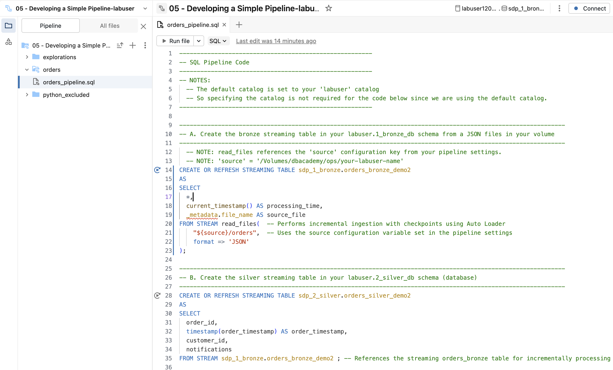
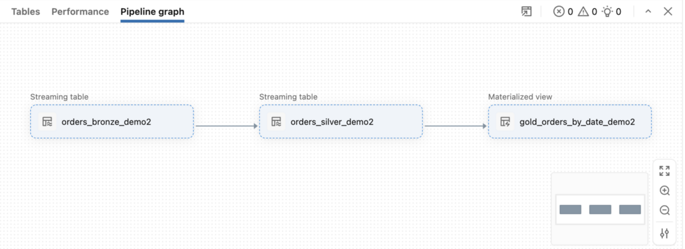
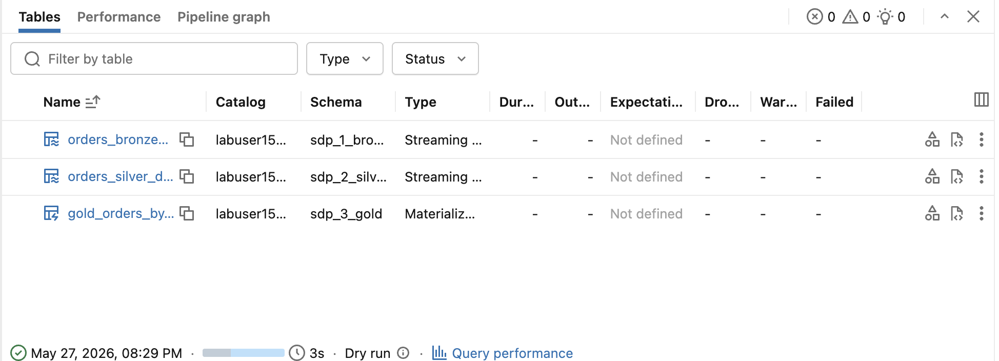
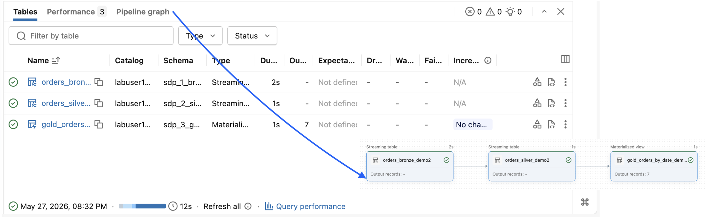
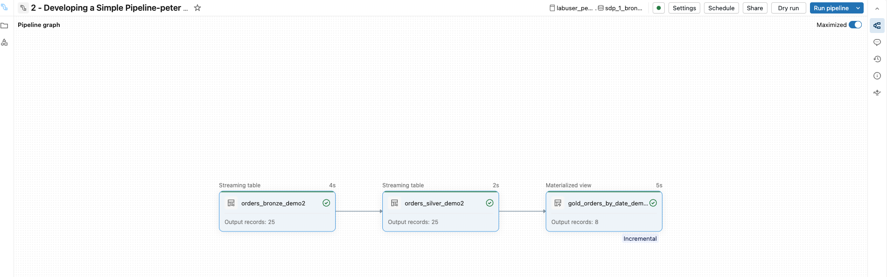

Erstellen Sie mit dem neuen **Lakeflow Pipeline Editor** und deklarativem SQL ein einfaches Projekt mit Apache Spark™ Declarative Pipelines.




#### B2.1. Die Ordnerstruktur erkunden

Ihr Pipeline-Projekt enthält drei Ordner:

| Ordner | Beschreibung |
|--------|-------------|
| `exploration` | Beispiel-Notebook zur Exploration. **Dieses ist von der Pipeline ausgeschlossen** |
| `orders` | Enthält den Code der Bestell-Pipeline (`orders_pipeline.sql`) |
| `python_excluded` | Python-Version des SQL-Pipeline-Codes. Dieser Kurs konzentriert sich auf SQL. Sie können die Python-Version gerne erkunden. |

> **HINWEIS:** Sie können Ihr Pipeline-Projekt und Ihre Dateien beliebig strukturieren.

#### B2.2. Ordner in die Pipeline einschließen oder ausschließen

1. Klappen Sie den Ordner `exploration` auf.
- Beachten Sie das Symbol rechts neben dem Notebook `sample_exploration` 

- Bewegen Sie den Mauszeiger darüber, um zu bestätigen, dass es von der Pipeline **ausgeschlossen** ist.

2. Klicken Sie mit der rechten Maustaste auf den Ordner `exploration`.
- Beachten Sie die Option **Include folder as pipeline source code** (nicht auswählen – wir möchten keine Explorationen einschließen).

- Sie können dies umschalten, um den Ordner ein- oder auszuschließen. **Lassen Sie ihn vorerst ausgeschlossen.**

3. Derzeit sind nur die Dateien im Ordner **orders** in die Pipeline **eingeschlossen**.

#### B2.3. Pipeline-Einstellungen erkunden und ändern

1. Wählen Sie im linken Navigationsbereich unterhalb der Tabs **Pipeline** und **All Files** das Symbol **Settings** (Zahnrad).
- Rechts öffnet sich ein Bereich.

2. **Pipeline Settings** – Überprüfen Sie die Pipeline-Details:
- Pipeline-ID, Typ, Name, Modus, Ersteller, Eigentümer und Run as.
- Lassen Sie diese unverändert.

3. **Code Assets** – Dieser Abschnitt referenziert automatisch alle eingeschlossenen Dateien in Ihrem Projekt.
- **Root folder** – verweist auf den gesamten Pipeline-Projektordner
- **Source code** – listet alle eingeschlossenen Dateien auf (sollte nur den Ordner `orders` zeigen)
- **HINWEIS:** Verwenden Sie **Configure paths**, um bei Bedarf Dateien innerhalb oder außerhalb des Projekt-Root-Ordners zu referenzieren

4. **Default Location for Data Assets**

- Wählen Sie **Edit the catalog and schema** und bestätigen Sie Folgendes:

| Feld | Was auswählen |
|-------|---------------|
| **Default catalog** | Ihr **labuser**-Katalog |
| **Default schema** | **sdp_1_bronze** |

- Wählen Sie **Save**, falls Sie diese Werte geändert haben.

> **HINWEIS:** Mit Apache Spark™ Declarative Pipelines können Sie Streaming Tables und Materialized Views in jedem beliebigen Katalog und Schema veröffentlichen. Sie sind nicht auf den Standardkatalog und das Standardschema beschränkt.

5. **Compute** – Legt das Compute der Pipeline fest

a. Wählen Sie das Symbol **Edit** und bestätigen Sie, dass **Serverless** ausgewählt ist.

b. Heben Sie die Auswahl von **Serverless** auf und sehen Sie sich die verfügbaren Compute-Optionen, Cluster-Richtlinien und Tags an.

c. **Wählen Sie wieder Serverless** aus und kehren Sie zu den Pipeline-Einstellungen zurück.

**
ERFORDERLICH – Einen Konfigurationsparameter hinzufügen, der auf Ihr Quell-Volume verweist
**

6. Führen Sie die folgenden Schritte aus, um eine Variable `source` hinzuzufügen, die auf Ihr Rohdaten-Volume verweist.

   a. Führen Sie die folgende Zelle aus und kopieren Sie den Pfad zu Ihrem Quelldaten-Volume.

   b. Wählen Sie **Add configuration**.

   c. **Key** = `source`

   d. **Value** = Fügen Sie den Volume-Pfad Ihres Volumes `labuser.sdp_1_bronze.source` ein.
- Beispiel: `/Volumes/labuser/sdp_1_bronze/source`

   e. Wählen Sie **Save**.

##### 

###### A. Bronze – Rohdaten-Ingestion (Streaming Table)

- Ingestiert rohe JSON-Dateien aus einem Volume mit Auto Loader (`STREAM read_files`)
- Fügt die Spalten `processing_time` und `source_file` für das Auditing hinzu
- **Verarbeitet bei jedem Pipeline-Lauf inkrementell nur neue Dateien**

###### B. Silber – Bereinigt & typisiert (Streaming Table)

- Liest inkrementell aus der Bronze-Streaming-Table (`FROM STREAM sdp_1_bronze.orders_bronze_demo05`)
- Wählt relevante Spalten aus und castet `order_timestamp` zu `TIMESTAMP`
- Nur neue Zeilen aus Bronze fließen durch

###### C. Gold – Aggregation (Materialized View)

- Aggregiert Silber zu **täglichen Bestellanzahlen** (`GROUP BY date`)
- Verwendet eine `MATERIALIZED VIEW` statt einer Streaming Table
- Aggregationen erfordern einen vollständigen Tabellenscan. **Databricks optimiert die Neuberechnung jedoch, wo möglich**
- **Inkrementelle Aktualisierung für Materialized Views**:
[AWS](https://docs.databricks.com/aws/en/optimizations/incremental-refresh) |
[Azure](https://learn.microsoft.com/en-us/azure/databricks/optimizations/incremental-refresh) |
[GCP](https://docs.databricks.com/gcp/en/optimizations/incremental-refresh)

**Wichtige Unterschiede ST/MV**:
  - Bronze und Silber verwenden `STREAMING TABLE` für die inkrementelle Verarbeitung.
  - Gold verwendet `MATERIALIZED VIEW`, weil `GROUP BY`-Aggregationen nicht inkrementell berechnet werden können.

## C. Die Spark Declarative Pipeline ausführen

### C1. Einen Dry Run der Pipeline durchführen
Mit einem Dry Run können Sie **den Quellcode einer Pipeline auf Probleme prüfen**, ohne darauf warten zu müssen, dass Tabellen erstellt oder aktualisiert werden.

Diese Funktion ist bei der Entwicklung oder beim Testen von Pipelines nützlich, weil Sie damit Fehler in Ihrer Pipeline – etwa falsche Tabellen- oder Spaltennamen – schnell finden und beheben können.

1. Wählen Sie in der oberen Navigationsleiste **Dry Run** (bei kleinem Bildschirm müssen Sie möglicherweise das Dropdown neben der Schaltfläche **Run pipeline** in der oberen Navigationsleiste auswählen).

- Beachten Sie, dass die Pipeline im linken Fenster in den Modus **DRY RUN** wechselt und mit der Verarbeitung der einzelnen Schritte beginnt (dauert etwa ~1 Minute).

- Nach Abschluss des Dry Runs sollten Sie im **Pipeline graph** drei Elemente sehen (wählen Sie bei Bedarf das Graph-Symbol in der rechten Navigationsleiste):



2. Erkunden Sie das untere Fenster und beachten Sie die folgenden Spalten:

- **Catalog** – der Katalog, in den jedes Objekt schreibt

- **Schema** – das Schema, in das jedes Objekt schreibt

- **Type** – der Objekttyp



**
Fehlerbehebung bei einem Pipeline-Fehler
**

Wenn Ihre Pipeline einen Fehler zurückgibt, prüfen Sie Folgendes in Ihren **Pipeline Settings**:

  - Der Default catalog ist auf Ihren **labuser**-Katalog gesetzt

  - Das Default schema ist auf **sdp_1_bronze** gesetzt

  - Die Konfigurationsvariable `source` verweist auf Ihren Volume-Pfad: `/Volumes/labuser/sdp_1_bronze/source`

### C2. Die Spark Declarative Pipeline ausführen

1. Wählen Sie das Dropdown neben der Schaltfläche **Run pipeline** in der oberen Navigationsleiste.

Sie sehen zwei Optionen:

| Update-Typ | Materialized View | Streaming Table |
|-------------|------------------|-----------------|
| **Run pipeline** – Refresh | Aktualisiert die Ergebnisse, sodass sie die aktuellen Ergebnisse der definierenden Abfrage widerspiegeln. Prüft die Kosten und führt eine inkrementelle Aktualisierung durch, wenn diese kosteneffizienter ist. | Verarbeitet neue Datensätze über die in Streaming Tables und Flows definierte Logik. |
| **Run pipeline with full table refresh** – Vollständige Aktualisierung der Pipeline | Aktualisiert die Ergebnisse, sodass sie die aktuellen Ergebnisse der definierenden Abfrage widerspiegeln. | Löscht die Daten aus Streaming Tables, löscht Zustandsinformationen (Checkpoints) aus Flows und verarbeitet alle Datensätze aus der Datenquelle erneut. |

2. Wählen Sie **Run pipeline** und beobachten Sie jede Phase im rechten Fenster.

**
Information
**

- Eine vollständige Aktualisierung (Full Refresh) löscht alle Objekte und Checkpoints. Seien Sie bei der Verwendung vorsichtig.
- Um zu verhindern, dass ein Full Refresh ausgelöst wird, setzen Sie die Tabelleneigenschaft: `pipelines.reset.allowed = false`
- **Pipeline refresh semantics**:
[AWS](https://docs.databricks.com/aws/en/ldp/updates#pipeline-refresh-semantics) |
[Azure](https://learn.microsoft.com/en-us/azure/databricks/ldp/updates#pipeline-refresh-semantics) |
[GCP](https://docs.databricks.com/gcp/en/ldp/updates#pipeline-refresh-semantics)

### C3. Den Pipeline-Lauf überwachen

1. Beobachten Sie während des Pipeline-Laufs (~1 Minute) den **Pipeline graph** rechts.

Während jedes Objekt erstellt wird, erscheint ein Datenfluss, und die Zeilenanzahlen werden aktualisiert, sobald die Verarbeitung abgeschlossen ist.

Erwartete Ergebnisse:
- **174 Zeilen** ingestiert von Raw JSON → Bronze → Silber
- **7 Zeilen** in der Aggregation der Materialized View

### C4. Die abgeschlossene Pipeline erkunden

Erkunden Sie nach Abschluss der Pipeline die Ergebnisse:

1. Sehen Sie sich den **Pipeline graph** an. Der Graph visualisiert den vollständigen Datenfluss.

2. Sehen Sie sich im unteren Fenster die Details zu den erstellten Tabellen und Materialized Views an, einschließlich Speicherorten, Dauer und Zeilenanzahlen.

   a. Wählen Sie den Tab **Performance**, um Performance-Kennzahlen anzuzeigen, und kehren Sie dann zu **Tables** zurück.

   b. Wählen Sie die Streaming Table **orders_bronze_demo05**, um ihre **Daten**, **Table metrics** und **Performance** anzuzeigen.

   c. Wählen Sie im unteren Fenster den Pfeil links neben **All tables**, um zur vollständigen Liste der Pipeline-Objekte zurückzukehren.

   d. Wählen Sie die Materialized View **gold_orders_by_date_demo05** und bestätigen Sie, dass sie die Daten wie erwartet nach Datum zusammenfasst.
- Verwenden Sie die Navigationsleiste im unteren Fenster, um die Tabs **Data**, **Columns**, **Table metrics** und **Performance** für die Materialized View zu erkunden.

### C5. Den DAG (Pipeline Graph) erkunden

1. Sie können Objekte auch direkt im DAG (Pipeline Graph) auswählen, um die Details im unteren Fenster zu aktualisieren.

### C6. Die Pipeline erneut ausführen

1. Wählen Sie erneut **Run pipeline** und erkunden Sie die aktualisierten Ergebnisse, während sie läuft.

2. Beachten Sie nach Abschluss des zweiten Laufs, dass keine neuen Zeilen zu den Streaming Tables hinzugefügt wurden.

**Das ist zu erwarten, da keine neuen Dateien zur Datenquelle hinzugefügt wurden und die Checkpoints wissen, dass die aktuellen Daten bereits ingestiert wurden**.



## D. Eine neue Datei zum Cloud-Speicher hinzufügen

1. Führen Sie die folgende Zelle aus, um eine neue JSON-Datei (**01.json**) zu Ihrem Volume hinzuzufügen unter:  `/Volumes/labuser/sdp_1_bronze/source/orders`.

Dies simuliert das Hinzufügen von Dateien zum Cloud-Speicher.

```python
%python
## Daten im Datenordner des Workspace finden
data_path = find_folder('Includes/data')

## Eine weitere JSON-Datei in Ihrem Orders-Volume ablegen
copy_workspace_files_to_volume(
    src_workspace_folder=f'{data_path}/orders',
    target_volume_path=f'{source_volume_path}/orders',
    n=2
)
```

2. Führen Sie die folgenden Schritte aus, um die neue Datei in Ihrem Volume anzuzeigen:

   a. Wählen Sie im linken Navigationsbereich das Symbol **Catalog** .

   b. Klappen Sie Ihr Volume **labuser.sdp_1_bronze.source** auf.

   c. Klappen Sie das Verzeichnis **orders** auf.

   d. Sie sollten zwei Dateien in Ihrem Volume sehen: **00.json** und **01.json** (bei Bedarf aktualisieren).

3. Führen Sie die folgende Zelle aus, um die Daten in der neuen Datei **/orders/01.json** anzuzeigen. Beachten Sie Folgendes:

   - Die Datei **01.json** enthält neue Bestellungen.
   - Die Datei **01.json** hat 25 Zeilen.

```python
%python
spark.sql(f'''
  SELECT *
  FROM json.`{source_volume_path}/orders/01.json`
  LIMIT 10
''').display()
```

4. Kehren Sie zur Datei **orders_pipeline.sql** zurück und wählen Sie **Run Pipeline**, um Ihre ETL-Pipeline mit der neuen Datei erneut auszuführen.

   - Beobachten Sie den Pipeline-Lauf und beachten Sie, dass nur **25 Zeilen** zu den Bronze- und Silber-Tabellen hinzugefügt werden.

   - Das geschieht, weil:
- die Pipeline die ursprüngliche Datei **00.json** (174 Zeilen) bereits verarbeitet hat
- sie jetzt nur die neue Datei **01.json** (25 Zeilen) liest
- neue Zeilen an die **Streaming Tables** angehängt werden
- die Materialized View mit den neuesten Daten **inkrementell neu berechnet** wird (sollte insgesamt **8 Zeilen** haben)

#### Checkpoint


## E. Ihre Streaming Tables erkunden

### E1. Die Tabellen ansehen

1. Sehen Sie sich die neuen Streaming Tables und die Materialized View in Ihrem Katalog an. Gehen Sie wie folgt vor:

   a. Wählen Sie im linken Navigationsbereich das Katalog-Symbol .

   b. Klappen Sie Ihren **labuser**-Katalog auf.

   c. Klappen Sie die Schemas **sdp_1_bronze**, **sdp_2_silver** und **sdp_3_gold** auf.
- Beachten Sie, dass die beiden Streaming Tables und die Materialized View korrekt in Ihren Schemas abgelegt sind.

- Bronze-Streaming-Table: **labuser.sdp_1_bronze.orders_bronze_demo05**

- Silber-Streaming-Table: **labuser.sdp_2_silver.orders_silver_demo05**

- Gold-Materialized-View: **labuser.sdp_3_gold.gold_orders_by_date_demo05**

2. Führen Sie die folgende Zelle aus, um die Daten in der Tabelle **labuser.sdp_1_bronze.orders_bronze_demo05** anzuzeigen.

   Wie viele Zeilen sollte diese Streaming Table haben, bevor Sie die Zelle ausführen?

   Beachten Sie Folgendes:
- Die Tabelle enthält 199 Zeilen (**00.json** hatte 174 Zeilen und **01.json** hatte 25 Zeilen).
- In der Spalte **source_file** sehen Sie genau, aus welcher Datei die Zeilen ingestiert wurden.
- In der Spalte **processing_time** sehen Sie genau, wann die Zeilen ingestiert wurden.

```sql
SELECT *
FROM sdp_1_bronze.orders_bronze
LIMIT 10;
```

### E2. Die Tabellenhistorie ansehen

1. Führen Sie den folgenden Code aus, um die Historie der Streaming Table **orders_bronze_demo05** anzuzeigen.

Beachten Sie Folgendes:

- In der Spalte **operation** lauten die letzten beiden Updates **STREAMING UPDATE**, nicht `WRITE` oder `MERGE`. Das bestätigt, dass die Tabelle inkrementell von einer Streaming-Abfrage beschrieben wird.

- Klappen Sie die Werte von **operationParameters** für die letzten beiden Updates auf. Beachten Sie, dass beide `"outputMode": "Append"` verwenden und jeweils eine aufsteigende **epochId** haben (`0` für den ersten Ladevorgang, `1` für das inkrementelle Update).

- Suchen Sie die Spalte **operationMetrics**. Klappen Sie die Werte für die letzten beiden Updates auf. Beachten Sie Folgendes:

- Sie zeigt verschiedene Kennzahlen für das Streaming-Update: **numRemovedFiles, numOutputRows, numOutputBytes und numAddedFiles**.

- In den Werten von `numOutputRows`
- wurden beim ersten Update **174 Zeilen** hinzugefügt
-  beim zweiten **25 Zeilen**. 
- Wäre dies eine Batch-Pipeline mit vollständigem erneuten Lesen, würde der zweite Lauf 199 Zeilen zeigen. Dass nur 25 angezeigt werden, beweist, dass nur neue Daten verarbeitet wurden.

```sql
DESCRIBE HISTORY sdp_1_bronze.orders_bronze
```


