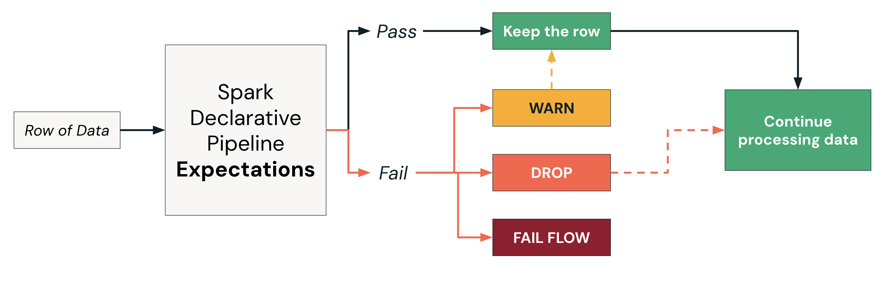

Datenqualitäts-Expectations zu Ihren Pipelines hinzufügen, Expectations zur Validierung von Streaming-Daten anwenden und die verfügbaren Aktionen für den Umgang mit Datensätzen verstehen, die Datenqualitätsprüfungen nicht bestehen.


```sql
CREATE OR REFRESH STREAMING TABLE 2_silver_db.orders_silver
 (
   CONSTRAINT valid_notifications EXPECT (notifications IN ('Y','N')),
   CONSTRAINT valid_date EXPECT (order_timestamp > "2021-01-01") ON VIOLATION FAIL UPDATE,
   CONSTRAINT valid_id EXPECT (customer_id IS NOT NULL) ON VIOLATION DROP ROW
 )
AS
SELECT
  order_id,
  timestamp(order_timestamp) AS order_timestamp,
  customer_id,
  notifications
FROM STREAM 1_bronze_db.orders_bronze;
  
```

## D. Aktionen im Überblick – wie Expectations in der Pipeline funktionieren

  

1. **Expectations sind Datenqualitätsregeln**, die mit der Syntax `CONSTRAINT ... EXPECT (...)` direkt im SQL Ihrer Pipeline definiert werden – sie validieren die Daten während des ETL Zeile für Zeile.
2. **WARN** (die Standardaktion) protokolliert Verstöße und schreibt ungültige Zeilen trotzdem ins Ziel – ideal für die Überwachung nicht kritischer Qualitätsaspekte, ohne die Pipeline zu unterbrechen.
3. **DROP** entfernt ungültige Zeilen aus der Ausgabe und protokolliert deren Anzahl – geeignet für Fälle, in denen fehlerhafte Daten ausgeschlossen werden müssen, die Pipeline aber weiterlaufen soll.
4. **FAIL** stoppt den betreffenden Flow, sobald ein Verstoß auftritt, und erfordert manuelles Eingreifen – für kritische Datenprobleme, die vor der nachgelagerten Verarbeitung behoben werden müssen.
5. **Mehrere Constraints** können in einer einzigen Tabellendefinition nebeneinander bestehen und werden jeweils unabhängig ausgewertet – das gibt Ihnen eine mehrstufige, granulare Kontrolle über die Datenqualität aller Spalten.

