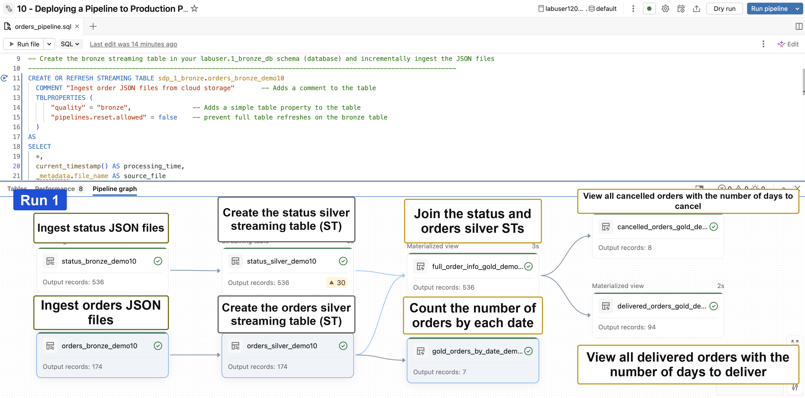
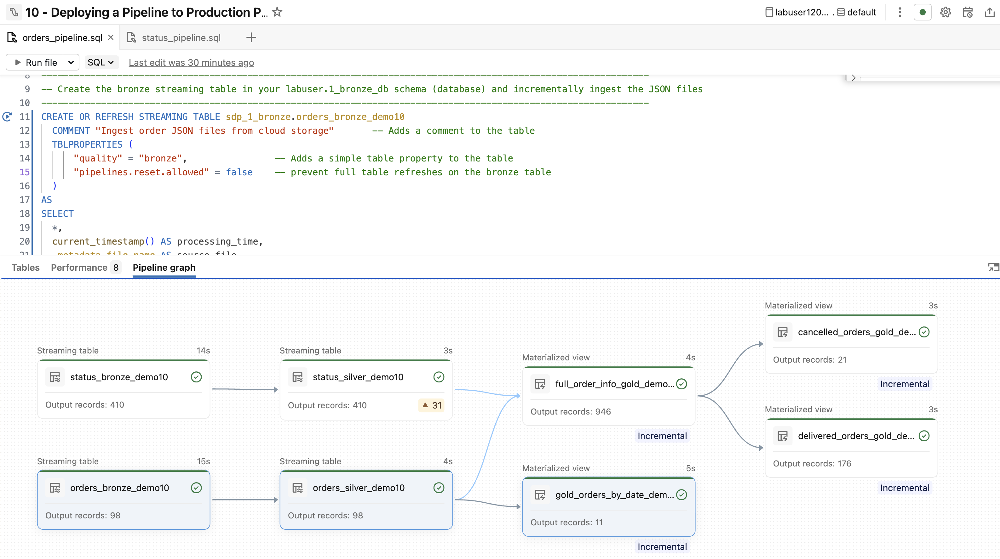

Wir fügen unserer Pipeline eine zusätzliche Datenquelle hinzu und führen einen Join mit unseren Streaming Tables durch. Anschließend konzentrieren wir uns darauf, die Pipeline produktionsreif zu machen: Wir fügen den erstellten Objekten Kommentare und Tabelleneigenschaften hinzu, planen die Pipeline und erstellen ein Event Log, um die Pipeline zu überwachen.

Die folgende Abfrage zeigt, wie das Ergebnis des finalen Joins in der Spark Declarative Pipeline aussehen wird, nachdem die Daten beim Erstellen der Pipeline inkrementell ingestiert und bereinigt wurden. Führen Sie die Zelle aus und sehen Sie sich die Ausgabe an.

```sql
WITH orders AS (
  SELECT *
  FROM read_files(
        source_volume_path || '/orders/',
        format => 'JSON'
  )
),
status AS (
  SELECT *
  FROM read_files(
        source_volume_path || '/status/',
        format => 'JSON'
  )
)
-- Die Views verknüpfen, um die Bestellhistorie mit Status zu erhalten
SELECT
  orders.order_id,
  timestamp(orders.order_timestamp) AS order_timestamp,
  status.order_status,
  timestamp(status.status_timestamp) AS order_status_timestamp
FROM orders
  INNER JOIN status
  ON orders.order_id = status.order_id
ORDER BY order_id, order_status_timestamp
LIMIT 10;
```


### E3. Erstellung der Silber-Status-Tabelle (`2_silver_db.status_silver_demo10`)

Verwenden Sie den Code im Abschnitt `B. Bronze -> Silver`, um zu verstehen, wie die Silber-Streaming-Table erstellt und die Datenqualität durchgesetzt wird.

1. Diese Anweisung erstellt die Streaming Table **2_silver_db.status_silver_demo10** aus der Bronze-Streaming-Table **1_bronze_db.status_bronze_demo10**.

2. Die `SELECT`-Klausel:
   - wählt nur die für die Silber-Schicht erforderlichen Spalten aus.
   - castet `status_timestamp` zu einem korrekten Zeitstempel als `order_status_timestamp`.

3. Die `CONSTRAINT`-Klauseln definieren Datenqualitäts-Expectations:
   - `valid_timestamp` verwirft Zeilen, deren Zeitstempel ungültig ist.
   - `valid_order_status` gibt eine Warnung aus, wenn der Status nicht in der zulässigen Liste steht.

4. `COMMENT` und `TBLPROPERTIES` dokumentieren die Tabelle und kennzeichnen sie als Silber in der Medallion-Architektur.

### E4. Materialized View zum Verknüpfen zweier Streaming Tables (`3_gold_db.full_order_info_gold_demo10`)

> Eine Möglichkeit, zwei Streaming Tables in Spark Declarative Pipelines zu verknüpfen, ist das Erstellen einer Materialized View, die den Join durchführt.

> Dieser Ansatz nimmt alle Zeilen aus jeder Streaming Table, führt einen vollständigen Inner Join durch und bezieht, wo möglich, Optimierungen ein.

Verwenden Sie den Code im Abschnitt `C. Use a Materialized View to Join Two Streaming Tables`, um zu verstehen, wie die Gold-Materialized-View erstellt wird.

1. Diese Anweisung erstellt die Materialized View **3_gold_db.full_order_info_gold_demo10**, indem sie die folgenden Streaming Tables verknüpft:
   - **2_silver_db.status_silver_demo10**
   - **2_silver_db.orders_silver_demo10**

2. `COMMENT` und `TBLPROPERTIES` dokumentieren die View und kennzeichnen sie als Gold in der Medallion-Architektur.

3. Beachten Sie, dass das Schlüsselwort `STREAM` beim Referenzieren der Streaming Tables in der Materialized View nicht verwendet wird.
   - Dadurch werden **alle Daten** aus beiden Streaming Tables verknüpft und Ihre finale Materialized View zurückgegeben.

### E5. Gold-Materialized-Views für `Cancelled` und `Delivered Orders`

Verwenden Sie den Code im Abschnitt `D. Create Gold Materialized Views for Cancelled and Delivered Orders`, um zu verstehen, wie die finalen Gold-Views erstellt werden.

1. Dieser Abschnitt erstellt zwei Gold-Materialized-Views aus **3_gold_db.full_order_info_gold_demo10**:
   - **3_gold_db.cancelled_orders_gold_demo10**, stornierte Bestellungen mit Tagen bis zur Stornierung.
   - **3_gold_db.delivered_orders_gold_demo10**, ausgelieferte Bestellungen mit Tagen bis zur Lieferung.

2. Jede Materialized View filtert nach einem bestimmten Status und berechnet mit `datediff` eine einfache Geschäftskennzahl.
   - Funktion `datediff`:
   [AWS](https://docs.databricks.com/aws/en/sql/language-manual/functions/datediff) |
   [Azure](https://learn.microsoft.com/en-us/azure/databricks/sql/language-manual/functions/datediff) |
   [GCP](https://docs.databricks.com/gcp/en/sql/language-manual/functions/datediff)

3. `COMMENT` und `TBLPROPERTIES` dokumentieren jede View und kennzeichnen sie als Gold in der Medallion-Architektur.

**
Information
**

- **Materialized Views enthalten, wo möglich, eingebaute Optimierungen:**

  - Inkrementelle Aktualisierung für Materialized Views: [AWS](https://docs.databricks.com/aws/en/optimizations/incremental-refresh) |[Azure](https://learn.microsoft.com/en-us/azure/databricks/optimizations/incremental-refresh) |
  [GCP](https://docs.databricks.com/gcp/en/optimizations/incremental-refresh)

  - [Delta Live Tables Announces New Capabilities and Performance Optimizations](https://www.databricks.com/blog/2022/06/29/delta-live-tables-announces-new-capabilities-and-performance-optimizations.html)

  - [Cost-effective, incremental ETL with serverless compute for Delta Live Tables pipelines](https://www.databricks.com/blog/cost-effective-incremental-etl-serverless-compute-delta-live-tables-pipelines)

- **Stateful Joins (Stream to Stream):** Informationen zu Stateful Joins in Pipelines (also inkrementellen Joins während der Ingestion) finden Sie in der Dokumentation „Optimize stateful processing in Spark Declarative Pipelines with watermarks“:
  [AWS](https://docs.databricks.com/aws/en/dlt/stateful-processing) |
  [Azure](https://learn.microsoft.com/en-us/azure/databricks/ldp/stateful-processing) |
  [GCP](https://docs.databricks.com/gcp/en/dlt/stateful-processing)
   - **Stateful Joins sind ein fortgeschrittenes Thema und liegen außerhalb des Umfangs dieses Kurses.**

## F. Die Produktions-Pipeline erstellen
Gehen Sie wie folgt vor, um die Pipeline-Einstellungen zu ändern und die Produktions-Pipeline auszuführen.

### F1. Die Pipeline-Einstellungen überprüfen und ändern

1. Führen Sie die folgenden Schritte in Ihrem **Lakeflow Editor** aus, um Ihre Spark Declarative Pipeline für die **Produktion** zu konfigurieren:

   a. Wählen Sie **Settings**, um Ihre Pipeline-Einstellungen anzuzeigen.

   b. Im Abschnitt **Pipeline settings** können Sie:
- die Einstellungen **Pipeline name** und **Run as** ändern (in diesem Lab haben Sie keine Berechtigung, **Run as** zu ändern).

- Wenn Sie die Berechtigung hätten, könnten Sie das Stiftsymbol  neben **Run as** auswählen, um die Option zu ändern.

- Optional können Sie den Ausführenden der Pipeline auf einen Service Principal ändern. Ein Service Principal ist eine Identität, die Sie in Databricks für die Verwendung mit automatisierten Tools, Jobs und Anwendungen erstellen.
- Weitere Informationen finden Sie in der Dokumentation **What is a service principal?**: [AWS](https://docs.databricks.com/aws/en/admin/users-groups/service-principals#what-is-a-service-principal) |
[Azure](https://learn.microsoft.com/en-us/azure/databricks/admin/users-groups/service-principals#what-is-a-service-principal) |
[GCP](https://docs.databricks.com/gcp/en/admin/users-groups/service-principals#what-is-a-service-principal)

- Stellen Sie unter **Pipeline mode** sicher, dass **Triggered** ausgewählt ist, damit die Pipeline nach Zeitplan läuft und Daten inkrementell verarbeitet.
- Alternativ können Sie den Modus **Continuous** wählen, damit die Pipeline dauerhaft läuft.
- Weitere Details finden Sie unter **Triggered vs. continuous pipeline mode**: [AWS](https://docs.databricks.com/aws/en/dlt/pipeline-mode) |
[Azure](https://learn.microsoft.com/en-us/azure/databricks/ldp/pipeline-mode) |
[GCP](https://docs.databricks.com/gcp/en/dlt/pipeline-mode)

   c. Bestätigen Sie im Abschnitt **Code assets**, dass:

- **Root folder** auf dieses Pipeline-Projekt verweist (**10 - Deploying a Pipeline to Production Project**).

- **Source code** die Ordner **orders** und **status** innerhalb dieses Projekts referenziert.

   d. Bestätigen Sie im Abschnitt **Default location for data assets** Folgendes:

- **Default catalog** ist Ihr **labuser**-Katalog.

- **Default schema** ist das Schema **default**.

   e. Bestätigen Sie im Abschnitt **Compute**, dass **Serverless**-Compute ausgewählt ist.

   f. Stellen Sie im Abschnitt **Configuration** sicher, dass der Schlüssel `source` auf den Pfad Ihres Datenquellen-Volumes gesetzt ist: `/Volumes/labuser_/sdp_1_bronze/source`

2. Im Abschnitt **Advanced settings** unten:

   a. Klappen Sie **Advanced settings** auf.

   b. Klicken Sie auf **Edit advanced settings**.

   c. Für **Channel** können Sie für Schulungszwecke **Current** beibehalten:
- **Current** – Verwendet die neueste stabile Databricks-Runtime-Version, empfohlen für die Produktion.
- **Preview** – Verwendet eine neuere, möglicherweise weniger stabile Runtime-Version, ideal zum Testen kommender Funktionen.
- Weitere Informationen finden Sie in den **Release Notes zu Apache Spark™ Declarative Pipelines** und in der Dokumentation zum Upgrade-Prozess: [AWS](https://docs.databricks.com/aws/en/release-notes/dlt/) |
[Azure](https://learn.microsoft.com/en-us/azure/databricks/release-notes/dlt/) |
[GCP](https://docs.databricks.com/gcp/en/release-notes/dlt/)

d. ⚠️ ERFORDERLICH – Im Abschnitt **Event logs**:

- Wählen Sie **Publish event log to Unity Catalog**.
- **Event log name** – `event_log_demo10`.
- **Event log catalog** – **labuser**-Katalog.
- **Event log schema** – Schema **sdp_1_bronze**.
- Wählen Sie **Save**.

**HINWEIS:** Wenn das Event Log nicht am richtigen Ort gespeichert wird, funktionieren die späteren Schritte zur Erkundung des Event Logs nicht korrekt.

3\. Klicken Sie auf **Save**, um Ihre Pipeline-Einstellungen zu speichern.

### F2. Die Pipeline planen
1. Sobald Ihre Pipeline produktionsreif ist, möchten Sie sie **so planen, dass sie entweder in einem Zeitintervall oder kontinuierlich läuft**.

   In dieser Demonstration werden wir:
   - die Pipeline so planen, dass sie jeden Tag um 20:00 Uhr läuft.
   - optional Benachrichtigungen konfigurieren, die Sie bei **Start**, **Success** und **Failure** des Jobs informieren.
   *(Wenn Sie keine E-Mail-Benachrichtigungen möchten, können Sie diesen Schritt überspringen.)*

   Führen Sie die folgenden Schritte aus, um die Pipeline zu planen:

   a. Wählen Sie die Schaltfläche **Schedule** (bei minimiertem Bildschirm ggf. ein kleines Kalendersymbol).

   b. Belassen Sie den Job-Namen bei **10 - Deploying a Pipeline to Production Project - labuser-name**.

   c. Wählen Sie unter **Job name** die Option **Advanced**.

   d. Konfigurieren Sie im Abschnitt **Schedule** Folgendes:
   - Legen Sie den **Day** fest.
   - Setzen Sie die Uhrzeit auf **20:00**.
   - Belassen Sie die **Timezone** bei der Standardeinstellung.
   - Wählen Sie **More options** und fügen Sie unter **Notifications** Ihre E-Mail-Adresse hinzu, um Benachrichtigungen zu erhalten für:
- **Start**
- **Success**
- **Failure**

   e. Klicken Sie auf **Create**, um den Job zu speichern und zu planen.

**HINWEIS:** Sie könnten die Pipeline auch so einstellen, dass sie einige Minuten nach Ihrer aktuellen Uhrzeit läuft, um zu sehen, wie sie über den Scheduler startet.

## G. Die Spark Declarative Pipeline für `orders` und `status` ausführen und ansehen

1. Führen Sie Ihre Spark Declarative Pipeline manuell aus (statt für Schulungszwecke auf den Job zu warten) und sehen Sie sich die Ergebnisse an.
- **HINWEIS:** Derzeit befindet sich jeweils eine JSON-Datei in den Volumes **status** und **orders**.

2. Führen Sie nach dem ersten Lauf der Pipeline Folgendes aus:

   a. Untersuchen Sie den **Pipeline graph** und bestätigen Sie:
- **Status-Flow**
- 536 Zeilen wurden in die Streaming Tables **status_bronze_demo10** und **status_silver_demo10** eingelesen
- **Orders-Flow**
- 174 Zeilen wurden in die Streaming Tables **orders_bronze_demo10** und **orders_silver_demo10** eingelesen
- 7 Zeilen befinden sich in der Materialized View **gold_orders_by_date_demo10**
- **Join der Streaming Tables und Gold-Materialized-Views**
- 536 Zeilen befinden sich in der Materialized View **full_order_info_gold_demo10** (JOIN)
- 8 Zeilen befinden sich in der Materialized View **cancelled_orders_gold_demo10**
- 94 Zeilen befinden sich in der Materialized View **delivered_orders_gold_demo10**

#### Checkpoint

  

## H. Neue Daten in Ihrer Pipeline inkrementell verarbeiten

### H1. Weitere Dateien in Ihrem Volume ablegen
1. Führen Sie die folgende Zelle aus, um **4** weitere JSON-Dateien zu Ihren Volumes hinzuzufügen und so das Eintreffen neuer Dateien im Cloud-Speicher zu simulieren:
- `/Volumes/labuser/sdp_1_bronze/source/orders`
- `/Volumes/labuser/sdp_1_bronze/source/status`

```python
%python

## Daten im Datenordner des Workspace finden
data_path = find_folder('Includes/data')

## JSON-Dateien in Ihrem Orders-Volume ablegen
copy_workspace_files_to_volume(
    src_workspace_folder=f'{data_path}/orders',
    target_volume_path=f'{source_volume_path}/orders',
    n=5
)

## JSON-Dateien in Ihrem Status-Volume ablegen
copy_workspace_files_to_volume(
    src_workspace_folder=f'{data_path}/status',
    target_volume_path=f'{source_volume_path}/status',
    n=5
)
```

```python
%python
orders_list = spark.sql(f"LIST '/Volumes/{my_catalog}/sdp_1_bronze/source/orders'")
status_list = spark.sql(f"LIST '/Volumes/{my_catalog}/sdp_1_bronze/source/status'")
display(orders_list)
display(status_list)
```

### H2. Die Pipeline ausführen, um neue Daten inkrementell zu verarbeiten
1. Nachdem Sie **4** neue Dateien in den Datenquellen-Volumes abgelegt haben, **führen Sie die Pipeline aus, um die neu abgelegten JSON-Dateien zu verarbeiten**.

2. Sehen Sie sich nach Abschluss der Pipeline den Pipeline-Lauf an. Beachten Sie Folgendes:

- **Status-Flow**
- Der **status**-Flow von Bronze zu Silber ingestiert 410 neue Zeilen.

- **Orders-Flow**
- Der **orders**-Flow von Bronze zu Silber ingestiert 98 neue Zeilen.
- Die Materialized View **orders_by_date_gold_demo10** enthält 11 Zeilen.

- **Join der Streaming Tables und Gold-Materialized-Views**
- Der Join in der Materialized View **full_order_info_gold_demo10** enthält insgesamt 946 Zeilen (die vorherigen 536 Zeilen + die neuen 410 Zeilen).
- Die Materialized View **cancelled_orders_gold_demo10** enthält 21 Zeilen.
- Die Materialized View **delivered_orders_gold_demo10** enthält 176 Zeilen.

#### Checkpoint – 4 neue Dateien


3. Im Fenster unten in Ihrer Pipeline:

a. Wählen Sie den Link **Expectations** für die Tabelle **status_silver_demo10**.

b. Er sollte den Wert **1 met | 1 unmet** enthalten. Beachten Sie, dass in diesem Lauf 7,6 % (31 Zeilen) für die Expectation **valid_order_status** eine Warnung ausgelöst haben.

c. Das wäre etwas, das wir in späteren Phasen der Pipeline untersuchen und beheben möchten.

## I. Einführung in das Event Log der Pipeline (fortgeschrittenes Thema)

Nachdem Sie Ihre Pipeline ausgeführt und das Event Log erfolgreich als Tabelle namens **event_log_demo10** in Ihrem Schema (Ihrer Datenbank) **labuser.default** veröffentlicht haben, beginnen Sie mit der Erkundung des Event Logs.

Hier stellen wir das Event Log kurz vor. **Um das Event Log zu verarbeiten, benötigen Sie Kenntnisse im Parsen JSON-formatierter Strings.**


**FEHLERBEHEBUNG:**
- **ERFORDERLICH:** Wenn Sie die Pipeline nicht ausgeführt und das Event Log nicht veröffentlicht haben, funktioniert der folgende Code nicht. Stellen Sie sicher, dass Sie alle Schritte abgeschlossen haben, bevor Sie mit diesem Abschnitt beginnen.

- **VERSTECKTES EVENT LOG:** Standardmäßig schreibt Spark Declarative Pipelines das Event Log in eine versteckte Delta-Tabelle im Standardkatalog und -schema, die für die Pipeline konfiguriert sind. Obwohl sie versteckt ist, kann die Tabelle von allen ausreichend berechtigten Benutzern abgefragt werden. Standardmäßig kann nur der Eigentümer der Pipeline die Event-Log-Tabelle abfragen. Der Name des versteckten Event Logs hat standardmäßig das Format:

  - `catalog.schema.event_log_{pipeline_id}` – wobei die Pipeline-ID die vom System vergebene UUID ist, bei der Bindestriche durch Unterstriche ersetzt sind.

  - Query the Event Log: [AWS](https://docs.databricks.com/aws/en/ldp/monitor-event-logs#query-the-event-log) |
  [Azure](https://learn.microsoft.com/en-us/azure/databricks/ldp/monitor-event-logs#query-event-log) |
  [GCP](https://docs.databricks.com/gcp/en/ldp/monitor-event-logs#query-the-event-log)

1. Führen Sie die folgenden Schritte aus, um das Event Log **labuser.default.event_log_demo10** in Ihrem Katalog anzuzeigen:

   a. Wählen Sie im linken Navigationsbereich das Katalog-Symbol .

   b. Klappen Sie Ihren **labuser**-Katalog auf.

   c. Klappen Sie die folgenden Schemas (Datenbanken) auf:
- **sdp_1_bronze**
- **sdp_2_silver**
- **sdp_3_gold**

   d. Beachten Sie Folgendes:
- In den Schemas **sdp_1_bronze**, **sdp_2_silver** und **sdp_3_gold** wurden die Streaming Tables und Materialized Views der Pipeline erstellt (sie enden auf **demo10**).
- Im Schema **sdp_1_bronze** hat die Pipeline das Event Log als Tabelle namens **event_log_demo10** veröffentlicht.

**HINWEIS:** Möglicherweise müssen Sie die Kataloge aktualisieren, um die Streaming Tables, Materialized Views und das Event Log zu sehen.

2. Fragen Sie Ihre Tabelle **labuser.sdp_1_bronze.event_log_demo10** ab, um zu sehen, wie das Event Log aussieht.

   Beachten Sie, dass es alle Ereignisse innerhalb der Pipeline als **STRING**-Spalten (typischerweise JSON-formatierte Strings) oder **STRUCT**-Spalten enthält. Databricks unterstützt den Operator `:` (Doppelpunkt) zum Parsen von JSON-Feldern. Siehe die Dokumentation zum Operator `:`: [AWS](https://docs.databricks.com/aws/en/sql/language-manual/functions/colonsign) | 
   [Azure](https://learn.microsoft.com/en-us/azure/databricks/sql/language-manual/functions/colonsign) |
   [GCP](https://docs.databricks.com/gcp/en/sql/language-manual/functions/colonsign)

   Die folgende Tabelle beschreibt das Schema des Event Logs. Einige Felder enthalten JSON-Daten – etwa das Feld **details** –, die für bestimmte Abfragen geparst werden müssen.

```sql
SELECT *
FROM sdp_1_bronze.event_log_demo10;
```

| Feld           | Beschreibung |
|----------------|-------------|
| `id`           | Eine eindeutige Kennung für den Event-Log-Datensatz. |
| `sequence`     | Ein JSON-Dokument mit Metadaten zur Identifizierung und Ordnung von Ereignissen. |
| `origin`       | Ein JSON-Dokument mit Metadaten zur Herkunft des Ereignisses, z. B. Cloud-Anbieter, Region des Cloud-Anbieters, user_id, pipeline_id oder pipeline_type, um anzuzeigen, wo die Pipeline erstellt wurde – entweder DBSQL oder WORKSPACE. |
| `timestamp`    | Der Zeitpunkt, zu dem das Ereignis aufgezeichnet wurde. |
| `message`      | Eine für Menschen lesbare Nachricht, die das Ereignis beschreibt. |
| `level`        | Der Ereignistyp, z. B. INFO, WARN, ERROR oder METRICS. |
| `maturity_level` | Die Stabilität des Ereignisschemas. Mögliche Werte sind:; ; - **STABLE**: Das Schema ist stabil und ändert sich nicht.; - **NULL**: Das Schema ist stabil und ändert sich nicht. Der Wert kann NULL sein, wenn der Datensatz vor Einführung des Felds maturity_level (Release 2022.37) erstellt wurde.; - **EVOLVING**: Das Schema ist nicht stabil und kann sich ändern.; - **DEPRECATED**: Das Schema ist veraltet, und die Pipeline-Runtime kann jederzeit aufhören, dieses Ereignis zu erzeugen. |
| `error`        | Falls ein Fehler aufgetreten ist, Details zur Beschreibung des Fehlers. |
| `details`      | Ein JSON-Dokument mit strukturierten Details zum Ereignis. Dies ist das Hauptfeld für die Analyse von Ereignissen. |
| `event_type`   | Der Ereignistyp. |

**Event-Log-Schema:**
[AWS](https://docs.databricks.com/aws/en/ldp/monitor-event-log-schema) |
[Azure](https://learn.microsoft.com/en-us/azure/databricks/ldp/monitor-event-log-schema) |
[GCP](https://docs.databricks.com/gcp/en/ldp/monitor-event-log-schema)

3. Die meisten detaillierten Informationen, die Sie aus dem Event Log benötigen, befinden sich in der Spalte **details**, einem JSON-formatierten String. Sie müssen diese Spalte parsen.

   Weitere Informationen zum Abfragen von JSON-Strings finden Sie in der Databricks-Dokumentation: [AWS](https://docs.databricks.com/aws/en/semi-structured/json) |
   [Azure](https://learn.microsoft.com/en-us/azure/databricks/semi-structured/json) |
   [GCP](https://docs.databricks.com/gcp/en/semi-structured/json)

   Der folgende Code:

   - gibt die Spalte **event_type** zurück.

   - gibt den gesamten JSON-formatierten String **details** zurück.

   - parst die Werte von **flow_progress** aus dem JSON-formatierten String **details**, falls vorhanden.

   - parst die Werte von **user_action** aus dem JSON-formatierten String **details**, falls vorhanden.

```sql
SELECT
  id,
  event_type,
  details,
  details:flow_progress,
  details:user_action
FROM sdp_1_bronze.event_log_demo10
```

4. Ein Anwendungsfall für das Event Log ist die Untersuchung der Datenqualitätskennzahlen über alle Läufe Ihrer Pipeline. Diese Kennzahlen liefern wertvolle kurz- und langfristige Einblicke in Ihre Pipeline. Die Kennzahlen werden für jeden Constraint über die gesamte Lebensdauer der Tabelle erfasst.

   Unten finden Sie eine Beispielabfrage, um diese Kennzahlen zu erhalten. Wir gehen hier nicht näher auf den JSON-Parsing-Code ein. Dieses Beispiel zeigt lediglich, was mit dem **event_log** möglich ist.

   Führen Sie die Zelle aus und betrachten Sie die Ergebnisse. Beachten Sie Folgendes:
   - Die **passing_records** für jeden Constraint werden angezeigt.
   - Die **failing_records** (WARN) für jeden Constraint werden angezeigt.

**HINWEIS:** Wenn Sie zu irgendeinem Zeitpunkt **Run pipeline with full table refresh** ausgewählt haben, enthalten Ihre Ergebnisse Kennzahlen aus vorherigen Läufen sowie aus dem Full Refresh. Um die Ergebnisse nach dem Full Refresh zu isolieren, ist zusätzliche Logik erforderlich. Dies liegt außerhalb des Umfangs dieses Kurses.

```sql
CREATE OR REPLACE TEMPORARY VIEW dq_source_vw AS
SELECT explode(
            from_json(details:flow_progress:data_quality:expectations,
                      "array<struct<name: string, dataset: string, passed_records: int, failed_records: int>>")
          ) AS row_expectations
   FROM sdp_1_bronze.event_log_demo10
   WHERE event_type = 'flow_progress';

-- Die Daten anzeigen
SELECT
  row_expectations.dataset as dataset,
  row_expectations.name as expectation,
  SUM(row_expectations.passed_records) as passing_records,
  SUM(row_expectations.failed_records) as warnings_records
FROM dq_source_vw
GROUP BY row_expectations.dataset, row_expectations.name
ORDER BY dataset;
```

### Zusammenfassung

Dies war eine kurze Einführung in das **event_log** der Pipeline. Mit dem **event_log** können Sie alle Aspekte Ihrer Pipeline-Läufe untersuchen, um die Läufe zu erkunden und Gesamtberichte zu erstellen. Erkunden Sie das **event_log** gerne selbstständig weiter.

## Zusätzliche Ressourcen

- Referenz der Eigenschaften von Apache Spark™ Declarative Pipelines:
[AWS](https://docs.databricks.com/aws/en/dlt/properties#dlt-table-properties) |
[Azure](https://learn.microsoft.com/en-us/azure/databricks/ldp/properties#pipeline-table-properties) |
[GCP](https://docs.databricks.com/gcp/en/dlt/properties#dlt-table-properties)

- Tabelleneigenschaften und Tabellenoptionen:
[AWS](https://docs.databricks.com/aws/en/sql/language-manual/sql-ref-syntax-ddl-tblproperties) |
[Azure](https://learn.microsoft.com/en-us/azure/databricks/sql/language-manual/sql-ref-syntax-ddl-tblproperties) |
[GCP](https://docs.databricks.com/gcp/en/sql/language-manual/sql-ref-syntax-ddl-tblproperties)

- Triggered vs. continuous pipeline mode:
[AWS](https://docs.databricks.com/aws/en/dlt/pipeline-mode) |
[Azure](https://learn.microsoft.com/en-us/azure/databricks/ldp/pipeline-mode) |
[GCP](https://docs.databricks.com/gcp/en/dlt/pipeline-mode)

- Entwicklungs- und Produktionsmodus:
[AWS](https://docs.databricks.com/aws/en/ldp/updates#development-mode) |
[Azure](https://learn.microsoft.com/en-us/azure/databricks/ldp/updates#development-mode) |
[GCP](https://docs.databricks.com/gcp/en/ldp/updates#development-mode)

- Apache Spark™ Declarative Pipelines überwachen:
[AWS](https://docs.databricks.com/aws/en/dlt/observability) |
[Azure](https://learn.microsoft.com/en-us/azure/databricks/ldp/observability) |
[GCP](https://docs.databricks.com/gcp/en/dlt/observability)

- **Materialized Views enthalten, wo möglich, eingebaute Optimierungen:**
  - Inkrementelle Aktualisierung für Materialized Views:
  [AWS](https://docs.databricks.com/aws/en/optimizations/incremental-refresh) |
  [Azure](https://learn.microsoft.com/en-us/azure/databricks/optimizations/incremental-refresh) |
  [GCP](https://docs.databricks.com/gcp/en/optimizations/incremental-refresh)
  - [Delta Live Tables Announces New Capabilities and Performance Optimizations](https://www.databricks.com/blog/2022/06/29/delta-live-tables-announces-new-capabilities-and-performance-optimizations.html)
  - [Cost-effective, incremental ETL with serverless compute for Delta Live Tables pipelines](https://www.databricks.com/blog/cost-effective-incremental-etl-serverless-compute-delta-live-tables-pipelines)

- **Stateful Joins:** Informationen zu Stateful Joins in Pipelines (also inkrementellen Joins während der Ingestion) finden Sie in der Dokumentation „Optimize stateful processing in Apache Spark™ Declarative Pipelines with watermarks“:
  [AWS](https://docs.databricks.com/aws/en/dlt/stateful-processing) |
  [Azure](https://learn.microsoft.com/en-us/azure/databricks/ldp/stateful-processing) |
  [GCP](https://docs.databricks.com/gcp/en/dlt/stateful-processing). 
  - **Stateful Joins sind ein fortgeschrittenes Thema und liegen außerhalb des Umfangs dieses Kurses.**

©  Databricks, Inc. Alle Rechte vorbehalten.
Apache, Apache Spark, Spark, das Spark-Logo, Apache Iceberg, Iceberg und das Apache-Iceberg-Logo sind Marken der [Apache Software Foundation](https://www.apache.org/).

[Datenschutzrichtlinie](https://databricks.com/privacy-policy) | [Nutzungsbedingungen](https://databricks.com/terms-of-use) | [Support](https://help.databricks.com/)

