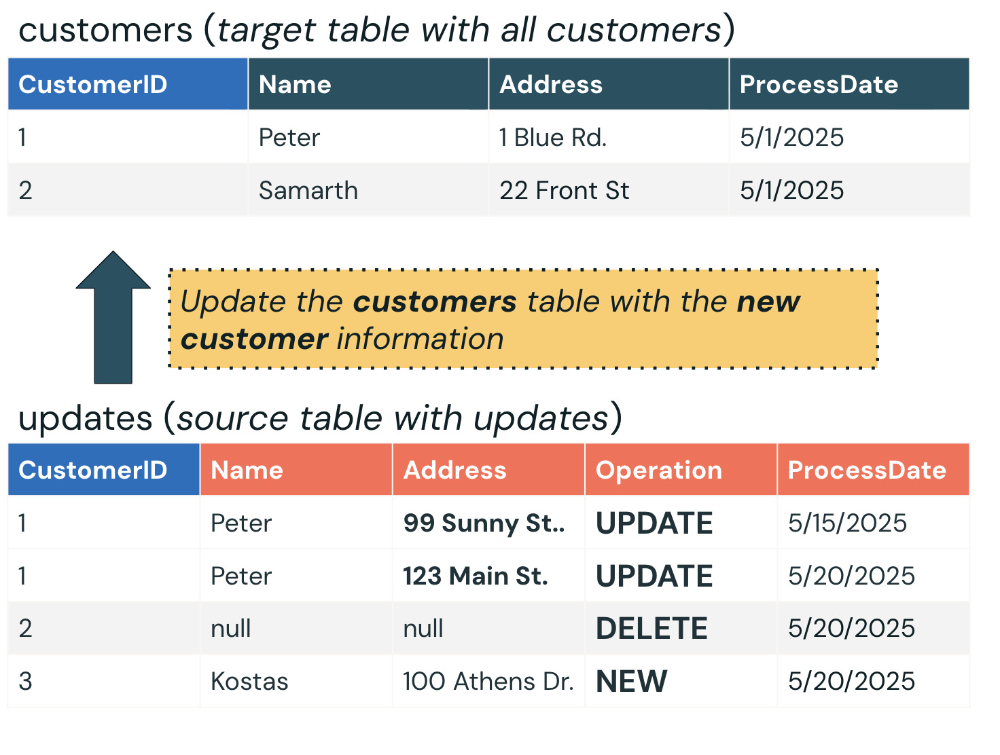
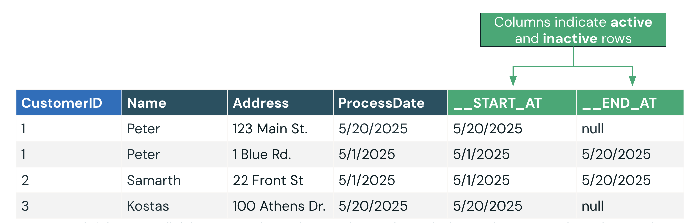
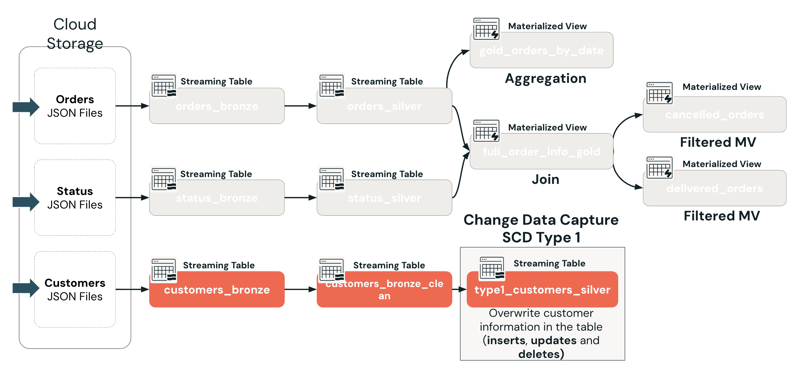

Grundlagen von Change Data Capture (CDC): was es ist und wie Sie Slowly Changing Dimensions (SCD) Type 1 und Type 2 umsetzen, um sich ändernde Daten in Ihren Pipelines zu verwalten und nachzuverfolgen.

### B1. SCD Type 1 – Überblick

Beginnen wir mit einem Überblick über Slowly Changing Dimension Type 1, kurz SCD Type 1. Bei SCD Type 1 wird die Zieltabelle mit den neuesten Werten überschrieben.

**Bei Update**
Wenn ein Datensatz aktualisiert wird, wird der **vorherige Datensatz** anhand seines **Schlüssels** einfach mit dem neuen Wert **überschrieben**.

**Bei Delete**
Wenn ein Datensatz anhand seines **Schlüssels** gelöscht wird, wird der **Datensatz entfernt**.

**Bei Insert**
Es gibt **keine Nachverfolgung alter Schlüssel (Zeilen)**; nur die **aktuellen Daten** bleiben erhalten.

### B2. Durchgerechnetes Beispiel – Schritt für Schritt

**Unser Szenario**:

Wir haben eine Tabelle **updates** als Quelle; sie enthält:

Unser Ziel ist es, die Tabelle customers mit den neuen Kundeninformationen aus der Quelltabelle updates zu aktualisieren.

Dies ist die einfachste CDC-Strategie und ideal, wenn historische Änderungen nicht aufbewahrt werden müssen. Sie benötigen nur die neuesten, genauesten Daten.

## C. SCD Type 2 – Historische Nachverfolgung/Versionierung

- `__START_AT` – zeigt, wann die Zeile aktiv wurde
- `__END_AT` – zeigt, wann die Zeile inaktiv wurde (falls zutreffend)

### D. AUTO CDC INTO in Spark Declarative Pipelines verwenden (früher APPLY CHANGES INTO)

##### Dokumentation
- [The AUTO CDC APIs: Simplify change data capture with Apache Spark™Declarative Pipelines](https://docs.databricks.com/aws/en/dlt/cdc)

HINWEIS: Die AUTO-CDC-APIs hießen früher APPLY CHANGES und hatten dieselbe Syntax.
- [AUTO CDC INTO (Apache Spark™ Declarative Pipelines)](https://docs.databricks.com/aws/en/dlt-ref/dlt-sql-ref-apply-changes-into)

### E. Die vollständige Pipeline – Customers-Flow hinzugefügt

Sehen wir uns den finalen CDC-Flow an, den wir unserer Pipeline hinzufügen.

**Überblick über den Customers-Flow:**
1. Kunden-JSON-Dateien ingestieren – Rohdaten aus dem Cloud-Speicher in die Streaming Table customers_bronze der Pipeline bringen.

2. Tabelle customers_bronze_clean erstellen – Eine bereinigte Streaming Table, die inkrementelle Updates, Inserts und Deletes aus der Streaming Table customers_bronze filtert und formatiert.

3. AUTO CDC INTO customers_silver verwenden

Verwendet SCD Type 1, um Kundenänderungen (Updates, Inserts und Deletes) zu überschreiben.
Umgesetzt mit AUTO CDC INTO und STORED AS SCD TYPE 1.

Dieser finale Flow kombiniert CDC-Logik mit der Medallion-Architektur, um eine aktuelle Kundentabelle (ohne historische Informationen) zu pflegen – entscheidend für nachgelagerte Analytics, Compliance und Personalisierung.

##### Dokumentation
- [AUTO CDC INTO (Apache Spark™ Declarative Pipelines)](https://docs.databricks.com/aws/en/dlt-ref/dlt-sql-ref-apply-changes-into#syntax)

## F. Fazit

In dieser Lektion haben Sie gelernt, wie Change Data Capture funktioniert und wie Sie es mit Apache Spark™ Declarative Pipelines umsetzen:

1. **Change Data Capture (CDC)** verfolgt und erfasst Inserts, Updates und Deletes aus einem Quellsystem und wendet sie auf eine Zieltabelle an – so bleibt das Lakehouse mit dem neuesten Zustand der Datenquelle synchron.
2. **SCD Type 1** überschreibt die Zieltabelle bei jeder Änderung mit den neuesten Werten – es wird keine Historie aufbewahrt, was es zum einfachsten und effizientesten Ansatz macht, wenn nur aktuelle Daten zählen.
3. **SCD Type 2** bewahrt jede historische Version eines Datensatzes auf, indem die Metadatenspalten `__START_AT` und `__END_AT` hinzugefügt werden – aktive Zeilen haben ein leeres (null) `__END_AT`, während inaktive und gelöschte Zeilen ein Datum tragen –, und ermöglicht so vollständige historische Analysen.
4. **AUTO CDC INTO** ist der eingebaute deklarative CDC-Mechanismus von Lakeflow – er ersetzt komplexe `MERGE INTO`-Batch-Logik durch eine prägnante, gut lesbare Syntax, in der `KEYS`, `APPLY AS DELETE WHEN`, `SEQUENCE BY`, `COLUMNS` und `STORED AS` jeweils eine eigene Rolle spielen.
5. **Der Customers-Flow** vervollständigt die gesamte Pipeline-Architektur – er ingestiert rohe Kunden-JSON-Dateien in Bronze, bereinigt sie in `customers_bronze_clean` und wendet SCD Type 1 über `AUTO CDC INTO` an, um eine aktuelle, produktionsreife Tabelle `type1_customers_silver` zu erzeugen.

### Nächste Schritte

Im nächsten Abschnitt führen Sie eine Demonstration zu Change Data Capture mit AUTO CDC INTO durch.

©  Databricks, Inc. Alle Rechte vorbehalten.
Apache, Apache Spark, Spark, das Spark-Logo, Apache Iceberg, Iceberg und das Apache-Iceberg-Logo sind Marken der [Apache Software Foundation](https://www.apache.org/).

[Datenschutzrichtlinie](https://databricks.com/privacy-policy) |
[Nutzungsbedingungen](https://databricks.com/terms-of-use) |
[Support](https://help.databricks.com/)

