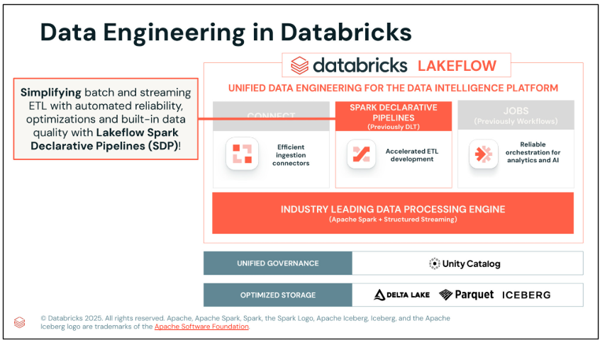
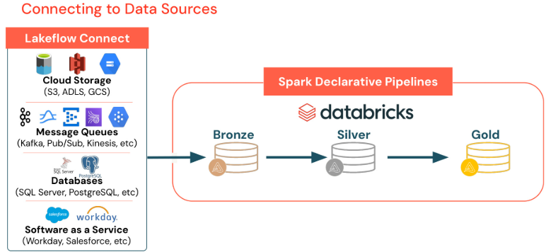
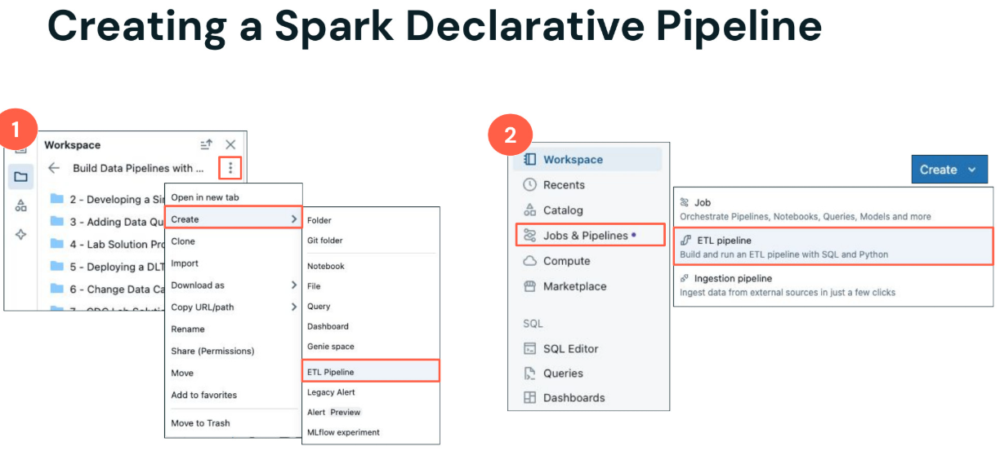
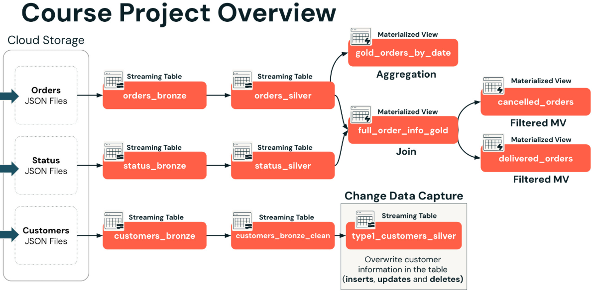
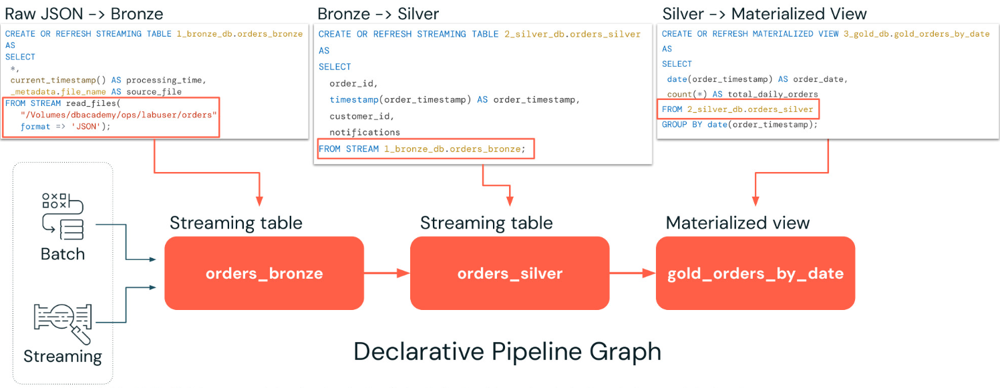
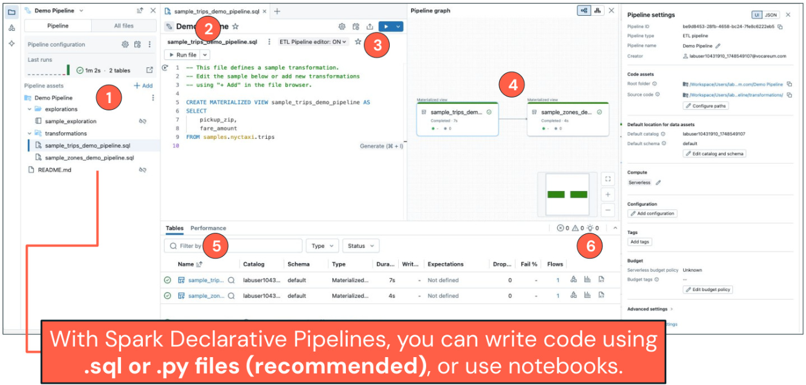
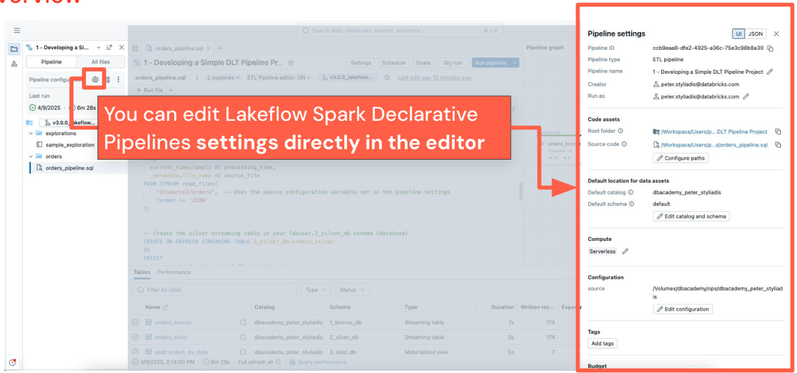
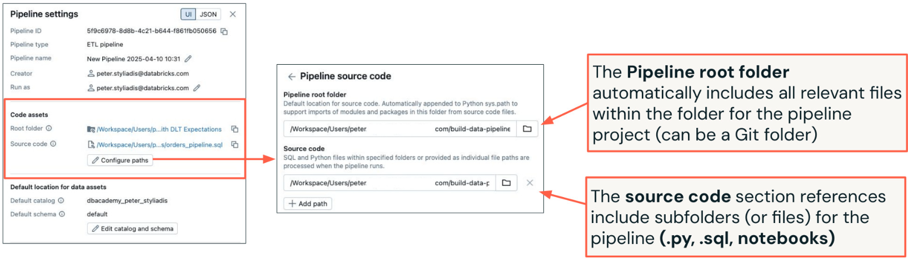
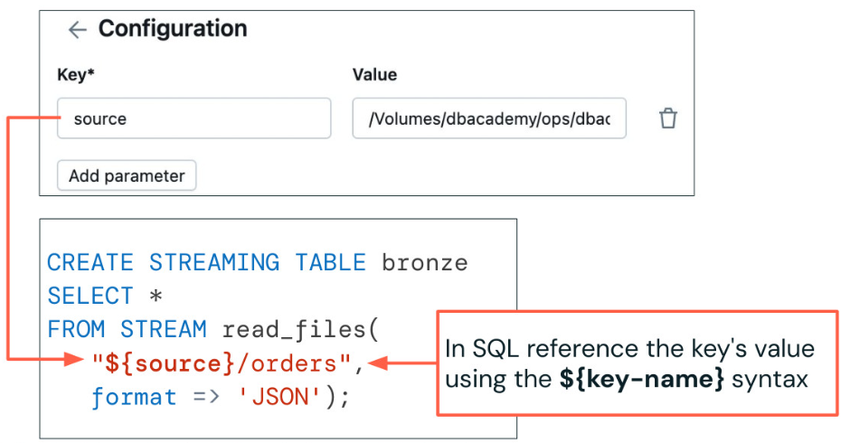
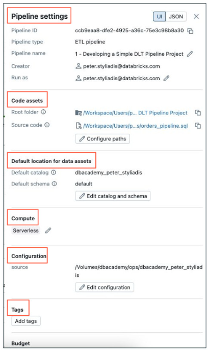

# Daten-Pipelines mit Lakeflow Spark Declarative Pipelines erstellen (Build Data Pipelines with Lakeflow Spark Declarative Pipelines)

[Website](https://customer-academy.databricks.com/learn/learning-plans/10/data-engineer-learning-plan/courses/2971/build-data-pipelines-with-lakeflow-spark-declarative-pipelines/lessons)

Kursmaterial und Code unter: [Further Learning](https://customer-academy.databricks.com/learn/courses/2965/Build%20Data%20Pipelines%20with%20Lakeflow%20Spark%20Declarative%20Pipelines)

[Vocareum](https://labs.vocareum.com/main/vnav.php?m=vnb&mode=s&asnid=4635188&stepid=4635189#)

# 1_Einführung in Data Engineering in Databricks

In dieser Lektion lernen Sie, wie Databricks effizientes Data Engineering durch optimierten Speicher, einheitliche Data Governance mit Unity Catalog und die integrierten Lakeflow-Tools für Daten-Ingestion, Transformation und Orchestrierung ermöglicht – mit dem Schwerpunkt auf der Vereinfachung und Automatisierung zuverlässiger Batch- und Streaming-ETL mit Lakeflow Declarative Pipelines.

Alles beginnt mit optimiertem Speicher auf Basis von Delta Lake, Parquet oder Iceberg.

Auf dieser Speicherschicht baut eine einheitliche Governance mit Unity Catalog auf. Unity Catalog ist ein zentraler Datenkatalog, der Zugriffskontrolle, Auditing, Data Lineage, Qualitätsüberwachung und Datenerkennung über Databricks-Workspaces hinweg bereitstellt.

Databricks bietet dann Lakeflow an, eine End-to-End-Lösung für Data Engineering, mit der Data Engineers, Softwareentwickler, SQL-Entwickler, Analysten und Data Scientists hochwertige Daten für nachgelagerte Analytics-, KI- und operative Anwendungen bereitstellen können. Lakeflow bietet eine einheitliche Plattform für Daten-Ingestion, Transformation und Orchestrierung und umfasst die folgenden Komponenten:

- **Lakeflow Connect**: Eine Reihe effizienter Ingestion-Connectors, die das Ingestieren von Daten aus gängigen Unternehmensanwendungen, Datenbanken, Cloud-Speicher, Message Buses und lokalen Dateien vereinfachen.

- **Lakeflow Spark Declarative Pipelines**: Ein Framework zum Erstellen von Batch- und Streaming-Daten-Pipelines mit SQL und Python, das die ETL-Entwicklung beschleunigen soll.

- **Lakeflow Jobs**: Ein Tool zur Workflow-Automatisierung für Databricks, das Datenverarbeitungs-Workloads orchestriert. Es ermöglicht die Koordination mehrerer Tasks innerhalb komplexer Workflows und damit die Planung, Optimierung und Verwaltung wiederholbarer Prozesse.

Dieser Kurs konzentriert sich darauf, Batch- und Streaming-ETL mit automatisierter Zuverlässigkeit, Optimierungen und eingebauter Datenqualität mit Lakeflow Spark Declarative Pipelines zu vereinfachen!



## 1_1_Was sind Lakeflow Spark Declarative Pipelines?

- **Vereinfachte Pipeline-Erstellung**: Deklarieren Sie Daten-Ingestion und Transformationen einfach mit SQL oder Python und überlassen Sie den Rest Spark Declarative
  Pipelines!
- **Intelligente Optimierung im großen Maßstab**: Automatisierte Skalierung und Wiederherstellung verbessern die Zuverlässigkeit und verringern den Wartungsaufwand.
- **Einheitliches Batch und Streaming**: Pipelines passen sich nahtlos sowohl an Workloads nahezu in Echtzeit als auch an Batch-Workloads an und optimieren Performance
  und Kosten.



Sobald Ihre Daten ingestiert sind, folgen Sie der Medallion-Architektur, um sie zu organisieren und zu verfeinern:

- **Bronze** ist die Schicht für die Ingestion von Rohdaten in Ihrem Lakehouse. Hier werden **Daten unverändert übernommen, teilweise ergänzt um zusätzliche Metadatenspalten**, die Kontext zum Ingestion-Prozess liefern.
- In **Silber** finden **Bereinigung** und Transformation statt; **aus Rohdaten wird eine besser nutzbare und verfeinerte Tabelle**.
- **Gold** steht für die finalen **Aggregate auf Geschäftsebene, die für** nachgelagerte Anwendungsfälle wie **Reporting, Machine Learning, KI, Streaming Analytics und mehr gedacht sind.**

------

Sehen wir uns nun an, wie Sie tatsächlich eine Spark Declarative Pipeline erstellen. Es gibt zwei einfache Wege für den Einstieg. Beide führen zum selben Ablauf der Pipeline-Erstellung, in dem Sie Ihre Ingestion- und Transformationslogik mit SQL oder Python definieren können. Siehe folgende Abbildung:



## 1_2_Überblick über das Kursprojekt

In dieser Lektion erhalten Sie einen Überblick über das Kursprojekt, in dem Sie mit Lakeflow Declarative Pipelines eine vollständige, modulare Pipeline aufbauen, um Bestell-, Status- und Kundendaten aus JSON-Dateien zu ingestieren, zu transformieren, zu verknüpfen und zu aggregieren und daraus produktionsreife Tabellen und Views zu erstellen.

Im Laufe dieses Kurses bauen wir gemeinsam ein praxisnahes Projekt mit Lakeflow Spark Declarative Pipelines.

Das Projekt beginnt mit Dateien im Cloud-Speicher. In diesem Kurs liegen alle Dateien im JSON-Format vor, aber denken Sie daran, dass Lakeflow in realen Pipelines viele Dateitypen unterstützt. Wir bauen drei Flows innerhalb einer einzigen Pipeline:

- Flow 1: Orders
  - Ingestiert Bestell-JSON-Dateien in eine Streaming Table orders_bronze.
  - Transformiert die Daten in eine Streaming Table orders_silver.
  - Erstellt die Materialized View gold_orders_by_date, die die Anzahl der Bestellungen nach Datum zusammenfasst ..
- Flow 2: Status
  - Ingestiert Status-JSON-Dateien in eine Streaming Table **status_bronze**.
  - Transformiert die Daten in eine Tabelle **status_silver**.
  - Verknüpft die Bestell- und Statustabellen, um die Materialized View **full_order_info_gold** zu erstellen.
  - Erzeugt zwei Materialized Views:
- Eine für stornierte Bestellungen – **canceled_orders**
- Eine für ausgelieferte Bestellungen – **delivered_orders**
  - Flow 3: Customer Change Data Capture (CDC)
- Ingestiert Kunden-JSON-Dateien in eine Tabelle **customers_bronze**.
- Bereinigt die Daten in eine verfeinerte Bronze-Tabelle namens **customers_bronze_clean**.
- Führt CDC durch, um Datenänderungen in der Tabelle **type1_customers_silver** nachzuverfolgen.

Am Ende des Kurses haben Sie praktische Erfahrung im Aufbau einer vollständigen, modularen und produktionsreifen Pipeline-Architektur mit Spark Declarative Pipelines.



# 2_Grundlagen von Lakeflow Declarative Pipelines

## 2_1_Überblick über die Dataset-Typen

In dieser Lektion lernen Sie, wie Streaming Tables, Materialized Views und Views Daten verarbeiten und wie Sie jeden Dataset-Typ mit SQL erstellen – und Sie verstehen ihre Unterschiede, ihre Benennung in Databricks und wie Pipeline-Abhängigkeiten automatisch verwaltet werden.

In Declarative Pipelines gibt es drei Haupttypen von Datasets, mit denen Sie arbeiten:

- Streaming Tables (ST)
- Materialized Views (MV)
- Views



**[Streaming Tables](https://docs.databricks.com/aws/en/ldp/load)**

Streaming Tables sind speziell **für Streaming- oder inkrementelle Datenverarbeitung konzipiert**. **Das bedeutet, dass sie nur neue Daten verarbeiten, sobald diese eintreffen**, anstatt bei jedem Pipeline-Lauf alles neu zu verarbeiten. Dieser Ansatz steigert die Effizienz erheblich und senkt die Kosten, insbesondere bei großen oder häufig aktualisierten Daten.

```sql
# Erstellt eine Streaming Table namens orders_bronze im Schema 1_bronze_db
CREATE OR REFRESH STREAMING TABLE 1_bronze_db.orders_bronze AS
SELECT
	*,
	current_timestamp() AS processing_time,
	_metadata.file_name AS source_file
# Um inkrementelle Streaming-Lesevorgänge mit Checkpointing zu ermöglichen, verwenden Sie die Syntax: FROM STREAM read_files()
# Dies nutzt die Funktionalität von **Databricks Auto Loader**, die neue Dateien automatisch nachverfolgt und eine zuverlässige, inkrementelle Ingestion sicherstellt.
# Dateinamen werden garantiert nur einmal gelesen, damit es bei der inkrementellen Ingestion keine doppelten Lesevorgänge gibt.
FROM STREAM readfiles(
	"Volumes/dbacademy/ops/labuser/orders",
    format => 'JSON'
);
```

```sql
# Jetzt erstellen wir eine Silber-Streaming-Table namens order_silver, die aus der Streaming Table orders_bronze liest.
CREATE OR REFRESH STREAMING TABLE 2_silver_db.orders_silver AS
# Geben Sie Ihre SQL-Transformationen für die Streaming-Daten aus der Bronze-Tabelle an
SELECT
	orders_id,
	timestamp(order_timestamp) AS order_timestamp,
	customer_id,
	notifications
# Verwenden Sie das Schlüsselwort STREAM mit dem Namen der STREAMING TABLE, aus der Sie lesen, um neue Zeilen zu transformieren.
FROM STREAM 1_bronze_db.orders_bronze;
```

**[Materialized Views](https://docs.databricks.com/aws/en/ldp/incremental-refresh)**

Sehen wir uns nun Materialized Views (MVs) an, die in Ihrer Pipeline eine zentrale Rolle spielen.

Materialized Views verarbeiten Datensätze nach Bedarf, um auf Basis des aktuellen Zustands Ihrer Streaming Tables korrekte Ergebnisse zu liefern. **Sie sind darauf ausgelegt, die Ergebnisse automatisch aktuell zu halten, wenn neue Daten durch vorgelagerte Tabellen fließen**.

Nützlich in folgenden Fällen:

- **Anwenden komplexer Transformationen**
- **Durchführen von Aggregationen**
- **Vorabberechnung langsamer oder teurer Abfragen**
- **Caching häufig verwendeter Berechnungen für schnelleren Zugriff**

Mit MVs können Sie die Performance verbessern und die Logik für nachgelagerte Nutzer wie Dashboards, Machine-Learning-Modelle und Analysetools vereinfachen, da die Daten für Ihre Nutzer vorab berechnet werden.

Sehen wir uns genauer an, wie Materialized Views (MVs) in Declarative Pipelines funktionieren.

- Bei jeder Aktualisierung einer Materialized View werden die Abfrageergebnisse neu berechnet, um Änderungen in den vorgelagerten Datasets widerzuspiegeln.
- Diese Views werden automatisch von der Pipeline erstellt und gepflegt, sodass Sie keine manuelle Aktualisierungslogik verwalten müssen.
- Sie erstellen sie mit der Standard-SQL-Syntax: **`CREATE OR REFRESH MATERIALIZED VIEW`**
- Obwohl Materialized Views **häufig in der Gold-Schicht verwendet werden, können sie überall in Ihrer Pipeline eingesetzt werden**, wenn Performance und Wiederverwendbarkeit wichtig sind.
- **Wo möglich, wird eine inkrementelle Aktualisierung verwendet, damit nicht bei jedem Eintreffen neuer Daten die gesamte View neu aufgebaut wird. Dies wird derzeit nur in Serverless-Compute-Umgebungen unterstützt.**
- Im Hintergrund **entscheidet ein kostenbasierter Optimizer, ob die View inkrementell aktualisiert oder vollständig neu berechnet wird**. So wird eine schnelle und effiziente Performance bei minimalem Ressourcenverbrauch sichergestellt.

```sql
# Eine MATERIALIZED VIEW namens gold_orders_by_date erstellen, die die Tabelle orders_silver zusammenfasst
CREATE OR REFRESH MATERIALIZED VIEW 3_gold_db.gold_orders_by_date AS
SELECT
	date(order_timestamp) AS order_date,
	count(*) AS total_daily_orders
# Geben Sie die Quelltabelle ohne das Schlüsselwort STREAM an, um die Quell-STREAMING-Table zu nutzen.
# Hinweis: Wo möglich, werden Abfragen inkrementell aktualisiert, um die View effizient zu aktualisieren, statt sie von Grund auf neu aufzubauen. Dies wird auf Serverless Compute unterstützt und aus Performance-Gründen von einem kostenbasierten Optimizer gesteuert. Dieser Ansatz ist ideal, um Aggregationen der Gold-Schicht oder geschäftsfertige Ausgaben mit minimalem Overhead und hoher Performance zu erstellen.
FROM 2_silver_db.orders_silver
GROUP BY date(order_timestamp);
```

**Views**

Views erstellen virtuelle Tabellen, die **keine physischen Daten speichern**. Stattdessen sind sie lediglich logische Darstellungen auf Basis der in Ihrer Pipeline definierten SQL-Abfrage. Es gibt zwei Arten von Views, mit denen Sie häufig arbeiten:

- [TEMPORARY VIEW](https://docs.databricks.com/aws/en/ldp/developer/ldp-sql-ref-create-temporary-view)

  - Temporary Views sind kurzlebige Views, die **nur für die Dauer des Pipeline-Laufs existieren** und **privat für die Pipeline sind**, die sie definiert.
  - Diese Views werden **nicht als Objekte in Unity Catalog registriert** und bleiben daher intern und isoliert.
  - Sie erstellen sie mit der SQL-Anweisung: **`CREATE TEMPORARY VIEW`**
  - Temporary Views sind besonders nützlich für **Zwischenabfragen oder -berechnungen**, die Ihre Pipeline-Logik unterstützen, aber nicht für Endbenutzer oder andere Pipelines sichtbar sein müssen.

- [VIEW](https://docs.databricks.com/aws/en/ldp/developer/ldp-sql-ref-create-view)

  - Views erstellen eine virtuelle Tabelle auf Basis der Ergebnismenge einer SQL-Abfrage, speichern aber keine physischen Daten.
  - Im Gegensatz zu Temporary Views **werden diese Views als Objekte in Unity Catalog registriert** und sind dadurch in Ihrer gesamten Umgebung verfügbar und verwaltbar.
  - Zum Erstellen verwenden Sie die SQL-Anweisung: **`CREATE VIEW`**

  Wichtige Einschränkungen:

  - **Die Pipeline muss eine Unity-Catalog-Pipeline sein, um diese Views zu erstellen.** 
  - **Views dürfen keine Streaming-Abfragen enthalten und können innerhalb einer Pipeline nicht als Streaming-Quellen verwendet werden.**

### 2_1_1_Veraltete Anweisungen

```sql
# STREAMING TABLE
CREATE OR REFRESH STREAMING TABLE      # Veraltet: CREATE OR REFRESH STREAMING LIVE TABLE

# Materialized View
CREATE OR REFRESH MATERIALIZED VIEW    # Veraltet: CREATE OR REFRESH LIVE TABLE

# View
CREATE VIEW                            # Veraltet: CREATEW LIVE VIEW

# Temporary View
CREATE TEMPORARY VIEW                  # Veraltet: CREATE TEMPORARY LIVE VIEW
```

## 2_2_Vereinfachte Pipeline-Entwicklung

In dieser Lektion lernen Sie, wie der Multi-File-Editor in Lakeflow Declarative Pipelines die Entwicklung und das Debugging von ETL-Pipelines vereinfacht – mit Funktionen wie einem Pipeline-Asset-Browser, Code-Bearbeitung über mehrere Dateien, interaktiver DAG-Visualisierung, Datenvorschauen,
Ausführungseinblicken, einfacheren Debugging-Tools und schneller Pipeline-Validierung.

Der Multi-File-Editor in Lakeflow Spark Declarative Pipelines macht die Entwicklung und das Debugging Ihrer ETL-Pipelines einfacher und effizienter.

Anstatt eine einzige große Datei zu verwalten, ist Ihre Pipeline als Satz von Dateien organisiert, die im Pipeline-Asset-Browser sichtbar sind. So können Sie Code bearbeiten und Ihre Pipeline-Komponenten an einem Ort konfigurieren.

Zu den wichtigsten neuen Funktionen in der folgenden Abbildung gehören:

1. Pipeline-Asset-Browser zur einfachen Navigation in Pipeline-Dateien
2. Ein Multi-File-Code-Editor für die schrittweise Pipeline-Entwicklung
3. Pipeline-spezifische Symbolleisten für den schnellen Zugriff auf häufige Aktionen
4. Ein interaktiver DAG (Directed Acyclic Graph) zur Visualisierung von Pipeline-Abhängigkeiten
5. Datenvorschauen zur Untersuchung von Zwischenergebnissen
6. Bereiche mit Ausführungseinblicken zur Überwachung von Pipeline-Läufen
   - Einfacheres Debugging mit integrierten Tools
   - Schnellere Validierung dank Dry-Run-Funktionen, sodass Sie Ihre Pipeline ohne vollständige Ausführung prüfen können

Diese Funktionen optimieren Ihren Workflow und helfen Ihnen, schneller robuste Pipelines zu bauen.



### 2_2_1_Weitere Funktionen im Überblick

Deployment mit **Databricks Asset Bundles (DABs)**

Mit DABs können Sie **Databricks-Ressourcen wie Pipelines für produktive CI/CD-Workloads programmatisch validieren, bereitstellen und ausführen**; siehe:

- [What are Databricks Asset Bundles? | Databricks on AWS](https://docs.databricks.com/aws/en/dev-tools/bundles/)
- [Automated Deployment with Databricks Asset Bundles | Databricks](https://customer-academy.databricks.com/learn/courses/3489/automated-deployment-with-declarative-automation-bundles/lessons)

## 2_3_Gängige Pipeline-Einstellungen

In dieser Lektion lernen Sie die verschiedenen in Declarative Pipelines verfügbaren Einstellungen kennen und wie Sie sie konfigurieren, um das Verhalten Ihrer Pipeline anzupassen.

Declarative Pipelines bieten eine Vielzahl von Einstellungen, die Sie einfach konfigurieren können, um das Verhalten Ihrer Pipeline anzupassen.

Mit dem neuen Multi-File-Editor ist der Zugriff auf diese Einstellungen und deren Bearbeitung einfach und intuitiv. Klicken Sie einfach auf das kleine Zahnradsymbol in Ihrem Editorfenster, um das Pop-up mit den Pipeline-Einstellungen zu öffnen. Sie müssen Ihre Entwicklungsumgebung nicht verlassen.

Dort können Sie wichtige Einstellungen und Optionen direkt anpassen und Ihre Pipeline so an Ihre spezifischen Anforderungen anpassen, ohne Ihren Workflow zu unterbrechen.



.

Es gibt viele Pipeline-Einstellungen, die Sie anpassen können, aber drei der häufigsten sind:

- **1. Compute** – Wählen Sie die Ressourcen und die Umgebung, in der Ihre Pipeline ausgeführt wird.

  - Die empfohlene Option ist [**Configure a serverless pipeline**](https://docs.databricks.com/aws/en/ldp/serverless)

- Databricks empfiehlt, neue Pipelines mit Serverless zu entwickeln, da dies die Pipeline-Verwaltung vereinfacht.
- Serverless **optimiert** die Kosten bei gleichzeitig **starker** Performance.
- Sie können sich vollständig auf Ihren Code konzentrieren, ohne Infrastruktur verwalten oder bereitstellen zu müssen.
- Für zeitkritische Workloads gibt es eine optionale Einstellung Serverless Performance Optimized, um die Reaktionsfähigkeit zu erhöhen.

Weitere Vorteile von Serverless Compute sind:

- Unterstützung für die **inkrementelle Aktualisierung von Materialized Views**.
- Ein kostenbasierter Optimizer, der schnelle und effiziente Transformationen von Materialized Views ermöglicht und so Effizienz und Geschwindigkeit der Pipeline verbessert.

- **2. Code Assets** – Verwalten Sie die Dateien und Code-Module, aus denen Ihre Pipeline besteht.

  - Neben Serverless gibt es auch **Classic Compute**, das Cluster mit fester Größe verwendet.

- Benutzer benötigen entsprechende Berechtigungen, um mit Classic Compute Compute-Ressourcen für Declarative Pipelines zu erstellen.
- Workspace-Administratoren können Cluster-Richtlinien einrichten, um den Zugriff auf Compute-Ressourcen für Benutzer, die mit Declarative Pipelines arbeiten, zu steuern und bereitzustellen.

Eine weitere wichtige Funktion ist Autoscaling:

- Enhanced Autoscaling ist für alle neuen Pipelines mit Classic Compute standardmäßig aktiviert.
- Es passt die Clustergröße automatisch an das Workload-Volumen an, optimiert die Ressourcennutzung und hilft, Kosten ohne manuelles Eingreifen zu kontrollieren.

  Sprechen wir nun über Code Assets in **Declarative Pipelines**. Diese Einstellung steuert, welche Code-Dateien Ihre Pipeline während der Ausführung verwendet.

  - Der **Pipeline Root Folder** wird automatisch festgelegt und umfasst alle relevanten Dateien in diesem Ordner für Ihr Pipeline-Projekt (sofern vom Benutzer nicht anders angegeben). Dies kann ein Git-Ordner sein, was eine einfache Versionskontrolle und Zusammenarbeit ermöglicht.
  - Im Abschnitt **Source Code** legen Sie fest, welche Unterordner oder einzelnen Dateien in Ihre Pipeline aufgenommen werden – typischerweise Unterordner und Dateien innerhalb des Root-Ordners. Das können Python-Skripte, SQL-Dateien, Notebooks und mehr sein.

  Zusammen stellen diese Einstellungen sicher, dass Ihre Pipeline genau mit dem Code läuft, den sie benötigt – organisiert und versioniert als Teil Ihres Projekts.

  

- **3. Konfiguration (Parameter)** – Legen Sie Pipeline-Parameter fest, um das Verhalten während der Ausführung dynamisch zu steuern.

  Zum Schluss behandeln wir die Konfiguration, auch Parameter genannt.

  Die Konfiguration einer Pipeline ist eine Sammlung von Schlüssel-Wert-Paaren, mit denen Sie Ihren Code parametrisieren können. Dieser Ansatz bringt mehrere Vorteile:

  - Verbessert Lesbarkeit und Wartbarkeit des Codes, indem wichtige Werte zentral verwaltet werden.
  - Ermöglicht die Wiederverwendung gemeinsamer Parameter über mehrere Pipeline-Dateien hinweg und vermeidet fest codierte Werte.

  Beispielsweise könnten Sie einen Parameter namens source haben, der auf einen bestimmten Volume-Pfad verweist.

  In Ihrem SQL-Code können Sie diesen Parameter mit der Syntax **`${source}`** referenzieren, wodurch der Wert zur Laufzeit dynamisch eingesetzt wird.

  Das macht Ihre Pipeline flexibel und leichter aktualisierbar, ohne Code an mehreren Stellen ändern zu müssen.

  

  Über die besprochenen Kerneinstellungen hinaus gibt es mehrere weitere Pipeline-Einstellungen, denen Sie im Laufe des Kurses begegnen werden.

  Dazu gehören:

  - Pipeline Settings – Allgemeines Verhalten und Metadaten der Pipeline
  - Code Assets – Verwaltung Ihrer Pipeline-Code-Dateien
  - Default Location for Data Assets – Festlegen, wo Daten standardmäßig gespeichert werden
  - Compute – Auswahl Ihrer Ausführungsumgebung.
  - Configuration – Parametrisierung Ihres Pipeline-Codes
  - Environment dependencies – Eine Abhängigkeit ist eine Zeile in einer pip-requirements-Datei.
  - Tags – Organisieren und Kategorisieren von Pipelines für eine einfache Verwaltung
  - Budget – Festlegen von Kostenkontrollen und -grenzen
  - Advanced Settings – Zusätzliche Optionen zur Feinabstimmung Ihrer Pipeline

  Wir werden diese in praktischen Demonstrationen genauer erkunden, damit Sie das Beste aus Spark Declarative Pipelines herausholen.

  

# 3_Lakeflow Declarative Pipelines erstellen

- 
