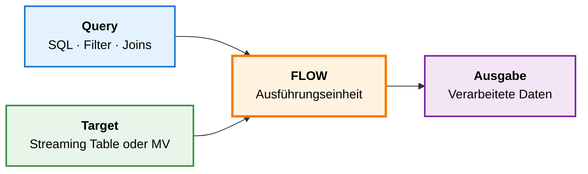
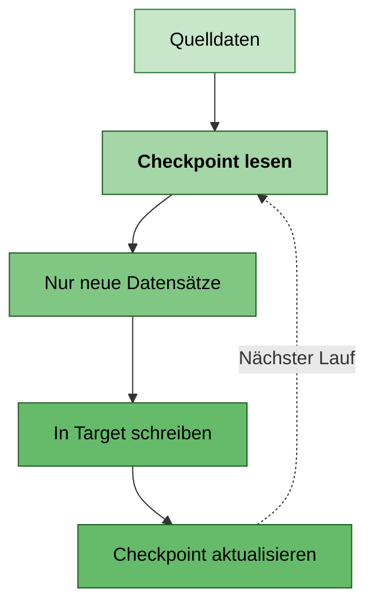
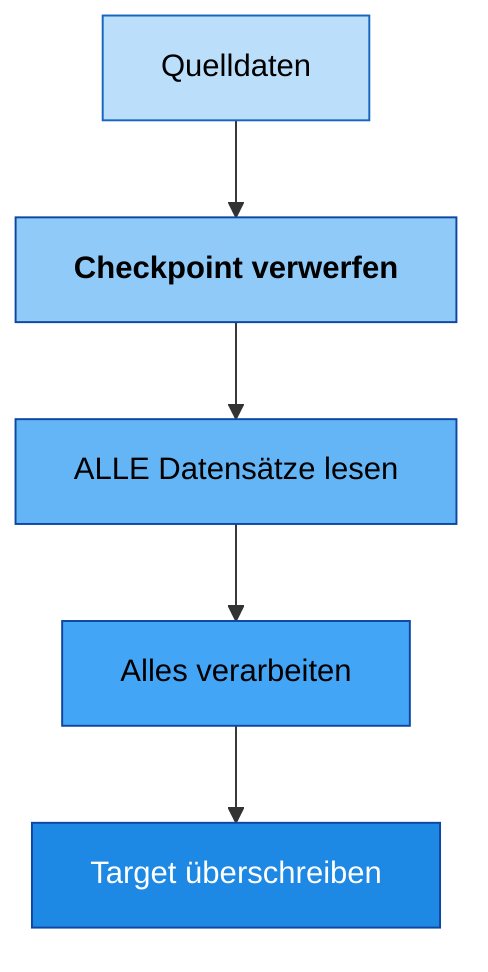
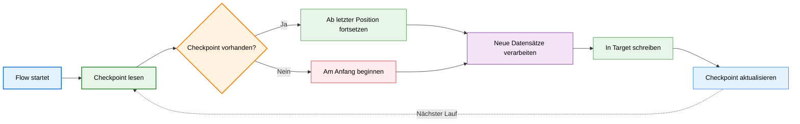
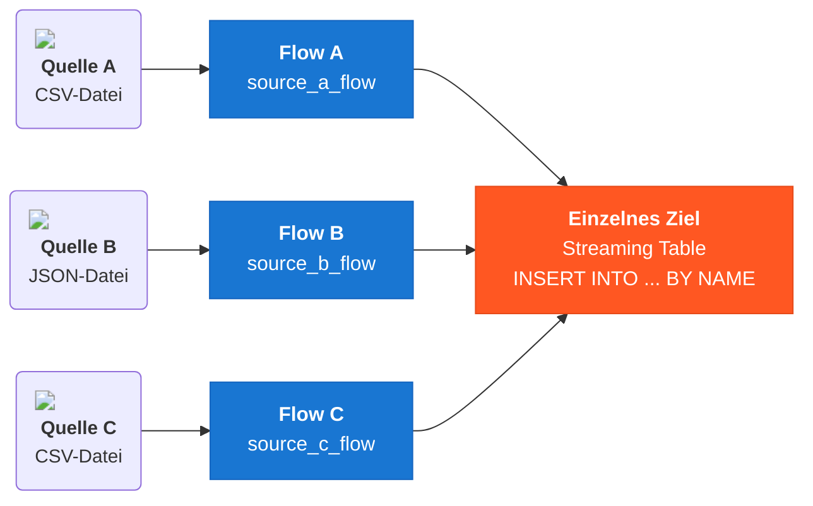
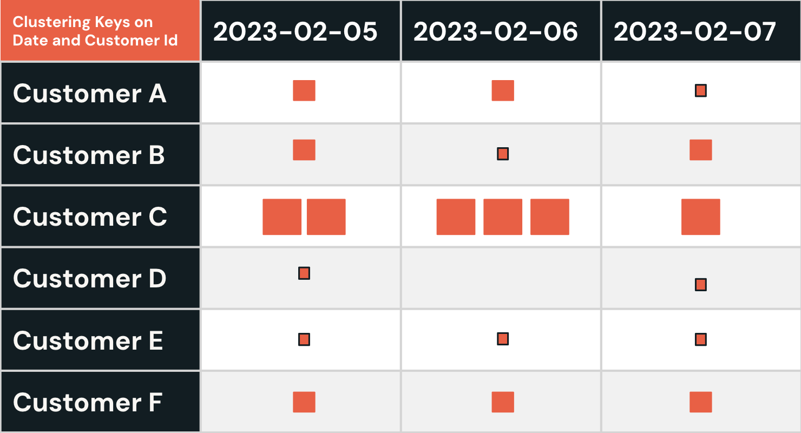
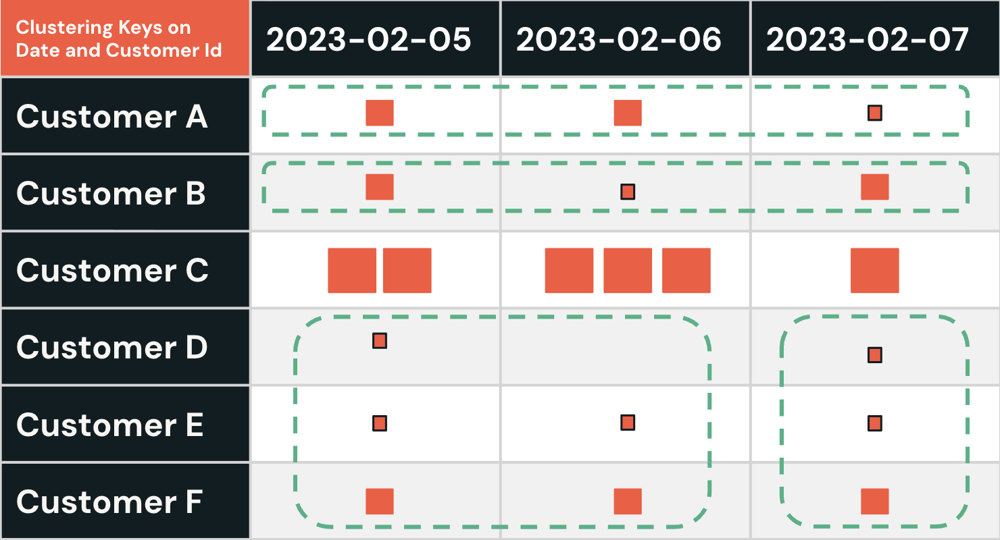
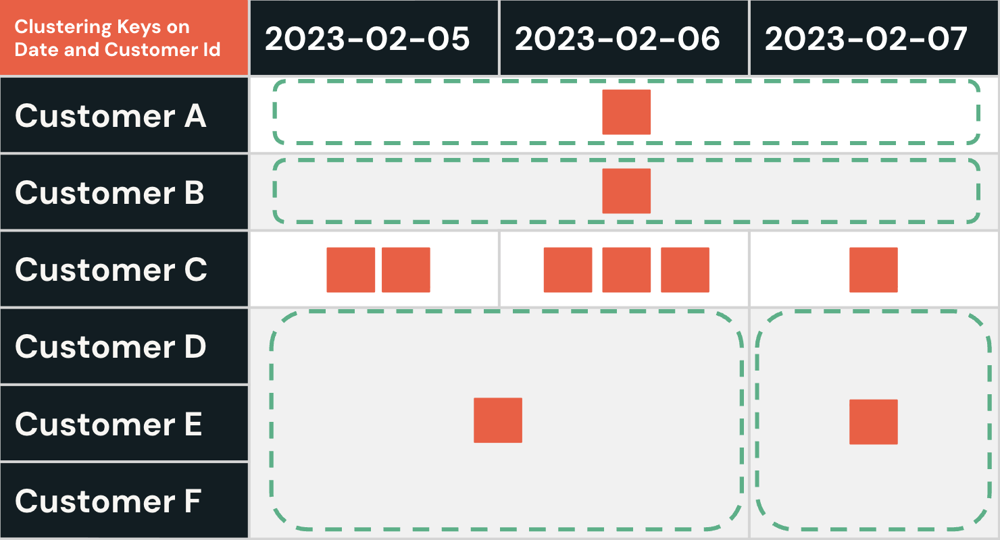

**Flows** in Spark Declarative Pipelines als zentraler Mechanismus zum **inkrementellen Laden und Verarbeiten von Daten**

Ein **Flow** ist die grundlegende Arbeitseinheit in einer **Spark Declarative Pipeline**. Jeder Flow liest, verarbeitet und schreibt Daten unabhängig und ermöglicht so modulare und zuverlässige Pipeline-Updates.

Die **Query** legt fest, *welche Daten gelesen werden* und wie sie transformiert werden – das ist Ihre SQL- oder DataFrame-Logik, einschließlich Filterung, Joins und Aggregation.

Das **Target** legt fest, *wo die Ergebnisse landen* – entweder in einer **Streaming Table** für die inkrementelle Ingestion oder in einer **Materialized View** für berechnete oder aggregierte Ergebnisse.

#### Flow = Query + Target



---

#### Verarbeitungsmodi von Flows

**Inkrementeller Modus:** Verarbeitet **nur neue Datensätze** seit dem letzten Pipeline-Lauf, mithilfe eines pro Flow gespeicherten **Checkpoints**. Das ist bei großen Datensätzen und Streaming-Quellen äußerst effizient – bei einem Neustart setzt der Flow genau dort fort, wo er aufgehört hat, ohne historische Daten erneut zu verarbeiten.

**Wann verwenden:** Laufende Ingestion aus Streaming-Quellen wie Kafka, Auto Loader oder beliebigen Append-only-Tabellen.



**Full-Refresh-Modus:** Verarbeitet **alle Datensätze aus der Quelle von Grund auf neu** – der vorhandene Checkpoint wird verworfen und die Zieltabelle vollständig überschrieben. Das ist teurer, aber notwendig, wenn Änderungen an der Geschäftslogik eine Neuberechnung historischer Daten erfordern.

**Wann verwenden:** Nach Änderungen an der Transformationslogik, zur Behebung von Datenqualitätsproblemen oder wenn ein sauberer Neuanfang erforderlich ist.



### A2. Lebenszyklus eines Flows und Checkpoint-Verwaltung

Jeder Flow pflegt seinen eigenen **Checkpoint**, der genau festhält, wie weit er aus seiner Quelle gelesen hat – das ermöglicht zuverlässige Neustarts, unabhängigen Fortschritt und die Isolation von Fehlern.

---

#### Wie ein Flow-Checkpoint funktioniert



---

#### Vier zentrale Regeln der Checkpoint-Verwaltung

Der Name des Flows ist direkt seinem Checkpoint-Speicherort zugeordnet. Der Fortschritt jedes Flows wird unabhängig unter seinem Namen verfolgt und gespeichert.
**Wenn Sie den Namen eines Flows ändern, entsteht ein brandneuer Checkpoint und der alte wird aufgegeben.** Der Flow verarbeitet die Daten dann von Anfang an neu, als wäre er noch nie gelaufen.

Jeder Flow verarbeitet Daten in seinem eigenen Tempo. **Ein langsamer oder zurückliegender Flow hat keine Auswirkung auf andere Flows** in derselben Pipeline – sie schreiten unabhängig voran.
**Wenn ein Flow fehlschlägt, verarbeiten die übrigen Flows normal weiter.** Fehler sind auf den einzelnen Flow beschränkt – nicht auf die gesamte Pipeline.

### A3. Default Flow vs. Explicit Flow

In den meisten Fällen wird ein Flow **automatisch und implizit** erstellt, wenn Sie eine **Streaming Table oder Materialized View** definieren. Das ist der **Default Flow** – er trägt den Namen seiner Zieltabelle.

Sie können **Explicit Flows** auch getrennt von der Tabellendefinition erstellen. Das ist erforderlich, wenn Sie aus einer neuen Quelle in eine bestehende Tabelle schreiben müssen oder wenn mehrere Quellen in ein Ziel zusammenfließen sollen.

**Default Flow (implizit)**
Tabelle und Flow werden in einem Schritt erstellt. Der Flow übernimmt den Namen der Tabelle.

```sql
CREATE OR REFRESH STREAMING TABLE target_table
AS SELECT *
FROM STREAM source_table;
```

**Explicit Flow (separate Definition)**
Zuerst wird die Tabelle definiert. Der Flow wird separat definiert und über den Namen an das Ziel angehängt.

```sql
CREATE OR REFRESH STREAMING TABLE target_table;

CREATE FLOW my_flow
AS INSERT INTO target_table BY NAME
SELECT * FROM STREAM source_table;
```

## B. Das Multi-Flow-Muster

### B1. Mehrere Quellen in ein Ziel schreiben

Die Stärke von Explicit Flows liegt darin, dass Sie **mehrere Flows definieren können, die in dieselbe Tabelle schreiben**. Jeder Flow liest unabhängig aus einer anderen Quelle und hängt seine Datensätze an das gemeinsame Ziel an.

Das ist das **Multi-Flow-Muster** – der empfohlene Ansatz, wenn Sie Daten aus mehreren Quellen in einer einzigen einheitlichen Tabelle zusammenführen müssen.



💡 Jeder Flow hat seinen **eigenen, unabhängigen Checkpoint** – wird später eine neue Quelle hinzugefügt, muss nur dieser Flow nachladen (Backfill). Die anderen Flows sind davon völlig unberührt.

### B2. Multi-Flow vs. UNION – warum das wichtig ist

Eine gängige Alternative zu Multi-Flow ist das Kombinieren von Quellen mit einer `UNION`-Klausel innerhalb einer einzigen Streaming-Table-Definition. Für inkrementelle Pipelines bringt das kritische Einschränkungen mit sich.

**❌ UNION-Ansatz**

- Alle Quellen teilen sich **einen einzigen Checkpoint**
- Das Hinzufügen einer neuen Quelle **erfordert einen Full Refresh**, um alles neu zu verarbeiten
- Ein Fehler in einer Quelle kann alle anderen blockieren
- Die Lineage pro Quelle ist schwerer nachzuverfolgen
- Komplexe Fehlerbehandlung über mehrere Datenquellen hinweg
- Begrenzte Skalierbarkeit bei steigender Anzahl von Quellen

**✅ Multi-Flow-Ansatz**

- Jeder Flow hat seinen **eigenen, unabhängigen Checkpoint**
- Neue Quellen können **ohne Full Refresh** hinzugefügt werden
- Flows sind isoliert – der Ausfall einer Quelle beeinträchtigt die anderen nicht
- Klare Lineage und klares Monitoring pro Quelle
- Unabhängige Fehlerbehandlung und Wiederherstellung pro Quelle
- Bessere Skalierbarkeit und Wartbarkeit

## C. Datenqualitäts-Expectations

Datenqualität bedeutet sicherzustellen, dass Ihre Pipeline nur gültige und zuverlässige Datensätze speichert. In Spark Declarative Pipelines verwenden Sie **Expectations**, um einfache Regeln direkt auf Streaming Tables festzulegen. Verletzt ein Datensatz eine Regel, können Sie wählen, ob gewarnt, der Datensatz verworfen oder das Update abgebrochen wird.

In Spark Declarative Pipelines werden Constraints inline im Spaltendefinitionsblock der Tabelle mit `CONSTRAINT ... EXPECT` definiert. Es gibt drei Verletzungsmodi, die steuern, was passiert, wenn ein Datensatz eine Regel nicht erfüllt:

**WARN:** Ungültige Zeilen **bleiben** in der Tabelle. Im Event Log der Pipeline wird eine Warnkennzahl protokolliert. Für die Überwachung, ohne Daten zu blockieren.
`CONSTRAINT valid_field EXPECT (field IS NOT NULL)`

**DROP ROW:** Ungültige Zeilen werden aus der Tabelle **entfernt**. Verworfene Datensätze werden in den Kennzahlen gezählt, erscheinen aber nicht im finalen Datensatz.
`CONSTRAINT valid_qty EXPECT (qty > 0)` **`ON VIOLATION DROP ROW`**

**FAIL UPDATE:** Das gesamte Pipeline-Update wird **angehalten**, sobald auch nur ein Datensatz die Regel verletzt. Für kritische Felder, bei denen jede Verletzung auf ein ernstes Problem in einer vorgelagerten Quelle hinweist.
`CONSTRAINT not_null_id EXPECT (id IS NOT NULL)` **`ON VIOLATION FAIL UPDATE`**

💡 **Expectation-Strategie**
Verwenden Sie einen mehrstufigen Ansatz: `FAIL UPDATE` für kritische Geschäftsschlüssel, `DROP ROW` für Datenqualitätsprobleme, die herausgefiltert werden können, und `WARN` für die Überwachung ungewöhnlicher, aber potenziell gültiger Datenmuster.

### C2. Beispiel für die Umsetzung von Expectations

Hier ein umfassendes Beispiel, wie Datenqualitäts-Expectations auf einer Streaming Table umgesetzt werden:

```sql
CREATE OR REFRESH STREAMING TABLE streaming_table
  (
    CONSTRAINT valid_qty        EXPECT (qty >= 0)                  ON VIOLATION DROP ROW,
    CONSTRAINT valid_amount     EXPECT (total_amount >= 0)         ON VIOLATION DROP ROW,
    CONSTRAINT not_null_ts      EXPECT (order_timestp IS NOT NULL) ON VIOLATION FAIL UPDATE,
    CONSTRAINT valid_email      EXPECT (customer_email RLIKE '^[^@]+@[^@]+\\.[^@]+$'),
    CONSTRAINT reasonable_qty   EXPECT (qty <= 1000)               ON VIOLATION WARN
  )
```

⚠️ **Datenqualitäts-Expectations können nicht auf einem Flow definiert werden**
Beim Multi-Flow-Muster **müssen Qualitäts-Constraints auf der Zieltabelle definiert werden** – nicht innerhalb der Definition `CREATE FLOW` oder `@dp.append_flow`. Die Tabelle setzt die Qualitätsregeln zentral für alle Flows durch, die in sie schreiben.

### C3. Monitoring und Observability

Datenqualitäts-Expectations **erzeugen automatisch Kennzahlen**, die über zwei Kanäle zugänglich sind: 
- **Pipeline-UI** für einen schnellen Überblick über den Zustand 
- **Systemtabellen** für eine tiefgehende programmatische Analyse

**Verarbeitete Datensätze: ** Gesamtzahl der pro Pipeline-Update gelesenen und geschriebenen Zeilen – liefert Ihnen eine Basisansicht des Durchsatzes für jeden Flow.

**Datensätze, die einen Constraint verletzen: **Anzahl der Verletzungen pro Constraint – zeigt genau, welche Regel fehlschlägt und wie viele Datensätze betroffen sind.

**Verletzungsquote: **Anteil der Datensätze, die eine Expectation verletzen – hilft, einen kleinen Ausreißer von einem systemischen Qualitätsproblem zu unterscheiden.

**Historische Trends: **Qualitätskennzahlen im Zeitverlauf – machen schleichenden Data Drift oder Regressionen durch vorgelagerte Schemaänderungen sichtbar.

**Tiefer gehend – Systemtabellen und Event Logs: **  Das Event Log der Pipeline zeichnet eine Zeile pro Flow-Update auf und erfasst sowohl Durchsatzkennzahlen als auch die Expectation-Ergebnisse pro Constraint. Sie können es direkt abfragen, um eigene Monitoring-Dashboards oder Alert-Pipelines zu erstellen.

```sql
SELECT timestamp, table_name, output_rows,
       data_quality.expectations
FROM event_log("pipeline_id")
WHERE event_type = 'flow_progress'
  AND data_quality.expectations IS NOT NULL
ORDER BY timestamp DESC;
```

## D. Liquid Clustering in Spark Declarative Pipelines


Liquid Clustering ist eine Technik zur Optimierung des Datenlayouts in Delta Lake, die **klassische Partitionierung im Hive-Stil und Z-Ordering ersetzt**. Sie organisiert Datendateien anhand von **Clustering-Schlüsseln**, um die Abfrage-Performance durch effizientes Data Skipping zu verbessern.

---

#### Wie es sich entwickelt hat

**Hive-Partitionierung**

- Starre Verzeichnisstruktur
- Vollständiges Neuschreiben, um Schlüssel zu ändern

  →

**Z-Ordering**

- Manuelles `OPTIMIZE` erforderlich
- Vollständiges Neuschreiben bei jedem Lauf

  →

**Liquid Clustering**

- Inkrementell – nur neue Daten werden neu organisiert
- Schlüssel jederzeit änderbar

---

#### Drei Eigenschaften, die Liquid Clustering so leistungsfähig machen

**Inkrementell: **Optimiert nur neue oder noch nicht geclusterte Daten; bereits geclusterte Dateien werden nicht neu geschrieben. Effizient für Streaming- und schreibintensive Workloads.

**Flexibel: **Clustering-Schlüssel können jederzeit ohne vollständiges Neuschreiben der Tabelle geändert werden. Passt sich an sich ändernde Abfragemuster an.

**Selbstoptimierend: **Mit `CLUSTER BY AUTO` wählt Databricks auf Basis der beobachteten Abfragenutzung automatisch die optimalen Schlüssel aus.

Stellen Sie es sich wie eine **Bibliothek vor, die ihre Regale laufend neu anordnet** – je nachdem, wonach Leser tatsächlich suchen: **Hive-Partitionierung** sperrt Bücher nach Genre in feste Räume, **Z-Ordering** sortiert innerhalb dieser Räume manuell, **Liquid Clustering** hingegen beobachtet das Ausleihverhalten und organisiert sich im Laufe der Zeit automatisch neu.

### D2. Wie Liquid Clustering funktioniert
Unten sehen Sie eine Reihe von Momentaufnahmen, die veranschaulichen, wie Liquid Clustering funktioniert. Wir haben eine Verkaufstabelle, deren Clustering-Schlüssel die Spalten Date und Customer Id sind (anstelle klassischer Partitionen). Klicken Sie auf die einzelnen Schritte, um mehr zu erfahren; unter jedem Bild finden Sie eine Erklärung.

**Schritt 1 – Vor dem Clustering**



Die Datendateien sind zufällig nach Date und Customer Id verteilt. Das bedeutet, dass Abfragen alle Dateien scannen müssen – selbst für einen einzelnen Kunden oder ein einzelnes Datum. Für Kunden mit geringem Volumen (D, E) gibt es kleine Dateien, während Kunde C mit hohem Volumen größere Dateien hat. Es gibt keine Gruppierung – daher ist die Performance schlecht.

**Schritt 2 – Cluster-Analyse**



Liquid Clustering untersucht die Daten und gruppiert Dateien nach Schlüsselbereichen (als grün gestrichelte Kästen dargestellt). Kunden mit geringem Volumen (A, B, D, E, F) werden für eine bessere Co-Location zusammengefasst. Kunde C mit hohem Volumen bleibt unverändert. Nur die Dateien, die verbessert werden müssen, werden neu organisiert – nicht die gesamte Tabelle.

**Schritt 3 – Nach dem Clustering**



Die Dateien sind jetzt nach Date und Customer Id gruppiert. Abfragen können Dateien überspringen, die nicht zu ihren Filtern passen, sodass sich die Performance verbessert. Liquid Clustering verwendet eine Hilbert-Kurve, um die Dateigrenzen enger zu ziehen, damit das Überspringen effektiver ist. Nur fragmentierte Dateien werden neu geschrieben; künftige Läufe clustern nur neue Daten.

### D3. Liquid Clustering auf Streaming Tables in SDP anwenden

Liquid Clustering auf Delta-Tabellen kennen Sie bereits. In Spark Declarative Pipelines wird es direkt in der Streaming-Table-Definition mit der Klausel `CLUSTER BY` aktiviert – ein separater `OPTIMIZE`-Befehl ist nicht nötig.

`CLUSTER BY AUTO`
Databricks **wählt** die besten Clustering-Schlüssel auf Basis der Abfragehistorie **automatisch** aus. Am besten, wenn Sie nicht sicher sind, nach welchen Spalten am häufigsten gefiltert wird.

```sql
CREATE OR REFRESH STREAMING TABLE my_table
CLUSTER BY AUTO
AS SELECT * FROM STREAM source_table;
```

`CLUSTER BY (columns)`
Sie **geben** die Clustering-Schlüssel **explizit an**. Am besten, wenn Sie Ihre häufigsten Filtermuster aus fachlicher Sicht gut kennen.

```sql
CREATE OR REFRESH STREAMING TABLE my_table
CLUSTER BY (region, order_date)
AS SELECT * FROM STREAM source_table;
```

### D4. Die Clustering-Strategie auswählen

**CLUSTER BY AUTO**
Lassen Sie Databricks **lernen und entscheiden**

- Schlüssel entwickeln sich mit den Abfragemustern weiter
- Keine manuelle Feinabstimmung nötig
- Am besten für neue oder sich entwickelnde Tabellen

vs.

**CLUSTER BY (columns)**
Sie **kennen Ihre Abfragen**

- Gleichbleibende Filterspalten
- Volle Kontrolle, vorhersehbares Layout
- Am besten für stabile, gut bekannte Muster

**AUTO ist anfangs nicht gesetzt** – Databricks muss zunächst Abfragen beobachten, bevor Schlüssel ausgewählt werden. Prüfen Sie `clusterByAuto=true`, um zu bestätigen, dass es aktiv ist.

**Eine Hybridlösung ist möglich** – legen Sie explizite Spalten als Starthinweis fest und aktivieren Sie trotzdem `clusterByAuto=true` für die langfristige Weiterentwicklung.

#### FÜR ZUSÄTZLICHE HINWEISE KLICKEN

#### Wann CLUSTER BY AUTO verwenden
- Am besten für neue Tabellen oder wenn Sie Ihre Abfragemuster noch nicht kennen
- Lässt Databricks auf Basis tatsächlicher Abfragen automatisch die besten Clustering-Schlüssel auswählen
- Passt sich an, wenn Ihre Tabelle wächst oder sich Abfragemuster ändern
- Keine manuelle Feinabstimmung erforderlich – Databricks optimiert kontinuierlich im Hintergrund

#### Wann CLUSTER BY (columns) verwenden
- Wenn Sie genau wissen, nach welchen Spalten in Ihren Abfragen am häufigsten gefiltert wird
- Gibt Ihnen volle Kontrolle und ein vorhersehbares Clustering-Layout 
- Ideal für stabile Workloads mit gleichbleibenden Filterspalten
- Empfohlen für regulatorisch relevante oder performancekritische Tabellen

#### Wie AUTO tatsächlich funktioniert
Databricks wählt Spalten nicht blind aus – im Hintergrund läuft eine kontinuierliche **Kosten-Nutzen-Analyse**. Clustering-Schlüssel werden nur geändert, wenn die prognostizierten Einsparungen durch Data Skipping die Kosten der Neuorganisation der Datendateien übersteigen.

© 2026 Databricks, Inc. Alle Rechte vorbehalten. Apache, Apache Spark, Spark, das Spark-Logo, Apache Iceberg, Iceberg und das Apache-Iceberg-Logo sind Marken der [Apache Software Foundation](https://www.apache.org/).

[Datenschutzrichtlinie](https://databricks.com/privacy-policy) | [Nutzungsbedingungen](https://databricks.com/terms-of-use) | [Support](https://help.databricks.com/)
