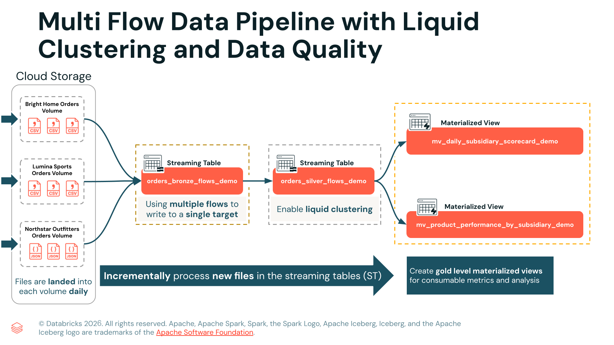

Die Demo zeigt, wie Sie gängige Herausforderungen in Pipelines bewältigen, darunter mehrere Flows in eine einzige Tabelle, Schema-Abweichungen, Datenqualitätsprobleme und Anforderungen an die Performance-Optimierung.

In der praktischen Umsetzung erstellen Sie eine vollständige Pipeline nach der Medallion-Architektur, die mithilfe von Flows mehrere Datenquellen inkrementell in eine einzige Bronze-Tabelle ingestiert, in der Silber-Schicht Datenqualitäts-Constraints und Transformationen mit Liquid-Clustering-Optimierung anwendet und in der Gold-Schicht Materialized Views für Business Intelligence erstellt. 

Wählen Sie vor dem Start dieses Notebooks die unten aufgeführte erforderliche Compute-Umgebung aus.

- **Serverless Compute, Version 4**  
  - [How to select an environment version](https://docs.databricks.com/aws/en/compute/serverless/dependencies#-select-an-environment-version)




```sql
-- bronze.sql

------------------------------------------
-- STRUKTUR DER BRONZE-TABELLE ERSTELLEN
------------------------------------------
CREATE OR REPLACE STREAMING TABLE multi_flow_1_bronze.orders_bronze_flows_demo
(
subsidiary_id   STRING,
order_id        STRING,
order_timestamp STRING,
customer_id     STRING,
region          STRING,
country         STRING,
city            STRING,
channel         STRING,
sku             STRING,
category        STRING,
qty             STRING,
unit_price      STRING,
discount_pct    STRING,
coupon_code     STRING,
total_amount    STRING,
order_date      STRING,
source_file     STRING,   -- Über die Spalte _metadata hinzugefügt, gibt den Namen der Quelldatei zurück
file_mod_time   TIMESTAMP -- Über die Spalte _metadata hinzugefügt, gibt den Änderungszeitpunkt der Datei zurück. Liefert einen konsistenten Wert
)
-- Die Klausel `COMMENT` fügt der Tabelle beschreibende Metadaten zu Dokumentationszwecken hinzu.
COMMENT "Creates a single bronze streaming table with orders from all subsidiaries using multiple flows."
-- Die Eigenschaft `'pipelines.reset.allowed' = false` verhindert Full Refreshes der 
-- Streaming Table und hilft so, das versehentliche Entfernen von Checkpoints und das 
-- Leeren der Daten der Streaming Table zu vermeiden.
-- Dieser Schutz ist besonders wichtig, wenn Ihre Rohdatenquelle Dateien nach einer bestimmten Zeit 
-- automatisch entfernt. Ohne diese Einstellung würden Daten, die nicht mehr im Quellverzeichnis 
-- vorhanden sind, bei einem **Run pipeline with full table refresh** nicht erneut in die 
-- Zieltabelle ingestiert.
TBLPROPERTIES (
'pipelines.reset.allowed' = false    -- Full Table Refreshes auf der Bronze-Tabelle verhindern
);
```

```python
# Schlüssel-Wert-Paare, die zum Setzen Ihrer Pipeline-Konfigurationsparameter benötigt werden
config_parameters = [
    ('bright_home_orders_source',        f'{my_vol_path}/bright_home_orders'),
    ('lumina_sports_orders_source',      f'{my_vol_path}/lumina_sports_orders'),
    ('northstar_outfitters_orders_source', f'{my_vol_path}/northstar_outfitters_orders')
]

for key, value in config_parameters:
    print(f"Key: {key}\nValue: {value}\n")
```

```sql
-- flow_ingestion.sql

------------------------------------------
-- BRONZE-FLOW – BRIGHT HOME
------------------------------------------
-- CSV-Dateien aus dem Volume bright_home_orders lesen
CREATE FLOW bright_home_orders_flow
AS INSERT INTO multi_flow_1_bronze.orders_bronze_flows_demo BY NAME
SELECT
CAST(subsidiary_id AS STRING) AS subsidiary_id,
CAST(order_id AS STRING) AS order_id,
CAST(order_timestamp AS STRING) AS order_timestamp,
CAST(customer_id AS STRING) AS customer_id,
CAST(region AS STRING) AS region,
CAST(country AS STRING) AS country,
CAST(city AS STRING) AS city,
CAST(channel AS STRING) AS channel,
CAST(sku AS STRING) AS sku,
CAST(category AS STRING) AS category,
CAST(qty AS STRING) AS qty,
CAST(unit_price AS STRING) AS unit_price,
CAST(discount_pct AS STRING) AS discount_pct,
CAST(coupon_code AS STRING) AS coupon_code,
CAST(total_amount AS STRING) AS total_amount,
CAST(order_date AS STRING) AS order_date,
_metadata.file_name AS source_file,
_metadata.file_modification_time AS file_mod_time
FROM STREAM read_files(
-- Verwendet den Konfigurationsparameter, um auf das Volume bright_home_orders zu verweisen
'${bright_home_orders_source}',   
format => 'csv',
header => true
);

------------------------------------------
-- BRONZE-FLOW – LUMINA SPORTS
------------------------------------------
-- CSV-Dateien aus dem Volume lumina_sports_orders lesen
CREATE FLOW lumina_sports_orders_flow
AS INSERT INTO multi_flow_1_bronze.orders_bronze_flows_demo BY NAME
SELECT
CAST(subsidiary_id AS STRING) AS subsidiary_id,
CAST(order_id AS STRING) AS order_id,
CAST(order_timestamp AS STRING) AS order_timestamp,
CAST(customer_id AS STRING) AS customer_id,
CAST(region AS STRING) AS region,
CAST(country AS STRING) AS country,
CAST(city AS STRING) AS city,
CAST(channel AS STRING) AS channel,
CAST(sku AS STRING) AS sku,
CAST(category AS STRING) AS category,
CAST(qty AS STRING) AS qty,
CAST(unit_price AS STRING) AS unit_price,
CAST(discount_pct AS STRING) AS discount_pct,
CAST(coupon_code AS STRING) AS coupon_code,
CAST(total_amount AS STRING) AS total_amount,
CAST(order_date AS STRING) AS order_date,
_metadata.file_name AS source_file,
_metadata.file_modification_time AS file_mod_time
FROM STREAM read_files(
'${lumina_sports_orders_source}',   -- Verwendet den Konfigurationsparameter, um auf das Volume von Lumina Sports zu verweisen
format => 'csv',
header => true
);

------------------------------------------
-- BRONZE-FLOW – NORTHSTAR OUTFITTERS
------------------------------------------
-- JSON-Dateien aus dem Volume northstar_outfitters_orders lesen
CREATE FLOW northstar_outfitters_orders_flow
AS INSERT INTO multi_flow_1_bronze.orders_bronze_flows_demo BY NAME
SELECT
CAST(subsidiary_id AS STRING) AS subsidiary_id,
CAST(order_id AS STRING) AS order_id,
CAST(order_timestamp AS STRING) AS order_timestamp,
CAST(customer_id AS STRING) AS customer_id,
CAST(region AS STRING) AS region,
CAST(country AS STRING) AS country,
CAST(city AS STRING) AS city,
CAST(channel AS STRING) AS channel,
CAST(sku AS STRING) AS sku,
CAST(category AS STRING) AS category,
CAST(qty AS STRING) AS qty,
CAST(unit_price AS STRING) AS unit_price,
CAST(discount_pct AS STRING) AS discount_pct,
CAST(coupon_code AS STRING) AS coupon_code,
CAST(total_amount AS STRING) AS total_amount,
CAST(order_date AS STRING) AS order_date,
_metadata.file_name AS source_file,
_metadata.file_modification_time AS file_mod_time
FROM STREAM read_files(
'${northstar_outfitters_orders_source}',  -- Verwendet den Konfigurationsparameter, um auf das Volume von Northstar zu verweisen
format => 'json'
);
```

```sql
-- silver_transformation.sql

CREATE OR REFRESH STREAMING TABLE multi_flow_2_silver.orders_silver_flows_demo
(
-- A: Ein festes Schema definieren, um Schema Evolution zu verhindern.
subsidiary_id   STRING,
order_id        STRING,
order_timestamp TIMESTAMP,
order_date      DATE,
customer_id     STRING,
region          STRING,
country         STRING,
city            STRING,
channel         STRING,
sku             STRING,
category        STRING,
qty             INT,
unit_price      DOUBLE,
discount_pct    DOUBLE,
total_amount    DOUBLE,
coupon_code     STRING,

-- B: Datenqualitäts-Constraints, um ungültige Zeilen zu verwerfen oder zu kennzeichnen.
CONSTRAINT qty_valid          EXPECT (qty >= 0) ON VIOLATION DROP ROW,
CONSTRAINT total_amount_valid EXPECT (total_amount >= 0) ON VIOLATION DROP ROW,
CONSTRAINT timestamp_not_null EXPECT (order_timestamp IS NOT NULL) ON VIOLATION FAIL UPDATE
)
-- C: Fügt einen Tabellenkommentar hinzu
COMMENT 'Clean and standardize data from the multiple-flow bronze table'

-- D: Liquid Clustering aktivieren, um die Performance bei häufigen Filtern zu verbessern.
CLUSTER BY AUTO

AS
-- E: Daten aus der Bronze-Tabelle auswählen und bereinigen. Verwendet TRY_CAST, um über alle Tochtergesellschaften hinweg konsistente Typen durchzusetzen.
SELECT
subsidiary_id,
order_id,
TRY_CAST(order_timestamp AS TIMESTAMP) AS order_timestamp,
TRY_CAST(order_date      AS DATE)      AS order_date,
customer_id,
region,
country,
city,
channel,
sku,
category,
TRY_CAST(qty          AS INT)    AS qty,
TRY_CAST(unit_price   AS DOUBLE) AS unit_price,
TRY_CAST(discount_pct AS DOUBLE) AS discount_pct,
TRY_CAST(total_amount AS DOUBLE) AS total_amount,
coupon_code
-- F: Liest inkrementell aus der Bronze-Tabelle, die Daten aus drei Volumes enthält
FROM STREAM multi_flow_1_bronze.orders_bronze_flows_demo;
```

```sql
-- gold_mvs.sql

------------------------------------------
-- a. GOLD-MATERIALIZED-VIEW: TÄGLICHE SCORECARD PRO TOCHTERGESELLSCHAFT
-- Einfache Tageszusammenfassung pro Tochtergesellschaft
------------------------------------------
CREATE OR REPLACE MATERIALIZED VIEW multi_flow_3_gold.mv_daily_subsidiary_scorecard_demo
AS
SELECT
order_date,
subsidiary_id,
COUNT(DISTINCT order_id)    AS order_count,   -- Anzahl der eindeutigen Bestellungen
ROUND(SUM(total_amount),2)  AS total_revenue, -- Gesamtumsatz des Tages
SUM(qty)                    AS total_units    -- Gesamtzahl verkaufter Einheiten
FROM multi_flow_2_silver.orders_silver_flows_demo
WHERE order_date IS NOT NULL
GROUP BY order_date, subsidiary_id;

------------------------------------------
-- b. GOLD-MATERIALIZED-VIEW: PRODUKT-PERFORMANCE PRO TOCHTERGESELLSCHAFT
-- Einheiten und Umsatz pro Produkt und Tochtergesellschaft
------------------------------------------
CREATE OR REPLACE MATERIALIZED VIEW multi_flow_3_gold.mv_product_performance_by_subsidiary_demo
AS
SELECT
subsidiary_id,
category,
sku,
SUM(qty)                   AS units_sold,  -- verkaufte Einheiten pro SKU
ROUND(SUM(total_amount),2) AS revenue      -- Gesamtumsatz pro SKU
FROM multi_flow_2_silver.orders_silver_flows_demo
GROUP BY subsidiary_id, category, sku;
```


### G2. Die neue tägliche Lieferung (2025-11-02) in jedem Volume erkunden
1. Führen Sie einfach die folgende Zelle aus, um die Anzahl der Datensätze in der rohen Tageslieferung **2025-11-02** in jedem Volume zu zählen.

2. Bestätigen Sie, dass die Ausgabe über alle drei Tochtergesellschaften hinweg insgesamt **502** Zeilen für die Bestelllieferung **2025-11-02** zeigt.

| Volume                      | TotalRows | FileName                    |
|-----------------------------|-----------|------------------------------|
| bright_home_orders          | 191       | bsh_orders_2025-11-02.csv    |
| lumina_sports_orders        | 170       | lms_orders_2025-11-02.csv    |
| northstar_outfitters_orders | 141       | nso_orders_2025-11-02.json   |
| GESAMT                      | 502       |                              |

```python
from pyspark.sql.functions import lit, sum as _sum

df_all = spark.sql(f"""
    SELECT 
        'bright_home_orders' AS Volume,
        COUNT(*) AS TotalRows,
        'bsh_orders_2025-11-02.csv' AS FileName
    FROM read_files('{my_vol_path}/bright_home_orders/bsh_orders_2025-11-02.csv')

    UNION ALL
    SELECT 
        'lumina_sports_orders' AS Volume,
        COUNT(*) AS TotalRows,
        'lms_orders_2025-11-02.csv' AS FileName
    FROM read_files('{my_vol_path}/lumina_sports_orders/lms_orders_2025-11-02.csv')

    UNION ALL
    SELECT 
        'northstar_outfitters_orders' AS Volume,
        COUNT(*) AS TotalRows,
        'nso_orders_2025-11-02.json' AS FileName
    FROM read_files('{my_vol_path}/northstar_outfitters_orders/nso_orders_2025-11-02.json')
""")

# Zeile TOTAL erstellen
total_row = (
    df_all
    .agg(_sum("TotalRows").alias("TotalRows"))
    .withColumn("Volume", lit("TOTAL"))
    .withColumn("FileName", lit(""))
    .select("Volume", "TotalRows", "FileName")  # Spaltenreihenfolge angleichen
)

# Zeile TOTAL unten anhängen
df_with_total = df_all.unionByName(total_row)

display(df_with_total)
```

## Tags zu Bronze-, Silber- und Gold-Objekten hinzufügen
Tags erleichtern das Organisieren, Durchsuchen und Verwalten (Governance) von Objekten in Unity Catalog. Sie helfen nachgelagerten Teams, schnell zu verstehen, was jedes Objekt darstellt und wie es verwendet werden sollte.

```sql
%sql

------------------------------------
-- Tags der Bronze-Tabelle
----------------------------------
ALTER TABLE multi_flow_1_bronze.orders_bronze_flows_demo
SET TAGS (
  'demo_tag_Department' = 'Sales',
  'demo_tag_Quality' = 'bronze'
);

----------------------------------
-- Tags der Silber-Tabelle
----------------------------------
ALTER TABLE multi_flow_2_silver.orders_silver_flows_demo
SET TAGS (
  'demo_tag_Department' = 'Sales',
  'demo_tag_Quality' = 'silver'
);

----------------------------------
-- Tags der Materialized Views
------------------------------------
ALTER TABLE multi_flow_3_gold.mv_product_performance_by_subsidiary_demo
SET TAGS (
  'demo_tag_Department' = 'Sales',
  'demo_tag_Quality' = 'gold'
);

ALTER TABLE multi_flow_3_gold.mv_daily_subsidiary_scorecard_demo
SET TAGS (
  'demo_tag_Department' = 'Sales',
  'demo_tag_Quality' = 'gold'
);
```
