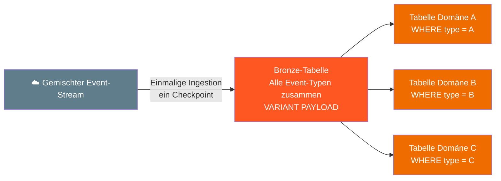
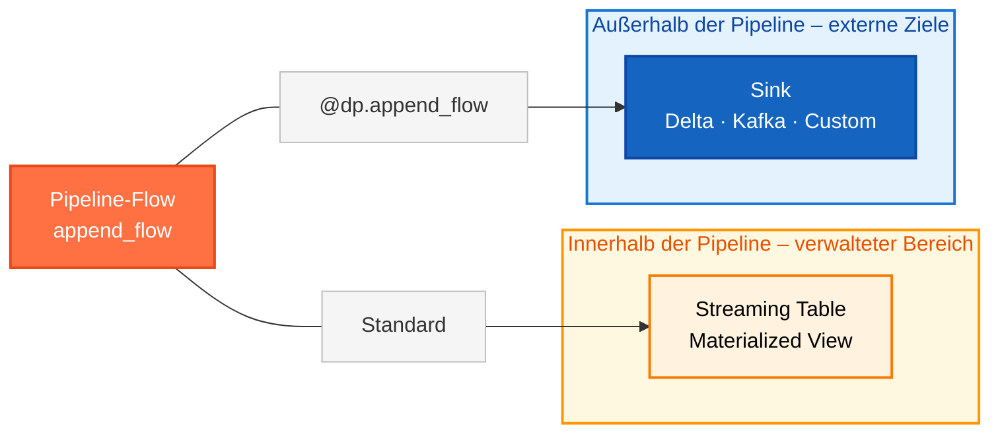
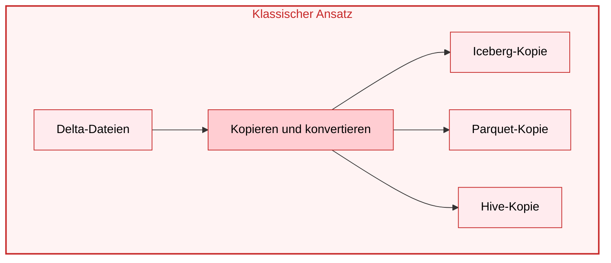
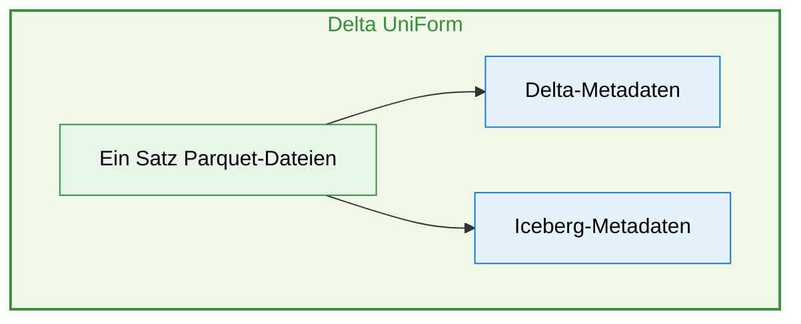
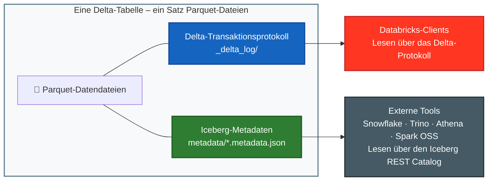
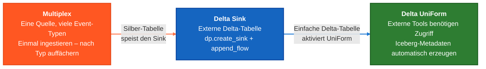

Diese Lektion stellt drei fortgeschrittene Konzepte vor, die in Spark Declarative Pipelines verwendet werden: 

- das **Multiplex-Muster** zur effizienten Ingestion gemischter Event-Streams, 
- **Delta Sinks** zum Schreiben von Streaming-Daten in externe Tabellen, 
- **Iceberg-Lesezugriffe über Delta UniForm**, um plattformübergreifenden Zugriff auf Delta-Tabellen zu ermöglichen.

## A. Das Multiplex-Muster (Fan-out)




**Wichtige Vorteile:**
- Verwaltung eines einzigen Checkpoints
- Gemeinsames Scannen der Quelle
- Zentrale Fehlerbehandlung
- Vereinfachtes Monitoring

## B. Sinks

Sinks bieten einen Mechanismus, um Streaming-Daten aus einer Spark Declarative Pipeline in externe Delta-Tabellen zu schreiben, die außerhalb des von der Pipeline verwalteten Bereichs liegen. **Nur die Python-API wird unterstützt** – SQL wird für Sinks nicht unterstützt. Nur `append_flow` kann in einen Sink schreiben.



### B1. Unterstützte Sink-Typen

Databricks unterstützt **vier Arten von Sinks** – jeweils geeignet für ein anderes Ziel und einen anderen Anwendungsfall.

**Delta Table Sink**

- Von Unity Catalog verwaltete Tabellen
- Externe Delta-Tabellen
- Schreiben über Pfad oder Tabellennamen

**Apache Kafka Sink**

- Zurückschreiben in Kafka-Topics
- Operative Anwendungsfälle mit niedriger Latenz
- Reverse ETL aus Databricks heraus

**Azure Event Hubs Sink**

- Verwendet das Kafka-Schnittstellenformat
- Event-Streaming in Echtzeit
- Betrugserkennung · Empfehlungen

**Python Custom Sink**

- In beliebige Datenspeicher schreiben
- Verwendet benutzerdefinierte PySpark-Datenquellen
- Maximale Flexibilität

### B2. Managed Tables vs. Sinks

Jedes Standard-Dataset in einer Spark Declarative Pipeline – Streaming Table oder Materialized View – **gehört der Pipeline und wird von ihr verwaltet**. Ein **Sink** durchbricht dies bewusst: Er lässt die Pipeline Streaming-Daten in eine **einfache Delta-Tabelle schreiben, die außerhalb des von der Pipeline verwalteten Bereichs liegt**.

**Managed Table (Standard)**

- Daten bleiben in Unity Catalog
- Vollständige Nachverfolgung der Pipeline-Lineage
- Unterstützt Expectations und CDC
- Streaming Tables und Materialized Views

vs.

**Sink**

- In externe Systeme außerhalb von Databricks schreiben
- Ermöglicht Reverse ETL und operative Anwendungsfälle
- Unterstützt Kafka, Event Hubs und benutzerdefinierte Ziele
- Keine Expectations – nur Anhängen (Append)

### B3. Delta Sink in Aktion

Ein **Delta Sink** schreibt die Pipeline-Ausgabe in eine Delta-Tabelle *außerhalb* des von der Pipeline verwalteten Lebenszyklus – und ermöglicht so Konfigurationen, die auf von der Pipeline verwalteten Streaming Tables nicht möglich sind, etwa **Iceberg-Kompatibilität**.

---

**Streaming Tables können nicht**

- Iceberg-Kompatibilität aktivieren
- Mit Nicht-Databricks-Plattformen geteilt werden

**Ein Delta Sink kann**

- Die volle Kontrolle über die Eigenschaften der Delta-Tabelle haben
- Iceberg UniForm für plattformübergreifende Lesezugriffe aktivieren

---

#### Umsetzung

Nur Python – keine SQL-Entsprechung

```python
from pyspark import pipelines as dp

# Schritt 1 — Den Sink registrieren
dp.create_sink(
    name    = "my_sink",
    format  = "delta",
    options = {
        "tableName": "catalog.schema.table"
    }
)

# Schritt 2 — In den Sink schreiben
# Das Checkpointing wird automatisch von append_flow() übernommen
# Pro Lauf werden nur neue Datensätze geschrieben – keine Überschreibungen

@dp.append_flow(
name   = "my_sink_flow",
target = "my_sink"
)
def my_sink_flow():
    return spark.readStream.table(
        "schema.source_table"
    )
```

## C. Iceberg-Lesezugriffe über Delta UniForm

**Delta UniForm** ermöglicht plattformübergreifenden Zugriff auf Delta-Tabellen, indem automatisch Apache-Iceberg-Metadaten erzeugt werden, ohne die zugrunde liegenden Daten zu duplizieren.

 Moderne Datenarchitekturen erstrecken sich über mehrere Plattformen. Klassischerweise bedeutete die Unterstützung jeder Plattform, **Daten in mehrere Formate zu kopieren** – mit Duplikaten, Synchronisationsproblemen und höheren Speicherkosten. **Delta UniForm** löst dies mit einem einzigen Satz von Dateien und zwei Metadatenschichten.





**Klassischer Ansatz**

- Daten werden in mehrere Formate kopiert
- Synchronisationsprobleme zwischen den Kopien
- Höhere Speicherkosten

**Delta UniForm**

- Ein Satz Parquet-Dateien
- Metadatenschichten für Delta + Iceberg
- Keine Duplikate – automatische Synchronisation

 Delta UniForm verwaltet **einen physischen Datensatz** mit **zwei logischen Sichten** – keine Datenduplikate, keine separaten Kopien. Iceberg-Metadaten werden nach jedem Delta-Schreibvorgang **asynchron** erzeugt, sodass beide Sichten automatisch synchron bleiben.

---



### Iceberg-Lesezugriffe aktivieren 

**1. Deletion Vectors deaktivieren**

**Eigenschaft:** `'delta.enableDeletionVectors' = 'false'`

Iceberg v2 kann die Soft-Delete-Markierungen von Delta nicht darstellen. **Durch das Deaktivieren sind alle Löschungen Hard Deletes**, sodass die Tabelle von Iceberg-Clients vollständig gelesen werden kann.

**2. Column Mapping Mode**

**Eigenschaft:** `'delta.columnMapping.mode' = 'name'`

Stellt sicher, dass die Spaltenbezeichner zwischen Delta- und Iceberg-Schemas konsistent sind, verhindert Schema Drift und ermöglicht nahtlosen plattformübergreifenden Zugriff.

**3. IcebergCompatV2 aktivieren**

**Eigenschaft:** `'delta.enableIcebergCompatV2' = 'true'`

Aktiviert das mit Iceberg v2 kompatible Schreibprotokoll von Delta, sodass Iceberg-Clients Delta-Tabellen ohne Datenkonvertierung lesen können.

**4. Universal Format aktivieren**

**Eigenschaft:** `'delta.universalFormat.enabledFormats' = 'iceberg'`

Löst nach jedem Delta-Commit die asynchrone Erzeugung von Iceberg-Metadaten aus und stellt so aktuelle Iceberg-Sichten für externe Tools sicher.

**⚠️ Iceberg-Lesezugriffe funktionieren nur auf einfachen Delta-Tabellen**

**Hinweis:** Für von der Pipeline verwaltete **Streaming Tables** und **Materialized Views** können keine Iceberg-Lesezugriffe aktiviert werden. Nur eine einfache externe Delta-Tabelle – etwa eine über einen **Delta Sink** erstellte – unterstützt UniForm. Diese Brücke ist für den plattformübergreifenden Zugriff erforderlich.

**Weitere Details:** Das Setzen dieser Eigenschaften ist ein einmaliger Vorgang, **muss aber erfolgen, bevor Daten geschrieben werden**. Nach der Aktivierung werden die Iceberg-Metadaten automatisch synchron gehalten, sodass Tools wie Snowflake, Trino und Athena dieselbe Delta-Tabelle abfragen können.

---

Weitere Details finden Sie in der [Delta UniForm Documentation](https://docs.databricks.com/aws/en/delta/uniform)

#### FÜR WEITERE DETAILS AUFKLAPPEN

Delta UniForm (Universal Format) löst ein seit Langem bestehendes Problem im Lakehouse-Ökosystem: **Verschiedene Tools sprechen unterschiedliche Tabellenformate**. Snowflake, Trino, Athena und Open-Source-Spark verstehen alle Apache Iceberg – aber nicht nativ Delta Lake. UniForm schließt diese Lücke, indem Ihre Delta-Tabellen *gleichzeitig als Iceberg-Tabellen lesbar* werden – ohne Datenduplikate oder separate Pipelines.

Sowohl Delta Lake als auch Apache Iceberg basieren auf derselben Grundlage: **Parquet-Datendateien** plus einer **Metadatenschicht**. UniForm nutzt das, indem nach jedem Delta-Schreibvorgang asynchron Iceberg-Metadaten erzeugt werden – dieselben Parquet-Dateien bedienen nun zwei Formate gleichzeitig. Aus Sicht eines Delta-Clients ändert sich nichts. Aus Sicht eines Iceberg-Clients sieht es wie eine native Iceberg-Tabelle aus. Sie erhalten **einen Datensatz, zwei logische Sichten, null Duplikate**.

---

#### Vorteile

- **Keine Datenbewegung:** Eine einzige Kopie der Parquet-Dateien wird von Delta- und Iceberg-Clients gemeinsam genutzt – kein ETL, keine Replikation, kein Speicher-Overhead.
- **Plattformübergreifende Interoperabilität:** Tools wie Snowflake, Trino, Apache Athena und Open-Source-Spark können Ihre Delta-Tabellen direkt über den Iceberg REST Catalog abfragen.
- **Vernachlässigbarer Schreib-Overhead:** Die Erzeugung der Iceberg-Metadaten erfolgt asynchron nach dem Delta-Commit, sodass Ihre Schreib-Pipelines nicht verlangsamt werden.
- **Funktioniert mit Unity Catalog:** Unity Catalog fungiert als Iceberg REST Catalog, sodass externe Clients einen verwalteten, katalogisierten Zugriff ohne zusätzliche Infrastruktur erhalten.
- **Gleichwertige Performance:** Benchmarks zeigen eine vergleichbare Leseleistung zwischen Delta UniForm und nativ verwalteten Iceberg-Tabellen auf Snowflake.

---

#### Einschränkungen

- **Nur lesend für Iceberg-Clients:** Externe Tools können über Iceberg nur *lesen*. Alle Schreibvorgänge müssen über Delta erfolgen – Sie können nicht aus Snowflake oder Trino in eine UniForm-Tabelle schreiben.
- **Deletion Vectors müssen deaktiviert sein:** Für Tabellen, die Deletion Vectors (eine Performance-Funktion von Delta) verwenden, kann UniForm nicht aktiviert werden. Sie müssen `'delta.enableDeletionVectors' = 'false'` setzen.
- **Streaming Tables und Materialized Views sind ausgenommen:** Für von der Pipeline verwaltete Tabellen in Spark Declarative Pipelines kann die erforderliche Eigenschaft `delta.universalFormat.enabledFormats` nicht direkt gesetzt werden. Hier kommen **Delta Sinks** ins Spiel – sie schreiben in einfache externe Delta-Tabellen, auf denen UniForm frei aktiviert werden kann.
- **Column Mapping ist dauerhaft:** Mit UniForm wird auch Column Mapping (`delta.columnMapping.mode = 'name'`) aktiviert, das nach dem Setzen nicht mehr entfernt werden kann.
- **Databricks Runtime 14.3 LTS oder höher erforderlich:** Jeder Databricks-Client, der in eine UniForm-fähige Tabelle schreibt, muss DBR 14.3+ verwenden.
- **Zugriff auf die Tabelle muss über den Namen erfolgen:** Die Erzeugung der Iceberg-Metadaten wird nur ausgelöst, wenn über den Tabellennamen (nicht über den Pfad) zugegriffen wird.

---

**🔗 Der Zusammenhang mit Delta Sinks:** Da Streaming Tables und Materialized Views UniForm nicht direkt nutzen können, verwendet das Muster in dieser Lektion einen **Delta Sink** – Sie schreiben die Ausgabe Ihrer Streaming-Pipeline in eine einfache externe Delta-Tabelle, aktivieren UniForm auf dieser Tabelle, und Iceberg-Clients können sie sofort lesen. Das ist das empfohlene Produktionsmuster für plattformübergreifenden Iceberg-Zugriff aus einer laufenden Streaming-Pipeline.

## D. Die Konzepte verbinden

Diese drei Konzepte wirken zusammen, um komplexe Anforderungen an reale Daten-Pipelines zu erfüllen. Jedes Konzept löst ein eigenes Problem. Zusammen bilden sie ein vollständiges Muster für Pipelines, die Echtzeitverarbeitung und plattformübergreifenden Zugriff benötigen.



#### FÜR WEITERE DETAILS AUFKLAPPEN

### Kombiniertes fortgeschrittenes Pipeline-Muster

#### 1. Multiplex-Muster
- **Problem**: Mehrere Event-Typen in einer Quelle
- **Lösung**: Einmalige Ingestion mit typbasiertem Fan-out
- **Ergebnis**: Domänenspezifische Silber-Tabellen

#### 2. Delta Sink
- **Problem**: Externe Tabelle für plattformübergreifenden Zugriff benötigt
- **Lösung**: `dp.create_sink()` + `@dp.append_flow`
- **Ergebnis**: Einfache Delta-Tabelle außerhalb des Pipeline-Bereichs

#### 3. Delta UniForm
- **Problem**: Externe Tools benötigen Zugriff im Iceberg-Format  
- **Lösung**: Iceberg-Metadaten auf einer einfachen Delta-Tabelle automatisch erzeugen
- **Ergebnis**: Tabelle mit zwei Protokollen, auf die jede Plattform zugreifen kann
