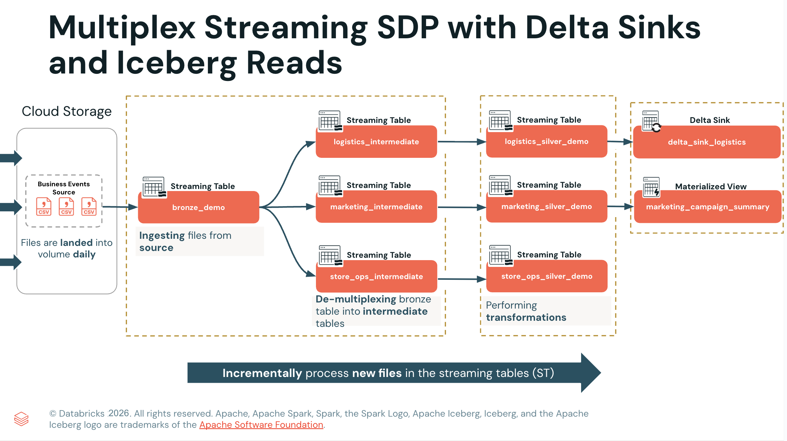

Wie Sie mit Spark Declarative Pipelines (Lakeflow) eine Multiplex-Daten-Pipeline aufbauen. 

Wählen Sie vor dem Start dieses Notebooks die unten aufgeführte erforderliche Compute-Umgebung aus.

- **Serverless Compute, Version 4**  [How to select an environment version](https://docs.databricks.com/aws/en/compute/serverless/dependencies#-select-an-environment-version)



```sql
%sql
SELECT 
  -- Aus der Datei gelesener roher JSON-Payload, in einen String gecastet
  CAST(value AS STRING) AS value_str,

  -- Den JSON-String in eine VARIANT-Spalte parsen, um flexibel auf Felder zuzugreifen
  -- Warum Variant: 
  -- 1. Unterstützt semistrukturierte JSON-Daten 
  -- 2. Funktioniert gut für Multiplex-Streaming-Daten
  -- 3. Verarbeitet mehrere Event-Strukturen in einer einzigen Spalte
  parse_json(value_str) AS event_data_variant,

  -- Das Feld event_id aus dem VARIANT extrahieren und in STRING casten
  CAST(event_data_variant:event_id AS STRING) AS extracted_event_id,

  -- Das Feld timestamp aus dem VARIANT extrahieren und in TIMESTAMP casten
  event_data_variant:timestamp::TIMESTAMP AS extracted_timestamp
FROM read_files(my_vol_path || '/business_events');
```

```python
# Statistiken der Rohdaten analysieren
# a. Gesamtzahl der Zeilen
df_count = spark.sql(f"""
    SELECT COUNT(*) AS total_rows
    FROM  read_files('{my_vol_path}/business_events')
""")
display(df_count)

# b. Anzahl pro Datenquelle nach Topic
df_data_source_count = spark.sql(f"""
    SELECT 
        topic,
        COUNT(*) AS total_rows
    FROM read_files('{my_vol_path}/business_events')
    GROUP BY topic
    ORDER BY topic
""")
display(df_data_source_count) 
```

## C. Die Spark Declarative Pipeline erstellen

```sql
-- ingestion.sql

------------------------------------------------------
-- BRONZE-TABELLE FÜR DIE BUSINESS-EVENT-DATEN ERSTELLEN
------------------------------------------------------
CREATE OR REFRESH STREAMING TABLE multiplex_1_bronze.bronze_demo
TBLPROPERTIES (
-- verhindert Full Refreshes der Streaming Table
'pipelines.reset.allowed' = false,
-- aktiviert den Datentyp VARIANT, mit dem Sie semistrukturierte Daten wie JSON 
-- effizient speichern und abfragen können. Diese Eigenschaft muss gesetzt sein, um die native 
-- Unterstützung für VARIANT-Spalten freizuschalten
'delta.feature.variantType-preview' = 'supported'
)
AS
SELECT
CAST(key AS STRING) AS event_id,
PARSE_JSON(CAST(value AS STRING)) AS event_data_variant,
CAST(topic AS STRING) AS event_group,
CAST(partition AS STRING) AS partition,
CAST(offset AS STRING) AS offset,
-- Metadatenspalten hinzufügen
_metadata.file_name AS source_file,
_metadata.file_modification_time AS file_mod_time
FROM STREAM read_files('${business_events_source}');

------------------------------------------------------
-- Die Bronze-Tabelle nach Business-Event auffächern (Fan-out)
-- MARKETING-ZWISCHENTABELLE ERSTELLEN
------------------------------------------------------
CREATE OR REFRESH STREAMING TABLE multiplex_1_bronze.marketing_intermediate
TBLPROPERTIES (
'delta.feature.variantType-preview' = 'supported'
)
AS SELECT
event_id,
event_data_variant,
event_group,
event_data_variant:event_id::STRING AS extracted_event_id,
event_data_variant:timestamp::TIMESTAMP AS timestamp,
event_data_variant:event_type::STRING AS event_type,
event_data_variant:subsidiary_id::STRING AS subsidiary_id,
event_data_variant:campaign_id::STRING AS campaign_id,
event_data_variant:channel::STRING AS channel,
event_data_variant:impressions::LONG AS impressions,
event_data_variant:clicks::LONG AS clicks,
event_data_variant:conversions::LONG AS conversions,
event_data_variant:spend_usd::DOUBLE AS spend_usd,
source_file,
file_mod_time
FROM STREAM multiplex_1_bronze.bronze_demo
WHERE event_group = 'business_events_marketing';


------------------------------------------------------
-- 
-- LOGISTIK-ZWISCHENTABELLE ERSTELLEN
------------------------------------------------------
CREATE OR REFRESH STREAMING TABLE multiplex_1_bronze.logistics_intermediate
TBLPROPERTIES (
'delta.feature.variantType-preview' = 'supported'
)
AS SELECT
event_id,
event_data_variant,
event_group,
event_data_variant:event_id::STRING AS extracted_event_id,
event_data_variant:timestamp::TIMESTAMP AS timestamp,
event_data_variant:event_type::STRING AS event_type,
event_data_variant:subsidiary_id::STRING AS subsidiary_id,
event_data_variant:warehouse_id::STRING AS warehouse_id,
event_data_variant:carrier::STRING AS carrier,
event_data_variant:batch_id::STRING AS batch_id,
event_data_variant:num_packages::LONG AS num_packages,
event_data_variant:destination_region::STRING AS destination_region,
source_file,
file_mod_time
FROM STREAM multiplex_1_bronze.bronze_demo
WHERE event_group = 'business_events_logistics';


------------------------------------------------------
-- ZWISCHENTABELLE FÜR DEN FILIALBETRIEB ERSTELLEN
------------------------------------------------------
CREATE OR REFRESH STREAMING TABLE multiplex_1_bronze.store_ops_intermediate
TBLPROPERTIES (
'delta.feature.variantType-preview' = 'supported'
)
AS SELECT
event_id,
event_data_variant,
event_group,
event_data_variant:event_id::STRING AS extracted_event_id,
event_data_variant:timestamp::TIMESTAMP AS extracted_timestamp,
event_data_variant:event_type::STRING AS event_type,
event_data_variant:subsidiary_id::STRING AS subsidiary_id,
event_data_variant:store_id::STRING AS store_id,
event_data_variant:city::STRING AS city,
event_data_variant:region::STRING AS region,
event_data_variant:opened_by_employee_id::STRING AS opened_by_employee_id,
source_file,
file_mod_time
FROM STREAM multiplex_1_bronze.bronze_demo
WHERE event_group = 'business_events_store_ops';
```

```python
# Die Pipeline-Parameter konfigurieren
config_parameters = [
    ('business_events_source', f'{my_vol_path}/business_events'),
    ('my_catalog',my_catalog)
]

for key, value in config_parameters:
    print(f"Key: {key}\nValue: {value}\n")
```

```sql
-- silver_transformation.sql

------------------------------------------------------
-- SILBER-TABELLE FÜR DIE MARKETINGDATEN ERSTELLEN
------------------------------------------------------

CREATE OR REFRESH STREAMING TABLE multiplex_2_silver.marketing_silver_demo
AS SELECT
COALESCE(extracted_event_id, event_id) AS event_id,
timestamp,
event_group,
event_type,
subsidiary_id,
campaign_id,
channel,
impressions,
clicks,
conversions,
spend_usd,
CASE WHEN impressions > 0
THEN clicks / impressions
ELSE 0
END AS click_through_rate,
CASE WHEN clicks > 0
THEN spend_usd / clicks
ELSE 0
END AS cost_per_click
FROM STREAM multiplex_1_bronze.marketing_intermediate;

------------------------------------------------------
-- SILBER-TABELLE FÜR DIE LOGISTIKDATEN ERSTELLEN
------------------------------------------------------

CREATE OR REFRESH STREAMING TABLE multiplex_2_silver.logistics_silver_demo
AS SELECT
COALESCE(extracted_event_id, event_id) AS event_id,
timestamp,
event_group,
event_type,
subsidiary_id,
warehouse_id,
carrier,
batch_id,
num_packages,
destination_region,
CASE WHEN num_packages > 0 THEN TRUE ELSE FALSE END AS is_valid_shipment,
DATE(timestamp) AS event_date
FROM STREAM multiplex_1_bronze.logistics_intermediate
WHERE warehouse_id IS NOT NULL
AND batch_id IS NOT NULL;

------------------------------------------------------
-- SILBER-TABELLE FÜR DIE DATEN DES FILIALBETRIEBS ERSTELLEN
------------------------------------------------------
CREATE OR REFRESH STREAMING TABLE multiplex_2_silver.store_ops_silver_demo
AS SELECT
COALESCE(extracted_event_id, event_id) AS event_id,
extracted_timestamp AS timestamp,
event_group,
event_type,
subsidiary_id,
store_id,
city,
region,
opened_by_employee_id,
DATE(extracted_timestamp) AS event_date,
HOUR(extracted_timestamp) AS event_hour,
SPLIT(store_id, '_')[2] AS store_number
FROM STREAM multiplex_1_bronze.store_ops_intermediate
WHERE extracted_timestamp IS NOT NULL
AND store_id IS NOT NULL
AND event_type IS NOT NULL;
```

```sql
-- gold_view.sql

------------------------------------------------------
-- MATERIALIZED VIEW FÜR DIE MARKETINGDATEN ERSTELLEN
------------------------------------------------------

CREATE OR REFRESH MATERIALIZED VIEW multiplex_3_gold.marketing_campaign_summary
AS SELECT
campaign_id,
subsidiary_id,
channel,
COUNT(*) AS total_events,
SUM(impressions) AS total_impressions,
SUM(clicks) AS total_clicks,
SUM(conversions) AS total_conversions,
ROUND(SUM(spend_usd), 2) AS total_spend_usd,
ROUND((SUM(clicks) * 1.0 / NULLIF(SUM(impressions), 0)) * 100, 2) AS ctr_percentage,
ROUND((SUM(conversions) * 1.0 / NULLIF(SUM(clicks), 0)) * 100, 2) AS conversion_rate_percentage,
ROUND(SUM(spend_usd) / NULLIF(SUM(conversions), 0), 2) AS cost_per_conversion
FROM multiplex_2_silver.marketing_silver_demo
GROUP BY campaign_id, subsidiary_id, channel;
```

## H. Iceberg-Lesezugriffe aktivieren

Nun möchten wir auf unserer finalen Streaming Table Iceberg-Lesezugriffe aktivieren, um plattformübergreifende Analysen und das Teilen von Daten zu unterstützen.

```python
# delta_sink.py

# ------------------------------------------------------
#       DELTA SINK ERSTELLEN
# ------------------------------------------------------

from pyspark import pipelines as dp

my_catalog = spark.conf.get("my_catalog")

# Ein Ziel (Sink) definieren: Die Funktion `create_sink` registriert einen 
# bestimmten Endpunkt für Ihre Daten – eine Delta-Tabelle namens `logistics_delta_sink` 
# im Gold-Schema – getrennt von der Logik, die ihn befüllt.
dp.create_sink(
name = "delta_sink_logistics",
format = "delta",
options = { "tableName": f"{my_catalog}.multiplex_3_gold.logistics_delta_sink" }
)

# Einen Streaming-Flow einrichten: Der Decorator `@dp.append_flow` erstellt eine 
# kontinuierliche Daten-Pipeline, die Ihre Verarbeitungslogik direkt mit dem 
# definierten Sink verbindet und die Datenbewegung automatisiert.

# Append-only-Logik ermöglichen: Der Append-Flow optimiert die Performance, indem 
# neue Datensätze beim Eintreffen hinzugefügt werden, statt vorhandene Daten 
# erneut zu verarbeiten oder zu überschreiben.
@dp.append_flow(name = "delta_sink_logistics_flow", target="delta_sink_logistics")
def delta_sink_logistics_flow():
return(
# Durch `readStream` verfolgt die Pipeline automatisch, welche Daten bereits 
# verarbeitet wurden (über Checkpointing), sodass nur neue Datensätze aus der 
# Silber-Tabelle nach Gold übertragen werden.
spark.readStream.table("multiplex_2_silver.logistics_silver_demo")
)
```

```sql
%sql
DESCRIBE EXTENDED multiplex_3_gold.logistics_delta_sink
```

### H4. Iceberg-Lesezugriffe aktivieren

```sql
-- Um Iceberg-Lesezugriffe auf einer Delta-Tabelle zu aktivieren, müssen Sie **Deletion Vectors deaktivieren**.
-- Deletion Vectors ermöglichen Soft Deletes, Iceberg benötigt für die Kompatibilität jedoch Hard Deletes.
-- Mit Iceberg (v3) müssen Sie Deletion Vectors nicht deaktivieren. 

-- Schritt 1: Deletion Vectors deaktivieren
ALTER TABLE multiplex_3_gold.logistics_delta_sink 
  SET TBLPROPERTIES (
    'delta.enableDeletionVectors' = 'false'
  );

-- Schritt 2: Iceberg-Kompatibilität aktivieren
ALTER TABLE multiplex_3_gold.logistics_delta_sink 
  SET TBLPROPERTIES (
    'delta.columnMapping.mode' = 'name',
    'delta.enableIcebergCompatV2' = 'true',
    'delta.universalFormat.enabledFormats' = 'iceberg'
  );
```

```sql
-- Sie sehen einen neuen Abschnitt namens **Delta Uniform Iceberg**, 
-- der Details enthält wie 

-- Speicherort der Metadaten 
-- konvertierte Delta-Version
-- Zeitstempel der konvertierten Delta-Version
DESCRIBE TABLE EXTENDED multiplex_3_gold.logistics_delta_sink;
```

```sql
-- Sehen wir uns die Tabelleneigenschaften an:

-- `delta.universalFormat.enabledFormats = iceberg` bestätigt, dass das Iceberg-Format aktiviert ist.
-- `delta.enableDeletionVectors = false` zeigt, dass Deletion Vectors nicht aktiviert sind.
-- Die Tabelle unterstützt derzeit Iceberg Version 2: 
-- `delta.feature.icebergCompatV2 = supported`.
SHOW TBLPROPERTIES multiplex_3_gold.logistics_delta_sink;
```
