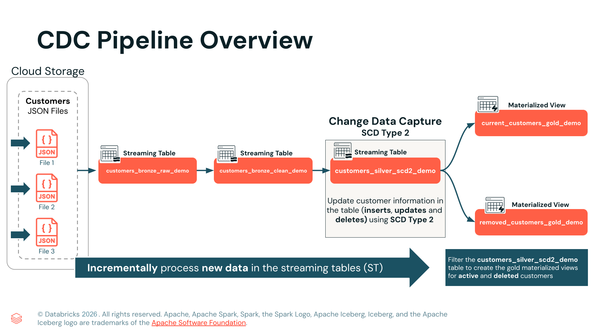

Wie Sie automatisiertes Change Data Capture (CDC) für Muster nach Slowly Changing Dimension (SCD) Type 2 mit Apache Spark™ Declarative Pipelines umsetzen. 



```sql
-- cdc_pipeline.sql

------------------------------------------------------
-- SCHRITT 1: JSON -> Bronze-Ingestion
------------------------------------------------------
-- Die JSON-Dateien mit Auto Loader aus dem Cloud-Speicher in eine Streaming Table ingestieren

-- `CREATE OR REFRESH STREAMING TABLE` – Erstellt eine verwaltete Streaming Table, die 
-- sich automatisch aktualisiert, wenn neue Daten eintreffen.  
CREATE OR REFRESH STREAMING TABLE sdp_cdc_1_bronze.customers_bronze_raw_demo
COMMENT "Raw data from customers CDC feed"
AS
SELECT
*,
current_timestamp() processing_time,  -- Den Verarbeitungszeitpunkt der Ingestion für die Zeilen ermitteln
_metadata.file_name as source_file    -- Den Dateinamen des Datensatzes ermitteln
-- `FROM STREAM read_files()` – Verwendet Auto Loader, um neue JSON-Dateien inkrementell zu lesen
FROM STREAM read_files("${source}", format => "json");


------------------------------------------------------
-- SCHRITT 2: Bronze Raw -> Bronze Clean
------------------------------------------------------
CREATE STREAMING TABLE sdp_cdc_1_bronze.customers_bronze_clean_demo
(

-- A. Gültige customer_id erforderlich; Transaktion schlägt fehl, wenn sie fehlt
CONSTRAINT valid_id EXPECT (customer_id IS NOT NULL)
ON VIOLATION FAIL UPDATE,

-- B. Gültige operation erforderlich; Datensätze mit NULL-operation werden verworfen
CONSTRAINT valid_operation EXPECT (operation IS NOT NULL)
ON VIOLATION DROP ROW,

-- C. Name muss vorhanden sein, außer bei operation DELETE
CONSTRAINT valid_name EXPECT (name IS NOT NULL OR operation = "DELETE"),

-- D. Vollständige Adressfelder erforderlich, außer bei operation DELETE
CONSTRAINT valid_address EXPECT (
(address IS NOT NULL
AND city IS NOT NULL
AND state IS NOT NULL
AND zip_code IS NOT NULL)
OR operation = "DELETE"),

-- E. Gültiges E-Mail-Format (Regex) erforderlich; Prüfung bei DELETE überspringen; ungültige Zeilen verwerfen
CONSTRAINT valid_email EXPECT (
rlike(email, '^([a-zA-Z0-9_\\-\\.]+)@([a-zA-Z0-9_\\-\\.]+)\\.([a-zA-Z]{2,5})$')
OR operation = "DELETE")
ON VIOLATION DROP ROW
)
COMMENT "Clean raw bronze data and apply quality constraints"
AS
SELECT
*,
-- **Wandelt außerdem den UNIX-Zeitstempel in einen lesbaren Zeitstempel um**, mit 
-- `CAST(from_unixtime(timestamp) AS timestamp)` als `timestamp_datetime`.
CAST(from_unixtime(timestamp) AS timestamp) AS timestamp_datetime -- UNIX-Zeitstempel umwandeln
FROM STREAM sdp_cdc_1_bronze.customers_bronze_raw_demo;

---------------------------------------------------------------------------------------
-- SCHRITT 3: CDC-Daten mit AUTO CDC INTO verarbeiten
---------------------------------------------------------------------------------------
-- a. Die Ziel-Streaming-Table erstellen, falls sie noch nicht existiert
CREATE OR REFRESH STREAMING TABLE sdp_cdc_2_silver.customers_silver_scd2_demo
COMMENT 'SCD Type 2 Historical Customer Data';


-- b. SCD Type 2 in die Silber-Tabelle durchführen
CREATE FLOW customers_scd_type_2_flow AS
AUTO CDC INTO sdp_cdc_2_silver.customers_silver_scd2_demo  -- Ziel: Hier werden die verarbeiteten Datensätze gespeichert
FROM STREAM sdp_cdc_1_bronze.customers_bronze_clean_demo   -- Quelle: Bereinigte CDC-Datensätze aus der Bronze-Schicht
KEYS (customer_id)                                       -- Primärschlüssel: Zum Abgleich von Datensätzen für Updates/Deletes
APPLY AS DELETE WHEN operation = "DELETE"                -- Löschlogik: Als DELETE markierte Datensätze entfernen
SEQUENCE BY timestamp_datetime                           -- Reihenfolge: Stellt sicher, dass Änderungen in der richtigen Reihenfolge angewendet werden
COLUMNS * EXCEPT (timestamp, _rescued_data, operation)   -- Spaltenauswahl: Alle außer Metadatenfeldern einschließen
STORED AS SCD TYPE 2;                                    -- SCD Type 2: Bewahrt historische Versionen mit __START_AT und __END_AT auf
```

#### Das Problem: Manuelle CDC-Logik ist fehleranfällig
In vielen Pipelines wird Change Data Capture manuell umgesetzt.

Das bedeutet in der Regel, eine `MERGE INTO`-Anweisung zu schreiben und zu pflegen, die Folgendes korrekt behandeln muss:

- Inserts, Updates und Deletes  
- Doppelte Events und Wiederholungen (Replays)  
- Verspätet eintreffende Änderungen  
- Korrekte Schlüssel und Abgleichsbedingungen  

Selbst wenn das SQL einfach aussieht, bricht die Logik leicht, wenn sich die Anforderungen ändern.

#### Klassischer Ansatz: Beispiel mit manuellem `MERGE INTO`

```sql
MERGE INTO target_table AS t
USING source_stream AS s
ON t.id = s.id
WHEN MATCHED AND s.operation = 'UPDATE'
  THEN UPDATE SET *
WHEN MATCHED AND s.operation = 'DELETE'
  THEN DELETE
WHEN NOT MATCHED AND s.operation = 'INSERT'
  THEN INSERT *


-- Alternative mit CDC:
CREATE OR REFRESH STREAMING TABLE sdp_cdc_2_silver.customers_silver_scd2_demo
COMMENT 'SCD Type 2 Historical Customer Data';
```

**Warum das ein Problem ist**

- Sie müssen die Merge-Logik selbst pflegen  
- Sie müssen den eingehenden operation-Werten vertrauen und Sonderfälle behandeln  
- Wenn sich Schemas weiterentwickeln und Regeln ändern, wächst der Merge oft zu einem großen SQL-Block, der schwer zu testen ist und leicht Fehler enthält  

Als Nächstes ersetzen wir dieses Muster durch `AUTO CDC INTO`, mit dem die Pipeline CDC-Änderungen automatisch und mit viel weniger Code anwenden kann.

#### LÖSUNG

`AUTO CDC INTO` in **Spark Declarative Pipelines** vereinfacht diesen Prozess, indem Inserts, Updates und Deletes in Streaming-Daten automatisch verwaltet werden. Das reduziert Boilerplate-Code und erhöht die Zuverlässigkeit.

`AUTO CDC INTO` bietet folgende Garantien und hat folgende Anforderungen:

- Führt eine inkrementelle und Streaming-Ingestion von CDC-Daten durch  
- Ermöglicht die Definition eines oder mehrerer Primärschlüsselfelder zur Identifizierung von Datensätzen  
- Geht standardmäßig davon aus, dass Zeilen Inserts und Updates enthalten  
- Wendet **optional** Deletes an, wenn diese definiert sind  
- Ordnet verspätet eintreffende Datensätze über einen **Sequenzierungsschlüssel**  
- Ermöglicht das Ausschließen von Spalten mit dem Schlüsselwort **`EXCEPT`**  
- Verwendet standardmäßig **SCD Type 1**; in dieser Demonstration verwenden wir jedoch **SCD Type 2**  

## Gold-Materialized-Views erstellen

Anstatt Benutzer die CDC-Tabelle manuell abfragen zu lassen, um **aktuelle oder gelöschte Kunden zu finden**, können Sie **Gold-Materialized-Views** erstellen, die diese Informationen automatisch als Objekt bereitstellen.  

Diese Views vereinfachen den Zugriff für Fachanwender und können direkt zu Ihrer **Spark Declarative Pipeline** hinzugefügt werden, damit sie kontinuierlich aktualisiert werden.

In diesem Schritt erstellen wir zwei Views:

   - a. **current_customers_gold_demo** – Gibt nur die neuesten, aktiven Kundendatensätze zurück (bei denen `__END_AT IS NULL`).  

   - b. **removed_customers_gold_demo** – Erstellt eine **Gold-Materialized-View**, die alle Kunden auflistet, die aus der SCD-Type-2-Tabelle **entfernt (gelöscht)** wurden. (Sie verwendet `MAX_BY` auf mehreren Spalten wie `name`, `address`, `city`, `state` und `zip_code`, um pro Kunde den neuesten Datensatz zurückzugeben, dessen letzter `__END_AT`-Wert nicht `NULL` ist.)

- Materialized Views in **Spark Declarative Pipelines** bieten eine automatisch aktualisierte Schicht für Reporting und Dashboards. Sie machen es einfach, nur den **aktuellen Kundenzustand** abzufragen oder **entfernte Kunden** zu identifizieren, ohne die gesamte SCD-Historie zu scannen.

```sql
-- cdc_pipeline.sql

---------------------------------------------------------------------------------------
-- SCHRITT 4: Materialized View für aktuelle (aktive) Kunden erstellen
---------------------------------------------------------------------------------------

-- a. Gold-Materialized-View für aktuelle Kunden erstellen
CREATE OR REFRESH MATERIALIZED VIEW sdp_cdc_3_gold.current_customers_gold_demo
COMMENT "Current updated list of active customers"
AS
SELECT
* EXCEPT (processing_time),
current_timestamp() updated_at
FROM sdp_cdc_2_silver.customers_silver_scd2_demo
WHERE  CODE153  IS NULL;      -- Nur Zeilen mit einem Nullwert in __END_AT filtern, was die aktuelle Version des Datensatzes kennzeichnet

-- b. Gold-Materialized-View erstellen, die alle aus der SCD-Type-2-Tabelle entfernten (gelöschten) Kunden auflistet.
CREATE OR REFRESH MATERIALIZED VIEW sdp_cdc_3_gold.removed_customers_gold_demo AS
SELECT
customer_id,
MAX_BY(name, __START_AT)      AS name,
MAX_BY(address, __START_AT)   AS address,
MAX_BY(city, __START_AT) AS city,
MAX_BY(state, __START_AT)   AS state,
MAX_BY(zip_code, __START_AT)   AS zip_code,
MAX_BY(__START_AT, __START_AT) AS __START_AT,
MAX_BY(__END_AT, __START_AT)  AS __END_AT
FROM sdp_cdc_2_silver.customers_silver_scd2_demo
GROUP BY customer_id
HAVING MAX_BY(__END_AT, __START_AT) IS NOT NULL;  -- Den __END_AT-Wert des neuesten Datensatzes ermitteln und nur zurückgeben, wenn er nicht null ist
```
