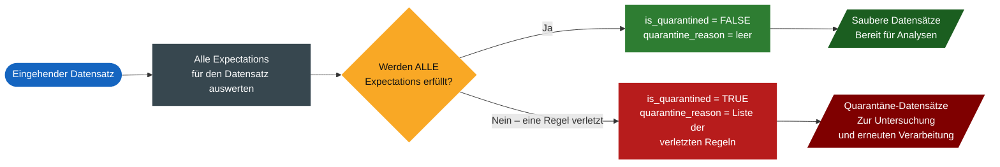

Spark Declarative Pipelines bieten zwar eingebaute Expectations mit drei Verletzungsmodi – **WARN**, **DROP ROW** und **FAIL UPDATE** –, reale Szenarien erfordern jedoch ausgefeiltere Ansätze. Produktions-Pipelines müssen Geschäftsregeln validieren, Schema Evolution souverän handhaben und jeden Datensatz für Audit- und Korrekturzwecke aufbewahren.

## A. Warum fortgeschrittene Qualitäts-Expectations?

### A1. Die Grenzen einfacher Expectations

Eine `NOT NULL`-Prüfung bestätigt, dass ein Feld *vorhanden* ist – aber Vorhandensein allein bedeutet nicht, dass ein Wert *korrekt* ist. Die folgende Tabelle zeigt die Bandbreite an Qualitätsproblemen, die in realen Produktionsdaten auftreten, und ob eine einfache `NOT NULL`-Prüfung sie erkennt.

| Problemtyp | Beispiel | Erkennt NOT NULL es? | Fortgeschrittene Expectation? |
| --- | --- | --- | --- |
| **Numerische Anomalie** | Negative Menge in einer Bestellung | ❌ | ✅ |
| **Zeitliche Inkonsistenz** | Event-Datum auf das Jahr 1970 gesetzt (Systemstandard) | ❌ | ✅ |
| **Bereichsverletzung** | Rabattsatz = 120 % | ❌ | ✅ |
| **Regel für optionale Felder** | Feld darf NULL sein, muss aber, wenn vorhanden, >= 0 sein | ❌ | ✅ |
| **Schema Evolution** | Mitten im Stream hinzugefügte Spalte verletzt bestehende Regeln | ❌ | ✅ |
| **Datenverlust** | Ungültige Datensätze dauerhaft verworfen – kein Audit Trail | ❌ | ✅ |

** Praxisbeispiel:** Ein Feld `discount_rate` mit dem Wert `120` besteht jede `NOT NULL`-Prüfung anstandslos – steht aber für einen unmöglichen Rabatt, der nachgelagerte Umsatzberechnungen unbemerkt verfälscht. Nur ein Bereichs-Constraint wie `discount_rate BETWEEN 0 AND 100` erkennt dies, bevor es nachgelagert weiterfließt.

### A2. Fortgeschrittene Expectation-Muster

Über Constraints auf Zeilenebene hinaus unterstützen Databricks-Expectations eine **tabellenübergreifende Validierung**. Mit diesen Mustern können Sie Zeilenanzahlen überprüfen, fehlende Datensätze erkennen und die Eindeutigkeit von Primärschlüsseln über Datensätze hinweg durchsetzen – und so Probleme erkennen, die Prüfungen einzelner Zeilen nicht sehen können.

**Validierung der Zeilenanzahl**
Prüft, ob die Zeilenanzahlen zweier Tabellen übereinstimmen – nützlich nach Joins, Aggregationen oder einem Pipeline-Fan-out, um sicherzustellen, dass keine Datensätze unbemerkt verworfen wurden.

```sql
CREATE OR REFRESH MATERIALIZED VIEW count_verification (
  CONSTRAINT no_rows_dropped EXPECT (a_count == b_count)
    ON VIOLATION FAIL UPDATE
)
AS SELECT * FROM
  (SELECT COUNT(*) AS a_count FROM table_a),
  (SELECT COUNT(*) AS b_count FROM table_b)
```

**Erkennung fehlender Datensätze**
Verwendet einen LEFT OUTER JOIN, um Datensätze zu identifizieren, die in einer Validierungskopie vorhanden sind, in der Report-Tabelle aber fehlen – und erkennt so Vollständigkeitsfehler, die Prüfungen auf Zeilenebene völlig übersehen.

```sql
CREATE OR REFRESH MATERIALIZED VIEW report_compare_tests (
  CONSTRAINT no_missing_records EXPECT (r_key IS NOT NULL)
    ON VIOLATION FAIL UPDATE
)
AS SELECT v.*, r.key AS r_key
FROM validation_copy v
LEFT OUTER JOIN report r ON v.key = r.key
```

**Eindeutigkeit des Primärschlüssels**
Gruppiert nach dem Primärschlüssel und prüft, ob jede Gruppe genau einen Eintrag hat. Erkennt doppelte Schlüssel, bevor sie nachgelagerte Joins oder Aggregationen verfälschen.

```sql
CREATE OR REFRESH MATERIALIZED VIEW report_pk_tests (
  CONSTRAINT unique_pk EXPECT (num_entries = 1)
    ON VIOLATION FAIL UPDATE
)
AS SELECT pk, COUNT(*) AS num_entries
FROM report
GROUP BY pk
```

**Weitere Details finden Sie in der Dokumentation:**
  [Databricks Expectation Patterns documentation](https://docs.databricks.com/aws/en/ldp/expectation-patterns?language=SQL)

### A3. NULL-tolerante Constraints schreiben

Jeder `CONSTRAINT`-Block sollte **eine einzige logische Regel** validieren. So erhält die Pipeline-UI präzise Kennzahlen pro Constraint. Es gibt jedoch eine kritische Falle: **NULL wird in SQL als NOT TRUE ausgewertet**, daher behandelt eine einfache Bereichsprüfung jeden NULL-Wert als Verletzung.

**Naiv – NULL-Werte werden als Verletzungen behandelt**

```sql
CONSTRAINT valid_discount
EXPECT (
  discount_rate >= 0
  AND discount_rate <= 100
)
-- Jeder NULL-Datensatz wird als Verletzung markiert
```

Nach einer Schema Evolution haben alle historischen Datensätze, die vor der Spalte `discount_rate` entstanden sind, den Wert `NULL` – und jeder einzelne verletzt diesen Constraint, sodass die Pipeline-UI mit falschen Verletzungen überschwemmt wird.

**NULL-tolerant – validiert nur, wenn vorhanden**

```sql
CONSTRAINT valid_discount
EXPECT (
  CASE
    WHEN discount_rate IS NOT NULL
    THEN discount_rate >= 0
         AND discount_rate <= 100
    ELSE TRUE   -- NULL ist zulässig
  END
)
```

NULL-Datensätze bestehen problemlos. Nur Datensätze, bei denen `discount_rate` vorhanden *und* außerhalb des Bereichs ist, werden markiert – so erhalten Sie genaue, rauschfreie Verletzungskennzahlen.

**Faustregel**

Wann immer eine Spalte fehlen kann – weil sie optional ist oder erst nach dem Start der Pipeline hinzugefügt wurde –, umschließen Sie ihren Constraint mit einem Block `'CASE WHEN ... IS NOT NULL THEN ... ELSE TRUE END'`.

## B. Robustes Pipeline-Design

### B1. Alles als STRING ingestieren

Das robusteste Design der Bronze-Schicht **weist niemals einen Datensatz wegen eines Typkonflikts ab**. Indem Sie alle eingehenden Felder als `STRING` speichern, akzeptieren Sie alles, was die Quelle sendet – Ganzzahlen, Dezimalzahlen, gemischte Typen – und verlagern die Durchsetzung der Typen nach Silber, wo `TRY_CAST` Fehler souverän behandelt.

**Bronze – alles akzeptieren**
Alle Felder werden als STRING abgeleitet. Typkonflikte lassen die Pipeline nie fehlschlagen – eine Ganzzahl in einem String-Feld ist einfach ein String.

```sql
CREATE OR REFRESH STREAMING TABLE bronze_events
COMMENT "Bronze: all fields as STRING, schema rescue enabled"
AS SELECT *
FROM STREAM read_files(
  '/path/to/source',
  format => 'json',
  schemaEvolutionMode => 'rescue'
)
```

**Silber – Typen sicher durchsetzen**
`TRY_CAST` gibt bei einem fehlgeschlagenen Cast NULL zurück, anstatt die Pipeline anzuhalten. Das NULL-tolerante Constraint-Muster erledigt dann den Rest.

```sql
CREATE OR REFRESH STREAMING TABLE silver_events (
  CONSTRAINT valid_amount EXPECT (
    CASE WHEN amount IS NOT NULL
    THEN amount >= 0 ELSE TRUE END
  ) ON VIOLATION DROP ROW
)
AS SELECT *,
  TRY_CAST(amount_str AS DOUBLE) AS amount
FROM STREAM bronze_events
```

### B2. Werkzeuge für Schema Evolution in der Bronze-Schicht

Zwei eingebaute Mechanismen decken den gesamten Lebenszyklus von Schemaänderungen ab – `schemaHints` für Spalten, von denen Sie wissen, dass sie kommen, und `_rescued_data` als letzte Verteidigungslinie für alles Unerwartete.

**schemaHints – künftige Spalten schon heute deklarieren**
Deklarieren Sie Spalten, die in *kommenden* Dateien erwartet werden, bevor sie eintreffen. Sobald die neue Spalte erscheint, wird sie automatisch befüllt. Datensätze vor der Schemaänderung enthalten `NULL` – gleichzeitig rückwärts- und vorwärtskompatibel.

```sql
CREATE OR REFRESH STREAMING TABLE bronze_events
AS SELECT *
FROM STREAM read_files(
  '/path/to/source',
  format => 'json',
  schemaHints => 'loyalty_tier STRING, region_code STRING',
)
-- Alte Datensätze: loyalty_tier = NULL (zulässig)
-- Neue Datensätze: loyalty_tier wird automatisch befüllt
```

**_rescued_data – die letzte Verteidigungslinie**
Jedes Feld, das außerhalb des deklarierten Schemas eintrifft – unerwartete Spalten, Typkonflikte –, wird als JSON in `_rescued_data` erfasst. Nichts wird unbemerkt verworfen. Fragen Sie es jederzeit zur Untersuchung oder Wiederherstellung ab.

```sql
-- Gerettete Felder im Nachhinein untersuchen
SELECT
  event_id,
  _rescued_data:unexpected_field  AS unexpected_field,
  _rescued_data:new_column        AS new_column
FROM bronze_events
WHERE _rescued_data IS NOT NULL
```

**⚠️ Kritische Wechselwirkung:** Wenn eine Spalte per Schema Evolution hinzugefügt wird, enthalten alle Datensätze, die *vor* der Schemaänderung ingestiert wurden, für diese Spalte `NULL`. Jeder Constraint für diese Spalte **muss das NULL-tolerante `CASE WHEN`-Muster verwenden** – andernfalls verletzt jeder historische Datensatz den Constraint, was zu zahlreichen falschen Verletzungen in der Pipeline-UI führt.

## C. Das Quarantäne-Muster

### C1. Wie das Quarantäne-Muster funktioniert

Das Quarantäne-Muster leitet jeden eingehenden Datensatz durch eine Qualitätsbewertung und teilt die Ausgabe dann anhand der Ergebnisse in zwei Pfade auf – einen sauberen Pfad für Analysen und einen Quarantäne-Pfad für die Korrektur.

**Zentrale Garantie**: Kein Datensatz wird jemals verworfen

**Mathematische Beziehung**: `Eingehende Datensätze gesamt = saubere Datensätze + Quarantäne-Datensätze`



**⚠️ Die Tabelle zur Qualitätsverfolgung muss immer WARN verwenden**
Wird `DROP ROW` oder `FAIL UPDATE` auf die Tabelle zur Qualitätsverfolgung angewendet, werden ungültige Datensätze entfernt, *bevor* das Quarantäne-Flag berechnet werden kann – und die Garantie „kein Datenverlust“ wird unbemerkt gebrochen. Die Aktion `WARN` wird hier aus nur einem Grund verwendet: um Verletzungskennzahlen pro Constraint in der Pipeline-UI sichtbar zu machen. Die gesamte eigentliche Routing-Logik wird separat über die inverse Logik abgewickelt.

**ℹ️ Warum die Tabelle zur Qualitätsverfolgung nach is_quarantined partitionieren?**
Die Partitionierung der Tabelle zur Qualitätsverfolgung nach der Spalte `is_quarantined` trennt saubere und fehlerhafte Datensätze physisch im Speicher. Die nachgelagerten Abfragen, die die beiden Pfade aufteilen – Filter auf `is_quarantined = FALSE` und `is_quarantined = TRUE` –, profitieren dann vom Partition Pruning und lesen nur die relevante Partition, statt die gesamte Tabelle zu scannen.

### C2. Kein Datenverlust dank inverser Logik

`DROP ROW` löscht ungültige Datensätze dauerhaft – es gibt keinen Weg zur Wiederherstellung. Das **Quarantäne-Muster** verhindert Datenverlust vollständig, indem *jeder* Datensatz in die Tabelle geleitet wird und anschließend ein Flag `is_quarantined` und inverse Logik saubere und fehlerhafte Datensätze in separate nachgelagerte Views aufteilen.

**Schritt 1 – Quarantäne-Tabelle mit inverser Logik**
Alle Datensätze werden mit `WARN` geschrieben – kein Datensatz wird verworfen. Das Flag `is_quarantined` wird über `NOT(alle Regeln)` abgeleitet: Verletzt eine beliebige Regel, wird der Datensatz markiert. `WARN` dient ausschließlich dazu, Kennzahlen pro Constraint in der Pipeline-UI sichtbar zu machen.

```sql
CREATE OR REFRESH STREAMING TABLE trips_quarantine (
  CONSTRAINT valid_distance EXPECT (trip_distance > 0),
  CONSTRAINT valid_fare     EXPECT (fare_amount >= 0),
  CONSTRAINT valid_pax      EXPECT (passenger_count BETWEEN 1 AND 9)
  -- WARN: macht Kennzahlen in der UI sichtbar, keine Datensätze werden verworfen
)
PARTITIONED BY (is_quarantined)
AS SELECT *,
  NOT(
    trip_distance > 0
    AND fare_amount >= 0
    AND passenger_count BETWEEN 1 AND 9
  ) AS is_quarantined
FROM STREAM bronze_trips
```

**Schritt 2 – In saubere und fehlerhafte Views aufteilen**
Zwei Materialized Views filtern auf die Partition `is_quarantined`. Da die Quarantäne-Tabelle **nach `is_quarantined` partitioniert** ist, profitiert jede View von vollständigem Partition Pruning – nur ihre Partition wird gescannt, nicht die gesamte Tabelle.

```sql
-- Saubere Datensätze für nachgelagerte Analysen
CREATE OR REFRESH MATERIALIZED VIEW valid_trips_data
AS SELECT * FROM trips_quarantine
WHERE is_quarantined = FALSE;

-- Fehlerhafte Datensätze, aufbewahrt für Korrektur und Audit
CREATE OR REFRESH MATERIALIZED VIEW invalid_trips_data
AS SELECT * FROM trips_quarantine
WHERE is_quarantined = TRUE;
```

**💡 Warum WARN und nicht DROP ROW auf der Quarantäne-Tabelle?** Würde `DROP ROW` oder `FAIL UPDATE` auf die Quarantäne-Tabelle angewendet, würden ungültige Datensätze entfernt, bevor das Flag `is_quarantined` ausgewertet wird – und das gesamte Muster wäre wirkungslos. `WARN` stellt sicher, dass jeder Datensatz geschrieben und über die Spalte mit inverser Logik korrekt weitergeleitet wird.

### C3. Zwischen DROP ROW und Quarantäne wählen

Beide Strategien setzen Datenqualität durch, unterscheiden sich aber grundlegend darin, was mit ungültigen Datensätzen geschieht. Die richtige Wahl hängt davon ab, ob Ihr Unternehmen einen Audit Trail und die Möglichkeit zur Wiederherstellung benötigt und ob falsche Verletzungen durch Schema Evolution ein Problem darstellen.

|  | DROP ROW | Quarantäne-Muster |
| --- | --- | --- |
| Ungültige Datensätze | Dauerhaft gelöscht | In der Quarantäne-Tabelle aufbewahrt |
| Audit Trail | Keiner | Vollständig – abfragbar |
| Datenwiederherstellung | Nicht möglich | Regel korrigieren → aus der Quarantäne neu weiterleiten |
| Verletzungskennzahlen in der UI | In der Pipeline-UI sichtbar | Kennzahlen pro Constraint über WARN |
| Lese-Performance | Vollständiger Tabellenscan auf sauberen Daten | Partition Pruning auf `is_quarantined` |
| Pipeline-Komplexität | Gering – eine einzige Tabelle | Mittel – Zwischentabelle + 2 Views |
| Am besten für | Nicht kritische Streams mit gut etablierten Regeln | Produktions-Pipelines mit Anforderungen an Compliance, Audit oder Korrektur |

**Empfehlung:** Für produktive Enterprise-Pipelines ist das Quarantäne-Muster der bevorzugte Ansatz. Es bietet keinen Datenverlust, Verletzungskennzahlen pro Constraint in der Pipeline-UI, Lesevorgänge mit Partition Pruning auf sauberen Daten und eine wiederherstellbare Quarantäne-Tabelle für Ursachenanalyse und erneute Verarbeitung – Möglichkeiten, die `DROP ROW` nicht bieten kann.

© 2026 Databricks, Inc. Alle Rechte vorbehalten. Apache, Apache Spark, Spark, das Spark-Logo, Apache Iceberg, Iceberg und das Apache-Iceberg-Logo sind Marken der [Apache Software Foundation](https://www.apache.org/).

[Datenschutzrichtlinie](https://databricks.com/privacy-policy) | [Nutzungsbedingungen](https://databricks.com/terms-of-use) | [Support](https://help.databricks.com/)
