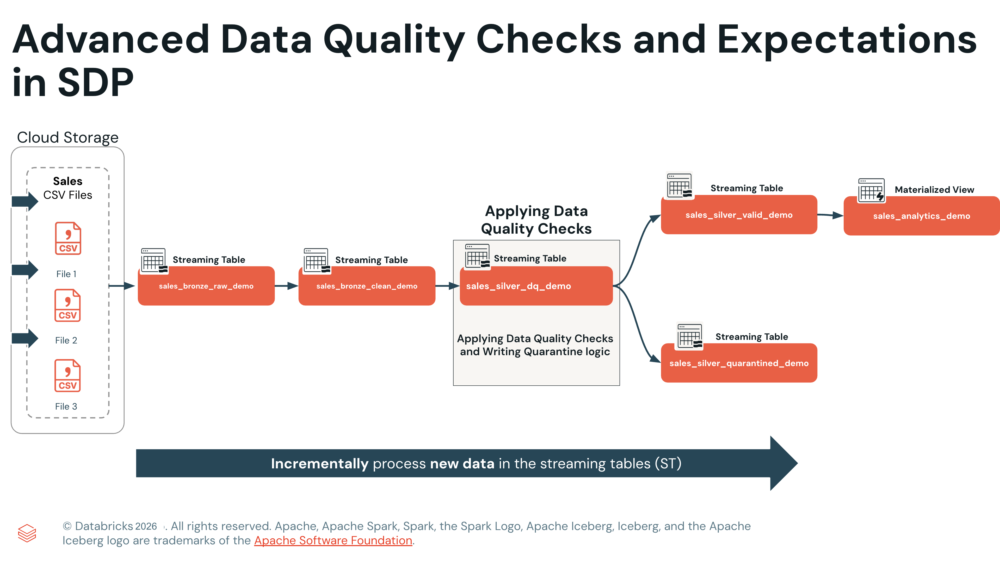
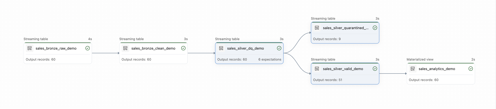

Präsentation eines Datenqualitätsmanagements auf Enterprise-Niveau mit Spark Declarative Pipelines (Lakeflow), fortgeschrittenen Qualitäts-Expectations und Quarantäne-Mustern. 

Die Demo simuliert ein reales Szenario, in dem Bestelldaten mit unterschiedlicher Qualität und sich weiterentwickelnden Schemas eintreffen. Mithilfe offizieller Databricks-Muster verarbeiten Sie diese Daten über Bronze-, Silber- und Gold-Schichten und setzen dabei robuste Qualitätskontrollen um, die Datenanomalien erkennen, Schemaänderungen nahtlos behandeln und durch intelligente Quarantäne-Mechanismen sicherstellen, dass keine Daten verloren gehen.



```python
# Schlüssel-Wert-Paare, die zum Setzen Ihrer Pipeline-Konfigurationsparameter benötigt werden

config_parameters = [
    ('source', f'{my_vol_path}/sales')
]

for key, value in config_parameters:
    print(f"Key: {key}\nValue: {value}\n")
```

```sql
-- bronze_ingestion.sql

------------------------------------------
-- BRONZE-SCHICHT: INGESTION DER ROHDATEN
------------------------------------------
CREATE OR REFRESH STREAMING TABLE dq_1_bronze.sales_bronze_raw_demo
AS
SELECT
-- Zentrale Geschäftsfelder (alle als STRING für Schema-Flexibilität)
CAST(subsidiary_id AS STRING) AS subsidiary_id,
CAST(order_id AS STRING) AS order_id,
CAST(order_timestamp AS STRING) AS order_timestamp,
CAST(customer_id AS STRING) AS customer_id,
CAST(region AS STRING) AS region,
CAST(country AS STRING) AS country,
CAST(city AS STRING) AS city,
CAST(channel AS STRING) AS channel,
CAST(sku AS STRING) AS sku,
CAST(category AS STRING) AS category,
CAST(qty AS STRING) AS qty,
CAST(unit_price AS STRING) AS unit_price,
CAST(discount_pct AS STRING) AS discount_pct,
CAST(coupon_code AS STRING) AS coupon_code,
CAST(total_amount AS STRING) AS total_amount,
CAST(order_date AS STRING) AS order_date,

-- Neue Spalten für die Schema Evolution (anfangs null)
CAST(order_status AS STRING) AS order_status,
CAST(shipping_cost AS STRING) AS shipping_cost,

-- Rescued-Data-Spalte für Parsing-Probleme
CAST(_rescued_data AS STRING) AS _rescued_data,

-- Metadatenspalten für die Nachverfolgung der Lineage
_metadata.file_name AS source_file,
_metadata.file_modification_time AS file_mod_time
FROM STREAM read_files(
'${source}',
format => 'csv',
schemaHints => 'order_status STRING, shipping_cost STRING'
);
```

**Die Designmuster der Bronze-Schicht im Überblick:**

**Strategie für Schema Evolution:**
- **Speicherung als STRING**: Alle Geschäftsspalten werden für maximale Flexibilität und Kompatibilität als STRING gespeichert
- **Vordefiniertes Schema**: Enthält sowohl die ursprünglichen als auch zwei künftige Spalten für eine nahtlose Weiterentwicklung
- **Schema Hints**: Deklariert erwartete neue Spalten (`order_status`, `shipping_cost`), auch wenn sie in den Daten noch nicht vorhanden sind
- **Behandlung von NULL-Werten**: Neue Spalten sind für bestehende Dateien NULL und werden bei künftigen Dateien befüllt

**Data Lineage und Schutz:**
- **Auto Loader**: Die Funktion `read_files` ermöglicht inkrementelle Verarbeitung mit Checkpoint-Verwaltung
- **Erfassung von Metadaten**: Namen der Quelldateien und Änderungszeitstempel für eine vollständige Data Lineage
- **Rescued Data**: Die Spalte `_rescued_data` erfasst Parsing-Probleme zur Untersuchung und Wiederherstellung
- **Parameterreferenz**: `${source}` ermöglicht eine dynamische Pfadkonfiguration

**Technische Vorteile:**
- Keine Änderungen am Pipeline-Code nötig, wenn neue Spalten hinzukommen
- Rückwärtskompatibilität mit bestehenden Datendateien
- Vorwärtskompatibilität mit sich ändernden Geschäftsanforderungen

Weitere Informationen zur Funktion Schema Hints finden Sie in der [Databricks-Dokumentation zu Schema Hints](https://docs.databricks.com/aws/en/ingestion/cloud-object-storage/auto-loader/schema#override-schema-inference-with-schema-hints).

### D2. Bereinigte Bronze-Tabelle erstellen

Erstellen Sie eine Streaming-Zwischentabelle der Bronze-Schicht, die ein sicheres Type Casting der rohen ingestierten Daten durchführt, ohne Qualitätsprüfungen anzuwenden. Dieser Schritt stellt vor der Datenvalidierung eine saubere Typkonvertierung sicher.

- Erstellt eine bereinigte Bronze-Streaming-Table aus dem Quelldatenstrom.
- Verwendet `TRY_CAST`, um Datentypen (Datumswerte, Zahlen) sicher zu konvertieren, ohne bei fehlerhaften Daten fehlzuschlagen.
- Reicht alle Spalten durch, ohne bereits Datenqualitätsfilter anzuwenden.

```sql
--========================================================================
-- BRONZE-SCHICHT: TRANSFORMATIONS-ZWISCHENTABELLE
-- Zweck: Sauberes Type Casting aus Bronze Raw (noch keine Qualitätsprüfungen)
--========================================================================

CREATE OR REFRESH STREAMING TABLE dq_1_bronze.sales_bronze_clean_demo
COMMENT "Intermediate table - type casting only, no quality checks"
AS
SELECT
-- Direktes Durchreichen und sicheres Type Casting
subsidiary_id,
order_id,
TRY_CAST(order_timestamp AS TIMESTAMP) AS order_timestamp,
TRY_CAST(order_date AS DATE) AS order_date,
customer_id,
region,
country,
city,
channel,
sku,
category,
TRY_CAST(qty AS INT) AS qty,
TRY_CAST(unit_price AS DOUBLE) AS unit_price,
TRY_CAST(discount_pct AS DOUBLE) AS discount_pct,
TRY_CAST(total_amount AS DOUBLE) AS total_amount,
coupon_code,
order_status,
TRY_CAST(shipping_cost AS DOUBLE) AS shipping_cost,
source_file

FROM STREAM dq_1_bronze.sales_bronze_raw_demo;
```

### E1. Das Framework der Datenqualitäts-Expectations verstehen

Bevor Sie Tabellen mit Expectations erstellen, sollten Sie das Expectation-Framework verstehen und wissen, warum jede Validierung für die Datenqualität im Unternehmen entscheidend ist.

**Syntax einer Expectation:**
```sql
CONSTRAINT <constraint_name> 
  EXPECT (<condition>) 
  ON VIOLATION <action>
```

**Verfügbare Aktionen bei Verletzungen:**
- **WARN** (Standard): Ungültige Datensätze werden aufgenommen, die Verletzung wird für das Monitoring protokolliert
- **DROP ROW**: Ungültige Datensätze werden von der Zieltabelle ausgeschlossen 
- **FAIL UPDATE**: Die Pipeline stoppt und erfordert manuelles Eingreifen

**Unsere Strategie:** Wir verwenden für alle Expectations **WARN** (Standard), damit die Pipeline weiterläuft und alle Datensätze für die Quarantäne-Analyse erhalten bleiben.

### E2. Das Muster der Quarantäne-Datensätze verstehen

**Quarantäne-Datensätze** in Spark Declarative Pipelines sind Datensätze, die Datenqualitäts-Expectations verletzen und zur Analyse und Korrektur in eine separate Quarantäne-Tabelle geleitet werden. Dieses Enterprise-Muster stellt sicher:

**Vorteile:**
- **Kein Datenverlust**: Ungültige Daten werden zur Prüfung isoliert, statt verworfen zu werden oder Pipeline-Fehler zu verursachen
- **Detaillierte Nachverfolgung**: Metadaten erfassen, welche Expectations für jeden Datensatz verletzt wurden
- **Flexible Workflows**: Ermöglicht Korrekturprozesse, erneute Verarbeitung und Qualitätsverbesserung
- **Audit-Compliance**: Vollständige Aufzeichnung von Datenqualitätsproblemen für regulatorische Anforderungen

**Umsetzungsmuster:**
- **Primärtabelle**: Enthält Expectations mit der Aktion WARN (protokolliert Verletzungen, behält Datensätze)
- **Quarantäne-Logik**: Verwendet inverse Logik (NOT-Bedingung), um fehlerhafte Datensätze zu identifizieren
- **Parallele Verarbeitung**: Gültige und ungültige Datensätze fließen gleichzeitig in separate Tabellen

```sql
-- silver_transformations.sql

-- ========================================================================
-- SILBER-SCHICHT – SCHRITT 1: QUARANTÄNE-TABELLE MIT EXPECTATIONS
-- Zweck: Tabellenstruktur und 6 Datenqualitäts-Expectations definieren
-- ========================================================================

CREATE OR REFRESH STREAMING TABLE dq_2_silver.sales_silver_dq_demo
(
-- Geschäftsspalten mit den richtigen Datentypen
subsidiary_id STRING,
order_id STRING,
order_timestamp TIMESTAMP,
order_date DATE,
customer_id STRING,
region STRING,
country STRING,
city STRING,
channel STRING,
sku STRING,
category STRING,
qty INT,
unit_price DOUBLE,
discount_pct DOUBLE,
total_amount DOUBLE,
coupon_code STRING,
order_status STRING,
shipping_cost DOUBLE,
source_file STRING,

-- Spalten zur Qualitätsverfolgung für die Quarantäne-Analyse
is_quarantined BOOLEAN,
quarantine_reason STRING,

--========================================================================
-- 6 DATENQUALITÄTS-EXPECTATIONS (AKTION WARN FÜR DAS QUARANTÄNE-MUSTER)
--========================================================================

CONSTRAINT check_subsidiary_id
EXPECT (subsidiary_id IS NOT NULL),

CONSTRAINT check_customer_id
EXPECT (customer_id IS NOT NULL),

CONSTRAINT check_sku
EXPECT (sku IS NOT NULL),

CONSTRAINT valid_discount_range
EXPECT (discount_pct IS NULL OR (discount_pct >= 0 AND discount_pct <= 100)),

-- Da die Daten statisch sind, prüfen wir, ob order_date zwischen dem 01.01.2026 und 4 Jahren davor liegt, statt das aktuelle Datum zu verwenden.
CONSTRAINT valid_date_range
EXPECT (order_date IS NULL OR
(order_date >= DATE_SUB(DATE '2026-01-01', 1460) AND
order_date <= DATE '2026-01-01')),

CONSTRAINT valid_shipping_cost EXPECT (
CASE WHEN shipping_cost IS NOT NULL THEN shipping_cost > 0 AND shipping_cost < 100 ELSE TRUE END
)
)
COMMENT "Quarantine table with 6 expectations - supports inverse logic pattern"
TBLPROPERTIES (
'quality.layer' = 'silver_quarantine',
'quality.pattern' = 'inverse_logic'
)
PARTITIONED BY (is_quarantined);
```

**Zusammenfassung der Expectations:**

| # | Name der Expectation | Validiert | Bereich/Regel | Beispiel für eine Verletzung |
|---|-----------------|-----------|------------|---------------------|
| 1 | check_subsidiary_id | Geschäftsschlüssel | NOT NULL | Fehlende Subsidiary-IDs |
| 2 | check_customer_id | Geschäftsschlüssel | NOT NULL | Fehlende Kunden-IDs |
| 3 | check_sku | Geschäftsschlüssel | NOT NULL | Fehlende SKUs |
| 4 | valid_discount_range | Rabatt | 0 %–100 % | discount = -10,73 % oder 120 % |
| 5 | valid_date_range | Datum | Letzte 4 Jahre | date = 1930-12-31 |
| 6 | valid_shipping_cost | Versand | 0–100 $ | shipping_cost = -5 oder 150 |

**Design der Qualitätsverfolgung:**
- **is_quarantined**: Boolesches Flag, das angibt, ob der Datensatz eine Expectation verletzt hat
- **quarantine_reason**: Detaillierter String mit allen fehlgeschlagenen Validierungen zur Korrektur
- **Partitionierung**: Trennt Quarantäne- und gültige Daten zur Performance-Optimierung

**Tabelleneigenschaften:**
- Metadaten-Tags kennzeichnen dies als Umsetzung des Quarantäne-Musters
- Ermöglichen es Monitoring- und Governance-Tools, das Qualitäts-Framework zu erkennen

### E5. Einen Flow mit inverser Logik zum Befüllen der Quarantäne erstellen

Fügen Sie den Flow mit inverser Logik hinzu, um die Quarantäne-Tabelle mit Informationen zur Qualitätsverfolgung zu befüllen. Dieser Flow setzt das offizielle Databricks-Quarantäne-Muster um, indem er mithilfe inverser Logik Datensätze identifiziert und markiert, die eine Qualitäts-Expectation verletzen.

```sql
--========================================================================
-- SILBER-SCHICHT – SCHRITT 2: FLOW ZUR ANWENDUNG DER INVERSEN LOGIK
-- Zweck: Flag is_quarantined berechnen und die Quarantäne-Tabelle befüllen
--========================================================================

CREATE FLOW apply_inverse_logic_flow
AS
INSERT INTO dq_2_silver.sales_silver_dq_demo BY NAME
SELECT
-- Alle Geschäftsspalten durchreichen
subsidiary_id,
order_id,
order_timestamp,
order_date,
customer_id,
region,
country,
city,
channel,
sku,
category,
qty,
unit_price,
discount_pct,
total_amount,
coupon_code,
order_status,
shipping_cost,
source_file,

--========================================================================
-- INVERSE LOGIK: Als Quarantäne markieren, wenn EINE Expectation verletzt wird
--========================================================================
NOT (
(subsidiary_id IS NOT NULL) AND
(customer_id IS NOT NULL) AND
(sku IS NOT NULL) AND
(discount_pct IS NULL OR (discount_pct >= 0 AND discount_pct <= 100)) AND
(order_date IS NULL OR
(order_date >= DATE_SUB(DATE '2026-01-01', 1460) AND
order_date <= DATE '2026-01-01')) AND
(shipping_cost IS NULL OR (shipping_cost > 0 AND shipping_cost < 100))
) AS is_quarantined,

--========================================================================
-- DETAILLIERTEN STRING MIT DEM QUARANTÄNE-GRUND AUFBAUEN
--========================================================================
CONCAT_WS('; ',
CASE WHEN subsidiary_id IS NULL
THEN 'Missing subsidiary_id' END,
CASE WHEN customer_id IS NULL
THEN 'Missing customer_id' END,
CASE WHEN sku IS NULL
THEN 'Missing sku' END,
CASE WHEN discount_pct IS NOT NULL AND (discount_pct < 0 OR discount_pct > 100)
THEN 'Invalid discount_pct (must be 0-100)' END,
CASE WHEN order_date IS NOT NULL AND
(order_date < DATE_SUB(DATE '2026-01-01', 1460) OR order_date > DATE '2026-01-01')
THEN 'Invalid order_date (outside 4-year range)' END,
CASE WHEN shipping_cost IS NOT NULL AND (shipping_cost <= 0 OR shipping_cost >= 100)
THEN 'Invalid shipping_cost (must be 0-100)' END
) AS quarantine_reason

FROM STREAM dq_1_bronze.sales_bronze_clean_demo;
```

**Die Umsetzung der inversen Logik im Überblick:**

**Logik des Quarantäne-Flags:**
- **NOT()**-Wrapper um alle Expectations, kombiniert mit AND-Logik
- Wird EINE Expectation verletzt, wird der Datensatz mit `is_quarantined = TRUE` markiert
- Werden ALLE Expectations erfüllt, wird der Datensatz mit `is_quarantined = FALSE` markiert

**Detaillierte Nachverfolgung von Fehlern:**
- **CONCAT_WS()** erstellt durch Semikolons getrennte Fehlergründe
- Jede CASE-Anweisung prüft auf bestimmte Verletzungstypen
- Liefert umsetzbare Informationen für Teams, die Daten korrigieren
- Leerer String für Datensätze, die alle Validierungen bestehen

**Vorteile des Streaming-Flows:**
- Verarbeitet Datensätze kontinuierlich, sobald sie eintreffen
- Hält die Latenz für eine Qualitätsüberwachung in Echtzeit gering
- Ermöglicht eine sofortige Identifizierung von Quarantäne-Datensätzen für operative Workflows

### E6. Separate Tabellen für gültige und Quarantäne-Datensätze erstellen

Erstellen Sie separate Tabellen für gültige und Quarantäne-Datensätze, um Datenverlust zu vermeiden und parallele Verarbeitungs-Workflows zu ermöglichen. Fügen Sie diesen Code zu Ihrer Datei `silver_transformations.sql` hinzu.

```sql
--========================================================================
-- SILBER-SCHICHT – SCHRITT 3: GÜLTIGE UND UNGÜLTIGE DATENPFADE TRENNEN
--========================================================================

--========================================================================
-- PFAD FÜR GÜLTIGE DATENSÄTZE – saubere Daten für Analysen
--========================================================================

CREATE OR REFRESH STREAMING TABLE dq_2_silver.sales_silver_valid_demo
COMMENT "Clean records passing all 6 quality checks - ready for analytics"
AS
SELECT * EXCEPT (is_quarantined, quarantine_reason)
FROM STREAM dq_2_silver.sales_silver_dq_demo
WHERE is_quarantined = FALSE;

--========================================================================
-- PFAD FÜR QUARANTÄNE-DATENSÄTZE – ungültige Daten zur Korrektur
--========================================================================

CREATE OR REFRESH STREAMING TABLE dq_2_silver.sales_silver_quarantined_demo
COMMENT "Invalid records with quality violations - requires remediation"
AS
SELECT *
FROM STREAM dq_2_silver.sales_silver_dq_demo
WHERE is_quarantined = TRUE;
```

**Die Umsetzung des offiziellen Quarantäne-Musters im Überblick:**

**Architektur ohne Datenverlust:**
- **Quelltabelle**: Enthält Expectations mit der Aktion WARN (protokolliert Verletzungen, behält alle Datensätze)
- **Gültiger Pfad**: Datensätze mit `is_quarantined = FALSE` (alle Qualitätsprüfungen bestanden)
- **Quarantäne-Pfad**: Datensätze mit `is_quarantined = TRUE` (eine oder mehrere Prüfungen nicht bestanden)
- **Mathematische Garantie**: Datensätze gesamt = gültige Datensätze + Quarantäne-Datensätze

**Vorteile der parallelen Verarbeitung:**
- **Analyse-Workflow**: Nutzt nur validierte, saubere Daten aus `sales_silver_valid_demo`
- **Korrektur-Workflow**: Verarbeitet Quarantäne-Daten mit detaillierten Fehlerinformationen
- **Monitoring-Workflow**: Verfolgt Qualitätskennzahlen über beide Streams hinweg
- **Performance-Optimierung**: Separate Tabellen ermöglichen unabhängige Skalierung und Optimierung

## F. Die Gold-Schicht erstellen – produktionsreife Analysedaten

Die Gold-Schicht enthält vorab aggregierte Analysen aus validierten Silber-Daten und bietet eine schnelle Abfrage-Performance für Business-Intelligence- und Reporting-Anwendungen.

### F1. Die Analysetabelle der Gold-Schicht erstellen

1. Wählen Sie in Ihrem Ordner **dq_pipeline** das Kebab-Menü und dann **Create File**
2. Wählen Sie als Sprache **SQL**
3. Benennen Sie die Datei `gold_analytics.sql`
4. Kopieren Sie den folgenden Code und fügen Sie ihn ein

```sql
--========================================================================
-- GOLD-SCHICHT: MATERIALIZED VIEW FÜR BUSINESS-ANALYSEN
--========================================================================

CREATE OR REFRESH MATERIALIZED VIEW dq_3_gold.sales_analytics_demo
COMMENT "Business metrics aggregated from validated sales data"
AS
SELECT
region,
country,
category,
COUNT(DISTINCT order_id) AS total_orders,
COUNT(DISTINCT customer_id) AS unique_customers,
SUM(qty) AS total_quantity_sold,
ROUND(SUM(total_amount), 2) AS total_revenue,
ROUND(AVG(total_amount), 2) AS avg_order_value,
ROUND(AVG(discount_pct), 2) AS avg_discount_pct,
MIN(order_date) AS earliest_order_date,
MAX(order_date) AS latest_order_date,
CURRENT_TIMESTAMP() AS last_refreshed_at
FROM dq_2_silver.sales_silver_valid_demo
GROUP BY region, country, category;
```

**Das Design der Gold-Schicht für Analysen im Überblick:**

**Warum Materialized Views für die Gold-Schicht?**
- **Vorab berechnete Aggregationen**: Vermeiden teure GROUP-BY-Operationen zur Abfragezeit
- **Automatische Aktualisierung**: Werden aktualisiert, wenn sich die zugrunde liegenden Silber-Daten ändern
- **Speicherung in Delta Lake**: Bietet ACID-Garantien und Time-Travel-Funktionen
- **Optimierung für BI-Tools**: Ideal für Dashboards, die schnelle Antwortzeiten erfordern

**Bereitgestellte Geschäftskennzahlen:**
- **Umsatzanalysen**: Gesamtumsatz und durchschnittlicher Bestellwert nach Region und Kategorie
- **Kundeneinblicke**: Anzahl eindeutiger Kunden und Kaufmuster
- **Produkt-Performance**: Verkaufte Menge und Rabattwirkung nach Kategorie
- **Zeitliche Analyse**: Zeiträume der Bestelldaten für Trendanalysen
- **Aktualität der Daten**: Zeitstempel der letzten Aktualisierung für das Monitoring

**Unterstützung von Analyse-Workflows:**
- **BI-Dashboards**: Vorab aggregierte Gold-Views für schnelle Performance abfragen
- **Data Science**: Auf detaillierte, validierte Silber-Tabellen für die Modellierung zugreifen
- **Operations-Teams**: Quarantäne-Tabellen zur Korrektur der Datenqualität überwachen
- **Management-Reporting**: Gold-Kennzahlen für strategische Entscheidungen nutzen

## G. Pipeline-Ergebnisse ausführen und analysieren – erster Lauf (saubere Basislinie)

Führen Sie die vollständige Pipeline aus und analysieren Sie die Ergebnisse, um zu bestätigen, dass das Qualitäts-Framework saubere Basisdaten korrekt verarbeitet.

### G1. Die vollständige Pipeline ausführen

1. **Führen Sie die Pipeline aus** und bestätigen Sie, dass sie ohne Fehler erfolgreich abgeschlossen wird
2. **Beobachten Sie den Pipeline-Graphen**, um zu sehen, wie die Daten durch alle Schichten fließen: Bronze → Silber → Gold
3. **Überwachen Sie Ausführungszeit** und Ressourcennutzung in der Pipeline-UI

**Fehlerbehebung:** Wenn Ihre Pipeline fehlschlägt, prüfen Sie Folgendes:
- Alle SQL-Dateien sind korrekt im Ordner `dq_pipeline` erstellt
- Die Konfigurationsparameter sind korrekt gesetzt
- Serverless Compute ist ausgewählt und läuft
- Die Volume-Pfade sind zugänglich und enthalten Datendateien

**Erwarteter Pipeline-Graph:**


### G2. Ergebnisse des ersten Laufs validieren – saubere Basislinie

Überprüfen Sie die Pipeline-Ausführung, um zu bestätigen, dass alle Datenqualitätsprüfungen bestanden wurden und die Pipeline eine perfekte Basislinie geschaffen hat. Dieser Lauf zeigt, dass das Pipeline-Framework saubere Daten korrekt ingestiert, transformiert und validiert.

**Erwartete Ergebnisse für Lauf 1 (saubere Basislinie):**

| Tabelle | Erwartete Datensätze | Qualitätsstatus | Hinweise |
|-------|------------------|----------------|-------|
| Bronze (sales_bronze_raw_demo) | 157 | Alle ingestiert | Rohdaten aus sales_1.csv |
| Silber (sales_bronze_clean_demo) | 157 | Type Casting erfolgreich | Alle Konvertierungen erfolgreich |
| Silber (sales_silver_dq_demo) | 157 | Alle verfolgt | Alle Datensätze mit is_quarantined = FALSE |
| Silber (sales_silver_valid_demo) | 157 | 100 % Qualität | Perfekte Basislinie geschaffen |
| Silber (sales_silver_quarantined_demo) | 0 | Keine Verletzungen | Qualitäts-Framework validiert |
| Gold (sales_analytics_demo) | ~55 | Aggregiert | Geschäftskennzahlen nach Region/Kategorie |

**Validierungsschritte in der Pipeline-UI:**
1. Wählen Sie die Tabelle **sales_silver_dq_demo** und öffnen Sie den Tab **Expectations**, um „6 constraints tracked“ zu überprüfen
2. Öffnen Sie den Tab **Data**, um zu bestätigen, dass alle Datensätze `is_quarantined = FALSE` haben
3. Prüfen Sie die Tabelle **sales_silver_quarantined_demo**, um sicherzustellen, dass sie 0 Datensätze enthält
4. Überprüfen Sie, dass die Gold-Tabelle **sales_analytics_demo** aggregierte Geschäftskennzahlen enthält

### G3. Ergebnisse abfragen und analysieren

Führen Sie die folgenden Abfragen aus, um die Ergebnisse der Silber- und Gold-Schicht zu überprüfen:
- Die Anzahl der Datensätze in **sales_silver_quarantined_demo** sollte null sein
- Der Quality Score sollte **100 %** betragen
- Abfrage der MV **sales_analytics_demo** für Erkenntnisse

```sql
%sql
-- Prüfen, dass die Quarantäne für Lauf 1 leer ist (sollte 0 zurückgeben – perfekte Qualitätsbasislinie)
SELECT 
  COUNT(*) AS quarantined_count,
  'Expected: 0 records for clean baseline' AS validation_note
FROM dq_2_silver.sales_silver_quarantined_demo;
```

```sql
%sql
-- Prüfen, dass alle Datensätze die Qualitätsprüfungen bestanden haben
SELECT 
  COUNT(*) AS total_records,
  SUM(CASE WHEN is_quarantined = FALSE THEN 1 ELSE 0 END) AS valid_records,
  SUM(CASE WHEN is_quarantined = TRUE THEN 1 ELSE 0 END) AS quarantined_records,
  ROUND(SUM(CASE WHEN is_quarantined = FALSE THEN 1 ELSE 0 END) * 100.0 / COUNT(*), 2) AS quality_score_pct
FROM dq_2_silver.sales_silver_dq_demo;
```

```sql
%sql
-- Die Materialized View sales_analytics abfragen
SELECT * FROM dq_3_gold.sales_analytics_demo
LIMIT 10;
```

**Validierungs-Checkpoint Lauf 1 – erwartete Ergebnisse:**
- **Bronze-Schicht**: 157 Datensätze aus sales_1.csv erfolgreich ingestiert
- **Silber-Transformation**: 157 Datensätze ohne Konvertierungsfehler erfolgreich gecastet
- **Qualitätsvalidierung**: 157 Datensätze erfüllen alle 6 Expectations (Quality Score 100 %)
- **Quarantäne-Status**: 0 Datensätze in Quarantäne (perfekte Basislinie geschaffen)
- **Gold-Analysen**: Die aggregierten Geschäftskennzahlen sollten 55 validierte Datensätze umfassen

## H. Zweiten Lauf vorbereiten und ausführen – Qualitätsprobleme und Schema Evolution

Bringen Sie die zweite Datendatei mit Qualitätsproblemen und neuen Schemaspalten ein, um die Robustheit und die Monitoring-Fähigkeiten der Pipeline zu demonstrieren.

### H1. Weitere Dateien zur Verarbeitung kopieren

Kopieren Sie die zweite Datei vom Operations-Speicherort an den Speicherort für die Verkaufsverarbeitung, um eine inkrementelle Verarbeitung mit Qualitätsproblemen und Schema Evolution auszulösen.

```python
ops_path = f'/Volumes/{my_catalog}/dq_1_bronze/ops'
sales_path = f'/Volumes/{my_catalog}/dq_1_bronze/sales'

# Dateien vom Ops-Speicherort in das Quell-Volume des Benutzers kopieren (jetzt einschließlich sales_2.csv)
copy_files(copy_from=ops_path, copy_to=sales_path, n=2)
```

### H2. Die Verfügbarkeit der Datei für die Verarbeitung prüfen

Bestätigen Sie, dass `sales_2.csv` erfolgreich an den Quellspeicherort für die Verarbeitung verschoben wurde und bereit für die Pipeline ist.

```python
spark.sql(f"LIST '{sales_path}'").display()
```

### H3. Pipeline-Lauf 2 ausführen – Qualitätsprobleme und Schema Evolution

1. **Führen Sie die Pipeline erneut aus** und bestätigen Sie, dass sie trotz Qualitätsproblemen erfolgreich abgeschlossen wird
2. **Beobachten Sie die inkrementelle Verarbeitung**, während die Pipeline die neue Datei erkennt und verarbeitet
3. **Überwachen Sie die Qualitätskennzahlen** in der Pipeline-UI, um zu sehen, wie Verletzungen von Expectations nachverfolgt werden

**Erwartetes Verhalten:**
- Die Pipeline läuft trotz Qualitätsverletzungen weiter (Aktion WARN)
- Neue Spalten werden automatisch übernommen (Schema Evolution)
- Ungültige Datensätze werden systematisch mit detaillierten Fehlergründen in Quarantäne gestellt
- Gültige Datensätze fließen weiter in die Analysetabellen

**Erwartete Pipeline-Ergebnisse:**



### H4. Ergebnisse von Lauf 2 analysieren – erkannte Qualitätsprobleme

Überprüfen Sie die Pipeline-Ausführung, um zu sehen, wie Qualitätsprobleme und Schema Evolution vom Quarantäne-Framework erfolgreich behandelt wurden.

**Erwartete Ergebnisse für Lauf 2 (inkrementell mit Problemen):**

| Tabelle | Neue Datensätze | Datensätze gesamt | Hinweise zur Qualität |
|-------|-------------|---------------|---------------|
| Bronze (sales_bronze_raw_demo) | +60 | 217 | Schema weiterentwickelt! (2 neue Spalten befüllt) |
| Bronze (sales_bronze_clean_demo) | +60 | 217 | Type Casting für alle Datensätze erfolgreich |
| Silber (sales_silver_dq_demo) | +60 | 217 | Alle Datensätze mit Qualitäts-Flags verfolgt |
| Silber (sales_silver_valid_demo) | +51 | 208 | 9 Datensätze haben Expectations verletzt |
| Silber (sales_silver_quarantined_demo) | +9 | 9 | Ungültige Datensätze mit Fehlerdetails erfasst |
| Gold (sales_analytics_demo) | Aktualisiert | ~60 | Kennzahlen mit neuen gültigen Daten aktualisiert |

**Wichtige Validierungspunkte:**
1. **Kein Datenverlust**: Bronze (217) = gültig (208) + Quarantäne (9)
2. **Schema Evolution**: Neue Spalten automatisch befüllt
3. **Qualitätserkennung**: Konkrete Verletzungen identifiziert und in Quarantäne gestellt
4. **Robustheit der Pipeline**: Verarbeitet trotz Qualitätsproblemen weiter

### H5. Umfassende Qualitätsanalyse

Führen Sie detaillierte Analyseabfragen aus, um die Qualitätsmuster zu verstehen und die Wirksamkeit des Quarantäne-Frameworks zu validieren.

```sql
%sql
-- Gesamte Qualitätskennzahlen und Überprüfung „kein Datenverlust“
WITH quality_stats AS (
  SELECT 
    (SELECT COUNT(*) FROM dq_1_bronze.sales_bronze_raw_demo) AS total_ingested,
    (SELECT COUNT(*) FROM dq_2_silver.sales_silver_valid_demo) AS total_valid,
    (SELECT COUNT(*) FROM dq_2_silver.sales_silver_quarantined_demo) AS total_quarantined
)
SELECT 
  total_ingested,
  total_valid,
  total_quarantined,
  ROUND(total_valid * 100.0 / total_ingested, 2) AS quality_score_pct,
  ROUND(total_quarantined * 100.0 / total_ingested, 2) AS failure_rate_pct,
  CASE WHEN total_ingested = total_valid + total_quarantined 
       THEN '✅ ZERO DATA LOSS VERIFIED' 
       ELSE '❌ DATA LOSS DETECTED' 
  END AS data_loss_check
FROM quality_stats;
```

```sql
%sql
-- Konkrete Quarantäne-Datensätze mit detaillierten Fehlergründen analysieren
SELECT 
  order_id,
  customer_id,
  discount_pct,
  order_date,
  shipping_cost,
  source_file,
  quarantine_reason
FROM dq_2_silver.sales_silver_quarantined_demo
ORDER BY quarantine_reason, order_id;
```

**Erkenntnisse aus der Qualitätsanalyse:**
- **Kein Datenverlust erreicht**: Mathematische Überprüfung, dass keine Datensätze verloren gingen
- **Hoher Quality Score**: Typischerweise 94–96 % Gesamtqualität über beide Dateien
- **Detaillierte Fehlerverfolgung**: Jeder Quarantäne-Datensatz enthält konkrete Verletzungsgründe
- **Umsetzbare Erkenntnisse**: Operations-Teams können die Korrektur nach Fehlertyp priorisieren
- **Wirksamkeit der Bereichsvalidierung**: Rabatte > 100 %, negative Werte und historische Datumswerte wurden erfolgreich erkannt
- **Schutz der Geschäftsschlüssel**: Datensätze mit fehlenden kritischen Kennungen wurden identifiziert und in Quarantäne gestellt

### H6. Erfolg der Schema Evolution validieren

Überprüfen Sie, dass die Schema Evolution nahtlos und ohne Änderungen am Pipeline-Code funktioniert hat. Beachten Sie, dass Datensätze aus der ersten Datei für die neuen Spalten (**shipping_cost** und **order_status**) Nullwerte haben, während Datensätze aus der zweiten Datei befüllte Werte haben.

```sql
%sql
SELECT *
FROM dq_2_silver.sales_silver_valid_demo LIMIT 10;
```

**Validierung des Erfolgs der Schema Evolution:**
- **Nahtlose Weiterentwicklung**: Das Schema wuchs ohne Änderungen am Pipeline-Code von 16 auf 18 zentrale Geschäftsspalten
- **Rückwärtskompatibilität**: Datensätze aus Datei 1 behalten NULL-Werte für die neuen Spalten
- **Vorwärtskompatibilität**: Datensätze aus Datei 2 befüllen die neuen Spalten mit Geschäftswerten
- **Keine Unterbrechung der Pipeline**: Schema Hints ermöglichten das reibungslose Hinzufügen von Spalten
- **Zusätzlicher Geschäftswert**: Neue Spalten ermöglichen die Nachverfolgung des Bestellstatus und die Analyse der Versandkosten
- **Erweiterung des Qualitäts-Frameworks**: Neue Spalten werden automatisch in die Qualitätsvalidierungen einbezogen

### H7. Qualitäts-Performance nach Quelldatei

Analysieren Sie die Unterschiede in der Qualitäts-Performance zwischen der sauberen Basisdatei und der Datei mit absichtlichen Qualitätsproblemen.

```sql
%sql
-- Analyse des Quality Score nach Quelldatei
SELECT 
  COALESCE(b.source_file, q.source_file) AS source_file,
  COUNT(DISTINCT COALESCE(b.order_id, q.order_id)) AS total_records,
  COUNT(DISTINCT s.order_id) AS valid_records,
  COUNT(DISTINCT q.order_id) AS quarantined_records,
  ROUND(COUNT(DISTINCT s.order_id) * 100.0 / 
        NULLIF(COUNT(DISTINCT COALESCE(b.order_id, q.order_id)), 0), 2) AS quality_score_pct,
  CASE 
    WHEN COALESCE(b.source_file, q.source_file) LIKE '%sales_1%' THEN 'Clean baseline data'
    WHEN COALESCE(b.source_file, q.source_file) LIKE '%sales_2%' THEN 'Quality issues + schema evolution'
    ELSE 'Unknown file pattern'
  END AS file_profile
FROM dq_1_bronze.sales_bronze_raw_demo b
FULL OUTER JOIN dq_2_silver.sales_silver_valid_demo s 
  ON b.order_id = s.order_id
FULL OUTER JOIN dq_2_silver.sales_silver_quarantined_demo q 
  ON COALESCE(b.order_id, s.order_id) = q.order_id
GROUP BY COALESCE(b.source_file, q.source_file)
ORDER BY source_file;
```

**Erkenntnisse zur Qualitäts-Performance auf Dateiebene:**
- **Datei 1 (Basislinie)**: Ein Quality Score von 100 % bestätigt die Korrektheit des Frameworks
- **Datei 2 (Probleme)**: Ein Quality Score von 85 % zeigt die Fähigkeit, Probleme zu erkennen
- **Gesamt-Performance**: Ein kombinierter Quality Score von 95,85 % zeigt Datenqualität auf Enterprise-Niveau
- **Validierung des Frameworks**: Saubere Daten bestehen vollständig, problematische Daten werden systematisch identifiziert
- **Produktionsreife**: Das Qualitäts-Framework bewältigt sowohl perfekte als auch fehlerhafte Datenszenarien erfolgreich

## J. Zusammenfassung und wichtigste Erkenntnisse

**Datenqualitätsmanagement:**
- 6 umfassende Datenqualitäts-Expectations für Geschäftsschlüssel, numerische Bereiche und zeitliche Validierungen erfolgreich umgesetzt
- Quality Score von 100 % bei sauberen Basisdaten erreicht (Lauf 1: 157/157 Datensätze)
- 9 Qualitätsverletzungen in problematischen Daten erkannt und in Quarantäne gestellt (Lauf 2: 51/60 Datensätze bestanden)
- Gesamter Quality Score der Pipeline: 95,85 % (208/217 verarbeitete Datensätze)

**Schema Evolution:**
- Schema Evolution von 16 auf 18 zentrale Geschäftsspalten aus der Quelle nahtlos und ohne Änderungen am Pipeline-Code bewältigt
- Die STRING-Strategie der Bronze-Schicht ermöglichte Rückwärtskompatibilität und Vorwärtsflexibilität
- Neue Geschäftsspalten (**order_status, shipping_cost**) automatisch integriert

**Quarantäne ohne Datenverlust:**
- Das offizielle Databricks-Muster mit inverser Logik für die Quarantäne-Verarbeitung umgesetzt
- Mathematisch belegt kein Datenverlust: Bronze-Datensätze = gültige Verkaufsdatensätze + Quarantäne-Verkaufsdatensätze
- Detaillierte Fehleranalysen und Korrekturhinweise für jeden Quarantäne-Datensatz bereitgestellt

### Produktionsreife

Diese Demonstration hat Muster auf Enterprise-Niveau gezeigt, die Folgendes bieten:
- **Robuste Datenqualitätskontrollen**, die Anomalien erkennen, bevor sie in die Analysen gelangen
- **Flexible Schemabehandlung**, die sich an sich ändernde Geschäftsanforderungen anpasst
- **Vollständige Data Lineage** ohne Datenverlust und mit vollständigen Audit-Möglichkeiten
- **Umsetzbare Qualitätserkenntnisse** für die kontinuierliche Verbesserung der Daten

© 2026 Databricks, Inc. Alle Rechte vorbehalten. Apache, Apache Spark, Spark, das Spark-Logo, Apache Iceberg, Iceberg und das Apache-Iceberg-Logo sind Marken der [Apache Software Foundation](https://www.apache.org/).

[Datenschutzrichtlinie](https://databricks.com/privacy-policy) | [Nutzungsbedingungen](https://databricks.com/terms-of-use) | [Support](https://help.databricks.com/)
