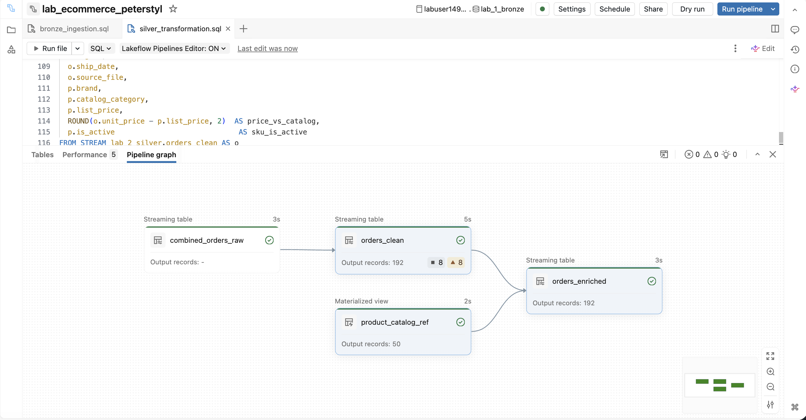
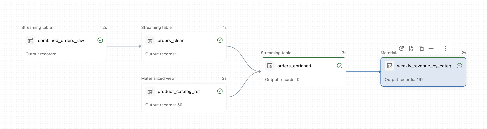
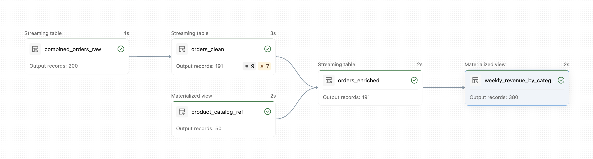

## Lab-Szenario

Sie sind Data Engineer bei einem E-Commerce-Unternehmen, das Bestellungen über zwei Kanäle erhält: seine Website und seine mobile App. Diese Kanäle speichern Daten in unterschiedlichen Formaten und erfassen Bestellinformationen teils ähnlich, teils unterschiedlich. Ihre Aufgabe ist es, mit Spark Declarative Pipelines eine Streaming-Daten-Pipeline zu bauen, die Daten aus diesen verschiedenen Kanälen verarbeitet und wöchentliche Umsatzberichte für fachliche Stakeholder erzeugt.

```python
# Schlüssel-Wert-Paare, die zum Setzen Ihrer Pipeline-Konfigurationsparameter benötigt werden

config_parameters = [
    ("web_orders_source",      f"{my_vol_path}/web_orders"),
    ("app_orders_source",      f"{my_vol_path}/app_orders"),
    ("product_catalog_source", f"{my_vol_path}/ops"),
]

print("=" * 65)
print("  Add these as Configuration Parameters in your Pipeline:")
print("=" * 65)
for key, value in config_parameters:
    print(f"  Key  : {key}")
    print(f"  Value: {value}")
    print()
```

2. Kopieren Sie die obigen Pfade und fügen Sie jeden als Konfigurationsparameter in Ihrer **Spark Declarative Pipeline** hinzu.

So kann Ihre Pipeline jedes Volume über Parameter referenzieren.

1. Wählen Sie in Ihrem Pipeline-Tab **Settings**  

2. Wählen Sie unter **Configuration** die Option **Add configuration**

3. Geben Sie für jeden **Key** den oben angezeigten Schlüsselnamen ein  

4. Geben Sie für jeden **Value** den entsprechenden Volume-Pfad ein  

5. Wählen Sie **Save**

**HINWEIS:** Weitere Details zu Konfigurationsparametern finden Sie in der Databricks-Dokumentation: [Use parameters with Apache Spark™ Declarative Pipelines](https://docs.databricks.com/aws/en/ldp/parameters)

## D. Bronze-Schicht – Multi-Flow-Ingestion

Wir haben Bestelldaten aus zwei Quellen: **Web und App**. Die Bronze-Schicht verwendet Multi-Flow-Ingestion, um die Daten beider Quellen in einer einheitlichen Tabelle zusammenzuführen.

Um die Bronze-Schicht aufzubauen, führen Sie diese drei Schritte aus:
1. Eine Bronze-Tabelle erstellen, die Daten aus beiden Quellen aufnehmen kann.
2. Einen Flow für die Web-Bestelldaten erstellen.
3. Einen Flow für die App-Bestelldaten erstellen.

### D1. Das Multi-Flow-Design verstehen

Beide Kanäle teilen die zentralen Bestellspalten, unterscheiden sich aber in kanalspezifischen Metadaten:

| Spalte | Web-CSV | App-JSON | Behandlung in Bronze |
|--------|---------|----------|----------------|
| **order_id**, **customer_id**, **sku** | Ja | Ja | Beide Flows |
**discount_code** | Ja | Ja | Schema Hint angewendet |
**browser**, **session_id** | Ja | Nein | Nur Web; NULL für App |
**app_version**, **device_model** | Nein | Ja | Nur App; NULL für Web |

### D2. Die Bronze-Tabelle erstellen

Erstellen Sie mit `CREATE OR REPLACE STREAMING TABLE` eine **Bronze**-Streaming-Table, die als einzige Landing-Tabelle für Rohdaten sowohl der Web- als auch der App-Bestellungen dient.

**Anforderungen:**
- Erstellen Sie die Tabelle im Schema **lab_1_bronze** und nennen Sie sie **combined_orders_raw**.  
- Nehmen Sie auf:
  - Alle gemeinsamen Spalten.
  - Quellenspezifische Spalten.  
  - Zukunftsgerichtete Spalten, die in den aktuellen Dateien möglicherweise noch nicht existieren (`discount_code`).  
- Fügen Sie Metadatenspalten hinzu:
  - **source_file** (Dateipfad oder logischer Quellname)  
  - **file_mod_time** (`TIMESTAMP`)  
  - **ingestion_time** (`TIMESTAMP`)  
- Verwenden Sie `STRING` für alle Geschäftsspalten und `TIMESTAMP` nur für die Zeit-Metadatenspalten.   
- Setzen Sie in `TBLPROPERTIES` `pipelines.reset.allowed = false`.  

```sql
----------------------------------------------------------------
-- SCHRITT 1: Die einheitliche Bronze-Streaming-Table definieren
-- Alle Geschäftsspalten werden für Schema-Flexibilität als STRING gespeichert.
-- ----------------------------------------------------------------
CREATE OR REPLACE STREAMING TABLE lab_1_bronze.combined_orders_raw
(
order_id          STRING,
order_date        STRING,
customer_id       STRING,
sku               STRING,
model             STRING,
category          STRING,
order_type        STRING,
channel           STRING,
quantity          STRING,
unit_price        STRING,
discount_code     STRING,
discount_amount   STRING,
total_amount      STRING,
payment_method    STRING,
order_status      STRING,
city              STRING,
region            STRING,
ship_date         STRING,
browser           STRING,
session_id        STRING,
os                STRING,
app_version       STRING,
device_model      STRING,
source_file       STRING,
file_mod_time     TIMESTAMP,
ingestion_time    TIMESTAMP
)
COMMENT "Unified Bronze streaming table - web and app orders combined via multi-flow ingestion."
TBLPROPERTIES (
'pipelines.reset.allowed' = false
);
```

### D3. Flows für jede Quelle erstellen

Da unsere Bronze-Tabelle nun bereit ist, erstellen wir zwei Flows: einen für App-Bestellungen und einen für Web-Bestellungen. Jeder Flow ingestiert Daten in unsere Bronze-Streaming-Table.

- Erstellen Sie einen Flow, der **JSON**-App-Bestellungen mit `read_files` ingestiert.
- Casten Sie alle Geschäftsfelder für Schema-Flexibilität in `STRING`.
- Fügen Sie Metadatenspalten (`source_file`, `file_mod_time`) und `ingestion_time` hinzu.
- Fügen Sie die Daten mit `INSERT INTO ... BY NAME` in die einheitliche Bronze-Tabelle ein, damit die Spalten über den Namen zugeordnet werden.

```sql
-- ----------------------------------------------------------------
-- SCHRITT 2: Flow für App-Bestellungen
-- Liest JSON-Dateien aus dem Volume app_orders.
-- Web-spezifische Spalten werden auf NULL gesetzt.
-- ----------------------------------------------------------------
CREATE FLOW app_orders_flow
AS INSERT INTO lab_1_bronze.combined_orders_raw BY NAME
SELECT
CAST(order_id        AS STRING)  AS order_id,
CAST(order_date      AS STRING)  AS order_date,
CAST(customer_id     AS STRING)  AS customer_id,
CAST(sku             AS STRING)  AS sku,
CAST(model           AS STRING)  AS model,
CAST(category        AS STRING)  AS category,
CAST(order_type      AS STRING)  AS order_type,
CAST(channel         AS STRING)  AS channel,
CAST(quantity        AS STRING)  AS quantity,
CAST(unit_price      AS STRING)  AS unit_price,
CAST(discount_code   AS STRING)  AS discount_code,
CAST(discount_amount AS STRING)  AS discount_amount,
CAST(total_amount    AS STRING)  AS total_amount,
CAST(payment_method  AS STRING)  AS payment_method,
CAST(order_status    AS STRING)  AS order_status,
CAST(city            AS STRING)  AS city,
CAST(region          AS STRING)  AS region,
CAST(ship_date       AS STRING)  AS ship_date,
CAST(os              AS STRING)  AS os,
CAST(app_version     AS STRING)  AS app_version,
CAST(device_model    AS STRING)  AS device_model,
_metadata.file_name              AS source_file,
_metadata.file_modification_time AS file_mod_time,
current_timestamp()              AS ingestion_time
FROM STREAM read_files(
'${app_orders_source}',
format => 'json',
schemaHints => 'discount_code STRING'
);
```

#### 2. Flow für Web-Bestellungen

Erstellen Sie mit dem Befehl `CREATE FLOW` einen **Flow** für Web-Bestellungen, der in die einheitliche Tabelle **lab_1_bronze.combined_orders_raw** schreibt.

**Anforderungen:**
- Lesen Sie alle Spalten aus der Quelle der Web-Bestellungen mit `read_files()`
- Wählen Sie alle Geschäftsspalten aus und casten Sie sie für Schema-Flexibilität in `STRING`.  
- Befüllen Sie die Metadatenspalten zur Nachverfolgung der Lineage:  
  - **source_file** aus `_metadata.file_name`  
  - **file_mod_time** aus `_metadata.file_modification_time`  
  - **ingestion_time** mit `current_timestamp()` 
- Verwenden Sie `schemaHints => 'discount_code STRING'` in `read_files()`, damit die Spalte **discount_code** erkannt wird, auch wenn sie in einigen CSV-Dateien fehlt.   
- Verwenden Sie `AS INSERT INTO lab_1_bronze.combined_orders_raw BY NAME`, damit die Spalten über den Namen dem Schema der Bronze-Tabelle zugeordnet werden.

```sql
-- ----------------------------------------------------------------
-- SCHRITT 3: Flow für Web-Bestellungen
-- Liest CSV-Dateien aus dem Volume web_orders.
-- App-spezifische Spalten werden auf NULL gesetzt.
-- ----------------------------------------------------------------
CREATE FLOW web_orders_flow
AS INSERT INTO lab_1_bronze.combined_orders_raw BY NAME
SELECT
CAST(order_id        AS STRING)  AS order_id,
CAST(order_date      AS STRING)  AS order_date,
CAST(customer_id     AS STRING)  AS customer_id,
CAST(sku             AS STRING)  AS sku,
CAST(model           AS STRING)  AS model,
CAST(category        AS STRING)  AS category,
CAST(order_type      AS STRING)  AS order_type,
CAST(channel         AS STRING)  AS channel,
CAST(quantity        AS STRING)  AS quantity,
CAST(unit_price      AS STRING)  AS unit_price,
CAST(discount_code   AS STRING)  AS discount_code,
CAST(discount_amount AS STRING)  AS discount_amount,
CAST(total_amount    AS STRING)  AS total_amount,
CAST(payment_method  AS STRING)  AS payment_method,
CAST(order_status    AS STRING)  AS order_status,
CAST(city            AS STRING)  AS city,
CAST(region          AS STRING)  AS region,
CAST(ship_date       AS STRING)  AS ship_date,
CAST(browser         AS STRING)  AS browser,
CAST(session_id      AS STRING)  AS session_id,
CAST(os              AS STRING)  AS os,
_metadata.file_name              AS source_file,
_metadata.file_modification_time AS file_mod_time,
current_timestamp()              AS ingestion_time
FROM STREAM read_files(
'${web_orders_source}',
format      => 'csv',
header      => true,
schemaHints => 'discount_code STRING'
);
```

### D4. Die Pipeline ausführen und erkunden

1. Führen Sie die Spark Declarative Pipeline aus und bestätigen Sie, dass sie erfolgreich abgeschlossen wird.

2. Erkunden Sie Ihren Pipeline-Lauf im Apache Spark™ Pipelines Editor:
   - Bestätigen Sie, dass **200** Zeilen aus beiden Quell-Volumes in die Tabelle **combined_orders_raw** ingestiert wurden.
   - Wählen Sie die Tabelle **combined_orders_raw** und öffnen Sie den Tab **Data**, um eine Vorschau aller ingestierten Business-Event-Datensätze zu sehen.
   - Beachten Sie, dass web-spezifische Spalten wie **browser** und **session_id** nur für Datensätze aus der Web-Quelle befüllt sind, während app-spezifische Spalten wie **device_model** und **app_version** nur für Datensätze aus der App-Quelle befüllt sind (und für Web-Datensätze NULL sind).

**FEHLERBEHEBUNG:** Wenn Ihre Pipeline nicht erfolgreich läuft, stellen Sie sicher, dass Ihre Volumes erstellt und Ihre Konfigurationsparameter korrekt gesetzt sind.

### D5. Die Ingestion der Datensätze bestätigen

Überprüfen wir, ob unsere Multi-Flow-Ingestion korrekt funktioniert, indem wir die ingestierten Daten untersuchen.

```sql
%sql
-- Bestätigen, dass beide Flows Datensätze ingestiert haben
SELECT
  source_file,
  order_type,
  COUNT(*)            AS total_rows,
  MIN(ingestion_time) AS first_ingested,
  MAX(ingestion_time) AS last_ingested
FROM lab_1_bronze.combined_orders_raw
GROUP BY source_file, order_type
ORDER BY source_file;
```

```sql
%sql
-- Prüfen, dass kanalspezifische Spalten korrekt befüllt oder NULL sind
SELECT
  order_type,
  COUNT(*)             AS total_orders,
  -- Web-spezifische Spalten
  COUNT(browser)       AS browser_count, 
  COUNT(session_id)    AS session_id_count,
  -- App-spezifische Spalten
  COUNT(app_version)   AS app_version_count,
  COUNT(device_model)  AS device_model_count
FROM lab_1_bronze.combined_orders_raw
GROUP BY order_type;
```

#### Checkpoint – Bronze-Schicht

| Quelle            | Erwartet                                              | Hinweise                                                                 |
|-------------------|------------------------------------------------------|----------------------------------------------------------------------|
| `web_orders_1.csv`| Web-Zeilen ingestiert|  **browser** und **session_id** befüllt|
| `app_orders_1.json`| App-Zeilen ingestiert | **app_version** und **device_model** befüllt|

**FEHLERBEHEBUNG:** Wenn ein Flow 0 Zeilen zeigt, prüfen Sie, ob der Konfigurationsparameter der Pipeline auf den richtigen Volume-Pfad verweist.

## E. Silber-Schicht – Expectations und Stream-Static-Join

Die Silber-Schicht bereinigt und validiert unsere Daten mithilfe von Expectations und reichert sie anschließend über einen Stream-Static-Join mit Informationen aus dem Produktkatalog an.

### E1. Die Datenqualitäts-Expectations verstehen

Datenqualitäts-Expectations stellen sicher, dass nur gültige Daten durch unsere Pipeline fließen. Diese Constraints setzen wir um:

| Name des Constraints | Expectation | Aktion | Warum |
|----------------|-------------|--------|-----|
| `valid_order_id` | `order_id IS NOT NULL` | **FAIL UPDATE** | Primärschlüssel – NULL bricht alle nachgelagerten Joins |
| `valid_sku` | `sku IS NOT NULL` | **DROP ROW** | Ohne Produktbezug für Analysen unbrauchbar |
| `positive_quantity` | `quantity >= 1` | **DROP ROW** | Eine Menge von null oder weniger ist kein gültiger Verkauf |
| `positive_unit_price` | `unit_price > 0` | **WARN** (Standard) | Markiert Preisanomalien, ohne die Pipeline zu blockieren |
| `valid_total_amount` | `total_amount >= 0` | **WARN** (Standard) | Markiert negative Summen zur Überprüfung |

### E2. Die Silber-SQL-Datei erstellen

1. Wählen Sie in Ihrem Ordner **ecommerce_pipeline** das Kebab-Menü und dann **Create File**

2. Wählen Sie als Sprache **SQL**

3. Benennen Sie die Datei `silver_transformation.sql`

### E3. Die Silber-Tabelle erstellen

**Anweisungen:**
- Erstellen Sie im Schema **lab_2_silver** eine Silber-Streaming-Table namens **orders_clean**.
- Verwenden Sie `CREATE OR REFRESH STREAMING TABLE` und lesen Sie aus `STREAM lab_1_bronze.combined_orders_raw`.
- Fügen Sie mit `CONSTRAINT` und `EXPECT` Datenqualitäts-Constraints für Schlüsselspalten hinzu.
- Verwenden Sie `CLUSTER BY AUTO` für automatisches Clustering.
- Casten Sie Rohfelder mit `TRY_CAST` in die richtigen Typen.
- Fügen Sie einen Tabellenkommentar hinzu, der die Tabelle beschreibt.

**Anforderungen:**
- **Tabelle:** **orders_clean**
- **Spalten:** Casten Sie Felder wie **order_date** (`TIMESTAMP`), **quantity** (`INT`), **unit_price**, **discount_amount**, **total_amount** (`DOUBLE`), **ship_date** (`DATE`).
- **Constraints:**
  - `valid_order_id`: **order_id** IS NOT NULL, `ON VIOLATION FAIL UPDATE`
  - `valid_sku`: **sku** IS NOT NULL, `ON VIOLATION DROP ROW`
  - `positive_quantity`: **quantity** >= 1, `ON VIOLATION DROP ROW`
  - `positive_unit_price`: **unit_price** > 0 (WARN)
  - `valid_total_amount`: **total_amount** >= 0 (WARN)

**Aufgabe:**
Schreiben Sie anhand dieser Anforderungen den vollständigen Code für die Silber-Tabelle.

```sql
-- ----------------------------------------------------------------
-- SCHRITT 1: Bereinigte Silber-Bestellungen
-- ----------------------------------------------------------------
CREATE OR REFRESH STREAMING TABLE lab_2_silver.orders_clean
(
-- FAIL: order_id ist der Primärschlüssel
CONSTRAINT valid_order_id
EXPECT (order_id IS NOT NULL)
ON VIOLATION FAIL UPDATE,

-- DROP: Zeilen ohne SKU sind für Analysen unbrauchbar
CONSTRAINT valid_sku
EXPECT (sku IS NOT NULL)
ON VIOLATION DROP ROW,

-- DROP: Eine Menge kleiner als 1 ist kein gültiger Verkauf
CONSTRAINT positive_quantity
EXPECT (quantity >= 1)
ON VIOLATION DROP ROW,

-- WARN: markiert Preisanomalien; die Zeile wird durchgelassen
CONSTRAINT positive_unit_price
EXPECT (unit_price > 0),

-- WARN: markiert negative Summen; die Zeile wird durchgelassen
CONSTRAINT valid_total_amount
EXPECT (total_amount >= 0)
)
COMMENT "Silver clean orders - type-cast, quality-validated, liquid-clustered."
CLUSTER BY AUTO
AS
SELECT
order_id,
TRY_CAST(order_date      AS TIMESTAMP) AS order_date,
customer_id,
sku,
model,
category,
order_type,
channel,
TRY_CAST(quantity        AS INT)       AS quantity,
TRY_CAST(unit_price      AS DOUBLE)    AS unit_price,
discount_code,
TRY_CAST(discount_amount AS DOUBLE)    AS discount_amount,
TRY_CAST(total_amount    AS DOUBLE)    AS total_amount,
payment_method,
order_status,
city,
region,
TRY_CAST(ship_date       AS DATE)      AS ship_date,
browser,
os,
session_id,
app_version,
device_model,
source_file,
ingestion_time
FROM STREAM lab_1_bronze.combined_orders_raw;
```

### E4. Den Produktkatalog ingestieren

Erstellen Sie in der Silber-Schicht eine **Materialized View**, die die statische Referenz des Produktkatalogs enthält.

**Anforderungen:**

- Nennen Sie die View **lab_2_silver.product_catalog_ref**.   
- Lesen Sie die Datei `product_catalog.csv` mit `read_files` und:
  - `format => 'csv'`  
  - `header => true`  
- Wählen Sie die folgenden Spalten aus und casten Sie sie:
  - **sku**  
  - **brand**  
  - **category** als **catalog_category**  
  - **list_price** in `DOUBLE` gecastet als **list_price**  
  - **is_active** in `BOOLEAN` gecastet als **is_active**  
- Fügen Sie einen Tabellenkommentar hinzu, der angibt, dass es sich um eine Produktkatalog-Referenz mit Marke, Kategorie und Listenpreis pro SKU handelt.

**Aufgabe:**
Schreiben Sie anhand dieser Anforderungen die vollständige Anweisung bzw. den vollständigen Code für die View.

```sql
-- ----------------------------------------------------------------
-- SCHRITT 2: Produktkatalog als Materialized View (statische Referenz)
-- Wird als statische Seite des folgenden Stream-Static-Joins verwendet.
-- ----------------------------------------------------------------
CREATE OR REFRESH MATERIALIZED VIEW lab_2_silver.product_catalog_ref
COMMENT "Product catalog reference - brand, category, and list price per SKU."
AS
SELECT
sku,
brand,
category                    AS catalog_category,
CAST(list_price AS DOUBLE)  AS list_price,
CAST(is_active  AS BOOLEAN) AS is_active
FROM read_files(
'${product_catalog_source}',
format => 'csv',
header => true
);
```

### E5. Die Tabelle orders_clean mit dem Produktkatalog verknüpfen

Wir reichern die Tabelle **orders_clean** über einen Stream-Static-Join mit Attributen aus dem Produktkatalog an.

**Wichtige Merkmale:**
- Verwenden Sie einen Stream-Static-**LEFT JOIN**, um alle Bestellungen zu behalten, auch wenn die **SKU** im Katalog fehlt.
- Fügen Sie Produktattribute aus dem Katalog hinzu:
  - **brand**
  - **catalog_category**
  - **list_price**
  - **is_active** (als **sku_is_active**)
- Berechnen Sie **price_vs_catalog** als Differenz zwischen dem **unit_price** der Bestellung und dem **list_price** des Katalogs.

```sql
-- ----------------------------------------------------------------
-- SCHRITT 3: Angereicherte Bestellungen – Stream-Static-Join
-- Streaming-Seite : orders_clean
-- Statische Seite : product_catalog_ref (bei jedem Trigger neu gelesen)
-- LEFT JOIN behält alle Bestellungen, auch wenn die SKU nicht im Katalog ist.
-- ----------------------------------------------------------------
CREATE OR REFRESH STREAMING TABLE lab_2_silver.orders_enriched
COMMENT "Enriched Silver orders - stream-static join adds brand, catalog category, and list price."
CLUSTER BY AUTO
AS
SELECT
o.order_id,
DATE(o.order_date)                     AS order_date,
o.customer_id,
o.sku,
o.model,
o.order_type,
o.channel,
o.quantity,
o.unit_price,
o.discount_code,
o.discount_amount,
o.total_amount,
o.payment_method,
o.order_status,
o.city,
o.region,
o.ship_date,
o.source_file,
p.brand,
p.catalog_category,
p.list_price,
ROUND(o.unit_price - p.list_price, 2)  AS price_vs_catalog,
p.is_active                             AS sku_is_active
FROM STREAM lab_2_silver.orders_clean AS o
LEFT JOIN lab_2_silver.product_catalog_ref AS p
ON o.sku = p.sku;
```

### E6. Die Pipeline ausführen und erkunden

1. Führen Sie die Spark Declarative Pipeline aus und bestätigen Sie, dass sie erfolgreich abgeschlossen wird.

2. Überprüfen Sie Ihren Pipeline-Lauf im Apache Spark™ Pipelines Editor:

   - Bestätigen Sie, dass **0** neue Datensätze in **combined_orders_raw** ingestiert wurden.

   - **orders_clean** sollte **192** Datensätze zeigen, mit 2 erfüllten und 3 nicht erfüllten Expectations.

   - Bewegen Sie den Mauszeiger im Pipeline-Graphen über **orders_clean**, um **8** verworfene Datensätze und **8** Datensätze mit Warnungen zu sehen. Klicken Sie für Details auf „Expectations“:

- **8** Datensätze wurden aufgrund des Constraints `positive_quantity` verworfen.
- **10** Datensätze haben Warnungen für den Constraint `positive_unit_price` ausgelöst.
-  **2** Datensätze haben beide Constraints verletzt, daher zeigt der Graph **8** Fehler für `positive_unit_price`, tatsächlich waren es aber **10**.

   - **product_catalog_ref** sollte **50** Datensätze haben.

   - **orders_enriched** sollte die verknüpften Spalten aus **product_catalog_ref** enthalten und ebenfalls **192** Datensätze zeigen.

**FEHLERBEHEBUNG:** Wenn Ihre Pipeline nicht erfolgreich läuft, prüfen Sie, ob Ihre Volumes und Konfigurationsparameter korrekt gesetzt sind.

#### Checkpoint – Silber-Schicht



### E7. Die Transformation der Datensätze bestätigen

Überprüfen wir, ob die Transformationen unserer Silber-Schicht korrekt funktionieren.

```sql
%sql
SELECT 'orders_clean'    AS table_name, COUNT(*) AS rows FROM lab_2_silver.orders_clean
UNION ALL
SELECT 'orders_enriched' AS table_name, COUNT(*) AS rows FROM lab_2_silver.orders_enriched;
```

```sql
%sql
-- Anreicherung prüfen – brand und list_price für bekannte SKUs befüllt
SELECT
  order_id, sku, brand, catalog_category,
  unit_price, list_price, price_vs_catalog, sku_is_active
FROM lab_2_silver.orders_enriched
WHERE brand IS NOT NULL
ORDER BY price_vs_catalog DESC
LIMIT 10;
```

#### Checkpoint – Silber-Schicht
| Prüfung | Erwartet |
|-------|----------|
| **orders_clean**  | Bronze-Zeilen abzüglich aller DROP-Verletzungen |
| **orders_enriched**  | Gleich orders_clean – LEFT JOIN behält alle Zeilen |
| **Tab Expectations (Pipeline-UI)** | 5 Constraints angezeigt |
| **Anreicherung** | brand, catalog_category, list_price für bekannte SKUs befüllt |

## F. Gold-Schicht – Materialized Views für Business-Analysen

Die Gold-Schicht stellt geschäftsfertige Analysetabellen bereit, die für Reporting und Dashboards optimiert sind.

### F1. Die SQL-Datei für die Gold-Analysen erstellen

1. Wählen Sie in Ihrem Ordner **ecommerce_pipeline** das Kebab-Menü und dann **Create File**

2. Wählen Sie als Sprache **SQL**

3. Benennen Sie die Datei `gold_analytics.sql`

### F2. Gold-View: Tagesumsatz nach Kategorie

Erstellen Sie eine **Materialized View der Gold-Schicht** namens **weekly_revenue_by_category**, die fachlichen Stakeholdern eine tägliche Momentaufnahme des Umsatzes nach Kategorie liefert.

**Anforderungen:**
- Aggregieren Sie die Verkäufe auf Tagesebene über die wichtigsten Geschäftsdimensionen: Datum, Produktkategorie, Marke, Vertriebskanal und Region.

- Stellen Sie die zentralen kaufmännischen KPIs bereit:
  - **total_orders**: Anzahl eindeutiger Bestellungen pro Gruppe
  - **units_sold**: Gesamte verkaufte Menge
  - **gross_revenue**: Summe von total_amount
  - **total_discounts**: Summe von discount_amount
  - **net_revenue**: Bruttoumsatz abzüglich der Gesamtrabatte
  - **avg_order_value**: Durchschnittlicher Bestellwert pro Gruppe
  - **discounted_orders**: Anzahl der Bestellungen mit Rabattcode
  - **last_refreshed**: Zeitstempel der Aktualisierung der Materialized View (`current_timestamp()`)
    Schreiben Sie anhand dieser Anforderungen den vollständigen Code für die Gold-Analyse-View.

```sql
-- ----------------------------------------------------------------
-- GOLD-VIEW: Tagesumsatz nach Kategorie
-- Zielgruppe: Management-Dashboards, Kategoriemanager
-- ----------------------------------------------------------------
CREATE OR REPLACE MATERIALIZED VIEW lab_3_gold.weekly_revenue_by_category
COMMENT "Gold MV: Daily gross revenue, units, and order count by category and channel."
AS
SELECT
order_date,
catalog_category                                        AS category,
brand,
order_type                                              AS channel,
region,
COUNT(DISTINCT order_id)                                AS total_orders,
SUM(quantity)                                           AS units_sold,
ROUND(SUM(total_amount), 2)                             AS gross_revenue,
ROUND(SUM(discount_amount), 2)                         AS total_discounts,
ROUND(SUM(total_amount) - SUM(discount_amount), 2)     AS net_revenue,
ROUND(AVG(total_amount), 2)                             AS avg_order_value,
COUNT(CASE WHEN discount_code IS NOT NULL THEN 1 END)  AS discounted_orders,
current_timestamp()                                     AS last_refreshed

FROM lab_2_silver.orders_enriched
WHERE order_date IS NOT NULL AND catalog_category  IS NOT NULL
GROUP BY
order_date,catalog_category,brand,order_type,region;
```

### F3. Die vollständige Pipeline ausführen und die Gold-Schicht validieren

1. Führen Sie die Spark Declarative Pipeline aus und bestätigen Sie, dass sie erfolgreich abgeschlossen wird.
2. Überprüfen Sie Ihren Pipeline-Lauf im Apache Spark™ Pipelines Editor:

   - Bestätigen Sie, dass **0** neue Datensätze in eine der Tabellen der Bronze- und Silber-Schicht ingestiert wurden.
   - Die Materialized View **weekly_revenue_by_category** sollte **192** Datensätze haben

#### Checkpoint – Gold-Schicht



```sql
%sql
-- Umsatzstärkste Kategorien
SELECT
  category,
  SUM(total_orders)            AS total_orders,
  SUM(units_sold)              AS units_sold,
  ROUND(SUM(gross_revenue), 2) AS gross_revenue,
  ROUND(SUM(net_revenue), 2)   AS net_revenue
FROM lab_3_gold.weekly_revenue_by_category
GROUP BY category
ORDER BY gross_revenue DESC;
```

## G. Inkrementelle Verarbeitung

Nun simulieren wir eine inkrementelle Datenverarbeitung, indem wir weitere Dateien ablegen und beobachten, wie unsere Pipeline neue Daten verarbeitet.

### G1. Weitere Dateien ablegen

Führen Sie die folgende Funktion aus, um neue Dateien automatisch an den Quellspeicherorten für Web- und App-Bestellungen abzulegen.

```python
copy_second_file()
```

### G2. Verfügbare Dateien auflisten

Überprüfen wir, ob die neuen Dateien zu unseren Quell-Volumes hinzugefügt wurden.

```python
# Dateien im Volume web_orders auflisten
display(spark.sql(f"LIST '{my_vol_path}/web_orders'"))
```

```python
# Dateien im Volume app_orders auflisten
display(spark.sql(f"LIST '{my_vol_path}/app_orders'"))
```

### G3. Die Pipeline ausführen und erkunden

1. Führen Sie die Spark Declarative Pipeline aus und bestätigen Sie, dass sie erfolgreich abgeschlossen wird.

2. Überprüfen Sie Ihren Pipeline-Lauf im Apache Spark™ Pipelines Editor:

   - Bestätigen Sie, dass **200** neue Datensätze in **combined_orders_raw** ingestiert wurden.

   - **orders_clean** sollte **191** Datensätze haben, mit 3 erfüllten und 2 nicht erfüllten Expectations.

   - Bewegen Sie den Mauszeiger im Pipeline-Graphen über **orders_clean**, um **9** verworfene Datensätze und **7** Datensätze mit Warnungen zu sehen. Klicken Sie für Details auf „Expectations“:

- Insgesamt wurden **9** Datensätze verworfen: **8** aufgrund des Constraints `positive_quantity` und **1** aufgrund des Constraints `valid_sku`.
- **7** Datensätze haben Warnungen für den Constraint `positive_unit_price` ausgelöst.

   - **product_catalog_ref** sollte **50** Datensätze haben.

   - **orders_enriched** sollte die verknüpften Spalten aus **product_catalog_ref** enthalten und ebenfalls **191** Datensätze zeigen.

   - **weekly_revenue_by_category** sollte nun insgesamt **380** Datensätze zeigen.

#### Checkpoint – Inkrementelle Verarbeitung



### G4. Die Pipeline validieren

Validieren wir, ob unsere inkrementelle Verarbeitung korrekt funktioniert, indem wir die Daten in jeder Schicht untersuchen.

#### 1. Kumulierte Summen in Bronze prüfen

Nach beiden Läufen sollte die Bronze-Schicht alle Datensätze aus Lauf 1 und Lauf 2 zusammen enthalten.

```sql
%sql
SELECT source_file, order_type, COUNT(*) AS rows
FROM lab_1_bronze.combined_orders_raw
GROUP BY source_file, order_type
ORDER BY source_file;
```

#### 2. Auswirkungen der Datenqualität prüfen

Im ersten Lauf sind **8** Datensätze fehlgeschlagen, im zweiten Lauf **9**. Die Differenz zwischen Bronze- und Silber-Schicht entspricht der Gesamtzahl verworfener Datensätze: `8 + 9 = 17`.

```sql
%sql
SELECT source_file, order_id, unit_price, sku, quantity FROM lab_1_bronze.combined_orders_raw
MINUS
SELECT source_file, order_id, unit_price, sku, quantity FROM lab_2_silver.orders_clean
ORDER BY source_file;
```

#### 3. Analyse der Bestehensquote der Datenqualität

Berechnen Sie die gesamte Bestehensquote der Datenqualität von Bronze Raw bis Silber Clean.

```sql
%sql
SELECT
  (SELECT COUNT(*) FROM lab_1_bronze.combined_orders_raw)   AS bronze_raw_rows,
  (SELECT COUNT(*) FROM lab_2_silver.orders_clean) AS silver_clean_rows,
  ROUND(
    (SELECT COUNT(*) FROM lab_2_silver.orders_clean) * 100.0 /
    NULLIF((SELECT COUNT(*) FROM lab_1_bronze.combined_orders_raw), 0),
  2) AS pass_rate_pct;
```
