# Databricks Data Privacy

[website](https://customer-academy.databricks.com/learn/learning-plans/10/data-engineer-learning-plan/courses/3767/databricks-data-privacy/lessons)

Kursmaterial und Code unter: [Further Learning](https://customer-academy.databricks.com/learn/courses/3764/Databricks%20Data%20Privacy)

[Vocareum](https://labs.vocareum.com/main/vnav.php?m=vnb&mode=s&asnid=4634644&stepid=4634645&hideNavBar=1)

# 1_Storing Data Securely

## 1_1_Regulatory Compliance

Auch wenn dein Team möglicherweise nicht direkt mit Daten arbeitet, die personenbezogene Informationen (PII) enthalten, ist dein Unternehmen höchstwahrscheinlich von regulatorischen Compliance-Anforderungen betroffen – und zumindest von einigen seiner Datenpraktiken. Wir besprechen hier einige Ansätze, um sensible Informationen aus der Perspektive von PII sicher zu speichern. Viele dieser Praktiken lassen sich jedoch auf alle Daten anwenden, die bei einem Leak die Geschäftstätigkeit gefährden würden, nicht nur auf PII.

Beginnen wir mit einem kurzen Überblick über zwei der bekanntesten Leitregelwerke. Auch wenn sich die Details von GDPR und CCPA leicht unterscheiden, müssen die meisten Unternehmen Richtlinien umsetzen, die beiden entsprechen – vorausgesetzt, sie sind in der EU und in Kalifornien geschäftlich tätig. Die Definition einer globalen Richtlinie, die beide Regelwerke erfüllt, vereinfacht daher die Datenmanagement-Praktiken.

Grundsätzlich müssen Unternehmen in der Lage sein, die zu einem bestimmten Nutzer gehörenden Daten zu identifizieren und bei Bedarf zu exportieren, zu aktualisieren oder zu löschen. Diese Anfragen müssen zwar nicht sofort nach Eingang bearbeitet werden, aber zeitnah beantwortet werden. Audits, bei denen Unternehmen als nicht compliant befunden werden, können für das Unternehmen extrem teuer werden – und die Skalierung auf jeden einzelnen Nutzer treibt die Kosten weiter in die Höhe. Nach der GDPR können Unternehmen, die nicht innerhalb von 30 Tagen auf Anfragen reagieren, mit bis zu 4 % ihres Jahresumsatzes oder 20 Millionen Euro bestraft werden, je nachdem, welcher Betrag höher ist. Nach der CCPA gilt zusätzlich, dass du den Eingang innerhalb von 10 Werktagen bestätigen, die Anfrage innerhalb von 45 Tagen bearbeiten musst; Bußgelder liegen bei bis zu 2.500 $ pro Verstoß und 750 $ pro Verbraucher und Vorfall.

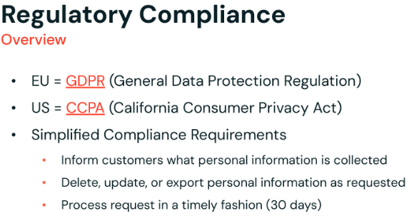

------

Ohne die Transaktionsgarantien und die Qualitätsdurchsetzung von Delta wäre es ein enormer Compliance-Aufwand, personenbezogene Daten in Databricks abzulegen. Delta Lake und die Lakehouse-Architektur der Databricks Data Intelligence Platform insgesamt ermöglichen es, riesige Datenmengen effizient zu speichern und schnell abzufragen, wodurch die Gesamtzahl der Systeme reduziert wird, die Kopien der Nutzerdaten für analytische Workloads benötigen.

Mit der Durchsetzung von Datenqualität kannst du dem Problem begegnen, dass PII aufgrund von Schema-Abweichungen oder Eingabefehlern von Queries übersehen wird, da die Transaktionen garantieren, dass beim Löschen oder Aktualisieren von Datensätzen die Jobs vollständig erfolgreich sind. Delta-Transaktionslogs können genutzt werden, um diese Verarbeitung zu bestätigen.

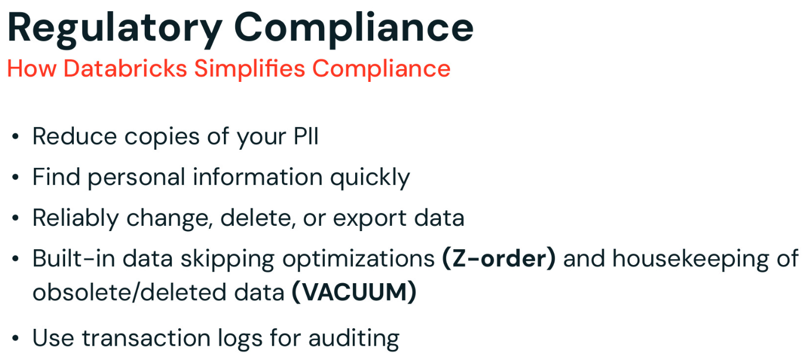

## 1_2_Data Privacy

Beim Thema Data Privacy gibt es drei zentrale Aspekte, die du in deiner Organisation berücksichtigen musst – wie du deine Daten eigenständig verwaltest und woher sie stammen:

1. Zuerst müssen wir den aktuellen Zustand identifizieren und uns Fragen stellen wie:
   a. Welche Daten gibt es, wo befindet sich ihre Quelle und wo werden sie konsumiert?
   b. Wie werden die Daten gehandhabt?
   c. Wie zuverlässig erkenne ich, welche Daten geschützt werden müssen?
   d. Woher weiß ich, dass eine Art von Sicherheit angewendet wurde?
2. Zweitens müssen wir unsere Optionen bewerten und abwägen:
   a. Sollte ich nichts tun? Lohnt es sich, diese Daten zu schützen?
   b. Sollte ich meine Daten anonymisieren oder pseudonymisieren?
   c. Wie bekomme ich meine Daten zurück, nachdem sie gesichert wurden?
3. Drittens geht es um die Verwaltung deiner Daten:
   a. Wie durchsuche ich all meine Daten?
   b. Wie wende ich Aktionen auf meine Daten an, wenn Nutzer Rechte haben wie „Recht auf Vergessenwerden“, „Recht auf Berichtigung“ oder „Recht auf Einschränkung der Verarbeitung“?


Der Aspekt „Identify“ (Identifizieren) von Data Privacy umfasst:

- Data Discovery: Organisationen müssen umfassende Dateninventare erstellen, um zu verstehen, welche personenbezogenen und sensiblen Informationen sie besitzen. Dazu gehört das Identifizieren, Kategorisieren und Labeln sensibler Daten, um deren Speicherort und Nutzung innerhalb der Organisation zu verstehen.
- Data Classification: Sobald Daten entdeckt wurden, sollten sie nach ihrer Sensibilität klassifiziert werden, z. B. PII, Finanzdaten und Gesundheitsdaten. Diese Klassifizierung hilft dabei, angemessene Datenschutzmaßnahmen und Compliance-Protokolle anzuwenden.
- Data Mapping: Ein klares Bild davon erstellen, wie Daten durch die Organisation fließen – einschließlich wo sie gespeichert sind, wer Zugriff darauf hat und wie sie genutzt werden.

Der Aspekt „Protect“ (Schützen) umfasst:

- Data Security Measures: Umsetzung technischer Schutzmaßnahmen wie Verschlüsselung, Zugriffskontrollen und Firewalls, um unbefugten Zugriff auf sensible Daten zu verhindern.
- Data Handling: Minimierung und Begrenzung der Datenerhebung auf das, was für bestimmte Geschäftszwecke notwendig ist, im Einklang mit Vorschriften wie der GDPR.
- [Außerhalb des Databricks-Scopes] Consent Management: Einholen einer ausdrücklichen und informierten Einwilligung von Personen, bevor ihre personenbezogenen Daten erhoben und verarbeitet werden.
- [Außerhalb des Databricks-Scopes] Privacy by Design: Berücksichtigung von Datenschutzaspekten bei der Entwicklung neuer Produkte, Dienste und Prozesse von Anfang an.

Der Aspekt „Manage“ (Verwalten) umfasst:

- Data Governance: Festlegung von Richtlinien, Verfahren und Best Practices für den Umgang mit personenbezogenen Daten über ihren gesamten Lebenszyklus.
- Compliance Management: Sicherstellung der Einhaltung relevanter Datenschutzvorschriften wie GDPR, CCPA und HIPAA.
- Laufendes Monitoring und Auditing: Regelmäßige Bewertung und Aktualisierung der Datenschutzpraktiken, um sich entwickelnden Bedrohungen und regulatorischen Anforderungen gerecht zu werden.
- [Außerhalb des Databricks-Scopes] Data Subject Rights Management: Umsetzung von Prozessen, um Auskunftsersuchen betroffener Personen (DSARs) und andere Datenschutzrechte effizient zu bearbeiten.
- [Außerhalb des Databricks-Scopes] Incident Response: Entwicklung und Pflege von Plänen zur Reaktion auf Datenschutzverletzungen und andere Datenschutzvorfälle.

# 2_Unity Catalog

## 2_1_Zentrale Konzepte und Komponenten


Talk Track: Dies ist ein Blick in die Welt vor Unity Catalog. Data- und AI-Governance war komplex. Der Grund, warum ich das ein so komplexes Thema nenne: Wir haben auf der linken Seite all diese unterschiedlichen Personas, die wir bedienen wollen, und all diese verschiedenen Technologietypen, mit denen wir sie bedienen wollen – und das schafft eine wirklich komplexe Governance-Umgebung.

In einem typischen Unternehmen liegen heute viele Daten in Data Lakes, z. B. AWS S3.

[Klick] Um Berechtigungen für Daten im Data Lake zu steuern, setzt du Berechtigungen auf Dateien und Verzeichnisse. [Klick] Das bedeutet, dass du keine feingranularen Berechtigungen auf Zeilen und Spalten setzen kannst. Da die Governance-Kontrollen auf Dateiebene liegen, müssen Datenteams ihr Daten-Layout sorgfältig strukturieren, um die gewünschten Richtlinien zu unterstützen. Ein Team könnte die Daten beispielsweise nach Land in verschiedene Verzeichnisse partitionieren und den Zugriff auf jedes Verzeichnis unterschiedlichen Gruppen gewähren. Aber was soll das Team tun, wenn sich die Governance-Regeln ändern? Wenn verschiedene Bundesstaaten innerhalb eines Landes unterschiedliche Datenvorschriften einführen, muss die Organisation möglicherweise alle Verzeichnisse und Dateien umstrukturieren – es wird also komplex, alle Richtlinienänderungen umzuschreiben.

[Klick] In den meisten Data Lakes hast du nicht nur Dateien, sondern auch Metadaten – du hast zum Beispiel möglicherweise einen Hive Metastore, der Tabellendefinitionen und Views verwaltet. Du musst also Berechtigungen auf Tabellen und Views vergeben. [Klick] Diese können tatsächlich aus dem Takt mit den zugrunde liegenden Daten geraten. Es gibt keine Garantie, dass Nutzer, die Zugriffsberechtigungen auf Dateien haben, auch Berechtigungen auf die entsprechende Tabelle haben oder umgekehrt. Das Verwalten von Berechtigungen wird sehr verwirrend.

[Klick] Dann hast du möglicherweise dein Data Warehouse, wo die Berechtigungen feingranularer auf Tabellen, Spalten und Views sind.

[Klick] Aber auch das ist wieder ein anderes Governance-Modell. Im typischen Szenario hast du Datenbewegungen von deinen Data Lakes und Data Warehouses – und jetzt hast du Datensilos mit Datenbewegungen über zwei Systeme hinweg geschaffen, jedes mit einem anderen Governance-Modell. Dadurch ist deine Governance-Methode inkonsistent und fehleranfällig, was es schwierig macht, Berechtigungen zu verwalten, Audits durchzuführen oder Daten zu entdecken und zu teilen.

[Klick] Aber Daten beschränken sich nicht auf Dateien oder Tabellen. Du hast auch Assets wie Dashboards, Machine-Learning-Modelle und Notebooks, jedes mit seinem eigenen Berechtigungsmodell und Tech-Stack, was es schwierig macht, Zugriffsberechtigungen für all diese Assets konsistent zu verwalten.

Das Problem wird noch größer, wenn deine Daten-Assets über mehrere Clouds mit unterschiedlichen Zugriffsmanagement-Lösungen verteilt sind.

[Überleitung zur nächsten Folie] Was du brauchst, ist ein einheitlicher Ansatz zur Vereinfachung der Governance für Daten und AI.

---

(Zusätzliche Notizen)
Herausforderungen im Data Lake

- Keine feingranularen Zugriffskontrollen
  - Cloud-Storage-Dienste bieten Zugriffskontrolle nur auf Dateiebene über cloud-spezifische Schnittstellen. Dieses Maß an Zugriffskontrolle ist grob und erlaubt keine Zugriffskontrolle unterhalb der Dateiebene. Wenn dein Data-Governance-Programm zum Beispiel verlangt, dass bestimmte Rollen nur auf eine Teilmenge der Zeilen oder Spalten innerhalb einer Tabelle zugreifen dürfen, ist das mit Zugriffskontrolle auf Dateiebene nicht möglich. Der einzige Weg, dies sicher zu erreichen, ist, die Teilmenge der Daten zu duplizieren, für die du Zugriff gewähren willst – was später zu massiven Wartungsproblemen führen kann.
- Kein gemeinsames Metadaten-Layer
  - Eine weitere Herausforderung besteht darin, dass Governance-Regeln in dieser Umgebung an das physische Layout der Dateien im Cloud-Storage gebunden werden. Angenommen, du musst das Layout reorganisieren – vielleicht hast du eine neue Möglichkeit gefunden, Dateien zu organisieren, um die Systemleistung zu verbessern. Dein gesamtes Sicherheitsmodell muss dann aktualisiert werden, um das neue Layout abzubilden.
- Nicht-standardisiertes, cloud-spezifisches Governance-Modell
  - Umgekehrt: Angenommen, deine Governance-Regeln ändern sich. Diese Änderungen können Auswirkungen auf deine Daten haben, die eine Umstrukturierung und möglicherweise sogar ein Umschreiben eines Teils oder aller Daten erfordern.
- Schwer zu auditieren
  - Noch eine weitere Herausforderung ergibt sich aus den unterschiedlichen Wegen, auf denen Unternehmen auf ihre Daten zugreifen müssen.
  - Kein gemeinsames Governance-Modell für verschiedene Arten von Daten-Assets
- Angenommen, du führst Analytics-Jobs aus, die sowohl auf Daten im Lake als auch im Warehouse zugreifen, zusammen mit Machine-Learning-Anwendungen. Diese Systeme verwenden unterschiedliche Berechtigungssteuerungsmodelle, was die Sache weiter verkompliziert.

Zusammengefasst: Der in einer typischen Data-Lake-Umgebung angebotene Ansatz zur Zugriffskontrolle führt zu komplizierten und unflexiblen Data-Governance-Implementierungen.

------

Um diese Herausforderungen zu bewältigen, haben wir Unity Catalog geschaffen, der ein einheitliches Governance-Layer für alle Daten- und AI-Assets in deinem Lakehouse bietet. Unity Catalog stellt eine einzige Schnittstelle bereit, um Berechtigungen und Auditing für deine Daten- und AI-Assets zu verwalten.


------

Zur Wiederholung: Databricks verwendet Access Control Lists, um zu steuern, wer auf welches Objekt zugreifen kann und wie.

Der „Wie“-Teil wird durch einen der zahlreichen in Databricks verfügbaren Privilege-Typen definiert, von denen einige hier beispielhaft gezeigt werden. Allerdings gelten nicht alle Privileges für alle Objekte. Das MODIFY-Privilege kann zum Beispiel nicht auf eine View angewendet werden. Das wäre bedeutungslos, da Views schreibgeschützt sind.

Der „Was“-Teil bezieht sich auf ein Securable Object wie eine Tabelle, View oder ein Schema. Das ist das Objekt, für das der Grant gilt.

Der „Wer“-Teil jedes Grants entspricht einem Databricks Principal. Das kann ein einzelner Nutzer oder Service Principal sein oder eine Gruppe. Um es zu wiederholen: Databricks empfiehlt, beim Vergeben von Berechtigungen Gruppen zu verwenden, da diese Praxis in der Regel zu einer eleganteren und wartbareren Governance-Implementierung führt.


------

Zugriff kann über GRANT- und REVOKE-Anweisungen in SQL gewährt oder entzogen werden – entweder über ein Notebook oder in DBSQL. Gezeigt wird ein einfaches Beispiel, das das Gewähren des SELECT-Privilege auf einer Tabelle namens „t“ an die Gruppe „analysts“ veranschaulicht. Außerdem zeigen wir eine Anweisung, um einen solchen Grant zu widerrufen.

Die Data-Explorer-Benutzeroberfläche, verfügbar sowohl im Data Science and Engineering Workspace als auch in DBSQL, bietet die Möglichkeit, Datenobjekte interaktiv zu erstellen, zu löschen und den Zugriff darauf zu steuern.

Schließlich können wir, wie bei den meisten Elementen der Databricks-Plattform, den Datenzugriff programmatisch verwalten. Auf der untersten Ebene können Datenobjekte über REST-APIs verwaltet werden, wobei die Databricks CLI eine bequemere Möglichkeit bietet, Datenobjekte programmatisch zu verwalten. Terraform, ein offen verfügbares Infrastructure-as-Code-Tool, verwendet deklarative Konfigurationsdateien, um Datenobjekte und viele andere Aspekte der Plattform zu verwalten.


------

Lineage ist ziemlich spannend! Wir haben jetzt die Möglichkeit, Laufzeit-Lineage automatisch über Tabellen, Spalten, Dashboards, Lakeflow Jobs, Notebooks, Dateien, externe Quellen, Modelle usw. zu erfassen. Das ist enorm hilfreich, wenn du Fragen beantworten willst wie „Woher stammen diese Daten?“ oder „Welche nachgelagerten Daten-Assets beeinflusse ich, wenn ich eine Änderung an dieser Pipeline vornehme?“.

Zu Best Practices gibt es hier nicht viel zu sagen, außer: Migriere zu UC, um von Lineage zu profitieren!


------


------

Wir haben außerdem Data Discovery eingeführt – eine integrierte Benutzeroberfläche, um Assets in Unity Catalog zu entdecken. Dies ist eine einheitliche UI über alle Personas hinweg und nutzt das gemeinsame Berechtigungsmodell von UC: Wenn du also keinen Zugriff hast, um eine Tabelle zu sehen oder zu lesen, erscheint sie nicht in deinen Suchergebnissen.

Die Empfehlung in Sachen Auffindbarkeit lautet, in deiner Organisation bestimmte Best Practices zu etablieren, welche Art von Tags oder Kommentaren du verwendest, und sie zum Bestandteil deiner Pipelines und deines täglichen Datenbetriebs zu machen.


------

Feingranulare Zugriffskontrolle ermöglicht die Zugriffssteuerung auf Zeilen und Spalten innerhalb einer Tabelle.

Sie richtet sich an bestimmte Nutzer oder Gruppen und ermöglicht dir drei wichtige Anwendungsfälle:

**Use Case 1**: Der erste Anwendungsfall ist das Verbergen von Spalten für bestimmte Nutzer oder Gruppen. Beim Abfragen der View sehen die betroffenen Nutzer keine Werte für die geschützten Spalten.

Dabei wird der Zugriff auf Spaltenwerte eingeschränkt. Alle sehen, dass die Spalte vorhanden ist, aber für alle außer bestimmten Nutzern oder Gruppen werden die Spaltenwerte geschwärzt.

**Use Case 2**: Der nächste Anwendungsfall ähnelt dem gerade besprochenen, nur dass wir ihn jetzt seitlich umkippen und auf Zeilen anwenden. In diesem Anwendungsfall lassen wir Datensätze für bestimmte Nutzer oder Gruppen weg. Beim Abfragen der View sehen die betroffenen Nutzer nur die Datensätze, die nicht von den Filterkriterien erfasst wurden.

Zeilenfilterung lässt Datensätze vollständig aus der Query-Ausgabe weg. Welche Datensätze durchgelassen und welche verworfen werden, hängt vom Principal ab, der die Query formuliert, sowie von den Filterkriterien.

**Use Case 3**: Ein letzter Anwendungsfall, den wir betrachten, ist eigentlich ein Sonderfall der Spalteneinschränkung: Dabei werden Spaltenwerte für bestimmte Nutzer oder Gruppen transformiert oder teilweise verschleiert, statt sie vollständig zu schwärzen. Beim Abfragen der View sehen die betroffenen Nutzer nur eine transformierte Version der Daten für die geschützten Spalten. Zum Beispiel den Domain-Namen einer E-Mail-Adresse oder die letzten 2 Ziffern einer Kontonummer.


Das kann eine nützliche Technik sein, da sie zusätzliche Daten bereitstellt, die zur Unterscheidung von Ergebnissen verwendet werden können, aber nicht genug Informationen liefert, um den gesamten Wert zu bestimmen, den wir schützen.

Natürlich könnte man dies erreichen, indem man eine sekundäre Tabelle basierend auf der zu schützenden Tabelle erstellt; das führt jedoch zu Duplizierung, erhöhter Komplexität und Wartungsproblemen.

------

Sofern der Owner der View Zugriff auf die zugrunde liegenden Tabellen hat, die sie abfragt, benötigt niemand, der die View abfragt, direkten Zugriff auf diese zugrunde liegenden Tabellen. Das bedeutet, dass eine View eine Tabelle effektiv schützen kann, indem sie Zeilen oder Spalten filtert oder transformiert. Wer die View abfragt, sieht nur die Daten, die die View bereitstellt – die geschützten Daten kann er nicht sehen.

Dies ermöglicht in Kombination mit spezialisierten SQL-Funktionen, die Databricks bereitstellt, Muster, mit denen sich drei gängige Anwendungsfälle leicht umsetzen lassen.


------

Der zweite Ansatz erfolgt über „Row Filtering and Column Masking“.

- Row Filtering ermöglicht es dir, einen Filter direkt auf eine Tabelle anzuwenden, sodass Queries nur Zeilen zurückgeben, die bestimmte Kriterien erfüllen. Dies wird über eine benutzerdefinierte Funktion (UDF) angewendet, die mit dem Schlüsselwort „SET ROW FILTER“ an deine Tabelle angehängt wird. Links haben wir ein einfaches Beispiel dafür, wie diese UDF namens „us_filter“ die Funktion „is_member“ nutzt, um ein solches Verhalten zu steuern.
- Column Masking ermöglicht es dir, eine Maskierungsfunktion auf eine Tabellenspalte anzuwenden, wobei jede Referenz auf die Zielspalte durch das Ergebnis der Maskierungsfunktion ersetzt wird. Ähnlich wird dies über das Schlüsselwort „SET MASK“ auf deine Tabelle angewendet. Rechts haben wir ein weiteres Beispiel für eine Funktion namens „ssn_mask“, angewendet auf die Tabelle „user“ – beachte, dass sie ein „case“ verwendet, um die ersetzten Werte zurückzugeben.
- Beachte, dass beide Ansätze – Dynamic Views sowie Row Filtering und Column Masking – dasselbe Verhalten bieten können. Es gibt jedoch einige Überlegungen: Bei Dynamic Views musst du zum Beispiel für jeden Fall, den du behandeln musst, neue Views erstellen und pflegen. Bei Row Filtering und Column Masks musst du hingegen benutzerdefinierte Funktionen erstellen und an deine Tabelle anhängen.


------

Data Governance ist eine People-Process-Tools-Herausforderung.

Unity Catalog kann helfen, die Prozess- und Tooling-Aspekte der Lösung zu vereinfachen.

Betrachte ein reales Beispiel für Data Governance in Aktion:

Stell dir einen großen Gesundheitsdienstleister mit Tausenden von Patienten vor. Er speichert medizinische Aufzeichnungen, Abrechnungsinformationen und Forschungsdaten in einem komplexen Ökosystem von Systemen. Ohne angemessene Data Governance:

- **Risiko einer Datenschutzverletzung**: Eine falsch konfigurierte Datenbank könnte sensible Patienteninformationen offenlegen, was zu rechtlichen Schritten und Vertrauensverlust führt.
- **Ungenaue Behandlungsentscheidungen**: Veraltete oder inkonsistente medizinische Aufzeichnungen könnten zu falschen Diagnosen oder Medikationsfehlern führen.
- **Verpasste Forschungschancen**: Schlechte Datenqualität oder fehlender Zugriff könnten wertvolle Forschung zu neuen Behandlungen behindern.

Mit effektiver Data Governance und Tools wie Databricks und Unity Catalog:

- **Sicherheit wird erhöht**: Robuste Zugriffskontrollen stellen sicher, dass nur autorisiertes Personal Patientendaten einsehen kann, was das Risiko von Verletzungen minimiert.
- **Datengenauigkeit wird verbessert**: Automatisierte Datenqualitätsprüfungen und Validierungsprozesse halten Aufzeichnungen konsistent und zuverlässig und unterstützen eine bessere Versorgung.
- **Zusammenarbeit wird vereinfacht**: Forscher können relevante Datensätze leicht entdecken und darauf zugreifen, was Erkenntnisse zum Nutzen der Patienten beschleunigt.


## 2_2_Ihre Daten auditieren

- Unity Catalog verfügt inzwischen über umfangreiche System-Tabellen, die dir helfen, viele wichtige Fragen zu deinem Lakehouse zu beantworten. Das macht es transparenter und leichter zu verwalten und zu überwachen.
- Diese finden sich im „system“-Katalog. Beginnend mit Objekt-Metadaten kannst du das Schema „information_schema“ nutzen, um Analysen auf deinen operativen Daten durchzuführen und so Fragen rund um Ownership, Inventar, Datenzugriff, Tags usw. zu beantworten.

Zum Beispiel:

- Welche Tabellen befinden sich in einem bestimmten Katalog?
- Wer hat Zugriff auf eine bestimmte Tabelle?
- Wer hat die letzte Aktualisierung an einer Gold-Tabelle vorgenommen und wann?
- Wer ist Owner einer bestimmten Tabelle und mehr

System Tables - https://docs.databricks.com/en/admin/system-tables/index.html
Information Schema - https://docs.databricks.com/en/sgl/lanquage-manual/sgl-ref-information-schema.html

```sql
# System Tables: Object Metadata
# Fragen zum Zustand von Objekten im Katalog beantworten

# Welche Tabellen befinden sich im Katalog sales?
SELECT table_name 
FROM system.information_schema.tables 
WHERE table_catalog="sales";

# Wer hat die Gold-Tabellen zuletzt aktualisiert und wann?
SELECT table_name, last_altered_by, last_altered 
FROM system.information_schema.tables 
WHERE table_catalog="churn_gold" ORDER BY 1, 3 DESC;

# Wer hat Zugriff auf diese Tabelle?
SELECT grantee, table_name, privilege_type
FROM system.information_schema.table_privileges
WHERE table_name = "login_data_silver";

# Who owns this gold table?
SELECT table_owner
FROM system.information_schema.tables
WHERE table_catalog = "retail_prod" AND table_schema = "churn_gold" AND table_name = "churn_features";
```

------

Innerhalb des System-Katalogs kannst du außerdem die Billing-Logs über das Schema „billing“ und die Tabelle „usage“ nutzen, um Fragen zu beantworten wie:

- Wie ist der tägliche Trend beim DBU-Verbrauch?
- Wie viele DBUs jeder SKU wurden in diesem Monat verbraucht?
- Welche 10 Nutzer haben die meisten DBUs verbraucht?
- Welche Jobs haben die meisten DBUs verbraucht?

System Billing Schema - https://docs.databricks.com/en/admin/system-tables/billing.html

```sql
# System Tables: Billing Logs
# Understand const allocation across your data estate

# Wie ist der tägliche Trend beim DBU-Verbrauch?
SELECT usage_date as 'Date', sum(usage_quantity) as 'DBUs Consumed'
FROM system.billing.usage
GROUP BY usage_date
ORDER BY usage_date ASC;

# Welche 10 Benutzer haben die meisten DBUs verbraucht?
SELECT identity_metadata.run_as as 'User', sum(usage_quantity) as' DBUS'
FROM system.billing.usage
GROUP BY identity_metadata.run_as
ORDER BY DBUS DESC
LIMIT 10;

# Wie viele DBUs wurden in diesem Monat bisher pro SKU verbraucht?
SELECT sku_name as 'SKU', sum(usage_quantity) as 'DBUS'
FROM system.billing.usage
WHERE month(usage_date) = month(CURRENT_DATE)
GROUP BY sku
ORDER BY 'DBUS' DESC;

# Welche Jobs haben die meisten DBUs verbraucht?
SELECT usage_metadata. job_id as 'Job ID',
sum(usage_quantity) as 'DBUs'
FROM system.billing. usage
GROUP BY Job ID;
```

------

Du kannst außerdem die „Audit Logs“ im Schema „access“ und der Tabelle „audit“ nutzen, um Fragen zu beantworten wie:

- Auf welche Tabelle wird am häufigsten zugegriffen?
- Wer hat eine bestimmte Tabelle gelöscht?
- Worauf hat ein bestimmter Nutzer in den letzten 24 Stunden zugegriffen?
- Auf welche Tabellen greift ein bestimmter Nutzer am häufigsten zu?

Hier sind einige Beispiele. Beachte, dass sich dieses Feature noch in der Public Preview befindet – kläre also mit deinem Workspace-Administrator, ob es aktiviert ist.

Audit Logs - https://docs.databricks.com/en/admin/system-tables/audit-logs.html

```sql
# System Tables: Audit Logs
# Nahezu in Echtzeit sehen, wer wann worauf zugegriffen hat

# Wer greift am häufigsten auf diese Tabelle zu?
SELECT user_identity.email, count(*)
FROM system. access.audit
WHERE request_params.table_full_name = "main. uc_deep_dive. login_data_silver"
	AND service_name = "unityCatalog"
	AND action_name = "generateTemporaryTableCredential"
GROUP BY 1 ORDER BY 2 DESC LIMIT 1;

# Who deleted this table?
SELECT user_identity. email
FROM system. access.audit
WHERE request_params. full_name_arg = "main. uc_deep_dive. login_data_silver"
	AND service_name = "unityCatalog"
	AND action_name = "deleteTable";
	
# Worauf hat dieser Benutzer in den letzten 24 Stunden zugegriffen?
SELECT request_params. table_full_name
FROM system. access.audit
WHERE user_identity.email = "ifi.derekli@databricks.com"
	AND service_name = "unityCatalog"
	AND action_name = "generateTemporaryTableCredential"
	AND datediff(now(), event_time) < 1;

# Auf welche Tabellen greift dieser Benutzer am häufigsten zu?
SELECT request_params. table_full_name, count(*)
FROM system. access. audit
WHERE user_identity.email = "ifi.derekli@databricks.com"
	AND service_name = "unityCatalog"
	AND action_name = "generateTemporaryTableCredential"
GROUP BY 1 ORDER BY 2 DESC LIMIT 1;
```

------

Was ist mit Lineage-Daten? Hier gibt es zwei Optionen: erstens auf Tabellenebene und zweitens auf Spaltenebene. Dafür kannst du das Schema „access“ und die Tabelle „table_lineage“ nutzen, um Fragen zu beantworten wie:

- Welche Tabellen speisen sich aus einer bestimmten Tabelle?
- Welche Nutzer-Queries lesen aus einer bestimmten Tabelle?

Dieses Feature befindet sich im Preview-Modus – kläre es also mit deinem Administrator.

Table Lineage - https://docs.databricks.com/en/admin/system-tables/lineage.html
Column Lineage - https://docs.databricks.com/en/admin/system-tables/lineage.html#column-lineage-table

```sql
# System Tables: Lineage Data
# Vor- und nachgelagerte Quellen an einem Ort abfragen

# Welche Tabellen speisen sich aus dieser Tabelle?
SELECT DISTINCT target_table_full_name
FROM system.access.table lineage
WHERE source_table_name = "login_data_bronze";

# Welche Benutzerabfragen lesen aus dieser Tabelle?
SELECT DISTINCT entity_type, entity_id, source_table_full_name
FROM system. access.table lineage
WHERE source_table_name = "login_data_silver";
```

## 2_3_Data Isolation

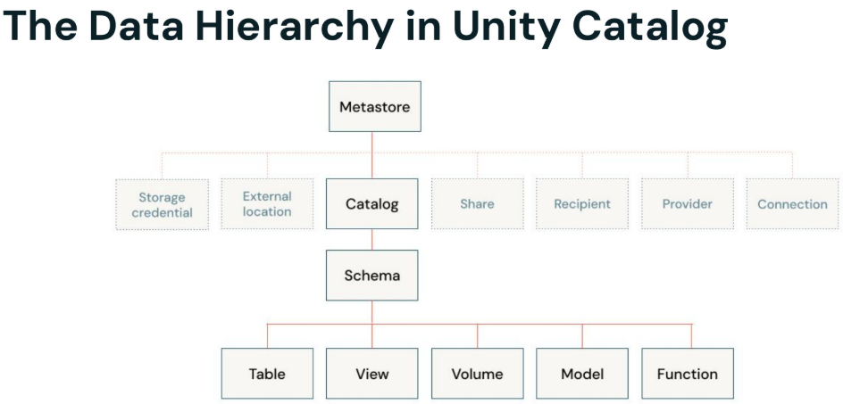

- Für das Thema Data Isolation ist es wichtig, die Datenhierarchie von Unity Catalog zu verstehen und zu berücksichtigen. Sie ist mit einem Metastore und dessen Zuordnung zu einem dreistufigen Namespace, der deine Daten-Assets organisiert, sehr leicht nachvollziehbar.
- In dieser Session betrachten wir den „Metastore“, Kataloge und Volumes.

------

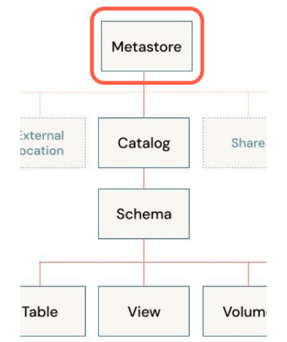

**Metastore**s

- Der Metastore ist der oberste Container für Metadaten in Databricks Unity Catalog und organisiert Datenobjekte hierarchisch nach dem dreistufigen Namespace.
- Account-Administratoren können **einen Metastore pro Region** erstellen und ihn **mehreren Workspaces in dieser Region** zuweisen.
- Ein Workspace ist die Arbeitsumgebung für eine Gruppe von Nutzern.
- Metastores bieten **standardmäßig regionale Isolation**, wobei der physische Speicher jedes Metastores in der Regel von anderen Metastores im selben Account getrennt ist.
- Aber **Data Isolation sollte auf Katalogebene beginnen**, der höchsten Ebene in der Datenhierarchie (Katalog > Schema > Tabelle/View/Volume).

------

**Katalog**e

- Wie erwähnt sind Kataloge als **primäre Einheit der Data Isolation** vorgesehen.
- Sie bilden oft Organisationseinheiten oder Phasen des Software-Entwicklungslebenszyklus ab, z. B. getrennte Kataloge für Produktions- und Entwicklungsdaten.
- Kataloge können **auf Metastore-Ebene oder getrennt vom übergeordneten Metastore gespeichert** werden, wobei getrennter Speicher die bevorzugte Option ist.
- Sie können an bestimmte Workspaces gebunden werden, sodass bestimmte Datentypen nur in dafür vorgesehenen Umgebungen verarbeitet werden.
- Kataloge sind ein idealer Ort, um vererbte Berechtigungen zu setzen, was eine effiziente und granulare Zugriffskontrolle ermöglicht.

------

**Volumes**

- Volumes können jede Art von Daten speichern, einschließlich strukturierter, halbstrukturierter und unstrukturierter Formate.
- Volumes bieten Möglichkeiten, um Dateien abzurufen, zu speichern, zu verwalten (governance) und zu organisieren – z. B. Bibliotheken, Konfigurationen und Checkpoint-Ordner.
- Sie bieten Governance über nicht-tabellarische Datensätze und ergänzen die Governance, die Tabellen für tabellarische Daten bieten.
- Wichtig zu verstehen: Die in Volumes gespeicherten Daten können nicht als Tabellen registriert oder wie eine Tabelle behandelt werden.
- Sie können entweder managed (an von Unity Catalog verwalteten Speicherorten gespeichert) oder external (auf Verzeichnisse in External Locations registriert) sein.

------

**Daten physisch trennen**

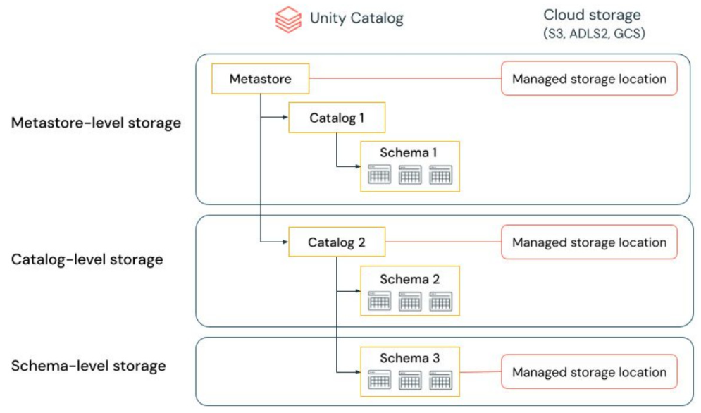

Eine Organisation kann verlangen, dass Daten bestimmter Typen in bestimmten Accounts oder Buckets in ihrem Cloud-Tenant gespeichert werden.

Unity Catalog bietet die Möglichkeit, Speicherorte auf Metastore-, Katalog- oder Schema-Ebene zu konfigurieren, um solche Anforderungen zu erfüllen.

Darüber hinaus

bietet Unity Catalog dir die Möglichkeit, zwischen zentralisierten und verteilten Governance-Modellen zu wählen.

Im zentralisierten Governance-Modell sind deine Governance-Administratoren Owner des Metastores und können die Ownership jedes Objekts übernehmen sowie Berechtigungen gewähren und entziehen.

In einem verteilten Governance-Modell ist der Katalog oder eine Gruppe von Katalogen die Data Domain. Der Owner dieses Katalogs kann alle Assets erstellen und besitzen und die Governance innerhalb dieser Domain verwalten. Die Owner einer bestimmten Domain können unabhängig von den Ownern anderer Domains agieren.

Unabhängig davon, ob du den Metastore oder Kataloge als deine Data Domain wählst, empfiehlt Databricks dringend, eine Gruppe als Metastore-Admin oder Katalog-Owner festzulegen.

------

**External Locations und Storage Credentials**

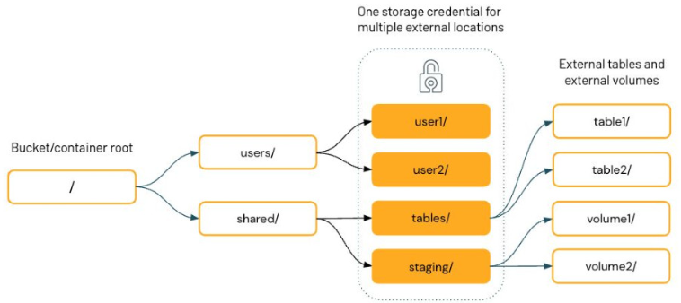

External Locations und Storage Credentials in Databricks Unity Catalog spielen eine entscheidende Rolle bei der Data Isolation:

- External Locations verknüpfen Unity-Catalog-Storage-Credentials mit Cloud-Object-Storage-Containern. Sie ermöglichen es Unity Catalog, im Namen der Nutzer Daten in deinem Cloud-Tenant zu lesen und zu schreiben.
- Für eine verbesserte Data Isolation können External Locations und Storage Credentials an bestimmte Workspaces gebunden werden.
- External Locations bieten eine starke Kontrolle und Nachvollziehbarkeit des Speicherzugriffs.
- Um zu verhindern, dass Unity-Catalog-Zugriffskontrollen umgangen werden, beschränke den direkten Nutzerzugriff auf Container, die als External Locations verwendet werden.

------

**Das Sicherheitsmodell von Unity Catalog**

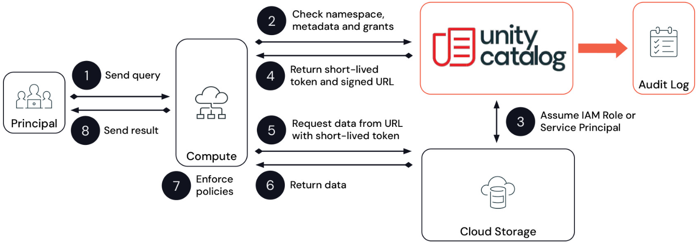

Nachdem wir alle zentralen Konzepte rund um Unity Catalog besprochen haben, werfen wir einen letzten Blick auf sein Sicherheitsmodell in Aktion. Beginnen wir mit einer Tour durch den Lebenszyklus einer Query, um zu sehen, wie Unity Catalog Zugriffskontrolle auf sichere und zugleich performante Weise bereitstellt.

(DIE FOLIE ENTHÄLT ANIMATIONEN; EINE FÜR JEDEN DER FOLGENDEN SCHRITTE)

1. [KLICK] Die Geschichte beginnt damit, dass ein Principal eine Query absetzt. Queries können über All-Purpose-Cluster abgesetzt werden, wenn Nutzer Python- oder SQL-Workloads interaktiv ausführen. Im Fall eines Jobs oder einer Pipeline, die als Service Principal läuft, würde dies typischerweise über einen Job-Cluster laufen. Alternativ setzen Datenanalysten Queries in Databricks SQL über ein SQL Warehouse ab, oder die Query stammt aus einem BI-Tool, das mit einem SQL Warehouse verbunden ist. In jedem Fall beginnt die zuständige Compute-Ressource mit der Verarbeitung der Query.
2. [KLICK] Die Anfrage wird an Unity Catalog weitergeleitet, der sie protokolliert und die Query gegen alle Sicherheitsbeschränkungen validiert, die innerhalb des Metastores definiert sind, mit dem die Compute-Ressource verknüpft ist.
3. [KLICK] Für jedes in der Query referenzierte Objekt nimmt Unity Catalog die passende Cloud-Credential an, die dieses Objekt regelt und von einem Cloud-Administrator bereitgestellt wird. Bei Managed Tables wäre das der mit dem Metastore verknüpfte Cloud-Storage. Bei Dateien oder External Tables wäre das eine External Location, die durch eine Storage Credential geregelt wird.
4. [KLICK] Wiederum für jedes in der Query referenzierte Objekt generiert Unity Catalog ein scoped, temporäres Token, das einem Client den direkten Zugriff auf die Daten aus dem Storage ermöglicht, und gibt dieses Token zusammen mit einer Zugriffs-URL zurück. So kann der Cluster bzw. das SQL Warehouse direkt, aber sicher auf Daten zugreifen.
5. [KLICK] Der Cluster bzw. das SQL Warehouse fordert die Daten mit der von Unity Catalog zurückgegebenen URL und dem Token direkt vom Cloud-Storage an.
6. [KLICK] Die Daten werden vom Cloud-Storage zurückübertragen. Dieser Anfrageprozess wird für jedes von der Query referenzierte Objekt wiederholt.
7. [KLICK] Mit Zugriff auf Daten auf Partitionsebene wird das „Last-Mile“-Filtern auf Zeilen- oder Spaltenbasis auf dem Cluster bzw. dem SQL Warehouse angewendet.
8. [KLICK] Schließlich wird das gefilterte Ergebnis an den Aufrufer zurückgegeben.

------

**Daten- und Workload-Isolation**

Eine weitere Möglichkeit, deine Daten zu isolieren, besteht darin, ein geeignetes Cluster-Profil und den Einsatz von Workspaces zu nutzen.

Hier haben wir eine Abbildung mit zwei Workspaces: Der erste hat zwei Cluster – einen für einen Single User, der an einem POC arbeitet, und einen mit Shared Access, damit dein Team an aktiven Projekten arbeiten kann. Der zweite Workspace hat einen SQL-Warehouse-Cluster, der die Zusammenarbeit über dein Team hinweg ermöglicht.

Isoliere einfach nach deinen Anforderungen

1. Single-User-Cluster bieten Datenschutz
2. Multi-User-Cluster, die Nutzer mit unterschiedlichen Berechtigungen sicher unterstützen, z. B. Shared Access Mode oder SQL Warehouses
3. Mehrere Workspaces isolieren Gruppen, die nicht zusammenarbeiten

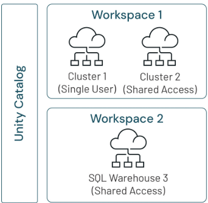

------

**Verschlüsselung standardmäßig**

Du kannst dich darauf verlassen, dass Databricks Verschlüsselungsmaßnahmen einsetzt, um Daten bei allen Übertragungen zu schützen:

- Data in transit: Der gesamte Datenverkehr zwischen Nutzern und der Control Plane, zwischen Control Plane und Compute Plane sowie zu AWS-APIs wird mit TLS/SSL-Protokollen verschlüsselt.
- Data at rest: AES-256-Verschlüsselung wird für Daten verwendet, die in Azure Storage und Amazon-EBS-Volumes gespeichert sind.
- Control-Plane-Daten: Es wird Envelope Encryption verwendet, bei der der Data Encryption Key (DEK) mit einem Customer-Managed Key (CMK) verschlüsselt und dann erneut mit einem von Databricks verwalteten Schlüssel verschlüsselt wird.

https://www.databricks.com/trust/security-features/data-protection-with-cus
tomer-managed-keys

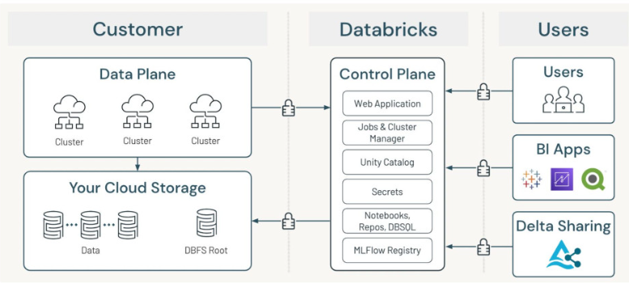

------

**Zugriff auf PII verwalten**

Auch wenn Databricks über umfangreiche Access Control Lists verfügt, ist das physische Trennen privater Daten in Storage-Container mit eingeschränktem Zugriff über die gesamte Organisation hinweg ein wichtiger zusätzlicher Schritt. Selbst wenn du dich für die Gewährung von Datenzugriff in Databricks nicht ausdrücklich auf das Cloud-Identity-and-Access-Management verlässt, ist es entscheidend, die Berechtigungen in der Cloud korrekt gesetzt zu haben.

Da Cluster und angehängte Storage-Volumes ephemer sind, bleiben zwischengespeicherte (cached) Daten nach Abschluss eines Jobs nicht erhalten. Wenn du personenbezogene Informationen speicherst, begrenzt das Entfernen natürlicher Schlüssel, die zur Nutzeridentität zurückführen könnten, die Anzahl der Stellen, an denen du Daten löschen musst, und stellt sicher, dass sie nicht mehr identifizierbar sind.

Wenn du Daten für Analysten verfügbar machst, können Views verwendet werden, um Spalten entweder dynamisch zu maskieren oder durch Aggregation zu de-identifizieren.

- Zugriff auf Speicherorte mit Cloud-Berechtigungen steuern
- Menschlichen Zugriff auf Rohdaten begrenzen
- Zeilen- und Spaltenfilterung in Unity Catalog
- Datensätze bei der Ingestion pseudonymisieren
- Table ACLs zur Verwaltung von Nutzerberechtigungen verwenden
- Dynamic Views für Datenschwärzung konfigurieren
- Identifizierende Details aus demografischen Views entfernen

------

**Neue Best Practices**

Gehen wir nun die neuen von Databricks empfohlenen „Best Practices“ durch:

1. Vermeide den direkten Zugriff auf Object Stores. Unity Catalog sollte jeglichen Datenzugriff vermitteln und einen umfassenden Audit-Trail aller Zugriffsanfragen führen. Dieser zentralisierte Ansatz sorgt für bessere Kontrolle und Sichtbarkeit des Datenzugriffs.
2. Minimiere die Verwendung von Keys: Weniger Keys im Umlauf verringern das Risiko von Sicherheitsverletzungen. Die zentralisierte Zugriffskontrolle von Unity Catalog macht mehrere Access Keys überflüssig.
3. Eliminiere Credentials in Code oder Secret Scopes: Mit Unity Catalog werden sensible Credentials nicht mehr in Code oder Secret Scopes gespeichert. Nutze stattdessen Databricks Secrets.
4. Migriere weg vom Hive Metastore: Hive Metastores gelten als weniger sicher. Alle neuen Daten-Assets sollten innerhalb von Unity Catalog erstellt und verwaltet werden.
5. Nutze für Modell-Assets Unity Catalog: Speichere alle Modell-Assets in Schemas in Unity Catalog statt in workspace-lokalen Model Registries. Dieser Ansatz bietet bessere Governance und Sharing-Möglichkeiten über Workspaces hinweg.
6. Vermeide die Nutzung von DBFS: Das Databricks File System (DBFS) sollte in Unity-Catalog-fähigen Workspaces vermieden werden. Nutze stattdessen Volumes, um unstrukturierte Daten wie Checkpoints, Bibliotheken und Konfigurationsdateien zu speichern.

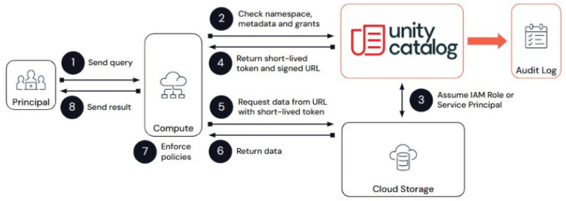

Hier ist ein Link zu weiteren Best Practices:

https://docs.databricks.com/en/data-governance/unity-catalog/best-practices.html

------

**Kunden-Use-Case – SEEK**

PII-Erkennung im großen Maßstab auf dem Lakehouse

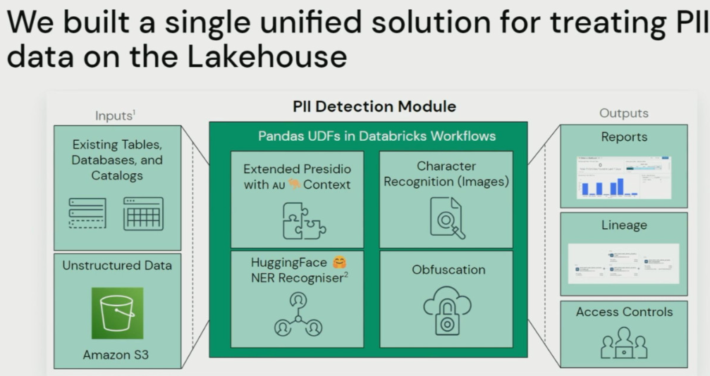

Hier haben wir einen Erfolgsfall von SEEK, Australiens größtem Online-Jobmarktplatz. Dieser Marktplatz verarbeitet Millionen von Lebensläufen mit sensiblen Bewerberinformationen.

- Ihr Ziel ist es, ein nahezu echtzeitfähiges Datenüberwachungssystem zu schaffen, das Lücken aufdeckt, Dashboards bereitstellt und Tickets für Data Custodians auslöst, um Probleme zu beheben.
- SEEK hat ein eigenes Framework auf Basis von HuggingFace-Transformern entwickelt, um PII sowohl in strukturierten als auch in unstrukturierten Daten zu erkennen und zu anonymisieren.
- Ihr PII-Erkennungsmodul umfasst:
  - Angepasste Recognizer für bestimmte Kontexte
  - Optical Character Recognition (OCR), um PII in hochgeladenen Dokumenten wie Pässen zu erkennen
  - Integration mit MLflow für Modell-Versionierung und API-Erstellung
  - Echtzeit-Warnungen, um zu verhindern, dass Nutzer sensible Informationen übermitteln
- Das System nutzt Unity Catalog für die Nachverfolgung der Data Lineage und die Durchsetzung der Zugriffskontrolle.

Ihr Ansatz zielt darauf ab, Data Governance von einem manuellen Prozess zu einem KI-gesteuerten, automatisierten System zu transformieren, das den Datenschutz und das Risikomanagement verbessert – schau sie dir also an.

# 3_PII Data Security

## 3_1_Pseudonymization & Anonymization

**PII Data Security**

Tauchen wir etwas tiefer in die Ansätze zur Pseudonymisierung und Anonymisierung ein.

Bevor wir beginnen, beachte jedoch: Mit ausreichend Zeit und Zugriff auf zusätzliche Daten ist es oft möglich, die meisten Daten wieder zu re-identifizieren – unabhängig vom verwendeten Ansatz. Das Anwenden von Pseudonymisierungs- und Anonymisierungstechniken auf Datensätze reduziert das Risiko der Datenexfiltration und verringert die Sichtbarkeit für die meisten Nutzer des Datensatzes, beseitigt das Risiko aber nicht vollständig.

Links siehst du ein Beispiel für Pseudonymisierung, bei dem „John Doe“ in der Spalte „Name“ zu „User-321“ geändert wurde. Dieser Schlüssel kann später auch genutzt werden, um Daten zu joinen. Falls du ihn löschen musst, lässt sich leicht sicherstellen, dass die Daten nicht an anderer Stelle kompromittiert werden.

Das Bild rechts ist ein Beispiel für Anonymisierung. Dies kann mit Dynamic Views umgesetzt werden – basierend auf den Berechtigungen, die du für eine Nutzergruppe oder ein Mitglied konfigurierst. Konkret kannst du bestimmte Informationen verbergen oder die Art ändern, wie du sie darstellst.

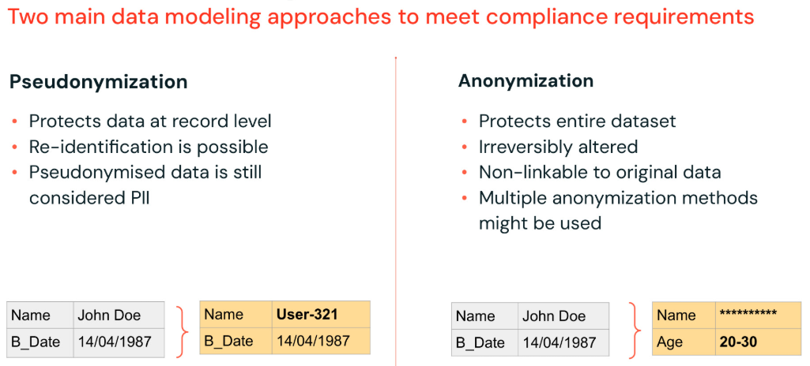

------

### 3_1_1_Pseudonymization

Pseudonymisierung bedeutet, PII (personenbezogene Informationen) durch künstliche Identifikatoren oder Pseudonyme zu ersetzen. Beachte, dass auch pseudonymisierte Daten weiterhin als personenbezogene Informationen gelten.

Sie bietet Datenschutz auf Record-Ebene, indem sie aussagekräftige Werte durch generierte, aber ebenso eindeutige Werte wie Tokens, Hashes oder verschlüsselte Daten ersetzt.

Pseudonymisierung ermöglicht die Umkehrung des Prozesses und eine Re-Identifikation, wenn nötig.

Das Anwenden von Pseudonymisierung auf personenbezogene Daten kann die Risiken für die betroffenen Personen verringern und Controllern und Auftragsverarbeitern helfen, ihre Datenschutzanforderungen zu erfüllen. Data Scientists können weiterhin mit vollständigen Datensätzen arbeiten, aber nicht ohne Weiteres auf die tatsächlichen Werte zugreifen, die durch die zufälligen Zeichenketten repräsentiert werden, die sie analysieren.

Hier haben wir zwei Optionen: Hashing und Tokenisierung.

Überblick über den Ansatz

- Ersetzt den ursprünglichen Datenpunkt durch ein Pseudonym zur späteren Re-Identifikation
- Nur autorisierte Nutzer haben Zugriff auf Keys/Hash/Tabelle für die Re-Identifikation
- Schützt Datensätze auf Record-Ebene für Machine Learning
- Ein Pseudonym gilt nach der GDPR weiterhin als personenbezogene Daten
- Zwei wichtige Pseudonymisierungsmethoden: Hashing und Tokenisierung

------

**Methode: Hashing**

Das Anwenden einer Hash-Funktion auf personenbezogene Informationen ergibt eine zufällige Zeichenkette, die die Datenwerte für Endnutzer verschleiert.

Da Hashes deterministisch sind, kann das Hinzufügen einer zufälligen Zeichenkette am Anfang oder Ende eines Werts helfen, das Risiko zu verringern, dass ein Hash umgekehrt wird. Das nennt man Salting. Wenn du zum Beispiel eine bestimmte Sozialversicherungsnummer übergibst, kannst du sie – statt den Wert einfach an die Hash-Funktion zu übergeben – an eine zufällige Zeichenkette anhängen.

Wir können auch die Databricks Secrets API nutzen, um diese Salt-Werte zu speichern. Berechtigungen auf diese Secrets können nur Produktions-Jobs und autorisierten Nutzern gewährt werden, und so wird sichergestellt, dass Salt-Werte niemals im Klartext in den Notebooks angezeigt werden.

Hashing erfordert zwar keine vollständige Neuarchitektur eines Datensystems, führt aber zu einer gewissen Zunahme der Datengröße, da Hash-Werte mehr Bytes belegen als die Daten, die sie ersetzen. Beachte, dass verschiedene Hashes unterschiedlich viele Bytes verwenden. Manche Operationen sind weniger effizient, und bestimmte Daten müssen möglicherweise vor dem Hashing extrahiert werden, um die nachgelagerte Verarbeitung zu ermöglichen.

Wenn ein ML-Vorverarbeitungsschritt zum Beispiel die Domain aus einer E-Mail-Adresse vor der Vorhersage extrahiert, sollte die Domain in einer separaten Spalte vom Hash der vollständigen E-Mail-Adresse gespeichert und gehasht werden, damit die gehashte Domain weiterhin verwendet werden kann.

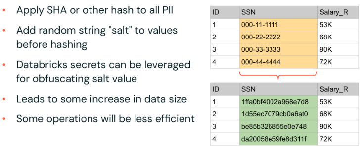

------

**Methode: Tokenisierung**

Bei der Tokenisierung wandeln wir all unsere PII in Keys um und speichern unsere Werte schließlich in einer sicheren Lookup-Tabelle. Das ist langsam beim Schreiben, aber schnell beim Lesen – zum Teil, weil unsere de-identifizierten Daten in weniger Bytes gespeichert werden, üblicherweise indem nur der Key kodiert wird, mit dem wir die Daten in einem Long-Wert nachschlagen.

Um einen Datensatz zu tokenisieren, beginnen wir damit, alle Spalten zu erfassen und sie in ein Array von Structs umzuwandeln. Sobald alle Werte identifiziert wurden, wird jedem eindeutigen Wert ein Token zugewiesen. Diese Tokens werden als Keys für eindeutige Werte im Token Vault verwendet. Die für Endnutzer sichtbare Tabelle enthält nur diese Keys, üblicherweise als Long-Werte gespeichert.

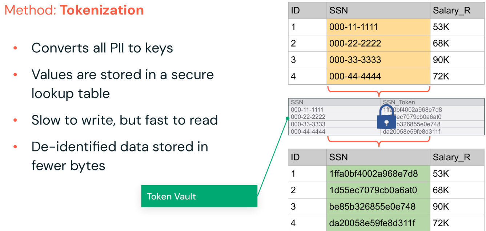

Zur Anonymisierung:

- Sie schützt ganze Datensätze, einschließlich Tabellen, Datenbanken und ganzer Datenkataloge, und verändert personenbezogene Daten unumkehrbar, um eine direkte oder indirekte Identifikation betroffener Personen zu verhindern. Das ist kein Problem, da Business-Analysten oft eher an Aggregationen und Trends interessiert sind, die sich auch ohne Einsicht in jeden einzelnen Datensatz verfolgen lassen.
- Anonymisierung verwendet in realen Szenarien typischerweise eine Kombination mehrerer Techniken, z. B. Data Suppression und Generalization.

Überblick über den Ansatz

- Schützt den **gesamten Datensatz** (Tabellen, Datenbanken oder ganze Datenkataloge), meist für Business Intelligence
- Personenbezogene Daten werden **unumkehrbar verändert**, sodass eine betroffene Person weder direkt noch indirekt identifiziert werden kann
- Üblicherweise wird in realen Szenarien eine Kombination mehrerer Techniken verwendet
- Zwei wichtige Anonymisierungsmethoden: **Data Suppression und Generalization**

------

**Methode: Data Suppression**

Bedingte Filter und dynamische Zugriffskontrollen können verwendet werden, um den Zugriff auf Spalten oder Zeilen von Daten zu entfernen, ohne die Fähigkeit der Analysten zu Reporting einzuschränken.

Aggregiertes Reporting für eine Region kann zum Beispiel weiterhin durchgeführt werden, ohne Zugriff auf vollständige Kundennamen oder Adressen. In manchen Fällen können demografische Daten leicht dazu verwendet werden, jemanden zu re-identifizieren. Selbst große Unternehmen können zum Beispiel nur eine begrenzte Anzahl von Kunden in einer kleinen Stadt haben – insbesondere, wenn es für eine bestimmte Geografie nur einen einzigen entsprechenden Datensatz gibt.

Aggregation verschleiert die zugrunde liegenden Daten nicht und kann sensible Daten möglicherweise über Reports und Dashboards offenlegen. Das Setzen eines Filters, um Zeilen mit niedrigen Counts für Gruppierungsspalten zu entfernen, kann helfen, einzelne Identitäten zu schützen. Databricks verfügt über dynamische Zugriffskontrollen, mit denen Daten auf Basis von Gruppenmitgliedschaften geschwärzt oder gefiltert werden können – das besprechen wir später im Kurs.

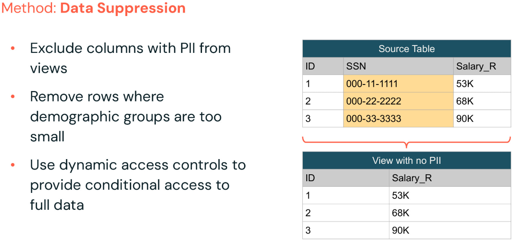

------

**Methode: Generalization**

Generalization kann als eine Möglichkeit verstanden werden, Daten durch Entfernen von Genauigkeit zu anonymisieren. Verschiedene Datentypen unterstützen verschiedene Arten von Generalization, z. B. kategoriale Generalisierung, Binning, das Kürzen von IP-Adressen und Rundung.

- **Kategoriale Generalisierung**: Bei der kategorialen Generalisierung besteht das Ziel darin, Präzision aus den Daten zu entfernen. In diesem Beispiel gruppieren wir kleinere Städte in größere regionale Gruppen wie Bundesstaat oder Land, um sicherzustellen, dass kleinere Geografien nicht offengelegt werden.

  Wenn du zum Beispiel eine anonyme Feedback-Umfrage einreichst, sie am Ende aber nach Team ausgewertet wird und du die einzige Person warst, die in deinem Team geantwortet hat, sind all deine Informationen offengelegt.

  Stattdessen würdest du diesen Grad an Genauigkeit anonymisieren und dann nach Abteilung oder Organisation gruppieren. Und weil so viele Daten aus Social Media gesammelt und geleakt wurden, können selbst scheinbar harmlose Präferenzen genutzt werden, um Einzelpersonen leicht zu identifizieren und gezielt anzusprechen.

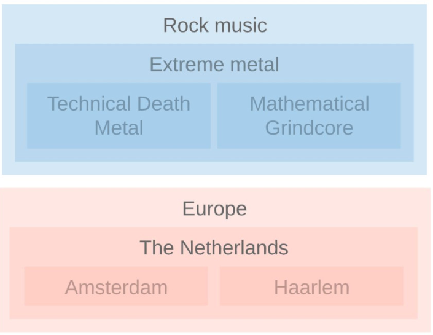

- **Binning**: Beispiele für Binning wären das Erstellen einer 10-Jahres-Altersspanne, um altersbasierte Trends zu reporten, oder das Gruppieren von Gehältern in Bänder auf Basis veröffentlichter Standards. Reports und Dashboards können weiterhin aussagekräftige Erkenntnisse liefern, aber Analysten können das genaue Gehalt einer bestimmten Person nicht ermitteln.

  Fachwissen kann nützlich sein, wenn es darum geht, sinnvolle Gruppen zu definieren. Analysten können helfen zu definieren, wie Bins auf Basis der Reporting-Anforderungen berechnet werden. Je nach den Use Cases derjenigen, die deine Daten analysieren, solltest du also Gruppen erstellen, die sinnvoll sind. In manchen Fällen brauchst du diese Information vielleicht gar nicht. In anderen musst du dir einen anderen Weg überlegen, weil du diese Information einfach entfernst. Es ist also sehr spezifisch für die Zielgruppe und den Use Case.

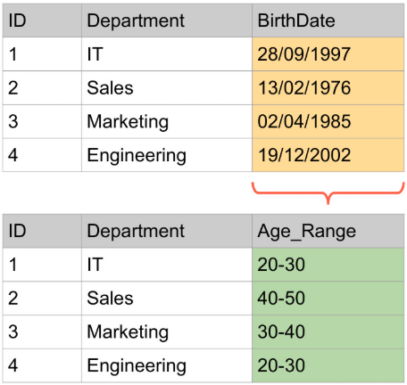

- **IP-Adressen kürzen**: Eine weitere Art der generalisierten Anonymisierungsmethode ist das Kürzen (Truncating), ein gängiger Use Case für IP-Adressen. Um eine IP-Adresse zu kürzen, können wir das letzte Byte davon nehmen und durch eine Null ersetzen, sodass sie im /24-CIDR-Bereich liegt.

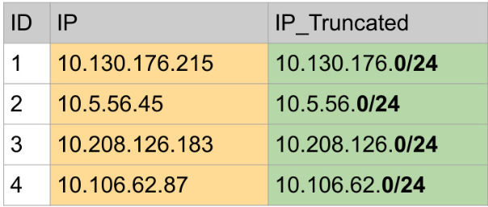

- **Rundung**: Viele Reports lassen sich sicher mit gerundeten Daten erstellen. Allgemeine Trends sind dieselben wie in ungerundeten Analysen, da Daten gleichmäßig auf- und abgerundet werden. Überlege dir also, welche Präzision nötig ist, um Erkenntnisse zu liefern. Wenn Trends im Tausenderbereich auftreten, gibt es keinen Grund, Präzision bis in den Zehnerbereich zu speichern oder offenzulegen.

  Ein einfaches Beispiel wäre, alles auf die nächsten 5 zu runden. Beachte, dass selbst bei Rundung die niedrigsten und höchsten Gruppen noch Ausreißer offenlegen können, die unterdrückt werden müssen.

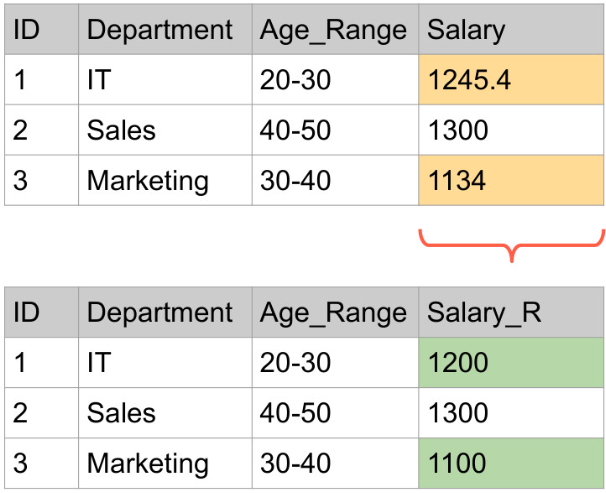

## 3_2_Zusammenfassung & Best Practices

Hier ist eine Zusammenfassung der verschiedenen Schutztechniken, die wir besprochen haben, zum ausführlichen Nachlesen.

Gängige Datenschutztechniken: Hier ist eine Zusammenfassung der verschiedenen Schutztechniken, die wir besprochen haben, zum ausführlichen Nachlesen.

| Technik                  | Beschreibung                                                 | Beispiel          | Beispiel-Use-Case                                            | Vorteile                                                     | Nachteile                                                    | Schutz           |
| ------------------------ | ----------------------------------------------------------- | ----------------- | ---------------------------------------------------------- | ----------------------------------------------------------- | ----------------------------------------------------------- | ---------------- |
| **Data Masking**         | Verbirgt Originaldaten durch modifizierten Inhalt. Dynamisches Masking in Databricks erlaubt das Definieren von Masking-Regeln. | gXXX.dXXXX@gmx.de | Sensible Daten schützen und dabei die operative Nutzbarkeit erhalten. | - Erhält das Datenformat; - Ein Teil der Information kann erhalten bleiben, während die Privatsphäre erhöht wird. | - Die Verteilung der Daten wird verändert.; - Daten sind evtl. über Informationen aus verwandten Spalten wiederherstellbar.; - Kann nicht zum Verknüpfen von Daten verwendet werden. | Gering bis mittel |
| **Pseudo-Anonymisierung** | Ersetzt Werte durch Pseudonyme oder andere künstliche Werte. | charles@gmx.de    | Medizinische Studien, in denen der Patient über die Zeit verfolgt werden muss, die Identität aber geschützt sein muss. | - Statistische Verteilung bleibt erhalten.; - Verknüpfung mehrerer Datensätze möglich. | - Aus der Verteilung der pseudo-anonymisierten Werte lassen sich evtl. tatsächliche Werte ableiten; - Daten sind evtl. über Informationen aus verwandten Spalten wiederherstellbar.; - Die Zuordnung zu den Originalwerten muss sicher gespeichert werden. | Gering bis mittel |
| **Hashing**              | Wandelt Daten in eine irreversible Zeichenkette um.          | cf35ddff242..     | Speicherung von Passwörtern                                  | - Sicher und irreversibel; - Datenverknüpfung möglich; - Erhält die Datenverteilung | - Aus der Verteilung der Hash-Werte lassen sich evtl. tatsächliche Werte ableiten; - Datenrückgewinnung nicht möglich | Mittel bis hoch  |
| **Column Encryption**    | Verschlüsselt Daten auf Spaltenebene. In Databricks werden sensible Daten vor der Speicherung verschlüsselt. | skjrk42ndd..      | Absicherung bestimmter sensibler Datenspalten.               | - Hohe Sicherheit; - Berücksichtigt einzelne Werte und Verteilungen | - Erfordert Key Management.; - Erhöht die Datengröße erheblich.; - Datenverknüpfung ist schwierig.; - Verteilung wird verändert. | Hoch             |
| **Tokenisierung**        | Ersetzt sensible Daten durch Tokens.                         | fik52tklhn2..     | Kreditkartentransaktionen                                    | - Token kann echte Daten für Operationen ersetzen.          | - Erfordert ein robustes Tokenisierungssystem.; - Alle Daten sind wiederherstellbar, wenn das Token-System kompromittiert wird. | Hoch             |

------

**Best Practices für den Umgang mit PII-Daten**

1. Kein PII zu haben ist immer besser, als PII zu haben
2. Anonymisierung ist immer > als Pseudo-Anonymisierung ist immer > als
  Klartext
3. Versuche stets, eine gesunde Paranoia gegenüber den angewendeten Schutzmaßnahmen zu bewahren
4. Wende stets die 3-Fakten-Regel an
5. Berücksichtige stets, wie Datensätze kombiniert werden könnten, um eine Re-Identifikation zu ermöglichen
6. Stelle stets sicher, dass deine Datenteams angemessen zu den geltenden Datenschutzgesetzen geschult sind
7. Nicht jedes PII ist gleich sensibel
8. Führe PIA-Reviews (Privacy Impact Assessments) durch
9. Isoliere stets Umgebungen, die PII verarbeiten
10. Dein Leben ist am einfachsten, wenn du die Umgebung isolierst, die PII schützt

- https://arxiv.org/abs/cs/0610105
- https://edps.europa.eu/system/files/2021-04/21-04-27_aepd-edps-anonymisation-en-5.pdf
- https://www.cs.utexas.edu/~shmat/shmat_oak08netflix.pdf
- https://courses.csail.mit.edu/6.857/2018/project/Archie-Gershon-Katchoff-Zeng-Netflix.pdf

# 4_Streaming-Daten und CDF

## 4_1_Capturing Changed Data

In dieser Lektion betrachten wir, wie Delta Change Data Feed Änderungen an Streaming-Daten erfasst, verarbeitet und bereitstellt – im Vergleich zu klassischem CDC.

**Updates und Deletes in Streaming-Daten**

Spark Structured Streaming ist ein hervorragendes Werkzeug, um PII-Kontrollen umzusetzen, indem Update-/Delete-Operationen inkrementell über eine Reihe von Tabellen in deiner Pipeline propagiert werden, um sicherzustellen, dass die privaten Informationen der Nutzer als Ganzes ordnungsgemäß gehandhabt werden.

Es gibt jedoch einige Einschränkungen von Structured Streaming, die berücksichtigt werden müssen.

In Structured Streaming wird eine Datenstromquelle als Tabelle behandelt, die kontinuierlich angehängt (appended) wird, und es wird erwartet, dass sie mit Datenquellen funktioniert, die append-only sind. Dasselbe gilt für die Streaming Tables in Lakeflow Spark Declarative Pipelines. Änderungen an bestehenden Daten wie Updates und Deletes brechen diese Annahme.

Wir müssen Deduplizierungslogik hinzufügen, um aktualisierte und gelöschte Datensätze zu identifizieren. Genau das ist es, was uns APPLY CHANGES INTO in Lakeflow Spark Declarative Pipelines viel einfacher und prägnanter ermöglicht als früher, als wir diese Logik in Structured Streaming manuell implementieren mussten. Genau das behandelt der vorherige Kurs.

- In Structured Streaming wird ein Datenstrom als Tabelle behandelt, die kontinuierlich angehängt wird. Structured Streaming erwartet die Arbeit mit Datenquellen, die append-only sind.
- Änderungen an bestehenden Daten (Updates und Deletes) brechen diese Erwartung!
- Wir brauchen eine Deduplizierungslogik, um aktualisierte und gelöschte Datensätze zu identifizieren.

- Hinweis: Delta-Transaktionslogs verfolgen Dateien statt Zeilen. Das Aktualisieren einer einzelnen Zeile verweist auf eine neue Version der Datei.

------

**Lösung 1: Änderung ignorieren**

**Neuverarbeitung verhindern, indem Deletes, Updates und Overwrites ignoriert werden**

Die erste Lösung besteht darin, Deletes und Änderungen zu ignorieren; das bleibt im Einklang mit der Append-only-Verarbeitungsregel und vereinfacht die Stream-Verarbeitung. Dies lässt sich mit folgenden Optionen erreichen:

- **`ignoreDeletes`**: ignoriert Transaktionen, die Daten an Partitionsgrenzen löschen. Bei vollständiger Partitionsentfernung werden keine neuen Datendateien geschrieben.

  ```python
  spark.readStream.format("delta")
  .option("ignoreDeletes", "true")
  ```

- **`skipChangeCommits`**: ignoriert dateiändernde Operationen vollständig und gibt nur eingefügte Zeilen zurück, wobei Updates und Deletes ignoriert werden. Es umfasst **`ignoreDeletes`**, d. h. es behandelt sowohl Löschungen als auch Updates an der Quelltabelle.

  ```python
  spark.readStream.format("delta")
  .option("skipChangeCommits", "true")
  ```

- Beachte, dass die Option `ignoreChanges` inzwischen zugunsten von
  `skipChangeCommits` als deprecated gilt.

Ein Use Case ist, wenn der Fokus auf der Verarbeitung neuer Datenzugänge liegt und bei Bedarf eine separate Logik zur Behandlung von Änderungen implementiert werden kann.

------

**Lösung 2: Change Data Feeds (CDF)**

**Inkrementelle Änderungen an nachgelagerte Tabellen propagieren**

- Die zweite Option nutzt einen Change Data Feed (CDF), der es ermöglicht, Änderungen auf Zeilenebene zwischen Versionen einer Delta-Tabelle zu verfolgen – einschließlich Zeilendaten und Metadaten.
- Um CDF auf Tabellenebene zu nutzen, musst du ihn bei der Tabellenerstellung manuell aktivieren oder nach der Erstellung über den Befehl „ALTER TABLE“.
- Um den Delta Change Data Feed zu nutzen, bringst du einfach deine externen Datenquellen in die Bronze-Schicht und aktivierst CDF ab diesem Punkt. So kannst du den Change Data Feed verwenden, um in die Silver- oder Gold-Schicht zu gelangen oder ihn an eine externe Plattform weiterzugeben.
- Beachte, dass die Nutzung von CDF einen zusätzlichen Overhead für das Speichern CDC-bezogener Metadaten verursacht.


------

**Was der Delta Change Data Feed für dich leistet**

**Vorteile und Use Cases von CDF**


Silver- und Gold-Tabellen

- Die Verwendung von Delta-Change-Data-Feed-Ausgaben für Änderungen in der Silver- und Gold-Schicht stellt sicher, dass alle Änderungen mit deutlich geringeren Verarbeitungskosten abgebildet werden.

Materialized Views

- In vielen Fällen besteht die Notwendigkeit, eine aggregierte Sicht auf die Daten der Gold-Ebene für ein Dashboard oder eine Echtzeitanwendung zu erfassen. Sich auf den Change Data Feed zu stützen, kann die Notwendigkeit kostspieliger Re-Aggregationen über vollständige Tabellen beseitigen und dabei sicherstellen, dass Änderungen angemessen abgebildet werden.

Änderungen übertragen

- Das Ausgeben von Daten aus Delta an andere Systeme kann helfen, bestimmte Anforderungen zu erfüllen und andere Anwendungen zu unterstützen. Für Plattformen, die Change-Data-Output aufnehmen können, entsteht so eine Möglichkeit, Datenbanken, Anwendungen und andere Systeme mit minimalem Overhead inkrementell zu aktualisieren.

Audit-Trail-Tabelle

- Compliance und Audit müssen typischerweise identifizieren können, wann, wo und wie Daten geändert wurden. In einer Delta-Tabelle gespeicherte Change-Data-Feed-Ausgaben bieten eine schnelle, abfragbare Möglichkeit, genau herauszufinden, was mit einem bestimmten Datensatz, mit Datensätzen oder mit der gesamten Tabelle passiert ist.

------

**Vergleich CDF versus CDC**

Der wesentliche Unterschied besteht in der Verwendung der Delta-Lake-Tabellen und der Implementierung über den Ordner „_change_data“; die Änderungen können über die Funktion „table_changes“ abgefragt werden, während CDC über die „APPLY CHANGES“-Syntax implementiert wird.

| Merkmal        | Change Data Feed (CDF)                                       | Change Data Capture (CDC)                                    |
| -------------- | ----------------------------------------------------------- | ---------------------------------------------------------- |
| Scope          | Spezifisch für Delta-Lake-Tabellen                           | Allgemeines Konzept, systemübergreifend anwendbar           |
| Funktionalität | Verfolgt Änderungen auf Zeilenebene innerhalb von Delta-Tabellen | Erfasst Datenänderungen zur Synchronisierung über Systeme hinweg |
| Implementierung | Auf Delta-Tabellen aktiviert; nutzt den Ordner **'_change_data'** und die Funktion **'table_changes'** | Implementiert über Spark Declarative Pipelines und APIs wie **APPLY CHANGES** |
| Effizienz      | Verarbeitet für Operationen nur geänderte Zeilen             | Synchronisiert inkrementelle Änderungen aus Quelldatenbanken |
| Use Case       | Änderungen innerhalb von Databricks verfolgen                | Änderungen aus externen Quellen erfassen                    |

------

**Wie funktioniert Delta CDF?**

Beispiel für ein CDF-Datenschema:


1. Wir beginnen mit der Originaltabelle, die drei Datensätze hat, A1 bis A3, und zwei Felder (PK und B).
2. Wir erhalten dann eine aktualisierte Version dieser Tabelle, die eine Änderung an Feld B in Datensatz A2, die Entfernung von Datensatz A3 und das Hinzufügen von Datensatz A4 zeigt. a. Bei der Verarbeitung erfasst der Delta Change Data Feed nur Datensätze, bei denen es eine Änderung gab. Dadurch kann der Delta Change Data Feed ETL-Pipelines beschleunigen, da weniger Daten angefasst werden. b. Beachte, dass Datensatz A1 nicht in der Change-Data-Feed-Ausgabe erscheint, da an diesem Datensatz keine Änderungen vorgenommen wurden.
3. Bei Updates enthält die Ausgabe, wie der Datensatz vor der Änderung aussah (das Preimage), und was er nach der Änderung enthielt (das Postimage). Das kann besonders hilfreich sein, wenn aggregierte Fakten oder Materialized Views erzeugt werden, da passende Updates an einzelnen Datensätzen vorgenommen werden können, ohne alle der Tabelle zugrunde liegenden Daten neu zu verarbeiten. So können Änderungen schneller in den für BI und Visualisierung verwendeten Daten abgebildet werden.
4. Bei Deletes und Inserts gibt der betroffene Datensatz an, ob er hinzugefügt oder entfernt wird.
5. Zusätzlich wird die Delta-Version vermerkt, um Logs darüber zu führen, was mit den Daten passiert ist. Das erlaubt bei Bedarf eine höhere Granularität für regulatorische und Audit-Zwecke. Wir erfassen außerdem den Timestamp dieser Commits und zeigen ihn gleich.
6. Dies zeigt zwar einen Batch-Prozess, aber Updates könnten auch aus einem Stream kommen und dieselbe Change-Data-Feed-Ausgabe erzeugen.

------

**Den Delta CDF konsumieren**


Es gibt zwei Möglichkeiten, den Delta Change Data Feed in der nachgelagerten Verarbeitung zu konsumieren – Stream und Batch.
**Stream-Modus**
Im Stream-Modus-Szenario, das oberhalb der Zeitachse gezeigt wird, verwendest du Delta Structured Streaming, um den Delta Change Feed zu verarbeiten, sobald er eintrifft. Dieses Muster erlaubt es, Micro-Batches auf Basis des letzten Checkpoints zu konsumieren, ohne auf ein vorher festgelegtes Zeitintervall zu warten. Der Stream verarbeitet einfach alles, was seit dem letzten Checkpoint eingetroffen ist.

1. Nehmen wir in der hier gezeigten Zeitachse an, dass das große Upsert aus unserem vorherigen Beispiel um 12:00 Uhr eintrifft.
2. Unser nächster Insert (Delta-Version 3) wird um 12:08 committet. Der Stream hat die Verarbeitung der ersten Gruppe bereits abgeschlossen und nimmt unseren Insert um 12:08 sofort auf. Er muss nicht auf eine geplante Zeit warten, um zu starten.
3. Wir erhalten dann den Insert für Delta-Version 4 um 12:09. Der Streaming-Prozess für den letzten Commit ist noch nicht abgeschlossen.
4. Delta-Version 5, ein Update desselben Datensatzes, der in Delta-Version 4 eingefügt wurde, trifft um 12:10:05 ein. Sobald der vorherige Stream-Micro-Batch abgeschlossen ist, startet der nächste und nimmt die Delta-Versionen 4 und 5 auf.
5. Wie erwähnt funktioniert das als Micro-Batch. Du hast jetzt sowohl einen Insert als auch ein Update für einen Datensatz im selben Batch. Du musst eine Behandlung hinzufügen, um die neuesten Daten auszuwählen, die aus diesem Batch eingefügt werden sollen.

**Batch-Modus**
Für den Batch-Modus, unterhalb der Zeitachse gezeigt: Der Delta Change Feed wird alle X Minuten gemeinsam verarbeitet. Du musst dann Logik hinzufügen, um das aktuelle High Watermark zu identifizieren – die zuletzt verarbeitete Delta-Version oder den zuletzt verarbeiteten Timestamp – und alle Änderungen ab diesem Punkt aufzunehmen.

1. Nehmen wir in unserem vorherigen Beispiel an, dass dieser Batch-Prozess alle 10 Minuten läuft. Wenn er um 12:00 startet, verarbeitet er das große Upsert.
2. Es folgt eine Pause bis 12:10, wenn der Prozess erneut startet, feststellt, dass das High Watermark Delta-Version 2 ist, und alles seit diesem Punkt aufnimmt. In diesem Fall sind sowohl Version 3 als auch Version 4 enthalten.
3. Der Batch pausiert dann erneut und nimmt Version 5 erst um 12:20 auf, obwohl sie kurz nach dem letzten Batch-Trigger eingetroffen ist.

------

**CDF-Konfiguration**

Wichtige Hinweise zur CDF-Konfiguration:

- Zur Erinnerung: Die CDF-Konfiguration ist **nicht** standardmäßig aktiviert. Wenn du sie anwenden möchtest, aktiviere die Eigenschaft `delta.enableChangeDataFeed` in deiner Tabelle – entweder über eine geänderte Tabelle oder indem du sie in deine Tabellendefinition aufnimmst.

  ```sql
  # At table level:
  ALTER TABLE myDeltaTable SET TBLPROPERTIES (delta.enableChangeDataFeed = true)
  ```

  ```python
  # Für alle neuen Tabellen:
  set spark.databricks.delta.properties.defaults.enableChangeDataFeed = true;
  ```

- Außerdem kannst du den Change Data Feed über die **History-Version** ansprechen oder sehr spezifisch über einen **Timestamp**.

------

**Change-Tables-Funktion**

Verfolgt Änderungen auf Zeilenebene zwischen Versionen einer Delta-Tabelle

Wie zuvor erwähnt, gibt es zwei Möglichkeiten, die Änderungen zu erfassen, und wir sehen beide in der folgenden Demo:

1. Die erste Option ist das Lesen des Streams, was den Ordner „`_change_data`“ nutzt, der zusammen mit deinen Daten und Metadaten liegt.
2. Die zweite ist für Batch-Fälle, in denen du die Funktion „`table_changes`“ mit dem Tabellennamen abfragen und die „start“- und „end“-Versionen aus der Historie der Tabelle angeben kannst.
3. Beachte, dass die Arbeit mit der Table-Changes-Funktion die Daten im angegebenen Versionsbereich zurückgibt, einschließlich drei zusätzlicher Spalten:
   a. `_change_type` gibt an, um welchen Änderungstyp es sich handelt: insert, delete, update_preimage für den vorherigen Wert und update_postimage für den aktualisierten Wert.
   b. `_commit_version` gibt die Versionsnummer an, die mit der Änderung verbunden ist.
   c. `_commit_timestamp` gibt den genauen Zeitpunkt der Änderung an.

```python
# Syntax:
table_changes(table_str, start [, end])
```

## 4_2_Daten in Databricks löschen

In dieser Lektion befassen wir uns mit dem Löschen von Daten in Databricks, dessen Nachverfolgung, der Propagierung mit CDF sowie den damit verbundenen Einschränkungen und Compliance-Use-Cases.

**Löschen von Daten in Databricks**

Um Datenschutzvorschriften wie GDPR und CCPA einzuhalten, muss PII in Databricks effektiv und effizient gehandhabt werden – und insbesondere das Löschen von PII erfordert besondere Aufmerksamkeit. Das Löschen wird typischerweise in Pipelines gehandhabt, die von den ETL-Pipelines getrennt sind.

CDF-Daten können verwendet werden, um Löschaktionen an nachgelagerte Tabellen zu propagieren. Das ähnelt dem Filtern von Multiplex-Bronze-Tabellen, um verschiedene nachgelagerte Pipelines für die ETL-Verarbeitung umzusetzen, bei der wir Daten in einen CDC-Feed einspeisen.

Bei Nutzerdaten können Aktionen im Change Data Feed herausgefiltert werden. Für alle Zugänge wie neue Datensätze, neue Nutzer-Datensätze und aktualisierte Nutzer-Datensätze würden wir die Daten weiterhin in unsere Silver-Pipelines einfügen. Für Lösch-Events können wir dies in einer separaten Pipeline behandeln, die die spezifischen Datenschutzanforderungen für das Löschen von Daten adressiert.

Das Löschen von Daten erfordert besondere Aufmerksamkeit!

- Unternehmen müssen Datenlöschanfragen sorgfältig behandeln, um die Compliance mit Datenschutzvorschriften wie GDPR und CCPA zu wahren.
- PII von Nutzern muss in Databricks effektiv und effizient gehandhabt werden, einschließlich des Löschens.
- Diese Operationen werden üblicherweise in Pipelines gehandhabt, die von den ETL-Pipelines getrennt sind.
- CDF-Daten können verwendet werden, um Löschaktionen an nachgelagerte Tabellen zu propagieren.

------

**Wichtige Datenänderungen protokollieren**

Delta Lake unterstützt beliebige Commit-Messages, die im Delta-Transaktionslog aufgezeichnet und in der Tabellenhistorie einsehbar sind. Das kann bei späterem Auditing helfen. Commit-Messages können auf globaler Ebene gesetzt und als Teil einer Schreiboperation angegeben werden. Datenzufügung kann zum Beispiel nach Verarbeitungstyp gelabelt werden, etwa manuell oder automatisiert.

Commit-Messages verwenden

- Delta Lake unterstützt **beliebige Commit-Messages**, die im Delta-Transaktionslog aufgezeichnet und in der Tabellenhistorie einsehbar sind. Das kann bei späterem **Auditing** helfen.
- Commit-Messages können:
  - Auf globaler Ebene gesetzt werden
  - Als Teil einer Schreiboperation angegeben werden. Datenzufügung kann zum Beispiel nach Verarbeitungstyp gelabelt werden: manuell, automatisiert.

------

**Datenlöschung mit CDF propagieren**

Datenlöschanfragen können mit automatisierten Triggern über Structured Streaming optimiert werden. CDF kann separat genutzt werden, um Datensätze zu identifizieren, die in nachgelagerten Tabellen gelöscht oder geändert werden müssen, wie zuvor erwähnt. Beachte: Wenn die History- und CDF-Features von Delta Lake genutzt werden, sind gelöschte Werte in älteren Versionen der Daten weiterhin vorhanden. Wir können dies lösen, indem wir an einer Partitionsgrenze löschen.

Wie kann CDF zur Propagierung von Deletes verwendet werden?

- Datenlöschanfragen können mit automatisierten Triggern über Structured Streaming optimiert werden.
- CDF kann separat genutzt werden, um Datensätze zu identifizieren, die in nachgelagerten Tabellen gelöscht oder geändert werden müssen.

Hinweis: Wenn die History- und CDF-Features von Delta Lake genutzt werden, sind gelöschte PII-Werte in älteren Versionen der Daten weiterhin vorhanden.

- Der Befehl VACUUM löscht PII physisch
- Das Löschen an einer Partitionsgrenze macht den gesamten Prozess effizienter

------

**CDF-Retention-Policy**

Bei der CDF-Retention-Policy erfolgt das Löschen von Dateien erst, wenn die Tabelle mit VACUUM bereinigt wird. CDF-Datensätze folgen derselben Retention-Policy wie die Delta-Tabelle, sodass der Befehl VACUUM CDF-Daten löscht. Standardmäßig verhindert die Delta-Engine automatische VACUUM-Operationen mit weniger als sieben Tagen Retention.

Für diese Dateien musst du die Retention-Duration-Prüfung von Spark deaktivieren. Führe VACUUM mit DRY RUN aus, um die Dateien vor der endgültigen Entfernung zu prüfen, und führe VACUUM mit null Stunden Retention aus. Beachte, dass dies die Schritte sind, die du für Delta-Tabellen unternehmen würdest, wenn du keine Lakeflow Spark Declarative Pipelines verwendest.

Wichtige Hinweise zur CDF-Konfiguration

- Das Löschen von Dateien erfolgt erst, wenn wir unsere Tabelle mit VACUUM bereinigen!
- CDF-Datensätze folgen derselben Retention-Policy wie die Tabelle. Der Befehl VACUUM löscht CDF-Daten.
- Standardmäßig verhindert die Delta-Engine VACUUM-Operationen mit weniger als 7 Tagen Retention. Um VACUUM für diese Dateien manuell auszuführen:
  - Deaktiviere die Retention-Duration-Prüfung von Spark (`retentionDurationCheck.enabled`)
  - Führe VACUUM mit DRY RUN aus, um die Dateien vor der endgültigen Entfernung zu prüfen
  - Führe VACUUM mit RETAIN 0 HOURS aus!

------

**Kann ich DML auf einer Streaming Table ausführen? (z. B. GDPR)**

Die nächste Frage lautet: „Kann ich Data-Manipulation-Aktionen wie Inserts, Updates, Deletes und Merges in eine Streaming Table ausführen?“.

Betrachten wir einen GDPR-Use-Case mit Streaming Tables und Materialized Views.

1. Im Staging werden Informationen aus Kafka eingespeist, wo wir eine begrenzte Retention haben. In diesem Beispiel speisen wir JSON-Dateien ein und streamen sie in unsere Bronze-Tabelle. Append-only wird verwendet, weil wir mit einer Streaming Table arbeiten. Von hier aus wird `APPLY CHANGES INTO` auf unsere Silver-Tabelle angewendet, um die Daten zu verarbeiten.
2. In Lakeflow Spark Declarative Pipelines haben wir eine konfigurierbare Retention, bei der du die Pipeline-Reset-Berechtigung setzen kannst, um zu verhindern, dass die Tabelle aktualisiert wird. Das kann nützlich sein, wenn du einen Nutzer dauerhaft löschen musst.
3. Für nachgelagerte Operationen kannst du Full Refreshes auf den Silver- und Gold-Tabellen mit Materialized Views durchführen, um diese Werte darauf basierend neu zu berechnen. Bei größeren Tabellen kann dies jedoch teuer sein.

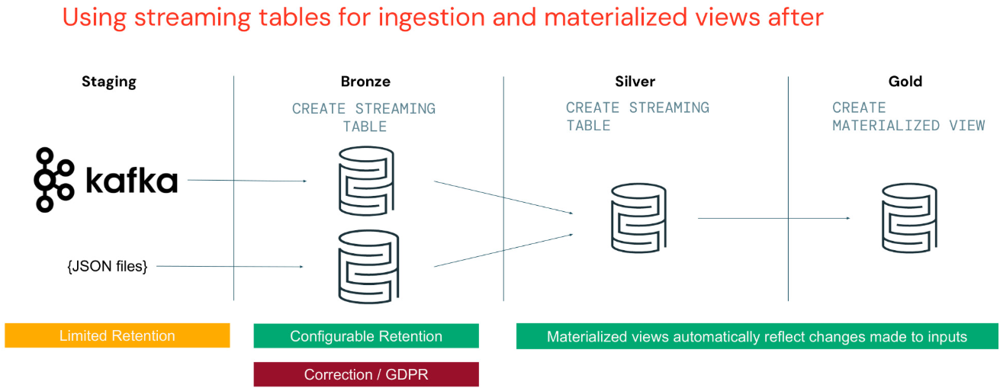

Du kannst deine Daten außerdem bei Bedarf korrigieren, für Fälle wie:

- Du kannst deine Daten anhand von Datumsintervallen löschen, um die Compliance für Aufbewahrungsfristen sicherzustellen.
- Bereinige dein PII in einer bestimmten Spalte oder führe es mit einer anderen Tabelle zusammen.
- Oder hänge einfach weiterhin neue Daten an.

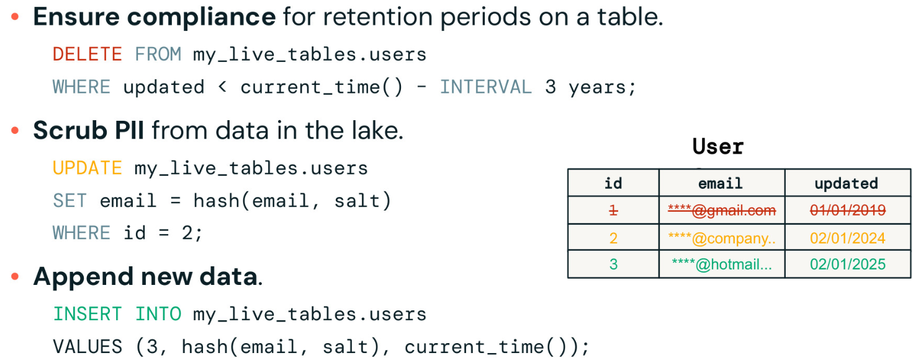

Bei Materialized Views kannst du keine direkten INSERT-, UPDATE- oder DELETE-Operationen ausführen, da sie ihrer Natur nach die Query-Ergebnisse des letzten Refreshs speichern. Das ermöglicht einen schnelleren Datenabruf für die Tabellen der Gold-Schicht. Stattdessen werden Materialized Views über Refresh-Operationen aktualisiert, die während der Lakeflow Spark Declarative Pipelines ausgeführt werden. Wenn eine MV manuell erstellt wird, kann sie manuell mit dem Befehl „Refresh“ aktualisiert werden.

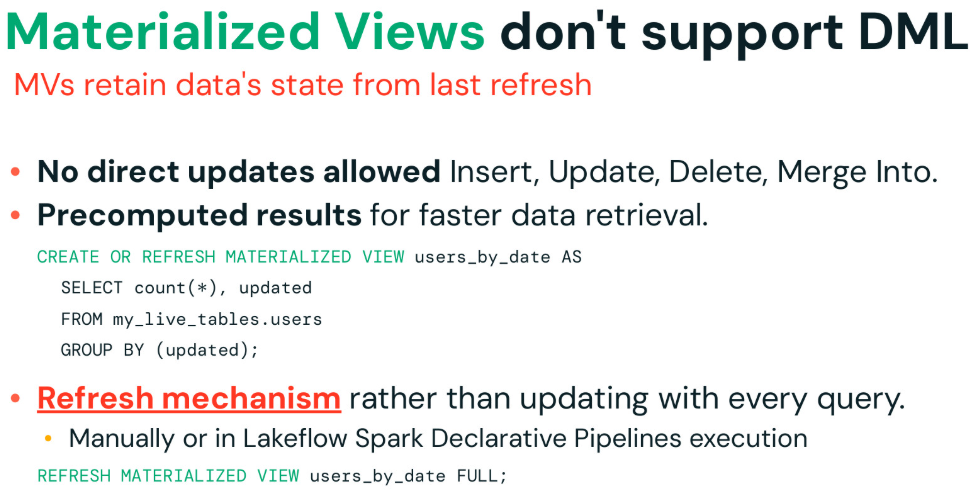

# Quiz
