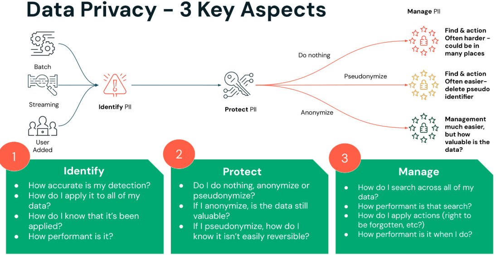

## 1_2_Data Privacy

Beim Thema Data Privacy gibt es drei zentrale Aspekte, die du in deiner Organisation berücksichtigen musst – wie du deine Daten eigenständig verwaltest und woher sie stammen:

1. Zuerst müssen wir den aktuellen Zustand identifizieren und uns Fragen stellen wie:
   a. Welche Daten gibt es, wo befindet sich ihre Quelle und wo werden sie konsumiert?
   b. Wie werden die Daten gehandhabt?
   c. Wie zuverlässig erkenne ich, welche Daten geschützt werden müssen?
   d. Woher weiß ich, dass eine Art von Sicherheit angewendet wurde?
2. Zweitens müssen wir unsere Optionen bewerten und abwägen:
   a. Sollte ich nichts tun? Lohnt es sich, diese Daten zu schützen?
   b. Sollte ich meine Daten anonymisieren oder pseudonymisieren?
   c. Wie bekomme ich meine Daten zurück, nachdem sie gesichert wurden?
3. Drittens geht es um die Verwaltung deiner Daten:
   a. Wie durchsuche ich all meine Daten?
   b. Wie wende ich Aktionen auf meine Daten an, wenn Nutzer Rechte haben wie „Recht auf Vergessenwerden“, „Recht auf Berichtigung“ oder „Recht auf Einschränkung der Verarbeitung“?

Der Aspekt „Identify“ (Identifizieren) von Data Privacy umfasst:

- Data Discovery: Organisationen müssen umfassende Dateninventare erstellen, um zu verstehen, welche personenbezogenen und sensiblen Informationen sie besitzen. Dazu gehört das Identifizieren, Kategorisieren und Labeln sensibler Daten, um deren Speicherort und Nutzung innerhalb der Organisation zu verstehen.
- Data Classification: Sobald Daten entdeckt wurden, sollten sie nach ihrer Sensibilität klassifiziert werden, z. B. PII, Finanzdaten und Gesundheitsdaten. Diese Klassifizierung hilft dabei, angemessene Datenschutzmaßnahmen und Compliance-Protokolle anzuwenden.
- Data Mapping: Ein klares Bild davon erstellen, wie Daten durch die Organisation fließen – einschließlich wo sie gespeichert sind, wer Zugriff darauf hat und wie sie genutzt werden.

Der Aspekt „Protect“ (Schützen) umfasst:

- Data Security Measures: Umsetzung technischer Schutzmaßnahmen wie Verschlüsselung, Zugriffskontrollen und Firewalls, um unbefugten Zugriff auf sensible Daten zu verhindern.
- Data Handling: Minimierung und Begrenzung der Datenerhebung auf das, was für bestimmte Geschäftszwecke notwendig ist, im Einklang mit Vorschriften wie der GDPR.
- [Außerhalb des Databricks-Scopes] Consent Management: Einholen einer ausdrücklichen und informierten Einwilligung von Personen, bevor ihre personenbezogenen Daten erhoben und verarbeitet werden.
- [Außerhalb des Databricks-Scopes] Privacy by Design: Berücksichtigung von Datenschutzaspekten bei der Entwicklung neuer Produkte, Dienste und Prozesse von Anfang an.

Der Aspekt „Manage“ (Verwalten) umfasst:

- Data Governance: Festlegung von Richtlinien, Verfahren und Best Practices für den Umgang mit personenbezogenen Daten über ihren gesamten Lebenszyklus.
- Compliance Management: Sicherstellung der Einhaltung relevanter Datenschutzvorschriften wie GDPR, CCPA und HIPAA.
- Laufendes Monitoring und Auditing: Regelmäßige Bewertung und Aktualisierung der Datenschutzpraktiken, um sich entwickelnden Bedrohungen und regulatorischen Anforderungen gerecht zu werden.
- [Außerhalb des Databricks-Scopes] Data Subject Rights Management: Umsetzung von Prozessen, um Auskunftsersuchen betroffener Personen (DSARs) und andere Datenschutzrechte effizient zu bearbeiten.
- [Außerhalb des Databricks-Scopes] Incident Response: Entwicklung und Pflege von Plänen zur Reaktion auf Datenschutzverletzungen und andere Datenschutzvorfälle.
