## 2_1_Zentrale Konzepte und Komponenten

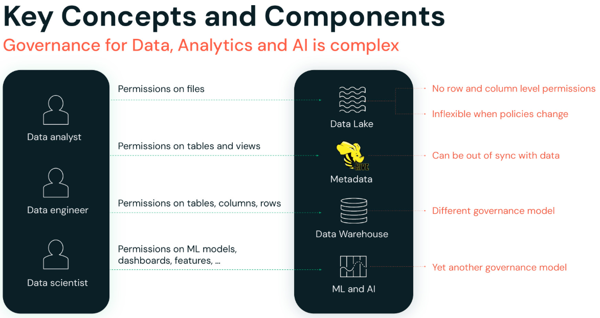

Talk Track: Dies ist ein Blick in die Welt vor Unity Catalog. Data- und AI-Governance war komplex. Der Grund, warum ich das ein so komplexes Thema nenne: Wir haben auf der linken Seite all diese unterschiedlichen Personas, die wir bedienen wollen, und all diese verschiedenen Technologietypen, mit denen wir sie bedienen wollen – und das schafft eine wirklich komplexe Governance-Umgebung.

In einem typischen Unternehmen liegen heute viele Daten in Data Lakes, z. B. AWS S3.

[Klick] Um Berechtigungen für Daten im Data Lake zu steuern, setzt du Berechtigungen auf Dateien und Verzeichnisse. [Klick] Das bedeutet, dass du keine feingranularen Berechtigungen auf Zeilen und Spalten setzen kannst. Da die Governance-Kontrollen auf Dateiebene liegen, müssen Datenteams ihr Daten-Layout sorgfältig strukturieren, um die gewünschten Richtlinien zu unterstützen. Ein Team könnte die Daten beispielsweise nach Land in verschiedene Verzeichnisse partitionieren und den Zugriff auf jedes Verzeichnis unterschiedlichen Gruppen gewähren. Aber was soll das Team tun, wenn sich die Governance-Regeln ändern? Wenn verschiedene Bundesstaaten innerhalb eines Landes unterschiedliche Datenvorschriften einführen, muss die Organisation möglicherweise alle Verzeichnisse und Dateien umstrukturieren – es wird also komplex, alle Richtlinienänderungen umzuschreiben.

[Klick] In den meisten Data Lakes hast du nicht nur Dateien, sondern auch Metadaten – du hast zum Beispiel möglicherweise einen Hive Metastore, der Tabellendefinitionen und Views verwaltet. Du musst also Berechtigungen auf Tabellen und Views vergeben. [Klick] Diese können tatsächlich aus dem Takt mit den zugrunde liegenden Daten geraten. Es gibt keine Garantie, dass Nutzer, die Zugriffsberechtigungen auf Dateien haben, auch Berechtigungen auf die entsprechende Tabelle haben oder umgekehrt. Das Verwalten von Berechtigungen wird sehr verwirrend.

[Klick] Dann hast du möglicherweise dein Data Warehouse, wo die Berechtigungen feingranularer auf Tabellen, Spalten und Views sind.

[Klick] Aber auch das ist wieder ein anderes Governance-Modell. Im typischen Szenario hast du Datenbewegungen von deinen Data Lakes und Data Warehouses – und jetzt hast du Datensilos mit Datenbewegungen über zwei Systeme hinweg geschaffen, jedes mit einem anderen Governance-Modell. Dadurch ist deine Governance-Methode inkonsistent und fehleranfällig, was es schwierig macht, Berechtigungen zu verwalten, Audits durchzuführen oder Daten zu entdecken und zu teilen.

[Klick] Aber Daten beschränken sich nicht auf Dateien oder Tabellen. Du hast auch Assets wie Dashboards, Machine-Learning-Modelle und Notebooks, jedes mit seinem eigenen Berechtigungsmodell und Tech-Stack, was es schwierig macht, Zugriffsberechtigungen für all diese Assets konsistent zu verwalten.

Das Problem wird noch größer, wenn deine Daten-Assets über mehrere Clouds mit unterschiedlichen Zugriffsmanagement-Lösungen verteilt sind.

[Überleitung zur nächsten Folie] Was du brauchst, ist ein einheitlicher Ansatz zur Vereinfachung der Governance für Daten und AI.

---

(Zusätzliche Notizen)
Herausforderungen im Data Lake

- Keine feingranularen Zugriffskontrollen
  - Cloud-Storage-Dienste bieten Zugriffskontrolle nur auf Dateiebene über cloud-spezifische Schnittstellen. Dieses Maß an Zugriffskontrolle ist grob und erlaubt keine Zugriffskontrolle unterhalb der Dateiebene. Wenn dein Data-Governance-Programm zum Beispiel verlangt, dass bestimmte Rollen nur auf eine Teilmenge der Zeilen oder Spalten innerhalb einer Tabelle zugreifen dürfen, ist das mit Zugriffskontrolle auf Dateiebene nicht möglich. Der einzige Weg, dies sicher zu erreichen, ist, die Teilmenge der Daten zu duplizieren, für die du Zugriff gewähren willst – was später zu massiven Wartungsproblemen führen kann.
- Kein gemeinsames Metadaten-Layer
  - Eine weitere Herausforderung besteht darin, dass Governance-Regeln in dieser Umgebung an das physische Layout der Dateien im Cloud-Storage gebunden werden. Angenommen, du musst das Layout reorganisieren – vielleicht hast du eine neue Möglichkeit gefunden, Dateien zu organisieren, um die Systemleistung zu verbessern. Dein gesamtes Sicherheitsmodell muss dann aktualisiert werden, um das neue Layout abzubilden.
- Nicht-standardisiertes, cloud-spezifisches Governance-Modell
  - Umgekehrt: Angenommen, deine Governance-Regeln ändern sich. Diese Änderungen können Auswirkungen auf deine Daten haben, die eine Umstrukturierung und möglicherweise sogar ein Umschreiben eines Teils oder aller Daten erfordern.
- Schwer zu auditieren
  - Noch eine weitere Herausforderung ergibt sich aus den unterschiedlichen Wegen, auf denen Unternehmen auf ihre Daten zugreifen müssen.
  - Kein gemeinsames Governance-Modell für verschiedene Arten von Daten-Assets
- Angenommen, du führst Analytics-Jobs aus, die sowohl auf Daten im Lake als auch im Warehouse zugreifen, zusammen mit Machine-Learning-Anwendungen. Diese Systeme verwenden unterschiedliche Berechtigungssteuerungsmodelle, was die Sache weiter verkompliziert.

Zusammengefasst: Der in einer typischen Data-Lake-Umgebung angebotene Ansatz zur Zugriffskontrolle führt zu komplizierten und unflexiblen Data-Governance-Implementierungen.

------

Um diese Herausforderungen zu bewältigen, haben wir Unity Catalog geschaffen, der ein einheitliches Governance-Layer für alle Daten- und AI-Assets in deinem Lakehouse bietet. Unity Catalog stellt eine einzige Schnittstelle bereit, um Berechtigungen und Auditing für deine Daten- und AI-Assets zu verwalten.

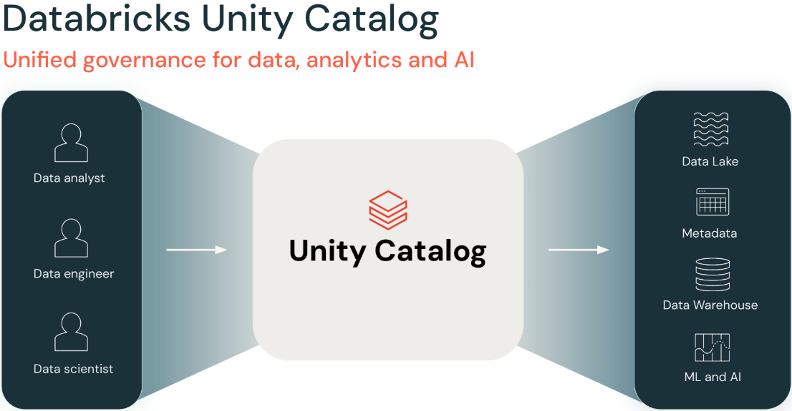

------

Zur Wiederholung: Databricks verwendet Access Control Lists, um zu steuern, wer auf welches Objekt zugreifen kann und wie.

Der „Wie“-Teil wird durch einen der zahlreichen in Databricks verfügbaren Privilege-Typen definiert, von denen einige hier beispielhaft gezeigt werden. Allerdings gelten nicht alle Privileges für alle Objekte. Das MODIFY-Privilege kann zum Beispiel nicht auf eine View angewendet werden. Das wäre bedeutungslos, da Views schreibgeschützt sind.

Der „Was“-Teil bezieht sich auf ein Securable Object wie eine Tabelle, View oder ein Schema. Das ist das Objekt, für das der Grant gilt.

Der „Wer“-Teil jedes Grants entspricht einem Databricks Principal. Das kann ein einzelner Nutzer oder Service Principal sein oder eine Gruppe. Um es zu wiederholen: Databricks empfiehlt, beim Vergeben von Berechtigungen Gruppen zu verwenden, da diese Praxis in der Regel zu einer eleganteren und wartbareren Governance-Implementierung führt.

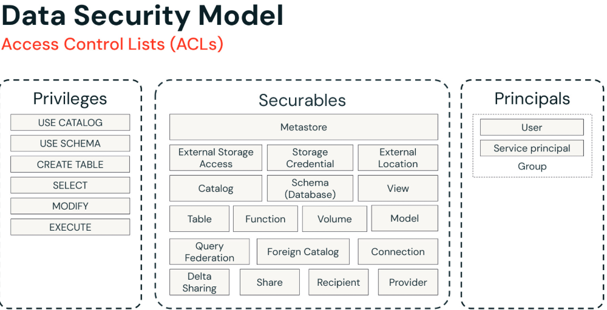

------

Zugriff kann über GRANT- und REVOKE-Anweisungen in SQL gewährt oder entzogen werden – entweder über ein Notebook oder in DBSQL. Gezeigt wird ein einfaches Beispiel, das das Gewähren des SELECT-Privilege auf einer Tabelle namens „t“ an die Gruppe „analysts“ veranschaulicht. Außerdem zeigen wir eine Anweisung, um einen solchen Grant zu widerrufen.

Die Data-Explorer-Benutzeroberfläche, verfügbar sowohl im Data Science and Engineering Workspace als auch in DBSQL, bietet die Möglichkeit, Datenobjekte interaktiv zu erstellen, zu löschen und den Zugriff darauf zu steuern.

Schließlich können wir, wie bei den meisten Elementen der Databricks-Plattform, den Datenzugriff programmatisch verwalten. Auf der untersten Ebene können Datenobjekte über REST-APIs verwaltet werden, wobei die Databricks CLI eine bequemere Möglichkeit bietet, Datenobjekte programmatisch zu verwalten. Terraform, ein offen verfügbares Infrastructure-as-Code-Tool, verwendet deklarative Konfigurationsdateien, um Datenobjekte und viele andere Aspekte der Plattform zu verwalten.

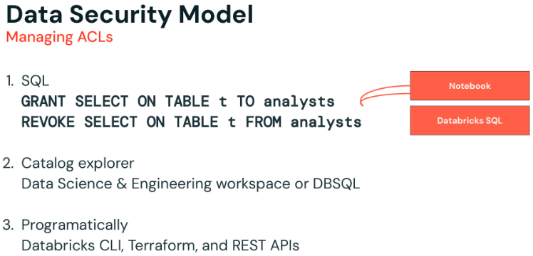

------

Lineage ist ziemlich spannend! Wir haben jetzt die Möglichkeit, Laufzeit-Lineage automatisch über Tabellen, Spalten, Dashboards, Lakeflow Jobs, Notebooks, Dateien, externe Quellen, Modelle usw. zu erfassen. Das ist enorm hilfreich, wenn du Fragen beantworten willst wie „Woher stammen diese Daten?“ oder „Welche nachgelagerten Daten-Assets beeinflusse ich, wenn ich eine Änderung an dieser Pipeline vornehme?“.

Zu Best Practices gibt es hier nicht viel zu sagen, außer: Migriere zu UC, um von Lineage zu profitieren!

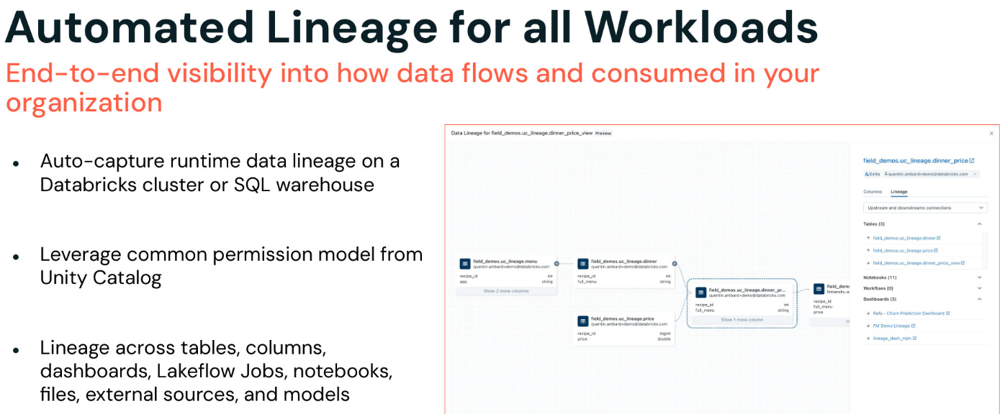

------

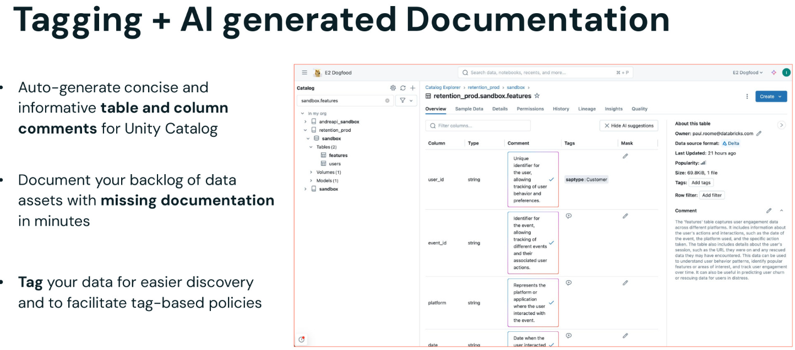

------

Wir haben außerdem Data Discovery eingeführt – eine integrierte Benutzeroberfläche, um Assets in Unity Catalog zu entdecken. Dies ist eine einheitliche UI über alle Personas hinweg und nutzt das gemeinsame Berechtigungsmodell von UC: Wenn du also keinen Zugriff hast, um eine Tabelle zu sehen oder zu lesen, erscheint sie nicht in deinen Suchergebnissen.

Die Empfehlung in Sachen Auffindbarkeit lautet, in deiner Organisation bestimmte Best Practices zu etablieren, welche Art von Tags oder Kommentaren du verwendest, und sie zum Bestandteil deiner Pipelines und deines täglichen Datenbetriebs zu machen.

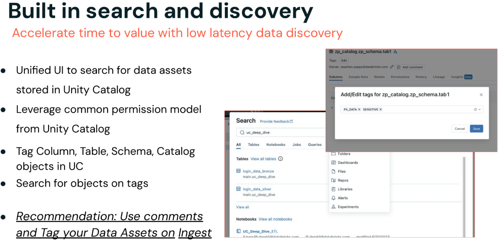

------

Feingranulare Zugriffskontrolle ermöglicht die Zugriffssteuerung auf Zeilen und Spalten innerhalb einer Tabelle.

Sie richtet sich an bestimmte Nutzer oder Gruppen und ermöglicht dir drei wichtige Anwendungsfälle:

**Use Case 1**: Der erste Anwendungsfall ist das Verbergen von Spalten für bestimmte Nutzer oder Gruppen. Beim Abfragen der View sehen die betroffenen Nutzer keine Werte für die geschützten Spalten.

Dabei wird der Zugriff auf Spaltenwerte eingeschränkt. Alle sehen, dass die Spalte vorhanden ist, aber für alle außer bestimmten Nutzern oder Gruppen werden die Spaltenwerte geschwärzt.

**Use Case 2**: Der nächste Anwendungsfall ähnelt dem gerade besprochenen, nur dass wir ihn jetzt seitlich umkippen und auf Zeilen anwenden. In diesem Anwendungsfall lassen wir Datensätze für bestimmte Nutzer oder Gruppen weg. Beim Abfragen der View sehen die betroffenen Nutzer nur die Datensätze, die nicht von den Filterkriterien erfasst wurden.

Zeilenfilterung lässt Datensätze vollständig aus der Query-Ausgabe weg. Welche Datensätze durchgelassen und welche verworfen werden, hängt vom Principal ab, der die Query formuliert, sowie von den Filterkriterien.

**Use Case 3**: Ein letzter Anwendungsfall, den wir betrachten, ist eigentlich ein Sonderfall der Spalteneinschränkung: Dabei werden Spaltenwerte für bestimmte Nutzer oder Gruppen transformiert oder teilweise verschleiert, statt sie vollständig zu schwärzen. Beim Abfragen der View sehen die betroffenen Nutzer nur eine transformierte Version der Daten für die geschützten Spalten. Zum Beispiel den Domain-Namen einer E-Mail-Adresse oder die letzten 2 Ziffern einer Kontonummer.

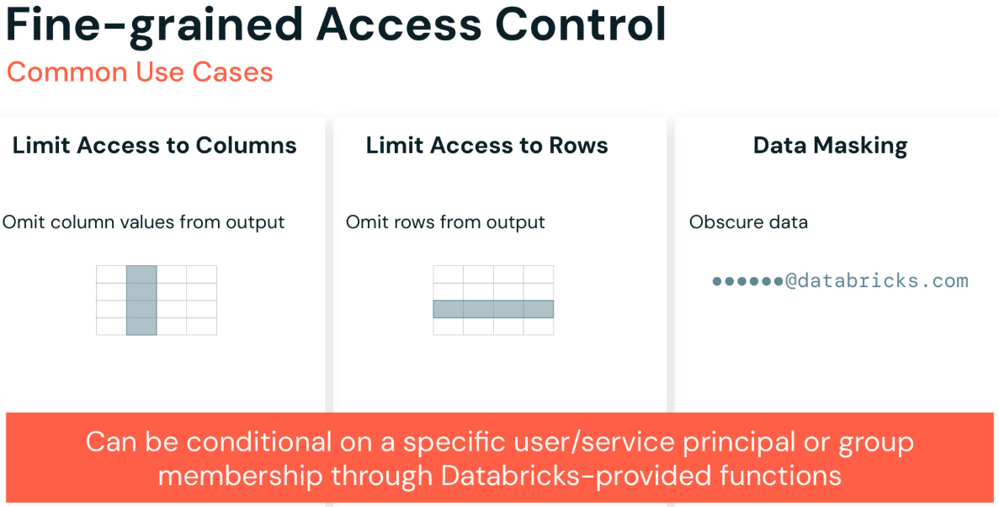

Das kann eine nützliche Technik sein, da sie zusätzliche Daten bereitstellt, die zur Unterscheidung von Ergebnissen verwendet werden können, aber nicht genug Informationen liefert, um den gesamten Wert zu bestimmen, den wir schützen.

Natürlich könnte man dies erreichen, indem man eine sekundäre Tabelle basierend auf der zu schützenden Tabelle erstellt; das führt jedoch zu Duplizierung, erhöhter Komplexität und Wartungsproblemen.

------

Sofern der Owner der View Zugriff auf die zugrunde liegenden Tabellen hat, die sie abfragt, benötigt niemand, der die View abfragt, direkten Zugriff auf diese zugrunde liegenden Tabellen. Das bedeutet, dass eine View eine Tabelle effektiv schützen kann, indem sie Zeilen oder Spalten filtert oder transformiert. Wer die View abfragt, sieht nur die Daten, die die View bereitstellt – die geschützten Daten kann er nicht sehen.

Dies ermöglicht in Kombination mit spezialisierten SQL-Funktionen, die Databricks bereitstellt, Muster, mit denen sich drei gängige Anwendungsfälle leicht umsetzen lassen.

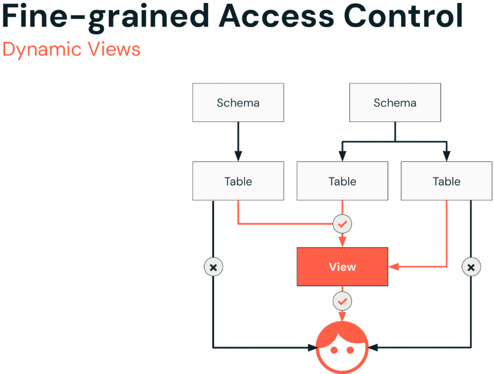

------

Der zweite Ansatz erfolgt über „Row Filtering and Column Masking“.

- Row Filtering ermöglicht es dir, einen Filter direkt auf eine Tabelle anzuwenden, sodass Queries nur Zeilen zurückgeben, die bestimmte Kriterien erfüllen. Dies wird über eine benutzerdefinierte Funktion (UDF) angewendet, die mit dem Schlüsselwort „SET ROW FILTER“ an deine Tabelle angehängt wird. Links haben wir ein einfaches Beispiel dafür, wie diese UDF namens „us_filter“ die Funktion „is_member“ nutzt, um ein solches Verhalten zu steuern.
- Column Masking ermöglicht es dir, eine Maskierungsfunktion auf eine Tabellenspalte anzuwenden, wobei jede Referenz auf die Zielspalte durch das Ergebnis der Maskierungsfunktion ersetzt wird. Ähnlich wird dies über das Schlüsselwort „SET MASK“ auf deine Tabelle angewendet. Rechts haben wir ein weiteres Beispiel für eine Funktion namens „ssn_mask“, angewendet auf die Tabelle „user“ – beachte, dass sie ein „case“ verwendet, um die ersetzten Werte zurückzugeben.
- Beachte, dass beide Ansätze – Dynamic Views sowie Row Filtering und Column Masking – dasselbe Verhalten bieten können. Es gibt jedoch einige Überlegungen: Bei Dynamic Views musst du zum Beispiel für jeden Fall, den du behandeln musst, neue Views erstellen und pflegen. Bei Row Filtering und Column Masks musst du hingegen benutzerdefinierte Funktionen erstellen und an deine Tabelle anhängen.

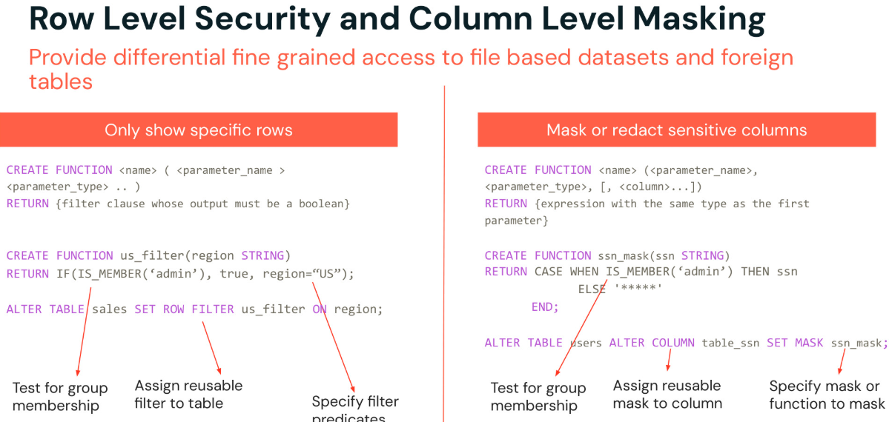

------

Data Governance ist eine People-Process-Tools-Herausforderung.

Unity Catalog kann helfen, die Prozess- und Tooling-Aspekte der Lösung zu vereinfachen.

Betrachte ein reales Beispiel für Data Governance in Aktion:

Stell dir einen großen Gesundheitsdienstleister mit Tausenden von Patienten vor. Er speichert medizinische Aufzeichnungen, Abrechnungsinformationen und Forschungsdaten in einem komplexen Ökosystem von Systemen. Ohne angemessene Data Governance:

- **Risiko einer Datenschutzverletzung**: Eine falsch konfigurierte Datenbank könnte sensible Patienteninformationen offenlegen, was zu rechtlichen Schritten und Vertrauensverlust führt.
- **Ungenaue Behandlungsentscheidungen**: Veraltete oder inkonsistente medizinische Aufzeichnungen könnten zu falschen Diagnosen oder Medikationsfehlern führen.
- **Verpasste Forschungschancen**: Schlechte Datenqualität oder fehlender Zugriff könnten wertvolle Forschung zu neuen Behandlungen behindern.

Mit effektiver Data Governance und Tools wie Databricks und Unity Catalog:

- **Sicherheit wird erhöht**: Robuste Zugriffskontrollen stellen sicher, dass nur autorisiertes Personal Patientendaten einsehen kann, was das Risiko von Verletzungen minimiert.
- **Datengenauigkeit wird verbessert**: Automatisierte Datenqualitätsprüfungen und Validierungsprozesse halten Aufzeichnungen konsistent und zuverlässig und unterstützen eine bessere Versorgung.
- **Zusammenarbeit wird vereinfacht**: Forscher können relevante Datensätze leicht entdecken und darauf zugreifen, was Erkenntnisse zum Nutzen der Patienten beschleunigt.

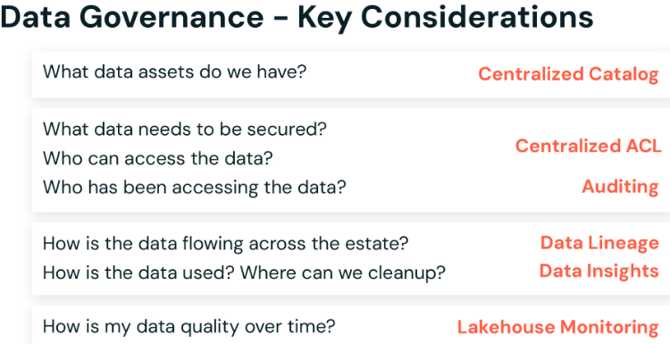
