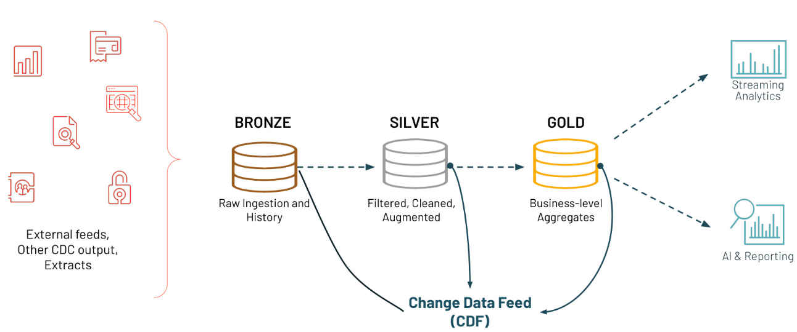
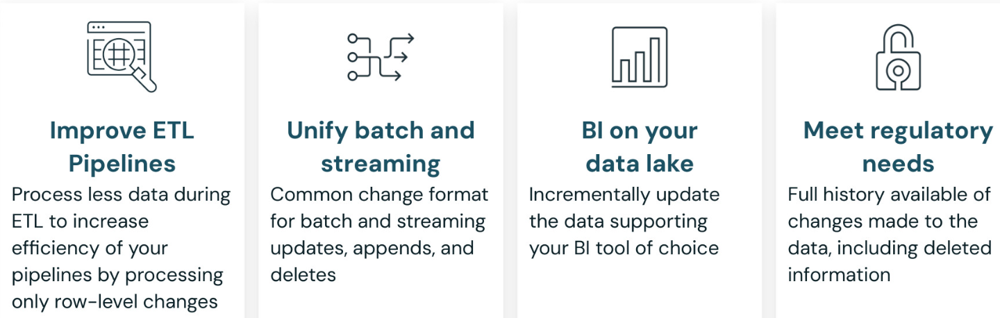
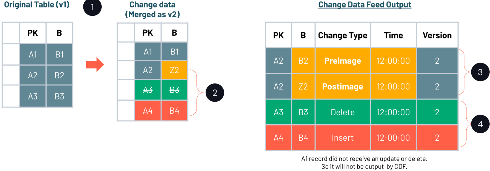
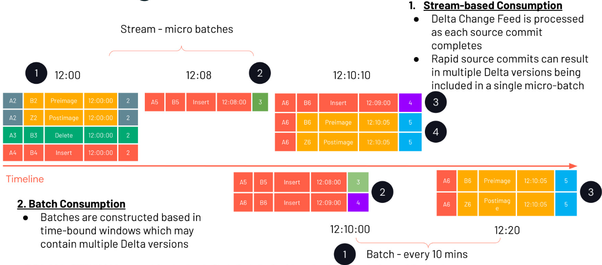

## 4_1_Capturing Changed Data

In dieser Lektion betrachten wir, wie Delta Change Data Feed Änderungen an Streaming-Daten erfasst, verarbeitet und bereitstellt – im Vergleich zu klassischem CDC.

**Updates und Deletes in Streaming-Daten**

Spark Structured Streaming ist ein hervorragendes Werkzeug, um PII-Kontrollen umzusetzen, indem Update-/Delete-Operationen inkrementell über eine Reihe von Tabellen in deiner Pipeline propagiert werden, um sicherzustellen, dass die privaten Informationen der Nutzer als Ganzes ordnungsgemäß gehandhabt werden.

Es gibt jedoch einige Einschränkungen von Structured Streaming, die berücksichtigt werden müssen.

In Structured Streaming wird eine Datenstromquelle als Tabelle behandelt, die kontinuierlich angehängt (appended) wird, und es wird erwartet, dass sie mit Datenquellen funktioniert, die append-only sind. Dasselbe gilt für die Streaming Tables in Lakeflow Spark Declarative Pipelines. Änderungen an bestehenden Daten wie Updates und Deletes brechen diese Annahme.

Wir müssen Deduplizierungslogik hinzufügen, um aktualisierte und gelöschte Datensätze zu identifizieren. Genau das ist es, was uns APPLY CHANGES INTO in Lakeflow Spark Declarative Pipelines viel einfacher und prägnanter ermöglicht als früher, als wir diese Logik in Structured Streaming manuell implementieren mussten. Genau das behandelt der vorherige Kurs.

- In Structured Streaming wird ein Datenstrom als Tabelle behandelt, die kontinuierlich angehängt wird. Structured Streaming erwartet die Arbeit mit Datenquellen, die append-only sind.
- Änderungen an bestehenden Daten (Updates und Deletes) brechen diese Erwartung!
- Wir brauchen eine Deduplizierungslogik, um aktualisierte und gelöschte Datensätze zu identifizieren.

- Hinweis: Delta-Transaktionslogs verfolgen Dateien statt Zeilen. Das Aktualisieren einer einzelnen Zeile verweist auf eine neue Version der Datei.

------

**Lösung 1: Änderung ignorieren**

**Neuverarbeitung verhindern, indem Deletes, Updates und Overwrites ignoriert werden**

Die erste Lösung besteht darin, Deletes und Änderungen zu ignorieren; das bleibt im Einklang mit der Append-only-Verarbeitungsregel und vereinfacht die Stream-Verarbeitung. Dies lässt sich mit folgenden Optionen erreichen:

- **`ignoreDeletes`**: ignoriert Transaktionen, die Daten an Partitionsgrenzen löschen. Bei vollständiger Partitionsentfernung werden keine neuen Datendateien geschrieben.

  ```python
  spark.readStream.format("delta")
  .option("ignoreDeletes", "true")
  ```

- **`skipChangeCommits`**: ignoriert dateiändernde Operationen vollständig und gibt nur eingefügte Zeilen zurück, wobei Updates und Deletes ignoriert werden. Es umfasst **`ignoreDeletes`**, d. h. es behandelt sowohl Löschungen als auch Updates an der Quelltabelle.

  ```python
  spark.readStream.format("delta")
  .option("skipChangeCommits", "true")
  ```

- Beachte, dass die Option `ignoreChanges` inzwischen zugunsten von
  `skipChangeCommits` als deprecated gilt.

Ein Use Case ist, wenn der Fokus auf der Verarbeitung neuer Datenzugänge liegt und bei Bedarf eine separate Logik zur Behandlung von Änderungen implementiert werden kann.

------

**Lösung 2: Change Data Feeds (CDF)**

**Inkrementelle Änderungen an nachgelagerte Tabellen propagieren**

- Die zweite Option nutzt einen Change Data Feed (CDF), der es ermöglicht, Änderungen auf Zeilenebene zwischen Versionen einer Delta-Tabelle zu verfolgen – einschließlich Zeilendaten und Metadaten.
- Um CDF auf Tabellenebene zu nutzen, musst du ihn bei der Tabellenerstellung manuell aktivieren oder nach der Erstellung über den Befehl „ALTER TABLE“.
- Um den Delta Change Data Feed zu nutzen, bringst du einfach deine externen Datenquellen in die Bronze-Schicht und aktivierst CDF ab diesem Punkt. So kannst du den Change Data Feed verwenden, um in die Silver- oder Gold-Schicht zu gelangen oder ihn an eine externe Plattform weiterzugeben.
- Beachte, dass die Nutzung von CDF einen zusätzlichen Overhead für das Speichern CDC-bezogener Metadaten verursacht.



------

**Was der Delta Change Data Feed für dich leistet**

**Vorteile und Use Cases von CDF**



Silver- und Gold-Tabellen

- Die Verwendung von Delta-Change-Data-Feed-Ausgaben für Änderungen in der Silver- und Gold-Schicht stellt sicher, dass alle Änderungen mit deutlich geringeren Verarbeitungskosten abgebildet werden.

Materialized Views

- In vielen Fällen besteht die Notwendigkeit, eine aggregierte Sicht auf die Daten der Gold-Ebene für ein Dashboard oder eine Echtzeitanwendung zu erfassen. Sich auf den Change Data Feed zu stützen, kann die Notwendigkeit kostspieliger Re-Aggregationen über vollständige Tabellen beseitigen und dabei sicherstellen, dass Änderungen angemessen abgebildet werden.

Änderungen übertragen

- Das Ausgeben von Daten aus Delta an andere Systeme kann helfen, bestimmte Anforderungen zu erfüllen und andere Anwendungen zu unterstützen. Für Plattformen, die Change-Data-Output aufnehmen können, entsteht so eine Möglichkeit, Datenbanken, Anwendungen und andere Systeme mit minimalem Overhead inkrementell zu aktualisieren.

Audit-Trail-Tabelle

- Compliance und Audit müssen typischerweise identifizieren können, wann, wo und wie Daten geändert wurden. In einer Delta-Tabelle gespeicherte Change-Data-Feed-Ausgaben bieten eine schnelle, abfragbare Möglichkeit, genau herauszufinden, was mit einem bestimmten Datensatz, mit Datensätzen oder mit der gesamten Tabelle passiert ist.

------

**Vergleich CDF versus CDC**

Der wesentliche Unterschied besteht in der Verwendung der Delta-Lake-Tabellen und der Implementierung über den Ordner „_change_data“; die Änderungen können über die Funktion „table_changes“ abgefragt werden, während CDC über die „APPLY CHANGES“-Syntax implementiert wird.

| Merkmal        | Change Data Feed (CDF)                                       | Change Data Capture (CDC)                                    |
| -------------- | ----------------------------------------------------------- | ---------------------------------------------------------- |
| Scope          | Spezifisch für Delta-Lake-Tabellen                           | Allgemeines Konzept, systemübergreifend anwendbar           |
| Funktionalität | Verfolgt Änderungen auf Zeilenebene innerhalb von Delta-Tabellen | Erfasst Datenänderungen zur Synchronisierung über Systeme hinweg |
| Implementierung | Auf Delta-Tabellen aktiviert; nutzt den Ordner **'_change_data'** und die Funktion **'table_changes'** | Implementiert über Spark Declarative Pipelines und APIs wie **APPLY CHANGES** |
| Effizienz      | Verarbeitet für Operationen nur geänderte Zeilen             | Synchronisiert inkrementelle Änderungen aus Quelldatenbanken |
| Use Case       | Änderungen innerhalb von Databricks verfolgen                | Änderungen aus externen Quellen erfassen                    |

------

**Wie funktioniert Delta CDF?**

Beispiel für ein CDF-Datenschema:



1. Wir beginnen mit der Originaltabelle, die drei Datensätze hat, A1 bis A3, und zwei Felder (PK und B).
2. Wir erhalten dann eine aktualisierte Version dieser Tabelle, die eine Änderung an Feld B in Datensatz A2, die Entfernung von Datensatz A3 und das Hinzufügen von Datensatz A4 zeigt. a. Bei der Verarbeitung erfasst der Delta Change Data Feed nur Datensätze, bei denen es eine Änderung gab. Dadurch kann der Delta Change Data Feed ETL-Pipelines beschleunigen, da weniger Daten angefasst werden. b. Beachte, dass Datensatz A1 nicht in der Change-Data-Feed-Ausgabe erscheint, da an diesem Datensatz keine Änderungen vorgenommen wurden.
3. Bei Updates enthält die Ausgabe, wie der Datensatz vor der Änderung aussah (das Preimage), und was er nach der Änderung enthielt (das Postimage). Das kann besonders hilfreich sein, wenn aggregierte Fakten oder Materialized Views erzeugt werden, da passende Updates an einzelnen Datensätzen vorgenommen werden können, ohne alle der Tabelle zugrunde liegenden Daten neu zu verarbeiten. So können Änderungen schneller in den für BI und Visualisierung verwendeten Daten abgebildet werden.
4. Bei Deletes und Inserts gibt der betroffene Datensatz an, ob er hinzugefügt oder entfernt wird.
5. Zusätzlich wird die Delta-Version vermerkt, um Logs darüber zu führen, was mit den Daten passiert ist. Das erlaubt bei Bedarf eine höhere Granularität für regulatorische und Audit-Zwecke. Wir erfassen außerdem den Timestamp dieser Commits und zeigen ihn gleich.
6. Dies zeigt zwar einen Batch-Prozess, aber Updates könnten auch aus einem Stream kommen und dieselbe Change-Data-Feed-Ausgabe erzeugen.

------

**Den Delta CDF konsumieren**



Es gibt zwei Möglichkeiten, den Delta Change Data Feed in der nachgelagerten Verarbeitung zu konsumieren – Stream und Batch.
**Stream-Modus**
Im Stream-Modus-Szenario, das oberhalb der Zeitachse gezeigt wird, verwendest du Delta Structured Streaming, um den Delta Change Feed zu verarbeiten, sobald er eintrifft. Dieses Muster erlaubt es, Micro-Batches auf Basis des letzten Checkpoints zu konsumieren, ohne auf ein vorher festgelegtes Zeitintervall zu warten. Der Stream verarbeitet einfach alles, was seit dem letzten Checkpoint eingetroffen ist.

1. Nehmen wir in der hier gezeigten Zeitachse an, dass das große Upsert aus unserem vorherigen Beispiel um 12:00 Uhr eintrifft.
2. Unser nächster Insert (Delta-Version 3) wird um 12:08 committet. Der Stream hat die Verarbeitung der ersten Gruppe bereits abgeschlossen und nimmt unseren Insert um 12:08 sofort auf. Er muss nicht auf eine geplante Zeit warten, um zu starten.
3. Wir erhalten dann den Insert für Delta-Version 4 um 12:09. Der Streaming-Prozess für den letzten Commit ist noch nicht abgeschlossen.
4. Delta-Version 5, ein Update desselben Datensatzes, der in Delta-Version 4 eingefügt wurde, trifft um 12:10:05 ein. Sobald der vorherige Stream-Micro-Batch abgeschlossen ist, startet der nächste und nimmt die Delta-Versionen 4 und 5 auf.
5. Wie erwähnt funktioniert das als Micro-Batch. Du hast jetzt sowohl einen Insert als auch ein Update für einen Datensatz im selben Batch. Du musst eine Behandlung hinzufügen, um die neuesten Daten auszuwählen, die aus diesem Batch eingefügt werden sollen.

**Batch-Modus**
Für den Batch-Modus, unterhalb der Zeitachse gezeigt: Der Delta Change Feed wird alle X Minuten gemeinsam verarbeitet. Du musst dann Logik hinzufügen, um das aktuelle High Watermark zu identifizieren – die zuletzt verarbeitete Delta-Version oder den zuletzt verarbeiteten Timestamp – und alle Änderungen ab diesem Punkt aufzunehmen.

1. Nehmen wir in unserem vorherigen Beispiel an, dass dieser Batch-Prozess alle 10 Minuten läuft. Wenn er um 12:00 startet, verarbeitet er das große Upsert.
2. Es folgt eine Pause bis 12:10, wenn der Prozess erneut startet, feststellt, dass das High Watermark Delta-Version 2 ist, und alles seit diesem Punkt aufnimmt. In diesem Fall sind sowohl Version 3 als auch Version 4 enthalten.
3. Der Batch pausiert dann erneut und nimmt Version 5 erst um 12:20 auf, obwohl sie kurz nach dem letzten Batch-Trigger eingetroffen ist.

------

**CDF-Konfiguration**

Wichtige Hinweise zur CDF-Konfiguration:

- Zur Erinnerung: Die CDF-Konfiguration ist **nicht** standardmäßig aktiviert. Wenn du sie anwenden möchtest, aktiviere die Eigenschaft `delta.enableChangeDataFeed` in deiner Tabelle – entweder über eine geänderte Tabelle oder indem du sie in deine Tabellendefinition aufnimmst.

  ```sql
  # At table level:
  ALTER TABLE myDeltaTable SET TBLPROPERTIES (delta.enableChangeDataFeed = true)
  ```

  ```python
  # Für alle neuen Tabellen:
  set spark.databricks.delta.properties.defaults.enableChangeDataFeed = true;
  ```

- Außerdem kannst du den Change Data Feed über die **History-Version** ansprechen oder sehr spezifisch über einen **Timestamp**.

------

**Change-Tables-Funktion**

Verfolgt Änderungen auf Zeilenebene zwischen Versionen einer Delta-Tabelle

Wie zuvor erwähnt, gibt es zwei Möglichkeiten, die Änderungen zu erfassen, und wir sehen beide in der folgenden Demo:

1. Die erste Option ist das Lesen des Streams, was den Ordner „`_change_data`“ nutzt, der zusammen mit deinen Daten und Metadaten liegt.
2. Die zweite ist für Batch-Fälle, in denen du die Funktion „`table_changes`“ mit dem Tabellennamen abfragen und die „start“- und „end“-Versionen aus der Historie der Tabelle angeben kannst.
3. Beachte, dass die Arbeit mit der Table-Changes-Funktion die Daten im angegebenen Versionsbereich zurückgibt, einschließlich drei zusätzlicher Spalten:
   a. `_change_type` gibt an, um welchen Änderungstyp es sich handelt: insert, delete, update_preimage für den vorherigen Wert und update_postimage für den aktualisierten Wert.
   b. `_commit_version` gibt die Versionsnummer an, die mit der Änderung verbunden ist.
   c. `_commit_timestamp` gibt den genauen Zeitpunkt der Änderung an.

```python
# Syntax:
table_changes(table_str, start [, end])
```
