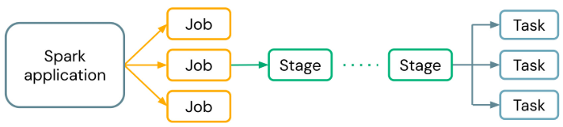
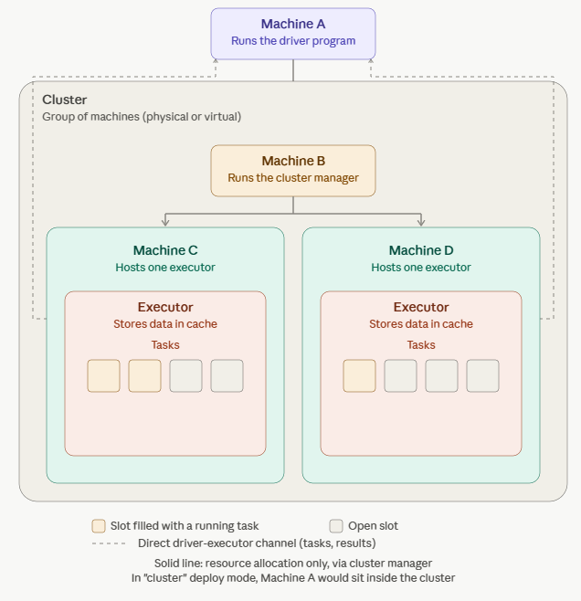
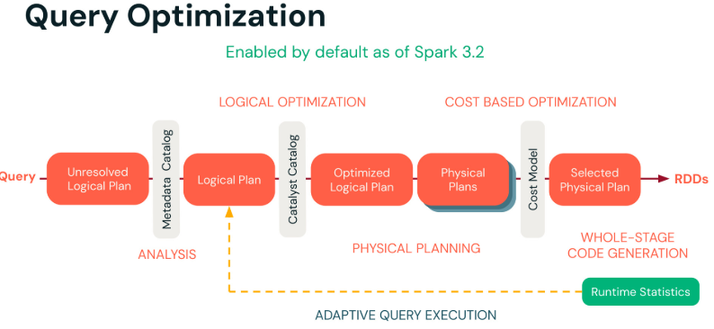

# 1_Spark Architecture

## 1_1_Spark UI Introduction

In dieser Lektion werden wir die Spark UI, ihre Architektur und Optimierungstechniken zur Verbesserung der Query- und Code-Performance untersuchen.

**Ausführung einer Spark-Anwendung**

Datenverarbeitungsaufgaben laufen parallel über einen Cluster von Maschinen

Spark nutzt Cluster von Maschinen, um Big Data zu verarbeiten, indem eine große Aufgabe in kleinere Aufgaben zerlegt und die Arbeit auf mehrere Maschinen verteilt wird. Schauen wir uns an, wie Spark eine Spark-Anwendung ausführt.

1. **Jobs**: Das Geheimnis der Performance von Spark ist Parallelismus. **Jede parallelisierte Action wird als Job bezeichnet.** Jeder Job wird in Stages unterteilt.

2. **Stages**: **Jeder Job wird in Stages unterteilt, also eine Menge geordneter Schritte**, die zusammen einen Job ausführen.

3. **Tasks**: **Tasks werden vom Driver erstellt und erhalten jeweils eine Partition der Daten zur Verarbeitung zugewiesen.** Sie sind die kleinste Arbeitseinheit.

------

**Spark-Architektur**

Gehen wir die einzelnen Elemente im untenstehenden Diagramm durch, um die **Komponenten zu identifizieren, mit denen Spark die Arbeit über einen Cluster** von Computern koordiniert. Auf hoher Ebene läuft der Workflow etwa so ab: Der Client führt eine Query aus. Der Driver erstellt Arbeitsanweisungen für mundgerechte Memory Partitions, die die Cores der Executors dann als Tasks (Arbeitseinheiten) parallel erstellen und ausführen.

- **Driver**
  - Der Driver ist **die Maschine, auf der die Anwendung läuft**. **Er ist verantwortlich für** drei Hauptaufgaben:
- die Verwaltung von Informationen über die Spark-Anwendung
- die Reaktion auf das Programm des Benutzers
- **das Analysieren, Verteilen und Planen der Arbeit über die Executors**.
  - In einem einzelnen Databricks-**Cluster** gibt es unabhängig von der Anzahl der Executors immer nur einen Driver.
- **Worker Node**
  - Ein Worker Node **hostet den Executor-Prozess. Ihm ist zu jedem Zeitpunkt eine feste Anzahl an Executors** zugewiesen.
- **Executors**
  - **Jeder Executor hält einen Teil der zu verarbeitenden Daten.** Dieser Teil wird als **Spark Partition** bezeichnet. Es handelt sich um eine Sammlung von Zeilen, die sich auf einer physischen Maschine im Cluster befindet.
- Hinweis: Dies ist völlig unabhängig von Festplattenpartitionen, die sich auf den Speicherplatz einer Festplatte beziehen.
  - Executors sind **verantwortlich für** die Ausführung der vom Driver zugewiesenen Arbeit. Jeder Executor ist für zwei Dinge verantwortlich:
- **Ausführen des vom Driver zugewiesenen Codes**
- **Rückmeldung des Berechnungsstatus an den Driver**
- **Cores** (auch bekannt als **Slots oder Threads**)
  - Spark parallelisiert auf zwei Ebenen:
- **Aufteilung der Arbeit auf die Executors.**
- **Jeder Executor verfügt über eine Anzahl von Slots. Jedem Slot kann ein Task zugewiesen werden.**
- In diesem Diagramm sind einige Slots bereits mit Tasks belegt, während andere Slots noch frei sind

**Cluster** bestehen aus einer Menge von **einer oder mehreren virtuellen Maschineninstanzen**, **über die Berechnungs-Workloads verteilt werden**. Im typischen Fall besteht ein Cluster aus einem Driver-Node sowie einem oder mehreren Worker-Nodes, wobei Databricks auch ein Single-Node-Modell anbietet (typischerweise beschränkt auf Entwicklung oder Tests mit kleinen Workloads). Die Workloads werden vom Driver auf die verfügbaren Worker-Nodes verteilt. Während die Abstraktionen und Schnittstellen einfach sind, ist die Verwaltung von Computerclustern und die Gewährleistung von Stabilität auf Produktionsniveau alles andere als trivial. Databricks macht Big Data einfach, indem es Apache Spark als gehostete Lösung bereitstellt, bei der ein Großteil Ihrer Spark-Konfiguration für Sie verwaltet wird. Dennoch ist das Verständnis der grundlegenden Spark-Architektur und Ausführungskonzepte essenziell für die Spark-Entwicklung, wie Sie später im Kurs sehen werden.

------

Basierend auf den Statistiken der abgeschlossenen Plan-Nodes wird der Ausführungsplan der verbleibenden Queries neu optimiert

- Dynamisches Wechseln der Join-Strategien
- Dynamisches Zusammenführen (Coalesce) von Shuffle Partitions
- Dynamische Optimierung von Skew Joins

Neu in Spark 3.0, standardmäßig aktiviert ab Spark 3.2

**Job-Optimierung mit AQE (Adaptive Query Execution)**:

- Erweiterte Optimierung mit AQE:
  - AQE in Spark führt eine Laufzeit-Anpassungsfähigkeit ein, um die Job-Ausführung basierend auf tatsächlichen Daten und Ausführungsstatistiken zu optimieren.
- Wesentliche Komponenten von AQE bei der Job-Optimierung:
  - Dynamische Anpassungen: AQE passt den Ausführungsplan während der Laufzeit dynamisch basierend auf beobachteten Datenstatistiken an.
  - Laufzeit-Optimierungen: Dynamic Partition Pruning, Join-Neuordnung und andere Optimierungen werden während der Ausführung des Jobs durchgeführt.

**Job-Optimierung ohne AQE**:

DataFrame-Operationen und Job-Optimierung:

- DataFrame-Operationen in Spark bestehen aus einer Abfolge von Transformationen und Actions, die auf verteilten Daten ausgeführt werden.
- Die Job-Optimierung umfasst in diesem Zusammenhang die Optimierung der Abfolge von DataFrame-Operationen innerhalb eines Spark-Jobs, um unnötiges Shuffling zu minimieren, Parallelismus zu nutzen und die Ressourcennutzung zu optimieren.

Optimierungsschritte in Spark ohne AQE:

- Logischer Plan: DataFrame-Operationen werden in Spark als logischer Plan dargestellt, der die Abfolge der auszuführenden Operationen definiert.
- Catalyst-Optimierung: Catalyst, der Optimizer von Spark, übersetzt den logischen Plan unter Berücksichtigung von Optimierungsregeln und Kostenmodellen in einen physischen Plan.
- Physischer Plan: Der physische Plan legt fest, wie die Berechnungen auf dem Spark-Cluster ausgeführt werden, indem DataFrame-Operationen in RDD-Transformationen und -Actions umgewandelt werden.
- Ermutigen Sie die Teilnehmenden, die neuen und verbesserten Methoden (DataFrames oder Datasets) anstelle älterer, weniger effizienter Methoden (RDDs) zu verwenden, die nicht von der besten Planung und Optimierung des Lehrers (Spark) profitieren.
- Vermeiden Sie es, die Teilnehmenden unnötige Arbeit verrichten zu lassen, nur um Ergebnisse zu sehen (vermeiden Sie das Auslösen von Actions wie das Anzeigen oder Sammeln von Daten, sofern dies nicht wirklich nötig ist). Heben Sie sich diese Actions für den Moment auf, in dem tatsächlich Arbeit anfällt.
- Lassen Sie nicht einen einzelnen Teilnehmenden (den Driver) die gesamte Arbeit allein mit Single-Threaded- oder einfachen Pandas-Funktionen erledigen. Nutzen Sie stattdessen Werkzeuge (wie Pandas API on Spark oder SQL), die es der ganzen Klasse (allen Cores) ermöglichen, mitzuhelfen und die Arbeitslast zu verteilen. So geht das Zählen der Bonbons deutlich schneller und die ganze Klasse wird effizient genutzt.

Empfehlungen zur Code-Optimierung

1. Verwendung von DataFrames oder SQL anstelle der RDD-APIs.
2. Vermeiden Sie in Produktions-Jobs unnötige Operationen, die neben dem Lesen und Schreiben von Dateien eine Action auslösen. Dazu können Operationen wie count(), display(), collect() gehören.
3. Vermeiden Sie Operationen, die die gesamte Berechnung auf den Driver-Node zwingen, wie etwa die Verwendung von Single-Threaded Python/Pandas. Nutzen Sie stattdessen die **Pandas API on Spark**, um Pandas-Funktionen zu verteilen.
