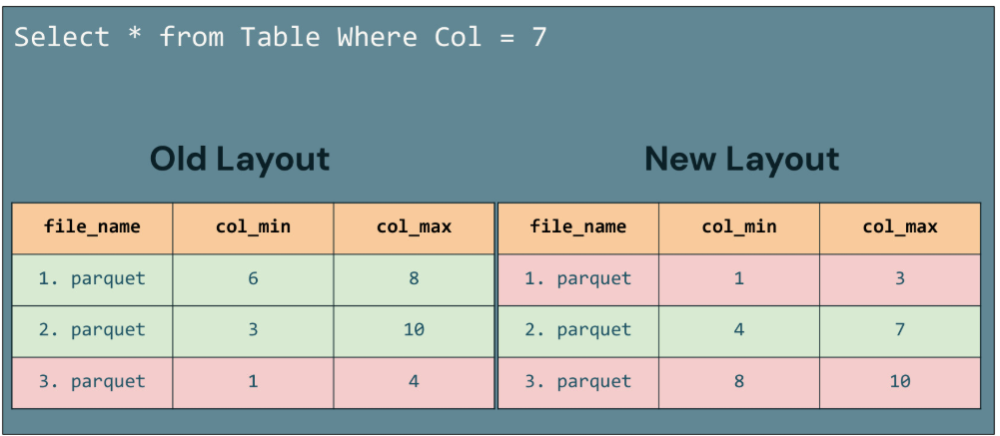

# **Z-Ordering**

Z-Ordering ist eine Methode, um Daten innerhalb einer Tabelle **basierend auf einer bestimmten Spalte** so zu organisieren, dass **ähnliche Werte in denselben Dateien gespeichert werden**. Obwohl Databricks für neue Tabellen mittlerweile Liquid Clustering gegenüber Z-Ordering oder Partitioning empfiehlt, **ist Z-Ordering nach wie vor manchmal nützlich**. 

Z-Ordering
- Schritt 1: Die Daten werden physisch nach der gewählten Spalte organisiert
- Schritt 2: Jede Datendatei speichert in ihren Metadaten den **Minimal- und Maximalwert** für diese Spalte (zum Beispiel im Footer einer Parquet-Datei). 

Data Skipping: Dieser Aufbau ermöglicht es Spark, bei der Ausführung einer Query, die nach der Z-Ordering-Spalte filtert, diese Min- und Max-Werte zu prüfen und alle Dateien zu überspringen, die die gesuchten Daten unmöglich enthalten können, ohne sie überhaupt zu öffnen. Dies reduziert die Anzahl der zu lesenden Dateien und verbessert die Gesamtperformance der Query, insbesondere bei Queries, die nach Spalten mit vielen unterschiedlichen Werten filtern.

Mit angewendetem Z-Ordering wird der Vorteil deutlich, wenn eine Query nach einem bestimmten Wert sucht (zum Beispiel bei der Auswahl von Zeilen, bei denen eine Spalte gleich sieben ist). Vor dem Z-Ordering musste Spark unter Umständen mehrere Dateien öffnen, um zu prüfen, ob sie den Wert sieben enthalten, da es keine effiziente Möglichkeit gab, herauszufinden, welche Dateien relevant sind. Nach dem Z-Ordering sind die Daten so organisiert, dass der Wert sieben, sofern vorhanden, in einer bestimmten Datei enthalten ist, wie die in den Metadaten jeder Datei gespeicherten Min- und Max-Statistiken zeigen. Spark kann diese Statistiken nutzen, um sofort die Datei zu identifizieren und zu öffnen, die den gesuchten Wert enthalten könnte, und alle anderen Dateien zu überspringen, die den Wert sieben nicht enthalten. Dieser
gezielte Zugriff vermeidet unnötige Dateizugriffe und verbessert Geschwindigkeit und Effizienz der Query-Ausführung.

------
