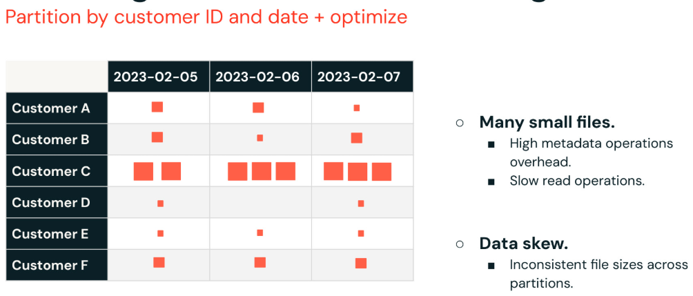
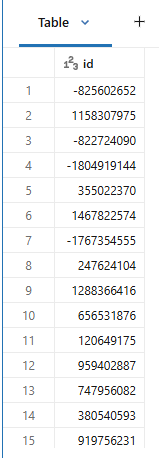

# Partitioning

Partitioning ist eine klassische Technik zur Organisation von Daten, **die es Spark ermöglicht, das Scannen unnötiger Dateien zu vermeiden**, indem **Daten nach bestimmten Spalten segmentiert werden**. Databricks rät jedoch generell von der Verwendung von Partitioning ab, **da es häufig überstrapaziert oder falsch angewendet wird**, was zu Problemen führt wie
- **einer Vielzahl kleiner Dateien** oder 
- **ungleichmäßig verteilten Daten (Data Skew)**. 

Trotz dieser Nachteile kann Partitioning **in bestimmten Fällen nützlich sein** — etwa: 

- Isolieren von Daten für separate Schemas (Single-to-Multiplexing)
- GDPR/CCPA-Anwendungsfälle, bei denen üblicherweise der Inhalt einer ganzen Partition gelöscht wird
- Anwendungsfälle, die eine physische Grenze zur Isolierung von Daten erfordern, z. B. SCD Type 2, Partitionierung nach „aktuell“ oder „nicht aktuell“ für bessere Performance.

Wenn Partitioning benötigt wird, empfiehlt sich Folgendes:

- Wählen Sie eine Spalte mit niedriger Kardinalität (wenige eindeutige Werte), um die Erzeugung vieler winziger Dateien zu vermeiden
- Versuchen Sie, jede Partition unter 1 TB und über 1 GB zu halten
- besonders hilfreich für Tabellen, die voraussichtlich über ein Terabyte anwachsen
- Partitionieren Sie (üblicherweise) nach einem Datum
- Z-Ordering kann auch zusammen mit Partitioning verwendet werden, um Queries zu optimieren, die nach häufig in WHERE-Klauseln verwendeten Spalten filtern.

------

**Herausforderungen beim Disk Partitioning**

Wir sehen häufig, dass Data Engineers ihre Tabellen auf eine Weise partitionieren, die erhebliche Performance-Probleme verursachen kann, ohne die zukünftige Query-Performance zu verbessern. Dies wird als „**Over-Partitioning**“ bezeichnet. Wir werden in dieser Demo sehen, wie sich das in der Praxis auswirkt.

Während Partitioning in manchen Szenarien nützlich sein kann, empfiehlt Databricks mittlerweile **Liquid Clustering** als flexibleren und effizienteren Ansatz. Zu den größten Herausforderungen beim Partitioning gehören 

- das **Risiko, viele kleine Dateien zu erzeugen**, was den Metadaten-Overhead erhöht und Lesevorgänge verlangsamt. 
- Außerdem **kann Partitioning zu Data Skew führen**, bei dem manche Partitionen nur sehr wenige Daten enthalten, während andere sehr viele enthalten, was zu uneinheitlichen Dateigrößen führt. Dieses Ungleichgewicht macht Query-Performance und Optimierung weniger effektiv.



------

Beispiel für Partitioning:

```python
(df
 .write
 .mode('overwrite')
 .option("overwriteSchema", "true")
 .partitionBy('id')   # nach id partitionieren
 .saveAsTable("iot_data_partitioned")
)
```

Zeigen Sie die History der Tabelle **iot_data_partitioned** an. Bestätigen Sie Folgendes:

- In der Spalte **operationParameters** ist die Tabelle nach **id** partitioniert.
- In der Spalte **operationMetrics** enthält die Tabelle 2.500 Dateien, eine Parquet-Datei für jede eindeutige partitionierte **id**.

```sql
DESCRIBE HISTORY iot_data_partitioned;
```

**Ausgabe:**

- **operationParameters:** {"**partitionBy":"[\"id\"]"**,"clusterBy":"[]","description":null,"isManaged":"true","properties":"{\"delta.enableDeletionVectors\":\"true\"}","statsOnLoad":"true"}
- **operationMetrics:** {**"numFiles":"2500"**,"numOutputRows":"2500","numOutputBytes":"3117045"}

------

Sie können die Anweisung **`SHOW PARTITIONS`** verwenden, um alle Partitionen einer Tabelle aufzulisten. Führen Sie den Code aus und betrachten Sie die Ergebnisse. Beachten Sie, dass die Tabelle nach **id** partitioniert ist und 2.500 Zeilen enthält.

------

```sql
SHOW PARTITIONS iot_data_partitioned;
```

**Ausgabe:**



```python
count = spark.sql("SHOW PARTITIONS iot_data_partitioned").count()
print(f"Partition count: {count}") # Ausgabe: 2500
```
