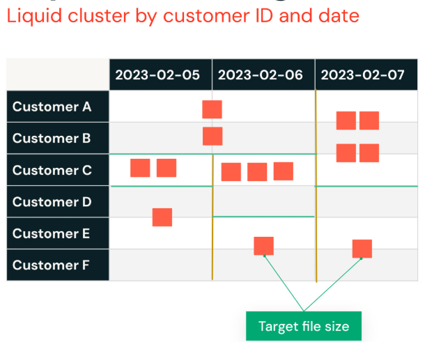

# Liquid Clustering

**Delta Lake Liquid Clustering** ersetzt **Table Partitioning** und **ZORDER**, um Entscheidungen zum Data Layout zu vereinfachen und die Query-Performance zu optimieren

**Liquid Clustering** ist eine **innovative Technik zum Clustering des Data Layouts, um einen effizienten Query-Zugriff zu unterstützen** und den Aufwand für Datenverwaltung und
-tuning zu reduzieren. Sie ist flexibel und passt sich an Änderungen der Datenmuster, an Skalierung und an Data Skew an

- Vorteile 

  - Beste Performance von Anfang an 
- Clustering beim Schreiben
  - Konsistentestes Data Skipping
- Immun gegen Data Skew
  - Minimale Write Amplification bei der Tabellenwartung
- Echtes inkrementelles Optimieren
  - Row Level Concurrency
- Vereinfachte Logik für gleichzeitige Writer
  - Reduzierter kognitiver Aufwand
- Keine Sorgen mehr um Kardinalität

Liquid Clustering ist eine innovative Technik, die Databricks entwickelt hat, um den Aufwand für die Datenverwaltung zu reduzieren und einen effizienteren Query-Zugriff zu ermöglichen. Sie bietet einen flexiblen und adaptiven Ansatz, der sich mit Ihren Daten verändert und sehr gut skaliert, wodurch Data Skew vermieden wird. Mit Liquid Clustering wird das Clustering automatisch aktiviert, sodass Sie sofort optimale Performance erhalten. Es ist immun gegen Data Skew und ermöglicht konsistenteres Data Skipping. Darüber hinaus gibt es dank echter inkrementeller Optimierung und Row-Level Concurrency nur minimale Write Amplification während der Tabellenwartung, was die Logik für gleichzeitige Writer vereinfacht und den kognitiven Aufwand reduziert. Mit Liquid Clustering müssen Sie sich keine Gedanken mehr darüber machen, ob Sie nach Spalten mit hoher oder niedriger Kardinalität clustern. Der Ansatz ist, wie der Name schon sagt, liquide (liquid) und passt sich an, während sich Ihre Daten weiterentwickeln.

Bei Liquid Clustering besteht das Hauptziel darin, eine bestimmte Dateigröße anzustreben, was im Vergleich zu traditionellen starren Grenzen deutlich mehr Flexibilität ermöglicht. Der „liquide“ Aspekt bedeutet, dass die Daten nicht an strikte Partitionen gebunden sind — Databricks kann intelligent entscheiden, welche Datenbereiche kombiniert werden, damit die Dateigrößen in etwa gleich bleiben. Dies reduziert Data Skew erheblich und führt zu konsistenten Dateigrößen. Liquid Clustering beinhaltet außerdem das Speichern von Metadaten, die dann verwendet werden, um neue Daten beim Schreiben in bestehende Cluster einzuordnen, wodurch sowohl Schreib- als auch Lesevorgänge schneller und effizienter werden.



- Liquid unterliegt keinen starren Grenzen
  - Liquid entscheidet intelligent, welche Datenbereiche kombiniert werden
- Data Skew gehört der Vergangenheit an
  - Die Datengrößen sind konsistent
- Liquid speichert Metadaten
  - Neue Daten können beim Schreiben in bestehende Cluster eingeordnet werden

------

**Tabellenstatistiken**

Tabellenstatistiken werden für jede dieser Optimierungstechniken berechnet und spielen eine entscheidende Rolle bei der Verbesserung der Tabellen-Performance. Durch das Sammeln von Statistiken zu den Tabellenspalten kann das System optimieren, wie Datendateien gelesen und verarbeitet werden. Diese Statistiken sind besonders hilfreich für Adaptive Query Execution (AQE), das sie nutzt, um den besten Join-Typ auszuwählen, die passende Build-Seite bei Hash-Joins zu bestimmen und die Join-Reihenfolge bei mehrstufigen Joins zu optimieren. Um diese Statistiken zu erfassen, kann der Befehl ANALYZE TABLE verwendet werden, mit der Angabe, „Statistiken für alle Spalten zu berechnen“. Diese detaillierten Statistiken unterstützen dann eine effizientere Query-Planung und -Ausführung.

Aktualität der Tabellenstatistiken für beste Ergebnisse mit dem Cost-Based Optimizer

- Sammelt Statistiken zu allen Spalten der Tabelle
- Unterstützt Adaptive Query Execution
  - Wahl des passenden Join-Typs
  - Auswahl der richtigen Build-Seite bei einem Hash-Join
  - Kalibrierung der Join-Reihenfolge bei einem mehrstufigen Join

```sql
ANALYZE TABLE mytable COMPUTE STATISTICS FOR ALL COLUMNS
```

------

**Predictive Optimization**

Predictive Optimization in Databricks nutzt prädiktive Analysen, um die Performance von Systemen, Workflows und Prozessen automatisch zu verbessern. Diese Technik verwendet datengestützte Erkenntnisse, um proaktiv Optimierungsmöglichkeiten zu identifizieren, bevor Probleme die Effizienz oder die Kosten beeinträchtigen. Durch die Analyse von Nutzungsmustern kann Databricks die am besten geeigneten Optimierungsstrategien für eine bestimmte Workload bestimmen und so sicherstellen, dass der Betrieb mit maximaler Performance und Kosteneffizienz läuft. Bei aktivierter Predictive Optimization überwacht Databricks kontinuierlich die Workload-Aktivität, lernt aus dem Systemverhalten und implementiert maßgeschneiderte Anpassungen. Dieser proaktive Ansatz führt zu höherer Effizienz, geringerem Ressourcenverbrauch und verbesserter Gesamtsystemleistung — er liefert im Wesentlichen die besten Optimierungsergebnisse, ohne dass manuelles Eingreifen erforderlich ist. Das System zielt darauf ab, durch automatische Feinabstimmung von Konfigurationen und Prozessen für jede individuelle Workload-Umgebung den größtmöglichen Nutzen zu erzielen.

Was ist Predictive Optimization?

- Predictive Optimization bezeichnet den Einsatz von Techniken der prädiktiven Analyse, um die Performance von Systemen, Prozessen oder Workflows automatisch zu optimieren und zu verbessern.
- Dabei werden datengestützte Erkenntnisse genutzt, um proaktiv Optimierungen zu identifizieren und umzusetzen und so Effizienz, Kosteneffizienz und Gesamtsystemleistung zu verbessern.

Predictive Optimization in Databricks bietet automatische Wartung für Delta-Tabellen und übernimmt Routine-Optimierungsaufgaben, die früher manuellen Aufwand erforderten. Dazu gehört die automatische Ausführung von Wartungsaktivitäten wie OPTIMIZE und VACUUM im Hintergrund, sodass Sie sich nicht mehr um die Planung oder Überwachung dieser Jobs kümmern müssen. Sobald Predictive Optimization eingerichtet ist, führt es intelligent alle notwendigen Wartungsarbeiten ohne Eingreifen der Nutzer aus, sodass Sie es „einrichten und vergessen“ können. Diese Vorteile stehen derzeit nur für Delta-Tabellen zur Verfügung. Zusätzlich zur Automatisierung der Wartung unterstützt Predictive Optimization Serverless Computing, wodurch die manuelle Verwaltung von Compute
-Clustern entfällt. Das System passt die Compute-Ressourcen automatisch an und führt die erforderlichen Wartungsarbeiten durch, was den betrieblichen Aufwand weiter reduziert und sowohl das Performance-Management als auch die Ressourcenzuweisung optimiert.

Wesentliche Funktionen:

- **Automatische Wartung**: Automatisiert die Ausführung von Hintergrund-Wartungsaufgaben für Delta-Tabellen.
- **Einrichten-und-vergessen-Ansatz**: Führt Wartungsjobs intelligent und automatisch aus, ohne dass eine fortlaufende Überwachung durch die Nutzer erforderlich ist.
- **Unterstützung von Wartungsoperationen**: Unterstützt Wartungsoperationen, darunter **OPTIMIZE** zur Verbesserung der Query-Performance durch Optimierung der Dateigrößen und **VACUUM** zur Reduzierung der Speicherkosten durch Löschen nicht mehr benötigter Daten
- **Serverless Computing**: Nutzt Serverless Compute, wodurch Nutzer keine Compute-Cluster mehr manuell verwalten müssen.
