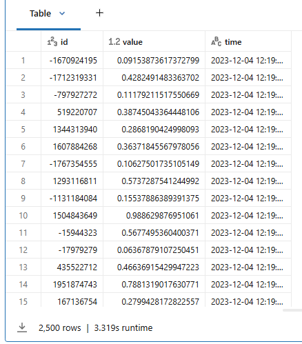
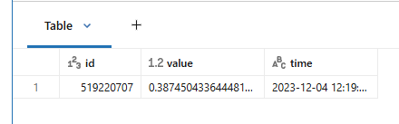
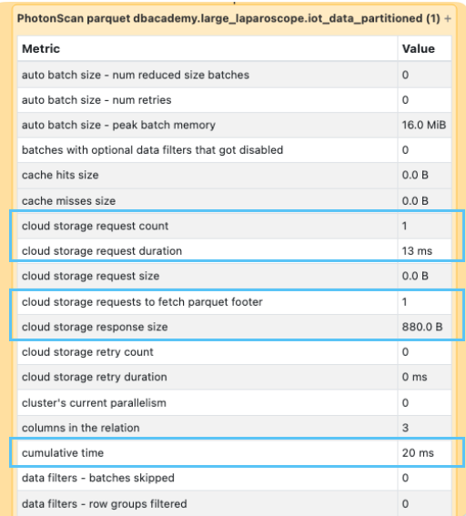

# 1_3_Process & Write IoT data

Lassen Sie uns ein paar fiktive IoT-Daten generieren. Beim ersten Durchgang erzeugen wir nur 2.500 Zeilen.

------

```python
from pyspark.sql.functions import *

df = (spark
      .range(0, 2500)
      .select(
          hash('id').alias('id'), # IDs leicht randomisieren
          rand().alias('value'),
          from_unixtime(lit(1701692381 + col('id'))).alias('time') 
      ))

df.display()
```

**Output:**



------

Jetzt schreiben wir die Daten in eine Tabelle, die nach **id** (2.500 eindeutige Werte) partitioniert ist. Dadurch wird jede Zeile in einen eigenen Ordner für die jeweilige Partition geschrieben. Das Schreiben von 2.500 Zeilen auf diese Weise wird lange dauern, da wir 2.500 Partitionen erzeugen. Jede Partition enthält einen Ordner mit einer Datei, und jede Datei speichert eine Datenzeile pro **id**, was zum "Small File"-Problem führt.

**Beachten Sie, wie lange die Erzeugung der Tabelle dauert.**

**HINWEIS:** **Dies dauert etwa 1-2 Minuten**, um die Tabelle mit 2.500 Partitionen zu erstellen.

```python
spark.sql('DROP TABLE IF EXISTS iot_data_partitioned')

(df
 .write
 .mode('overwrite')
 .option("overwriteSchema", "true")
 .partitionBy('id')
 .saveAsTable("iot_data_partitioned")
)
```

------

Lassen Sie sich die History der Tabelle **iot_data_partitioned** anzeigen. Bestätigen Sie Folgendes:

- In der Spalte **operationParameters** ist die Tabelle nach **id** partitioniert.
- In der Spalte **operationMetrics** enthält die Tabelle 2.500 Dateien, eine Parquet-Datei für jede eindeutige partitionierte **id**.

```sql
DESCRIBE HISTORY iot_data_partitioned;
```

**Output:**

- **operationParameters:** {"**partitionBy":"[\"id\"]"**,"clusterBy":"[]","description":null,"isManaged":"true","properties":"{\"delta.enableDeletionVectors\":\"true\"}","statsOnLoad":"true"}
- **operationMetrics:** {**"numFiles":"2500"**,"numOutputRows":"2500","numOutputBytes":"3117045"}

------

Mit dem Statement **`SHOW PARTITIONS`** können Sie alle Partitionen einer Tabelle auflisten. Führen Sie den Code aus und betrachten Sie die Ergebnisse. Beachten Sie, dass die Tabelle nach **id** partitioniert ist und 2.500 Zeilen enthält.

------

```sql
SHOW PARTITIONS iot_data_partitioned;
```

**Output:**


```python
count = spark.sql("SHOW PARTITIONS iot_data_partitioned").count()
print(f"Partition count: {count}") # Output: 2500
```

------

## 1_Query der Tabelle

Führen Sie die beiden Queries gegen die soeben erstellte partitionierte Tabelle aus. **Beachten Sie die Ausführungszeit jeder Query.**

```sql
-- Query 1: Filterung nach der partitionierten Spalte. 
SELECT * 
FROM iot_data_partitioned 
WHERE id = 519220707;

# Laufzeit: 2.250 s
```

**Output:**



Sehen wir uns anhand der Spark UI an, wie diese Query performt hat. Achten Sie insbesondere auf die Anzahl der Cloud-Storage-Requests und die dafür benötigte Zeit. Um zu sehen, wie die Query performt hat, gehen Sie wie folgt vor:

1. Erweitern Sie in der obigen Zelle **Spark Jobs**.

2. Klicken Sie mit der rechten Maustaste auf **View** und wählen Sie *Open in a New Tab*.

**HINWEIS:** In der Vocareum-Lab-Umgebung wird ein Fehler angezeigt, wenn Sie auf **View** klicken, ohne es in einem neuen Tab zu öffnen.

3. Suchen Sie im neuen Fenster oben die Überschrift **Jobs** und klicken Sie auf die Zahl unter **Associated SQL Query**.

4. Hier sollten Sie den gesamten Query-Plan sehen.

5. Scrollen Sie im Query-Plan nach unten zum Ende, suchen Sie **PhotonScan parquet labuser123.your schema.iot_data_partitioned (1)** und klicken Sie auf das Plus-Symbol.



#### Betrachten Sie die folgenden Metriken in der Spark UI:

| Metric                      | Value  | Note                                                         |
| :-------------------------- | :----- | :----------------------------------------------------------- |
| cloud storage request count | 1      | Bezieht sich auf die **Anzahl der Requests an Cloud-Storage-Systeme wie S3, Azure Blob oder Google Cloud Storage während der Job-Ausführung**. Dies kann mehrere Vorgänge umfassen, etwa das Lesen von Metadaten, den Zugriff auf Verzeichnisse oder das Abrufen der eigentlichen Daten. Die Überwachung dieser Metrik hilft, die Performance zu optimieren, Kosten zu senken und potenzielle Ineffizienzen bei den Datenzugriffsmustern zu erkennen. |
| cloud storage response size | 880.0B | Gibt die **insgesamt vom Cloud Storage zu Spark übertragene Datenmenge während der Ausführung eines Jobs** an. Dies hilft, das Volumen der aus dem Cloud Storage gelesenen bzw. dorthin geschriebenen Daten nachzuverfolgen, und liefert Einblicke in die I/O-Performance sowie potenzielle Engpässe beim Datentransfer. |
| files pruned                | 2.499  | Gibt die **Anzahl der Dateien an, die Spark während einer Job-Ausführung übersprungen oder ignoriert hat**. Insgesamt wurden 2.499 Dateien von Spark aufgrund des Prunings basierend auf dem Query-Filter nach **id** übersprungen. Dies liegt daran, dass die Tabelle nach **id** partitioniert ist, der abgefragten Spalte. Spark liest nur die notwendigen Partitionen zur Verarbeitung und überspringt die übrigen Partitionen. |
| files read                  | 1      | Gibt **die Anzahl der Dateien an, die Spark während der Job-Ausführung tatsächlich gelesen hat**. Hier wurde während der Ausführung des Spark-Jobs 1 Datei gelesen. Es wurde nur 1 Datei gelesen, weil die Query auf der partitionierten Spalte **id** ausgeführt wurde. Spark muss basierend auf der Query nur die notwendige(n) Partition(en) lesen. |

#### Zusammenfassung

**Da die Daten nach `id` partitioniert und nach der partitionierten Spalte abgefragt wurden, liest Spark nur die notwendige(n) Partition(en)** (in diesem Beispiel eine Partition) und überspringt die übrigen partitionierten Dateien.

## 2_Query 2 - Filter nach einer nicht partitionierten Spalte

```sql
SELECT avg(value) 
FROM iot_data_partitioned 
WHERE time >= "2023-12-04 12:19:00" AND
      time <= "2023-12-04 13:01:20";
-- Ausgabe: Laufzeit: 8.260 s
```

Sehen wir uns anhand der Spark UI an, wie diese Query performt hat. Achten Sie insbesondere auf die Anzahl der Cloud-Storage-Requests und die dafür benötigte Zeit. Um zu sehen, wie die Query performt hat, gehen Sie wie folgt vor:

1. Erweitern Sie in der obigen Zelle **Spark Jobs**.

2. Klicken Sie mit der rechten Maustaste auf **View** und wählen Sie *Open in a New Tab*.

**HINWEIS:** In der Vocareum-Lab-Umgebung wird ein Fehler angezeigt, wenn Sie auf **View** klicken, ohne es in einem neuen Tab zu öffnen.

3. Suchen Sie im neuen Fenster oben die Überschrift **Jobs** und klicken Sie auf die Zahl unter **Associated SQL Query**.

4. Hier sollten Sie den gesamten Query-Plan sehen.

5. Scrollen Sie im Query-Plan nach unten zum Ende, suchen Sie **PhotonScan parquet labuser123.your schema.iot_data_partitioned (1)** und klicken Sie auf das Plus-Symbol.

#### Betrachten Sie die folgenden Metriken in der Spark UI (Ergebnisse können variieren):

| Metric                                            | Value                                  | Note                                                         |
| :------------------------------------------------ | :------------------------------------- | :----------------------------------------------------------- |
| cloud storage request count total (min, med, max) | 2500 (21, 37, 37)                      | Bezieht sich auf die **Anzahl der Requests an Cloud-Storage-Systeme wie S3, Azure Blob oder Google Cloud Storage während der Job-Ausführung.** Dies kann mehrere Vorgänge umfassen, etwa das Lesen von Metadaten, den Zugriff auf Verzeichnisse oder das Abrufen der eigentlichen Daten. Die Überwachung dieser Metrik hilft, die Performance zu optimieren, Kosten zu senken und potenzielle Ineffizienzen bei den Datenzugriffsmustern zu erkennen. Min, med und max stellen die Zusammenfassung der von Tasks bzw. Executors gestellten Requests dar. Die Verteilung ist über Tasks bzw. Executors hinweg recht gleichmäßig, und es gibt keine große Varianz bei der Anzahl der Cloud-Storage-Requests je Task. |
| cloud storage response size total (min, med, max) | 2.1 MiB (18.0 KiB, 31.8 KiB, 31.8 KiB) | Gibt die **insgesamt vom Cloud Storage zu Spark übertragene Datenmenge während der Ausführung eines Jobs** an. Dies hilft, das Volumen der aus dem Cloud Storage gelesenen bzw. dorthin geschriebenen Daten nachzuverfolgen, und liefert Einblicke in die I/O-Performance sowie potenzielle Engpässe beim Datentransfer. Min, med und max zeigen, dass die meisten Tasks zwischen 18.0 KiB und 31.8 KiB an Daten übertragen, was auf ein relativ konsistentes und gleichmäßiges Datentransfermuster über die Tasks hinweg hinweist. |
| files pruned                                      | 0                                      | Insgesamt wurden 0 **Dateien von Spark aufgrund des Prunings basierend auf den Filtern der Query übersprungen.** Dies liegt daran, dass die Tabelle nach **id** partitioniert, aber nach der Spalte **time** abgefragt wird. Bei dieser Query wurden keine Dateien geprunt. |
| files read                                        | 2.500                                  | Während der Ausführung des Spark-Jobs wurden 2.500 **Dateien gelesen**. Dies liegt daran, dass die Query auf der Spalte **time** ausgeführt wurde, die Tabelle aber nach der Spalte **id** partitioniert ist. Bei dieser Query wurden alle Dateien in Spark eingelesen und anschließend auf die notwendigen Zeilen gefiltert. |

#### Zusammenfassung

Da die Daten nach **id** partitioniert, aber nach der Spalte **time** abgefragt wurden, **liest Spark alle Dateien, um die erforderliche Query auszuführen**, und filtert die Daten, um eine einzelne Zeile zurückzugeben.

