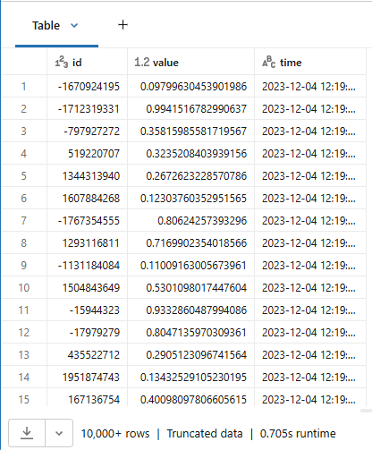

# 1_4_Das Problem beheben

Bisher haben wir **mit 2.500 Datenzeilen gearbeitet, die in der Tabelle partitioniert waren**.

Nun erhöhen wir das Volumen drastisch auf 50.000.000 Zeilen. Hätten wir den obigen Code mit einem so großen Datensatz ausprobiert, hätte die Erstellung aller Partitionen (Verzeichnisse für jede Partition) erheblich länger gedauert.

Wie zuvor erzeugt die folgende Zelle die Daten.

------

```python
from pyspark.sql.functions import *

df = (spark
      .range(0,50000000, 1, 32)
      .select(
          hash('id').alias('id'), # IDs leicht randomisieren
          rand().alias('value'),
          from_unixtime(lit(1701692381 + col('id'))).alias('time') 
      )
    )

df.display()
```

**Output:**



------

Jetzt erstellen wir eine Tabelle namens **iot_data**, um die Daten zu erfassen, **diesmal ohne Partitionierung**. Dieses Vorgehen bringt folgende Vorteile:

- Es dauert weniger Zeit, selbst bei größeren Datensätzen, da wir keine große Anzahl an Tabellenpartitionen erzeugen.
- Es werden weniger Dateien geschrieben (32 Dateien für 50.000.000 Zeilen gegenüber 2.500 Dateien für 2.500 Zeilen in der partitionierten Tabelle).
- Das Schreiben ist schneller im Vergleich zur Disk-Partitionierung, da sich alle Dateien in einem Verzeichnis befinden, statt 2.500 Verzeichnisse zu erzeugen.
- Abfragen nach einer **id** dauern etwa gleich lange wie zuvor.
- Filter nach der Spalte **time** sind deutlich schneller, da nur ein Verzeichnis abgefragt werden muss.

```sql
spark.sql('DROP TABLE IF EXISTS iot_data')

(df
 .write
 .option("overwriteSchema", "true")
 .mode('overwrite')
 .saveAsTable("iot_data")
)

display(spark.sql('SELECT count(*) FROM iot_data'))

# Output: count: 50000000
```

**Output:**

------

Lassen Sie sich die History der Tabelle **iot_data** anzeigen. Bestätigen Sie Folgendes:

- In der Spalte **operationParameters** bestätigen Sie, dass die Tabelle nicht partitioniert ist.
- In der Spalte **operationMetrics** bestätigen Sie, dass die Tabelle insgesamt 32 Dateien enthält.

```sql
DESCRIBE HISTORY iot_data;
```

**Output:**

**operationParameters:**

{**"partitionBy":"[]"**,"clusterBy":"[]","description":null,"isManaged":"true","properties":"{\"delta.enableDeletionVectors\":\"true\"}","statsOnLoad":"true"}

**operationMetrics:**

{**"numFiles":"32"**,"numOutputRows":"50000000","numOutputBytes":"809094243"}

------

