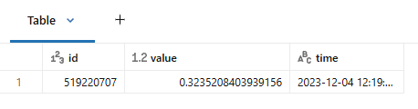

# 1_5_Validate Optimization

Die nächsten beiden Zellen wiederholen die Queries von zuvor und stellen diese Änderung auf die Probe. Die erste Zelle sollte fast genauso schnell laufen wie zuvor, und die zweite Zelle sollte deutlich schneller laufen.

## 1_Query 1 - Filter nach der id-Spalte (nicht partitionierte Tabelle)

```sql
SELECT * 
FROM iot_data 
WHERE id = 519220707

-- runtime: 1.795s
```

**Output:**



Sehen wir uns anhand der Spark UI an, wie diese Query performt hat. Vergleichen Sie die Ergebnisse mit derselben Query, die wir zuvor gegen eine over-partitionierte Tabelle ausgeführt haben.

1. Erweitern Sie in der obigen Zelle **Spark Jobs**.

2. Klicken Sie mit der rechten Maustaste auf **View** und wählen Sie *Open in a New Tab*.

**HINWEIS:** In der Vocareum-Lab-Umgebung wird ein Fehler angezeigt, wenn Sie auf **View** klicken, ohne es in einem neuen Tab zu öffnen.

3. Suchen Sie im neuen Fenster oben die Überschrift **Jobs** und klicken Sie auf die Zahl unter **Associated SQL Query**.

4. Hier sollten Sie den gesamten Query-Plan sehen.

5. Scrollen Sie im Query-Plan nach unten zum Ende, suchen Sie **PhotonScan parquet labuser123.\*your schema\*.iot_data (1)** und klicken Sie auf das Plus-Symbol.

#### Betrachten Sie die folgenden Metriken in der Spark UI (Ergebnisse können variieren):

| Metric                                            | Value                                    | Note                                                         |
| :------------------------------------------------ | :--------------------------------------- | :----------------------------------------------------------- |
| cloud storage request count total (min, med, max) | 65 (8, 8, 9)                             | Bezieht sich auf die Anzahl der Requests an Cloud-Storage-Systeme wie S3, Azure Blob oder Google Cloud Storage während der Job-Ausführung. Dies kann mehrere Vorgänge umfassen, etwa das Lesen von Metadaten, den Zugriff auf Verzeichnisse oder das Abrufen der eigentlichen Daten. Die Überwachung dieser Metrik hilft, die Performance zu optimieren, Kosten zu senken und potenzielle Ineffizienzen bei den Datenzugriffsmustern zu erkennen. Die Verteilung der Request-Anzahl ist über Tasks/Executors hinweg recht gleichmäßig, da die Werte für min, med und max sehr nah beieinander liegen (8 und 9), was auf einen konsistenten Cloud-Storage-Zugriff während der Ausführung hindeutet. |
| cloud storage response size total (min, med, max) | 216.9 MiB (24.8 MiB, 24.8 MiB, 43.0 MiB) | Gibt die insgesamt vom Cloud Storage zu Spark übertragene Datenmenge während der Ausführung eines Jobs an. Dies hilft, das Volumen der aus dem Cloud Storage gelesenen bzw. dorthin geschriebenen Daten nachzuverfolgen, und liefert Einblicke in die I/O-Performance sowie potenzielle Engpässe beim Datentransfer. |
| files pruned                                      | 0                                        | Insgesamt wurden 0 Dateien von Spark aufgrund des Prunings basierend auf den Filtern der Query übersprungen. Dies liegt daran, dass für die Tabelle keine optimierten Speichertechniken verwendet wurden. |
| files read                                        | 32                                       | Während der Ausführung des Spark-Jobs wurden 32 Dateien gelesen. |

#### Zusammenfassung

In diesem Beispiel hatten wir 50.000.000 Zeilen (mehr als die ursprünglichen 2.500 Zeilen), aber nur 32 Dateien und keine Partitionen in der Tabelle. Obwohl diese Tabelle deutlich mehr Zeilen enthielt, musste Spark nur 32 Dateien und keine Partitionen abfragen. So wurde das Small-File-Problem vermieden, das bei der partitionierten Tabelle auftrat, wodurch die Query schnell ausgeführt werden konnte.

## 2_Query 2 - Filter nach der time-Spalte (nicht partitionierte Tabelle)

```sql
SELECT avg(value) 
FROM iot_data 
WHERE time >= "2023-12-04 12:19:00" AND 
      time <= "2023-12-04 13:01:20";

-- Output: avg(value) 0.5004185931678183
-- runtime: 1.119s
```

Sehen wir uns anhand der Spark UI an, wie diese Query performt hat. Vergleichen Sie die Ergebnisse mit derselben Query, die wir zuvor gegen eine over-partitionierte Tabelle ausgeführt haben.

1. Erweitern Sie in der obigen Zelle **Spark Jobs**.

2. Klicken Sie mit der rechten Maustaste auf **View** und wählen Sie *Open in a New Tab*.

**HINWEIS:** In der Vocareum-Lab-Umgebung wird ein Fehler angezeigt, wenn Sie auf **View** klicken, ohne es in einem neuen Tab zu öffnen.

3. Suchen Sie im neuen Fenster oben die Überschrift **Jobs** und klicken Sie auf die Zahl unter **Associated SQL Query**.

4. Hier sollten Sie den gesamten Query-Plan sehen.

5. Scrollen Sie im Query-Plan nach unten zum Ende, suchen Sie **PhotonScan parquet labuser123.\*your schema\*.iot_data (1)** und klicken Sie auf das Plus-Symbol.

#### Betrachten Sie die folgenden Metriken in der Spark UI (Ergebnisse können variieren):

| Metric                      | Value    | Note                                                         |
| :-------------------------- | :------- | :----------------------------------------------------------- |
| cloud storage request count | 3        | Bezieht sich auf die Anzahl der Requests an Cloud-Storage-Systeme wie S3, Azure Blob oder Google Cloud Storage während der Job-Ausführung. Dies kann mehrere Vorgänge umfassen, etwa das Lesen von Metadaten, den Zugriff auf Verzeichnisse oder das Abrufen der eigentlichen Daten. |
| cloud storage response size | 18.4 MiB | Gibt die insgesamt vom Cloud Storage zu Spark übertragene Datenmenge während der Ausführung eines Jobs an. Dies hilft, das Volumen der aus dem Cloud Storage gelesenen bzw. dorthin geschriebenen Daten nachzuverfolgen, und liefert Einblicke in die I/O-Performance sowie potenzielle Engpässe beim Datentransfer. |
| files pruned                | 31       | Spark stellte fest, dass 31 Dateien basierend auf dem WHERE-Bedingungsfilter für die Spalte **time** keine relevanten Daten enthielten. |
| files read                  | 1        | Spark hat nur 1 der Dateien aus dem Cloud Storage gelesen.   |

#### Zusammenfassung

In diesem Beispiel hatten wir 50.000.000 Zeilen (mehr als die ursprünglichen 2.500 Zeilen), aber nur 32 Dateien in der Tabelle. Obwohl diese Tabelle deutlich mehr Zeilen enthielt, musste Spark nur 32 Dateien abfragen und konnte fast alle Dateien basierend auf der Spalte **time** prunen. So wurde das Small-File-Problem vermieden, das bei der partitionierten Tabelle auftrat.

