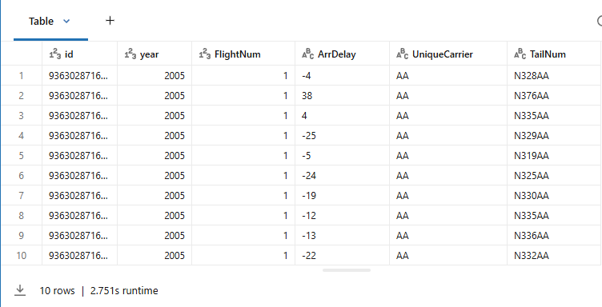

## 1_Die Daten erkunden

In diesem Lab verwenden wir Airline-Flugdaten, die auf drei verschiedene Arten gespeichert wurden:

- **flights**: OPTIMIZED mit einem ZORDER auf **FlightNum**.
- **flights_cluster_id**: Liquid clustered anhand der Spalte **id**.
- **flights_cluster_id_flightnum**: Liquid clustered anhand von zwei Spalten (**id** und **FlightNum**).

Jede Tabelle enthält genau dieselben Daten.

1. Sehen Sie sich die Tabelle **flights** in der Vorschau an. Beachten Sie, dass sie die folgenden Spalten enthält: **id, year, FlightNum, ArrDelay, UniqueCarrier, TailNum**.

```sql
SELECT * FROM flights LIMIT 10;
```

**Output:**



------

2. Zählen Sie die Anzahl der Zeilen in jeder der Flight-Tabellen (**flights, flights_cluster_id, flights_cluster_id_flightnum**), um zu bestätigen, dass die Anzahl der Zeilen in jeder Tabelle *1.235.347.780* beträgt.

   Jede Tabelle enthält dieselben Daten, ist jedoch unterschiedlich gespeichert.

```sql
SELECT 'flights', count(*) AS TotalRows
FROM flights
UNION ALL
SELECT 'flights_cluster_id', count(*) AS TotalRows
FROM flights_cluster_id
UNION ALL
SELECT 'flights_cluster_id_flightnum', count(*) AS TotalRows
FROM flights_cluster_id_flightnum;
```

**Output:**

- flights TotalRows:                                    1235347780
- flights_cluster_id TotalRows:                   1235347780
- flights_cluster_id_flightnum TotalRows:  1235347780