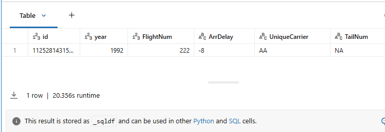

## 2_Abfrage-Performance mit ZORDER

1. Führen Sie die folgende Zelle aus, um die History der Tabelle **flights** anzuzeigen. Beobachten Sie im Output Folgendes:
   - Finden Sie in der Spalte **operation** die Version (Zeile) der Delta-Tabelle, die ***OPTIMIZED*** wurde.
   - Beachten Sie in der Spalte **operationParameters**, dass die Tabelle **flights** **mit einem ZORDER auf der Spalte FlightNum optimiert** wurde. Z-Ordering ist eine Technik, mit der zusammengehörige Informationen in derselben Menge von Dateien zusammengeführt werden.
   - Beobachten Sie in der Spalte **operationMetrics**, dass die OPTIMIZED-Anweisung *160* Dateien entfernt (*numRemovedFiles*) und *31* Dateien hinzugefügt (*numAddedFiles*) hat, um die Speicherung der Tabelle zu optimieren.

------

```sql
DESCRIBE HISTORY flights;
```

**Output:**

- operation: 
  - version1: OPTIMIZE  
  - version0: CREATE OR REPLACE TABLE AS SELECT
- operationParameters:
  - version1: {"predicate":"[]","auto":"false","clusterBy":"[]",**"zOrderBy":"[\"FlightNum\"]"**,"batchId":"0"}
  - version0: {"partitionBy":"[]","clusterBy":"[]","description":null,"isManaged":"true","properties":"{}","statsOnLoad":"false"}
- operationMetrics:
  - version1: {**"numRemovedFiles":"160"**,"numRemovedBytes":"8386219439","p25FileSize":"252566716","numDeletionVectorsRemoved":"0","minFileSize":"225236011",**"numAddedFiles":"31"**,"maxFileSize":"299875306","p75FileSize":"267756534","p50FileSize":"262424949","numAddedBytes":"8122318606"}
  - version0: {"numFiles":"160","numOutputRows":"1235347780","numOutputBytes":"8386219439"}

------

### 2_1_Unique Carrier Column Query

1. Führen Sie das folgende Query aus, um die durchschnittliche Ankunftsverspätung bei Flügen zu analysieren, indem die Spalte **UniqueCarrier** für die Airline *TW* abgefragt wird. Notieren Sie sich die Zeit, die das Query zur Ausführung benötigt hat.

**HINWEIS:** Die Tabelle **flights** enthält einen ZORDER auf **FlightNum**.

```sql
-- SELECT-Operation mit der AVG-Operation auf der Spalte 'ArrDelay' ausführen, wobei 'UniqueCarrier' auf 'TW' gesetzt ist.

SELECT AVG(try_cast(ArrDelay AS DOUBLE))
FROM flights
WHERE UniqueCarrier = 'TW';

-- Output: avg(TRY_CAST(ArrDelay AS DOUBLE)): 6.856535107094981
-- runtime: 7.929s
```

Sehen wir uns an, wie dieses Query mithilfe der Spark UI performt hat. Achten Sie insbesondere auf die Anzahl der Cloud-Storage-Requests und die damit verbundene Zeit. Um die Performance des Queries anzuzeigen, gehen Sie wie folgt vor:

1. Erweitern Sie in der obigen Zelle **Spark Jobs**.

2. Klicken Sie mit der rechten Maustaste auf **View** und wählen Sie *Open in a New Tab*.

**HINWEIS:** In der Vocareum-Lab-Umgebung zeigt das Popup-Fenster einen Fehler an, wenn Sie auf **View** klicken, ohne es in einem neuen Tab zu öffnen.

3. Suchen Sie im neuen Fenster oben die Überschrift **Jobs** und klicken Sie auf die Zahl unter **Associated SQL Query**.

4. Hier sollten Sie den gesamten Query-Plan sehen.

5. Scrollen Sie im Query-Plan nach unten, suchen Sie **PhotonScan parquet dbacademy_flightdata.v01.flights (1)** und wählen Sie das Plus-Symbol aus.

#### Betrachten Sie die folgenden Metriken in der Spark UI (die Ergebnisse können leicht variieren):

| Metric                                            | Value                                      | Note                                                         |
| :------------------------------------------------ | :----------------------------------------- | :----------------------------------------------------------- |
| cloud storage request count total (min, med, max) | 149 (3, 3, 18)                             | Bezieht sich auf die **Anzahl der Requests an die Cloud-Storage-Systeme** wie S3, Azure Blob oder Google Cloud Storage während der Job-Ausführung. Dies kann mehrere Operationen umfassen, wie das Lesen von Metadaten, den Zugriff auf Verzeichnisse oder das Abrufen der eigentlichen Daten. Die Überwachung dieser Metrik hilft, die Performance zu optimieren, Kosten zu senken und potenzielle Ineffizienzen bei den Datenzugriffsmustern zu erkennen. |
| cloud storage response size total (min, med, max) | 1116.5 MiB (336.6 KiB, 45.7 MiB, 50.7 MiB) | Gibt die **Gesamtmenge der während der Ausführung eines Jobs vom Cloud Storage zu Spark übertragenen Daten** an. Dies hilft, das Volumen der aus dem Cloud Storage gelesenen oder dorthin geschriebenen Daten nachzuverfolgen, und liefert Einblicke in die I/O-Performance sowie mögliche Engpässe bei der Datenübertragung. Die übertragene Datenmenge reichte von kleinen bis großen Requests, mit einer durchschnittlichen Response-Größe von etwa 45,7 MiB. |
| files pruned                                      | 0                                          | Insgesamt 0 Dateien wurden von Spark aufgrund von Pruning basierend auf den Filtern des Queries übersprungen. Dies liegt daran, dass die Tabelle nach **FlightNum** z-geordnet ist, aber nach der Spalte **UniqueCarrier** abgefragt wird. |
| files read                                        | 31                                         | Alle 31 Dateien wurden während der Ausführung des Spark-Jobs gelesen. |

#### Zusammenfassung

Diese Tabelle war nach **FlightNum** z-geordnet, wurde aber nach der Spalte **UniqueCarrier** abgefragt. Spark muss alle Dateien lesen, um die Tabelle zu filtern und eine einzelne Zeile zurückzugeben. Im Durchschnitt dauert dieses Query etwa ~10 Sekunden.

------

### 2_2_FlightNum Column (ZORDER column) Query

Führen Sie das folgende Query aus, um die durchschnittliche Ankunftsverspätung für die Flugnummer (**FlightNum**) *1890* zu analysieren. Notieren Sie sich die Zeit, die das Query zur Ausführung benötigt hat.

```sql
-- SELECT-Operation mit der AVG-Operation auf der Spalte 'ArrDelay' ausführen, wobei 'FlightNum' auf '1890' gesetzt ist.
SELECT AVG(try_cast(ArrDelay AS DOUBLE)) 
FROM flights
WHERE FlightNum = 1890

# Output: avg(TRY_CAST(ArrDelay AS DOUBLE)): 6.197794202121549
# runime: 1.684s
```

Sehen wir uns an, wie dieses Query mithilfe der Spark UI performt hat. Achten Sie insbesondere auf die Anzahl der Cloud-Storage-Requests und die damit verbundene Zeit. Um die Performance des Queries anzuzeigen, gehen Sie wie folgt vor:

1. Erweitern Sie in der obigen Zelle **Spark Jobs**.

2. Klicken Sie mit der rechten Maustaste auf **View** und wählen Sie *Open in a New Tab*.

**HINWEIS:** In der Vocareum-Lab-Umgebung zeigt das Popup-Fenster einen Fehler an, wenn Sie auf **View** klicken, ohne es in einem neuen Tab zu öffnen.

3. Suchen Sie im neuen Fenster oben die Überschrift **Jobs** und klicken Sie auf die Zahl unter **Associated SQL Query**.

4. Hier sollten Sie den gesamten Query-Plan sehen.

5. Scrollen Sie im Query-Plan nach unten, suchen Sie **PhotonScan parquet dbacademy_flightdata.v01.flights (1)** und wählen Sie das Plus-Symbol aus.

#### Betrachten Sie die folgenden Metriken in der Spark UI (die Ergebnisse können leicht variieren):

| Metric                                            | Value                                   | Note                                                         |
| :------------------------------------------------ | :-------------------------------------- | :----------------------------------------------------------- |
| cloud storage request count total (min, med, max) | 6 (3, 3, 3)                             | Bezieht sich auf die Anzahl der Requests an die Cloud-Storage-Systeme wie S3, Azure Blob oder Google Cloud Storage während der Job-Ausführung. Dies kann mehrere Operationen umfassen, wie das Lesen von Metadaten, den Zugriff auf Verzeichnisse oder das Abrufen der eigentlichen Daten. |
| cloud storage response size total (min, med, max) | 53.5 MiB (26.3 MiB, 27.2 MiB, 27.2 MiB) | Gibt die Gesamtmenge der während der Ausführung eines Jobs vom Cloud Storage zu Spark übertragenen Daten an. Dies hilft, das Volumen der aus dem Cloud Storage gelesenen oder dorthin geschriebenen Daten nachzuverfolgen, und liefert Einblicke in die I/O-Performance sowie mögliche Engpässe bei der Datenübertragung. Der Min-, Med- und Max-Wert deuten darauf hin, dass die Cloud-Storage-Requests in ihrer Größe relativ konsistent waren. |
| files pruned                                      | 30                                      | Insgesamt 30 Dateien wurden von Spark aufgrund von Pruning basierend auf den Filtern des Queries übersprungen. Dies liegt daran, dass die Tabelle nach **FlightNum** z-geordnet ist und nach der Spalte **FlightNum** abgefragt wird. |
| files read                                        | 1                                       | Nur 1 Datei wurde während der Ausführung des Spark-Jobs gelesen. |

#### Zusammenfassung

Diese Tabelle war nach **FlightNum** z-geordnet und wurde nach der Spalte **FlightNum** abgefragt. In diesem Szenario waren die Dateien nach **FlightNum** organisiert und wurden nach **FlightNum** abgefragt, sodass das Query optimal auf die effiziente Verarbeitung der benötigten Dateien ausgelegt war. Im Durchschnitt dauert dieses Query etwa ~2 Sekunden.

------

### 2_3_id Column Query

Führen Sie das folgende Query aus, um die Datensätze in der Flight-Tabelle mit der **id** *1125281431554* zu analysieren. Notieren Sie sich die Zeit, die das Query zur Ausführung benötigt hat.

```sql
SELECT * FROM flights WHERE id = 1125281431554;

# runtime: 18.513s
```

**Output:**



Sehen wir uns an, wie dieses Query mithilfe der Spark UI performt hat. Achten Sie insbesondere auf die Anzahl der Cloud-Storage-Requests und die damit verbundene Zeit. Um die Performance des Queries anzuzeigen, gehen Sie wie folgt vor:

1. Erweitern Sie in der obigen Zelle **Spark Jobs**.

2. Klicken Sie mit der rechten Maustaste auf **View** und wählen Sie *Open in a New Tab*.

**HINWEIS:** In der Vocareum-Lab-Umgebung zeigt das Popup-Fenster einen Fehler an, wenn Sie auf **View** klicken, ohne es in einem neuen Tab zu öffnen.

3. Suchen Sie im neuen Fenster oben die Überschrift **SQL/DataFrame Properties*** und wählen Sie die Zahl aus.

4. Hier sollten Sie den gesamten Query-Plan sehen.

5. Scrollen Sie im Query-Plan nach unten, suchen Sie **PhotonScan parquet dbacademy_flightdata.v01.flights (1)** und wählen Sie das Plus-Symbol aus.

#### Betrachten Sie die folgenden Metriken in der Spark UI (die Ergebnisse können leicht variieren):

| Metric                                            | Value                                    | Note                                                         |
| :------------------------------------------------ | :---------------------------------------- | :----------------------------------------------------------- |
| cloud storage request count total (min, med, max) | 267 (1, 4, 14)                           | Bezieht sich auf die Anzahl der Requests an die Cloud-Storage-Systeme wie S3, Azure Blob oder Google Cloud Storage während der Job-Ausführung. Dies kann mehrere Operationen umfassen, wie das Lesen von Metadaten, den Zugriff auf Verzeichnisse oder das Abrufen der eigentlichen Daten. |
| cloud storage response size total (min, med, max) | 4.7 GiB (256.0 KiB, 72.5 MiB, 101.1 MiB) | Gibt die Gesamtmenge der während der Ausführung eines Jobs vom Cloud Storage zu Spark übertragenen Daten an. Dies hilft, das Volumen der aus dem Cloud Storage gelesenen oder dorthin geschriebenen Daten nachzuverfolgen, und liefert Einblicke in die I/O-Performance sowie mögliche Engpässe bei der Datenübertragung. Die insgesamt übertragene Datenmenge ist mit rund 4,7 GiB extrem groß, und die Größe der einzelnen Requests variiert stark. |
| files pruned                                      | 0                                        | Insgesamt 0 Dateien wurden von Spark aufgrund von Pruning basierend auf den Filtern des Queries übersprungen. Dies liegt daran, dass die Tabelle nach **FlightNum** z-geordnet ist, aber nach der hochkardinalen Spalte **id** abgefragt wird. |
| files read                                        | 31                                       | Alle Dateien wurden während der Ausführung des Spark-Jobs gelesen. |

#### Zusammenfassung

Diese Tabelle war nach **FlightNum** z-geordnet und wurde nach der Spalte **id** abgefragt. Die Spalte **id** ist eine hochkardinale Spalte, was dazu führt, dass das Query:

- eine sehr große Cloud-Storage-Response-Größe aufweist,
- jede Datei liest,
- etwa ~28 Sekunden läuft.