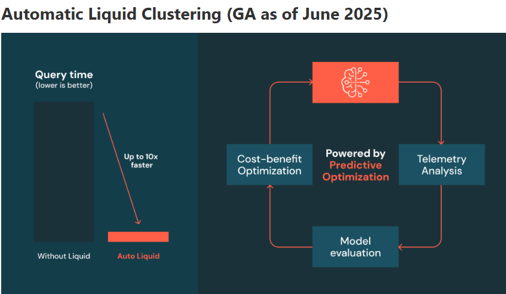

#### Zusammenfassung Liquid Clustering

Diese Tabelle war nach **FlightNum** und **id** geclustert und wurde nach der Spalte **id** abgefragt. Dies ermöglicht es Spark, das Lesen der Daten zu optimieren. Dieses Query sollte in etwa 2 Sekunden ausgeführt werden, deutlich schneller als bei der Tabelle **flights** mit einem ZORDER auf **FlightNum** bei demselben Query (~28 Sekunden).

In den obigen Demos haben Sie die Clustering-Keys manuell ausgewählt. **Automatic Liquid Clustering** nimmt Ihnen diese Entscheidung ab — Databricks analysiert Ihre Workload und wählt die optimalen Keys für Sie aus.

Angetrieben von **Predictive Optimization**, funktioniert es, indem es Query-Prädikate (`WHERE`-Klauseln und `JOIN`-Filter) überwacht, modelliert, welche Clustering-Keys die gescannte Datenmenge am stärksten reduzieren würden, und Änderungen nur dann anwendet, wenn der erwartete Performance-Gewinn die Kosten des Clustering übersteigt. Dies läuft asynchron ab und **passt sich im Laufe der Zeit an**, wenn sich die Query-Muster ändern.

Databricks empfiehlt es für **alle von Unity Catalog verwalteten Tabellen** — insbesondere dann, wenn Sie unsicher sind, nach welchen Spalten geclustert werden soll, sich Query-Muster verändern oder Sie einen automatisierten Ansatz über viele Tabellen hinweg wünschen. Voraussetzungen sind **DBR 15.4 LTS+**, **von Unity Catalog verwaltete Delta-Tabellen** sowie **aktivierte Predictive Optimization** auf dem Katalog oder Schema.

#### Referenzen

- [Announcing Automatic Liquid Clustering](https://www.databricks.com/blog/announcing-automatic-liquid-clustering) (Blog)
- Documentation: [AWS](https://docs.databricks.com/aws/en/delta/clustering#automatic-liquid-clustering) | [Azure](https://learn.microsoft.com/en-us/azure/databricks/delta/clustering#automatic-liquid-clustering) | [GCP](https://docs.databricks.com/gcp/en/delta/clustering#automatic-liquid-clustering)