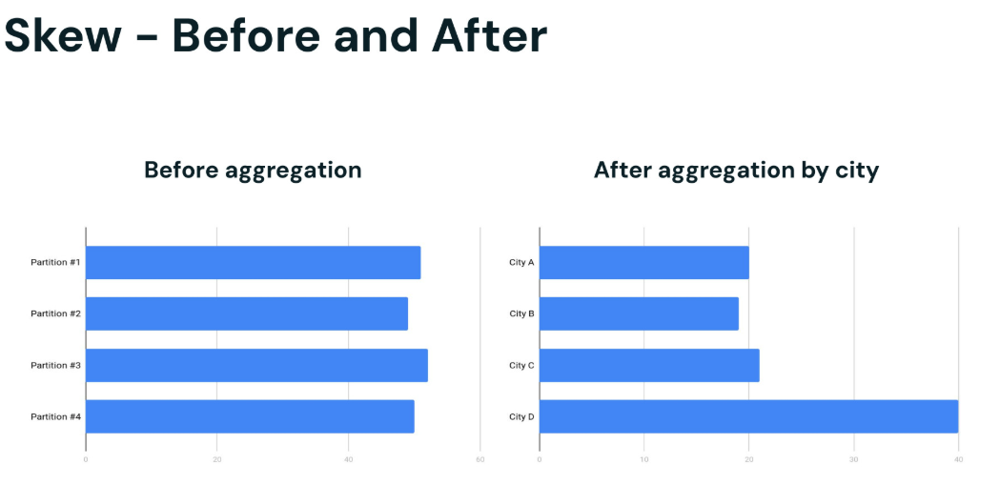
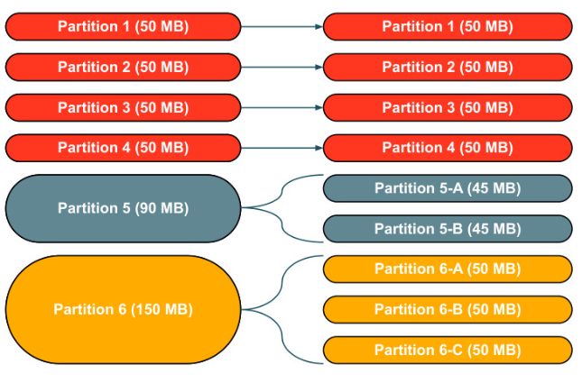

# 3_1_Skew

Diese Lektion erklärt, was Data Skew ist, welche Auswirkungen es auf die Performance hat und wie man effektiv damit umgeht und es abmildert.

Skew

- Daten werden typischerweise **in 128-MB-Partitionen eingelesen** und gleichmäßig verteilt
- Während die Daten transformiert werden (z. B. aggregiert), kann es vorkommen, dass eine Spark-Partition deutlich mehr Datensätze enthält als eine andere
- Ein geringes Maß an Skew kann ignoriert werden
- Aber starke Skews können zu Spill oder, schlimmer noch, zu schwer diagnostizierbaren OOM-Fehlern führen

Beispiel

- In diesem Beispiel haben wir 4 Partitionen. Sie sollten nach dem initialen Ingest durch Spark gleichmäßig verteilt sein.
- Stadt A, B und C könnten ähnlich groß sein, WENN die Daten mit etwas wie der Bevölkerungszahl korrelieren. Die Annahme hier ist, dass die Städte A, B und C gleich groß sind.
- Aber Stadt D hat doppelt so viele Einwohner, also auch doppelt so viele Datensätze
- Wer weiß, wie die Städte E bis ZZZ aussehen - für diese Veranschaulichung spielt das keine Rolle.

Skew - Auswirkungen

Wenn Stadt D 2x größer ist als A, B oder C ...

- dauert die Verarbeitung 2x so lange
- wird 2x so viel RAM benötigt

Die Konsequenzen daraus sind ...

- Die gesamte Stage dauert so lange wie der am längsten laufende Task
- Möglicherweise reicht der RAM für diese skew-behafteten Partitionen nicht aus

Hinweise:

- Sobald nach Stadt aggregiert wurde, können wir erwarten, dass die Partition mit D proportional größer ist als unsere anderen drei Städte.
- Eine größere Partition bedeutet mehr Datensätze. Mehr Datensätze bedeuten, dass Spark länger braucht, um diese Partition zu verarbeiten.
- In unserem Beispiel kann es für Spark doppelt so lange dauern, Stadt D zu verarbeiten, wie A, B oder C zu verarbeiten.

------

**Umgang mit Data Skew**

Wie gehen wir also mit Data Skew um? Das Schöne daran ist, dass die **Adaptive Query Execution** es ermöglicht, Skew auf sehr elegante Weise zu behandeln. Während viele Cloud-Systeme erfordern, dass man sich manuell darum kümmert, sorgt die in Spark **implementierte** AQE (Adaptive Query Execution) dafür, dass **größere Partitionen in kleinere Teile aufgebrochen und auf alle Cores verteilt werden, sodass die Tasks mit annähernd gleich viel Daten arbeiten.**

Data Skew ist unvermeidbar, Databricks behandelt dies automatisch

- In MPP-Systemen (Massively Parallel Processing Systems) wirkt sich Data Skew erheblich auf die Performance aus, da manche Worker deutlich mehr Daten verarbeiten.
- Die meisten Cloud-DWs erfordern eine manuelle, offline durchgeführte Redistribution, um Data Skew zu lösen.
- Mit **Adaptive Query Execution** zerlegt Spark größere Partitionen automatisch in kleinere, ähnlich große Partitionen.

------

**Skew - Mitigation**

1. Skew-behaftete Werte filtern

   - Wenn es möglich ist, die Werte herauszufiltern, um die herum der Skew entsteht, löst das das Problem auf einfache Weise.

Beispiel: Wenn Sie über eine Spalte mit vielen Null-Werten joinen, entsteht Data Skew. In diesem Szenario **löst das Herausfiltern der Null-Werte das Problem.**

2. Skew Hints
   - Wenn Sie die Tabelle, die Spalte und idealerweise auch die Werte identifizieren können, die den Data Skew verursachen, dann **können Sie Spark explizit über Skew Hints darauf hinweisen, sodass Spark versuchen kann, das Problem für Sie zu lösen.**

3. AQE Skew Optimization
   - Die AQE von Spark 3.0+ kann Data Skew auch dynamisch für Sie lösen. **Sie ist standardmäßig aktiviert, kann aber deaktiviert werden.** **Standardmäßig wird jede Partition, die mindestens 256 MB an Daten enthält und mindestens 5-mal so groß ist wie die durchschnittliche Partitionsgröße, von AQE als skew-behaftete Partition betrachtet.** Sie können diese Werte auch anpassen, um das Standardverhalten von AQE feinabzustimmen. Wenn Ihr Job mehr als 2.000 Shuffle-Partitionen hat, kann Spark die Größen der einzelnen Shuffle-Blöcke nicht mehr nachverfolgen; stattdessen werden nur noch Durchschnittsgrößen gespeichert, wodurch es AQE unmöglich wird, Skew zu erkennen. Sie können entweder die Anzahl der Shuffle-Partitionen auf unter 2.000 reduzieren oder die folgende Spark-Konfiguration auf einen Wert setzen, der größer ist als Ihre Anzahl an Shuffle-Partitionen, um dieses Problem zu lösen:

4. Salting
   - Wenn keine der oben genannten Optionen bei Ihnen funktioniert, bleibt als einzige weitere Option Salting. Es ist eine Strategie, um **eine große, skew-behaftete Partition in kleinere Partitionen aufzuteilen, indem den Werten der Skew-Spalte zufällige Ganzzahlen als Suffix angehängt werden.**

Drei "gängige" Lösungen

1. Adaptive Query Execution (standardmäßig aktiviert seit Spark 3.1)
2. Skew-behaftete Werte filtern
3. Databricks' [proprietärer] Skew Hint
   - Es ist einfacher, einen einzelnen Hint hinzuzufügen, als die Keys zu salten
   - Eine gute Option für Versionen von Spark 2.x
4. Die Join Keys salten, um eine gleichmäßige Verteilung beim Shuffle zu erzwingen
   - Wenn keine der Optionen geeignet ist, bleibt Salting die einzige Alternative
   - Dabei wird eine große, skew-behaftete Partition in kleinere aufgeteilt, indem zufällige Ganzzahlen als Suffix hinzugefügt werden.