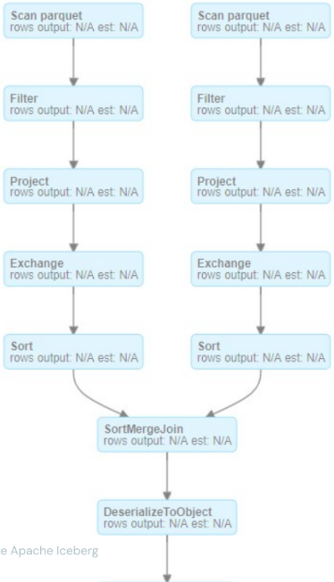
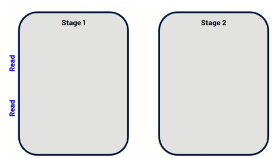
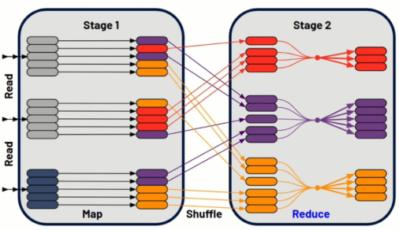
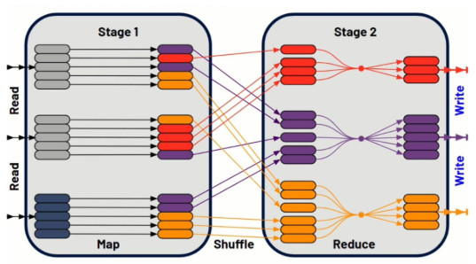

# 3_2_Shuffles

Diese Lektion erklärt, was Shuffles in Spark sind, wie sie funktionieren und mit welchen Strategien man ihre Auswirkungen abmildern kann.

**Job**: Ein Job in Apache Spark bezeichnet die **gesamte Berechnung**, die auf den Daten ausgeführt werden muss. Er besteht aus einer oder mehreren Stages.

**Stage**: Eine Stage ist eine **Sammlung von Tasks, die gemeinsam ausgeführt werden können**. Stages werden basierend auf den auf die Daten angewendeten Transformationen gebildet und stellen eine Arbeitseinheit dar.

**Task**: **Ein Task ist die kleinste Arbeitseinheit in Spark.** Jeder Task führt eine identische Operation auf einer Partition der Daten aus.

**Wide Transformation**: Eine Wide Transformation ist eine Operation, die zwei Stages zur Fertigstellung benötigt. **Sie beinhaltet häufig einen Shuffle**, also den Prozess der Neuverteilung von Daten über Partitionen hinweg. Beispiele für Wide Transformations sind join(), distinct(), groupBy(), orderBy() sowie einige Actions wie count().

**Narrow Transformation**: Eine Narrow Transformation ist eine Operation, die nur eine Stage zur Fertigstellung benötigt. Im Gegensatz zu Wide Transformations **ist bei Narrow Transformations kein Shuffle erforderlich**.

**Shuffle**: Shuffling bezeichnet das **Verschieben von Daten von der Ausgabe einer Stage zur Eingabe einer anderen**. Es ist ein Nebeneffekt von Wide Transformations und eine kritische Operation, bei der Daten neu verteilt und reorganisiert werden.

------

**Shuffles im Überblick**

Was also ist ein Shuffle? Hier haben wir einen zweistufigen Job, bei dem eine Stage abgeschlossen sein muss und am Ende dieser Stage Daten erzeugt werden, verbunden mit irgendeiner Transformation oder einem sonstigen Vorgang. Stage zwei findet statt, nachdem Stage eins abgeschlossen ist. Nun betrachten wir MapReduce und wie dies über diese beiden Stages angewendet werden kann.

------

Zunächst werden die Daten in Stage eins eingelesen. Wir führen den Map-Vorgang bzw. die Map-Transformation aus, und anschließend haben wir Daten, die zum Reducer verschoben werden müssen.

------

Jetzt shuffeln wir, da diese Map dazu geführt hat, dass Daten basierend auf diesem spezifischen Mapping in Stage zwei verschoben werden müssen. Dabei werden Daten überall hin verteilt, was Netzwerkbewegungen von einem Worker zum anderen darstellt. Während diese Worker bestimmte Tasks ausführen, müssen wir Dinge im Netzwerk des Cloud-Anbieters hin- und herbewegen - das ist ein Shuffle.

------

Anschließend folgt das Reduce, und wir erhalten unsere ausgegebenen Daten.

------

Unsere ausgegebenen Daten müssen dann in einen DataFrame oder eine Tabelle geschrieben werden, je nachdem, worum es sich handelt. Wir haben Stage eins und Stage zwei, die abgeschlossen werden, und dazwischen findet der Shuffle statt. Dies ist ein Ergebnis davon, dass Daten basierend auf dem in Stage eins erfolgten Mapping zugewiesen und anschließend so reorganisiert werden, dass sie durch die Reducer-Funktion geschleust werden können.

------

**Shuffles - Mitigation**

1. Durch die Verwendung von **weniger und größeren VMs (z. B. mehr Cores)** zahlen wir weiterhin die Kosten für Disk-IO, reduzieren aber den Network-IO

2. **AQE (Adaptive Query Execution) & DPP (Dynamic Partition Pruning)** sollten es zunehmend unnötig machen, Datasets zu denormalisieren, da Spark sich weiterentwickelt. Außerhalb von Spark 3 ist es jedoch weiterhin eine sinnvolle Strategie

Bucketing

- "Wenn Sie Datasets bucketen, machen Sie es falsch" - DT
- Bucketing ist schwer richtig umzusetzen und von vornherein eine teure Operation ... besonders wenn Sie ein Dataset bucketen, das sich periodisch ändert
- Eliminiert den Sort im Sort-Merge Join durch vorsortierte Partitionen
- Die Kosten fallen bei der Erstellung des Datasets an, in der Annahme, dass Einsparungen durch häufige Joins beider Tabellen erzielt werden
- Für Datasets unter 1-5 TB nicht in Betracht zu ziehen
- DT = Daniel Tomes, aus einer seiner Präsentationen auf dem Spark Summit

- Network-IO reduzieren durch die Verwendung von weniger, dafür größeren Workern
- Shuffle Reads & Writes beschleunigen durch die Verwendung von NVMe & SSDs
- Menge der geshuffelten Daten reduzieren
  - Unnötige Spalten entfernen
  - Unnötige Datensätze vorab herausfiltern
- Datasets denormalisieren, besonders wenn der Shuffle durch einen Join verursacht wird

Join-Strategie neu bewerten:

- Umordnen des Joins
- Dynamisches Wechseln der Join-Strategie
- Broadcast Hash Join
- Shuffle Hash Joins (Standard für Databricks Photon)
- Sort-Merge Join (Standard für OS Spark)