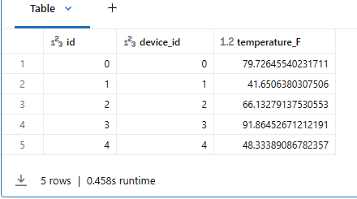

# 3_Generate Data

Lassen Sie uns die Daten generieren, die wir in dieser Demo verwenden werden. Dazu synthetisieren wir Telemetriedaten, die Temperaturmesswerte darstellen. Diesmal generieren wir jedoch nur 60 Messwerte und erstellen eine Tabelle mit dem Namen **device_data**.

```python
from pyspark.sql.functions import *

## Tabelle löschen, falls sie existiert
spark.sql('DROP TABLE IF EXISTS device_data')

## Tabelle erstellen
spark.sql('DROP TABLE IF EXISTS device_data')

df = (spark
      .range(0, 60, 1, 1)
      .select(
          'id',
          (col('id') % 1000).alias('device_id'),
          (rand() * 100).alias('temperature_F')
      )
      .write
      .saveAsTable('device_data')
)

## Tabelle anzeigen
display(spark.sql('SELECT * FROM device_data LIMIT 5'))
```

**Output:**



