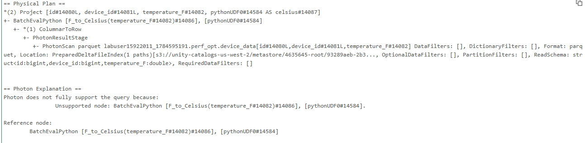

# 4_Python UDF

Erstellen und verwenden Sie eine Python UDF auf zwei Arten.

- Rechenintensive Python UDF
- Parallelisierung einer Python UDF durch Repartitioning

## 1_Rechenintensive Python UDF

Zu Experimentierzwecken implementieren wir eine Funktion, die Fahrenheit in Celsius umrechnet. Beachten Sie, dass wir eine einsekündige Pause (sleep) einfügen, um innerhalb unserer UDF eine rechenintensive Operation zu simulieren. Probieren wir es aus.

```python
from pyspark.sql.functions import *
from pyspark.sql.types import *
import time

## Die Python UDF erstellen
@udf("double")
def F_to_Celsius(f):
    # Tun wir so, als würde eine ausgefeilte Berechnung pro Zeile eine Sekunde dauern
    time.sleep(1)
    return (f - 32) * (5/9)

spark.sql('DROP TABLE IF EXISTS celsius')

## Die Daten vorbereiten
celsius_df = (spark
              .table('device_data')
              .withColumn("celsius", F_to_Celsius(col('temperature_F')))
            )

## Die Tabelle erstellen
(celsius_df
 .write
 .mode('overwrite')
 .saveAsTable('celsius')
)
```

Führen Sie den Code aus, um zu sehen, wie viele Partitionen für die Query verwendet wurden. Beachten Sie, dass nur **1 Partition** verwendet wurde, da die UDF die parallelen Verarbeitungsmöglichkeiten von Spark nicht nutzt, was die Query verlangsamt.

```python
print(f'Total number of cores across all executors in the cluster: {spark.sparkContext.defaultParallelism}')
print(f'The number of partitions in the underlying RDD of a dataframe: {celsius_df.rdd.getNumPartitions()}')

# Output:
# Gesamtzahl der Kerne über alle Executors im Cluster: 4
# Anzahl der Partitionen im zugrunde liegenden RDD eines DataFrames: 1
```

Erklären Sie den Spark-Ausführungsplan. Beachten Sie, dass die Stage **BatchEvalPython** darauf hinweist, dass eine Python UDF verwendet wird.

```python
celsius_df.explain()
```

**Output:**



#### Zusammenfassung

Das dauerte etwa eine Minute, was einigermaßen überraschend ist, da wir etwa 60 Sekunden an Berechnung haben, die über mehrere Cores verteilt sind. Sollte es nicht deutlich schneller gehen?

Die Antwort auf diese Frage ist ja, es sollte weniger Zeit in Anspruch nehmen. Das Problem hierbei ist, dass Spark nicht weiß, dass die Berechnungen aufwändig sind, und die Arbeit daher nicht in Tasks aufgeteilt hat, die parallel ausgeführt werden können. Das lässt sich beobachten, indem man zusieht, wie der eine Task vor sich hin arbeitet, während die Zelle läuft, sowie durch einen Blick in die Spark UI.

------

## 2_Parallelisierung einer Python UDF durch Repartitioning

Repartitioning ist in diesem Fall die Lösung. *Wir* wissen, dass diese Berechnung aufwändig ist und sich über alle 4 Cores erstrecken sollte, daher können wir den DataFrame explizit repartitionieren:

```python
# Über die Anzahl der Cores in Ihrem Cluster repartitionieren
num_cores = 4

@udf("double")
def F_to_Celsius(f):
    # Tun wir so, als würde eine ausgefeilte Berechnung pro Zeile eine Sekunde dauern
    time.sleep(1)
    return (f - 32) * (5/9)

spark.sql('DROP TABLE IF EXISTS celsius')

celsius_df_cores = (spark.table('device_data')
                    .repartition(num_cores) # <-- HERE
                    .withColumn("celsius", F_to_Celsius(col('temperature_F')))
             )

(celsius_df_cores
 .write
 .mode('overwrite')
 .saveAsTable('celsius')
)
```

Führen Sie den Code aus, um zu sehen, wie viele Partitionen für die Query verwendet werden. Beachten Sie, dass 4 Partitionen (Tasks) verwendet werden, um den Code parallel auszuführen.

```python
print(f'Total number of cores across all executors in the cluster: {spark.sparkContext.defaultParallelism}')
print(f'The number of partitions in the underlying RDD of a dataframe: {celsius_df_cores.rdd.getNumPartitions()}')

# Output: 
# Gesamtzahl der Kerne über alle Executors im Cluster: 4
# Anzahl der Partitionen im zugrunde liegenden RDD eines DataFrames: 4
```

####  Zusammenfassung

Der repartition-Befehl ist eine empfohlene Best Practice, um sicherzustellen, dass Ihre UDF parallel und verteilt ausgeführt wird.

