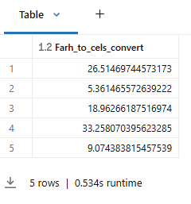
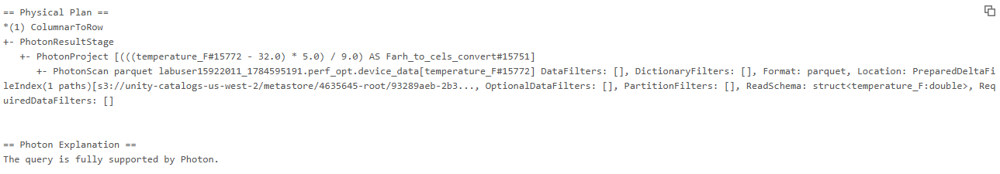

# 5_SQL UDFs

Die Möglichkeit, benutzerdefinierte Funktionen in Python und Scala zu erstellen, ist praktisch, da sie es erlaubt, die Funktionalität in der Sprache Ihrer Wahl zu erweitern. Was die Optimierung betrifft, ist es jedoch wichtig zu wissen, dass SQL im Allgemeinen die beste Wahl ist, und zwar aus mehreren Gründen:

- SQL UDFs erfordern weniger Datenserialisierung
- Der Catalyst Optimizer kann innerhalb von SQL UDFs arbeiten

Lassen Sie uns das nun in Aktion sehen, indem wir die Performance einer SQL UDF mit ihrem Python-Gegenstück vergleichen.

Zunächst definieren wir die zuvor verwendete Python UDF neu, diesmal ohne die Verzögerung, damit wir die reine Performance vergleichen können.

------

Nun führen wir die äquivalente Operation über eine SQL UDF aus.

```sql
-- Dieselbe Funktion erstellen
DROP FUNCTION IF EXISTS farh_to_cels;

CREATE FUNCTION farh_to_cels (farh DOUBLE)
  RETURNS DOUBLE RETURN ((farh - 32) * 5/9);

-- Die Funktion verwenden, um die Tabelle zu erstellen
DROP TABLE IF EXISTS celsius_sql;

CREATE OR REPLACE TABLE celsius_sql AS
SELECT farh_to_cels(temperature_F) as Farh_to_cels_convert 
FROM device_data;

-- Die Daten anzeigen
SELECT * FROM celsius_sql LIMIT 5;
```

**Output:**



------

Erklären Sie den Query-Plan mit der SQL UDF. Beachten Sie, dass die SQL UDF vollständig von Photon unterstützt wird und performanter ist.

```sql
EXPLAIN 
SELECT farh_to_cels(temperature_F) as Farh_to_cels_convert 
FROM device_data
```

**Output:**



