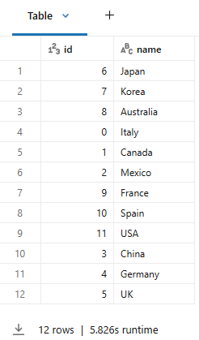

# 3_Creating Tables

Erstellen Sie die folgenden Tabellen für die Demonstration:

- **transactions**
- **stores**
- **countries**

## 1_Die Tabelle transactions erstellen

Lassen Sie uns die Daten generieren, die wir in dieser Demo verwenden werden. Zunächst synthetisieren wir Daten, die eine Reihe von Verkaufstransaktionen darstellen, und schreiben die Daten in eine Tabelle namens **transactions**.

Die Tabelle enthält *150.000.000* Zeilen.

```python
from pyspark.sql.functions import *

## Tabelle löschen, falls sie bereits existiert
spark.sql('DROP TABLE IF EXISTS transactions')

## Spark DataFrame erstellen und als Tabelle speichern
(spark
 .range(0, 150000000, 1, 32)
 .select(
    'id',
    round(rand() * 10000, 2).alias('amount'),
    (col('id') % 10).alias('country_id'),
    (col('id') % 100).alias('store_id')
 )
 .write
 .mode('overwrite')
 .saveAsTable('transactions')
)

## Vorschau der Tabelle
display(spark.sql('SELECT * FROM transactions LIMIT 10'))
```

## 2_Die Tabelle stores erstellen

Nun synthetisieren wir Daten und schreiben sie in eine Tabelle namens **stores**, die Informationen zu Verkaufsstellen beschreibt. Die Tabelle enthält 99 Zeilen.

```python
## Tabelle löschen, falls sie bereits existiert
spark.sql('DROP TABLE IF EXISTS stores')

## Spark DataFrame erstellen
(spark
 .range(0, 99)
 .select(
    'id',
    round(rand() * 100, 0).alias('employees'),
    (col('id') % 10).alias('country_id'),
    expr('uuid()').alias('name')
    )
 .write
 .mode('overwrite')
 .saveAsTable('stores')
)

## Tabelle anzeigen
display(spark.sql('SELECT * FROM stores LIMIT 10'))
```

## 3_Die Lookup-Tabelle countries erstellen

Nun erstellen wir eine Lookup-Tabelle, die **country_id** aus den Datentabellen dem tatsächlichen Ländernamen zuordnet. Die Tabelle **countries** enthält 12 Zeilen.

```python
## Tabelle löschen, falls sie bereits existiert
spark.sql('DROP TABLE IF EXISTS countries')

## Daten erstellen
countries = [(0, "Italy"),
             (1, "Canada"),
             (2, "Mexico"),
             (3, "China"),
             (4, "Germany"),
             (5, "UK"),
             (6, "Japan"),
             (7, "Korea"),
             (8, "Australia"),
             (9, "France"),
             (10, "Spain"),
             (11, "USA")
            ]

columns = ["id", "name"]

## Spark DataFrame und countries-Tabelle erstellen
countries_df = (spark
                .createDataFrame(data = countries, schema = columns)
                .write
                .mode('overwrite')
                .saveAsTable("countries")
            )

## Tabelle anzeigen
display(spark.sql('SELECT * FROM countries'))
```

**Ausgabe:**



