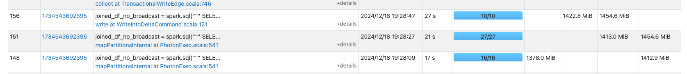
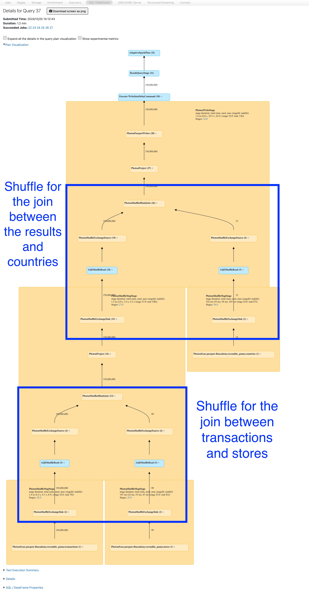
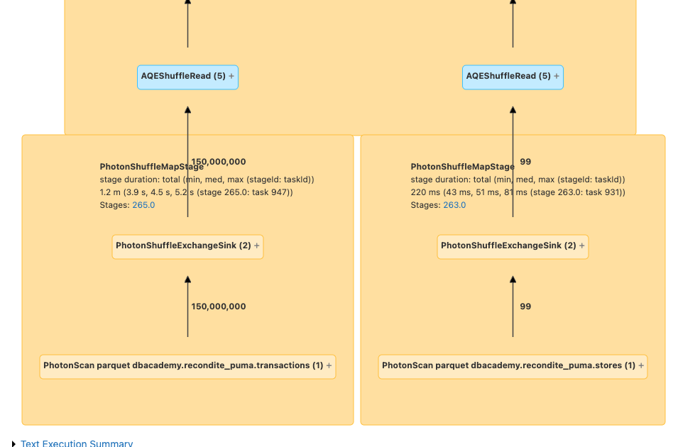
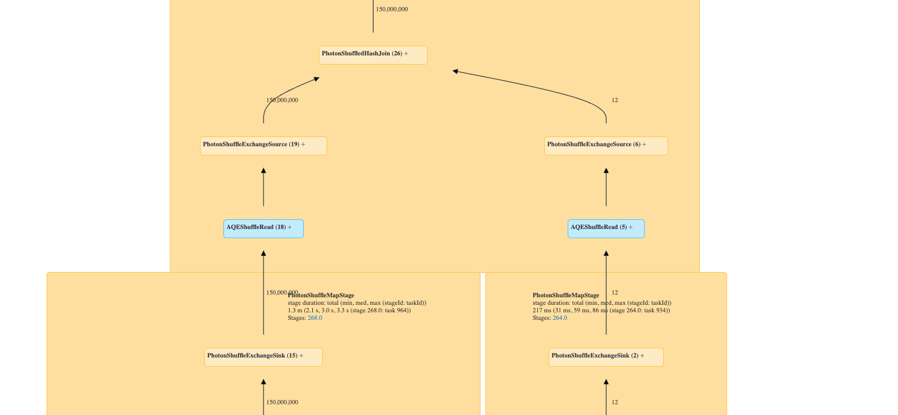
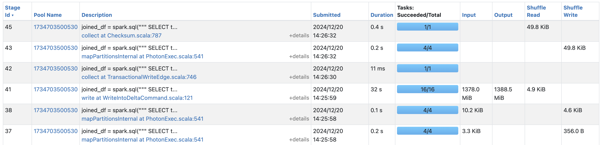
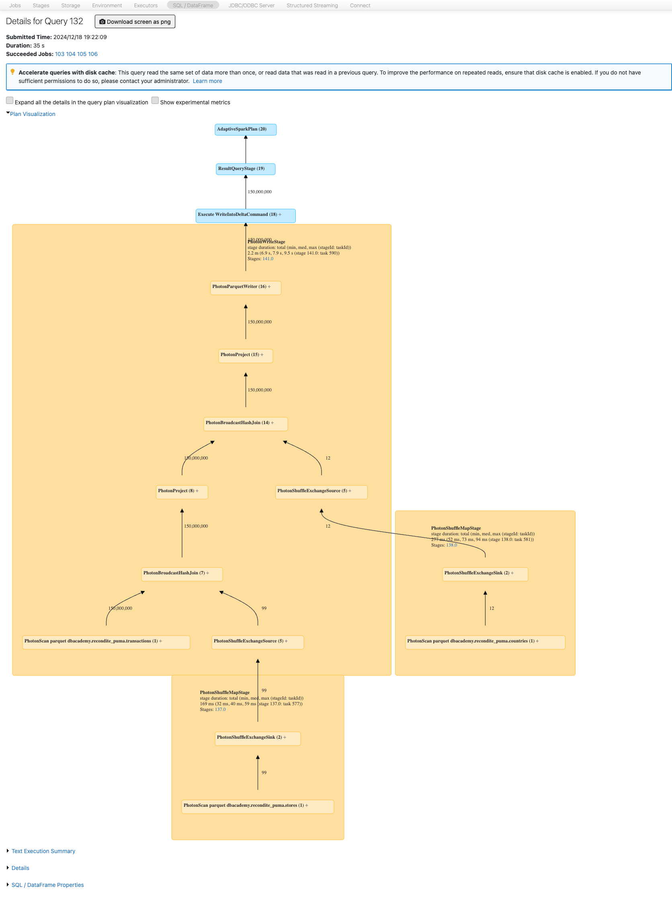

# 4_Joins

Nun führen wir eine Abfrage aus, die einen Shuffle auslöst, indem drei Tabellen miteinander verbunden werden, und schreiben die Ergebnisse in eine separate Tabelle.

## 1_Broadcast Joins deaktivieren, um Shuffle zu demonstrieren

Diese Optionen bestimmen automatisch, wann ein Broadcast Join verwendet werden soll, basierend auf der Größe des kleineren DataFrames (bzw. der kleineren Tabelle) im Join.

- [spark.sql.autoBroadcastJoinThreshold](https://spark.apache.org/docs/latest/sql-performance-tuning.html#automatically-broadcasting-joins) Dokumentation
- [spark.databricks.adaptive.autoBroadcastJoinThreshold](https://spark.apache.org/docs/latest/sql-performance-tuning.html#converting-sort-merge-join-to-broadcast-join) Dokumentation

Führen Sie die untenstehende Zelle aus, um die Standardwerte des Broadcast Join und der Adaptive Query Execution(AQE)-Konfigurationen anzuzeigen. Beachten Sie Folgendes:

- Der Standardwert für eine Tabelle bei einem Broadcast Join beträgt **10.485.760 Bytes**.
- Wenn AQE aktiviert ist, beträgt der Wert für den Broadcast Join **31.457.280 Bytes**.
- Beachten Sie, dass AQE standardmäßig aktiviert ist.

```python
print(f'Default value of autoBroadcastJoinThreshold: {spark.conf.get("spark.sql.autoBroadcastJoinThreshold")}')
print(f'Default value of adaptive.autoBroadcastJoinThreshold: {spark.conf.get("spark.databricks.adaptive.autoBroadcastJoinThreshold")}')
print(f'View if AQE is enabled: {spark.conf.get("spark.sql.adaptive.enabled")}')

# Output:
# Default value of autoBroadcastJoinThreshold: 10485760b
# Default value of adaptive.autoBroadcastJoinThreshold: 31457280b
# Anzeigen, ob AQE aktiviert ist: true
```

In dieser Zelle deaktivieren wir Broadcast Joins explizit, um einen Shuffle zu demonstrieren und Ihnen zu zeigen, wie Sie die Query Performance untersuchen und verbessern können.

```python
## Den automatischen Broadcast Join vollständig deaktivieren. Das bedeutet, Spark wird für Joins niemals einen Datensatz broadcasten, unabhängig von seiner Größe.
spark.conf.set("spark.sql.autoBroadcastJoinThreshold", -1)

# Deaktivieren der Broadcast-Join-Funktion unter AQE, was bedeutet, dass Spark auch bei aktivierter Adaptive Query Execution nicht versucht, die kleinere Seite eines Joins zu broadcasten.
spark.conf.set("spark.databricks.adaptive.autoBroadcastJoinThreshold", -1)

## Die neuen Werte anzeigen
print(f'Current value of autoBroadcastJoinThreshold: {spark.conf.get("spark.sql.autoBroadcastJoinThreshold")}')
print(f'Current value of adaptive.autoBroadcastJoinThreshold: {spark.conf.get("spark.databricks.adaptive.autoBroadcastJoinThreshold")}')

# Output:
# Current value of autoBroadcastJoinThreshold: -1
# Current value of adaptive.autoBroadcastJoinThreshold: -1
```

Führen Sie den Join von **transactions**, **stores** und **countries** durch, um eine Tabelle namens **transact_countries** zu erstellen, ohne Broadcast Joins zu verwenden. Beachten Sie, dass diese Abfrage etwa ~1 Minute zur Ausführung benötigt.

```python
joined_df_no_broadcast = spark.sql("""
    SELECT 
        transactions.id,
        amount,
        countries.name as country_name,
        employees,
        stores.name as store_name
    FROM
        transactions
    LEFT JOIN
        stores
        ON
            transactions.store_id = stores.id
    LEFT JOIN
        countries
        ON
            transactions.country_id = countries.id
""")

## Eine Tabelle mit den verbundenen Daten erstellen
(joined_df_no_broadcast
 .write
 .mode('overwrite')
 .saveAsTable('transact_countries')
)
```

Öffnen Sie die Spark UI auf der Seite Stages und beachten Sie, dass es zwei große Shuffles von Daten mit jeweils **1,4 GB** gab.

Ein Shuffle bezeichnet den Prozess der Umverteilung von Daten über verschiedene Nodes/Partitions hinweg. Dies ist bei Operationen wie Joins notwendig, bei denen Daten aus zwei oder mehr Datensätzen anhand eines Keys zusammengeführt werden müssen, die relevanten Zeilen sich jedoch möglicherweise nicht in derselben Partition befinden.

Um das Query-DAG anzuzeigen, führen Sie die folgenden Schritte aus:

1. Erweitern Sie in der obigen Zelle **Spark Jobs**.

2. Klicken Sie im zweiten Job mit der rechten Maustaste auf **View** und wählen Sie *Open in a New Tab*.

**HINWEIS:** In der Vocareum-Laborumgebung wird ein Fehler im Popup-Fenster angezeigt, wenn Sie auf **View** klicken, ohne es in einem neuen Tab zu öffnen.

3. Klicken Sie auf den Link **Stages** in der oberen Navigationsleiste. Beachten Sie, dass es in den Stages dieser spezifischen Abfrage sehr große **Shuffle Read**- und **Shuffle Write**-Operationen für die Abfrage gab.



4. Wählen Sie als Nächstes in der Tabelle **Completed Stages** den Link (**mapPartitionsInternal at...**) in der Spalte **Description** für die Zeile mit dem großen **Shuffle Read** und **Shuffle Write** sowie den Link **Jobs** in der oberen Navigationsleiste. Im obigen Bild wäre dies beispielsweise Zeile **151**.

5. Wählen Sie dann den Zahlen-Link in der Tabelle oben unter **Associated Job ID**. Klicken Sie anschließend auf die Zahl unter **Associated SQL Query**. Dort können Sie den gesamten Query Plan (DAG) einsehen.



6. Führen Sie im Query Plan die folgenden Schritte aus:

   ##### 6a. Shuffle Join mit transactions und stores



- Suchen Sie **PhotonScan parquet dbacademy.your-schema-name.transactions (1)**.

- Erweitern Sie oberhalb dieser Tabelle **PhotonShuffleExchangeSink (2)**.

- Beachten Sie, dass der Shuffle für den ersten Join mit der Tabelle **stores** rund 1,4 GB verwendet.

##### 6b. Shuffle Join des Ergebnisses mit countries



- Suchen Sie **PhotonShuffleExchangeSource** auf der linken Seite oberhalb von **AQEShuffleRead** für das Ergebnis des vorherigen Joins.
- Erweitern Sie **PhotonShuffleExchangeSource**.
- Beachten Sie, dass ein weiterer Shuffle mit rund 1,4 GB für den Join der Ergebnisse des ersten Joins mit der Tabelle **countries** durchgeführt wurde.

## 2_Enabling Broadcast Join

Der Broadcast Join vermeidet den Shuffle. In den obigen Zellen haben wir Broadcast Joins explizit deaktiviert, aber jetzt setzen wir die Konfiguration wieder auf den Standardwert zurück, damit der Broadcast Join aktiviert ist, um die Abfragen zu vergleichen.

Dies funktioniert in diesem Fall, weil mindestens eine der Tabellen in jedem Join relativ klein ist und unter den Schwellenwerten liegt:

- < 10 MB für einen Broadcast Join ohne AQE
- < 30 MB für einen Broadcast Join mit AQE

```python
# Die Standardkonfigurationen für Broadcast Joins setzen
spark.conf.unset("spark.sql.autoBroadcastJoinThreshold")
spark.conf.unset("spark.databricks.adaptive.autoBroadcastJoinThreshold")

## Die Standardwerte anzeigen
print(f'Current value of autoBroadcastJoinThreshold: {spark.conf.get("spark.sql.autoBroadcastJoinThreshold")}')
print(f'Current value of adaptive.autoBroadcastJoinThreshold: {spark.conf.get("spark.databricks.adaptive.autoBroadcastJoinThreshold")}')

# Output:
# Current value of autoBroadcastJoinThreshold: 10485760b
# Current value of adaptive.autoBroadcastJoinThreshold: 31457280b
```

Führen Sie die Abfrage aus, um denselben Join wie zuvor durchzuführen. Beachten Sie, dass diese Abfrage etwa in der halben Zeit des vorherigen Joins ausgeführt wird.

```python
joined_df = spark.sql("""
    SELECT 
        transactions.id,
        amount,
        countries.name as country_name,
        employees,
        stores.name as store_name
    FROM
        transactions
    LEFT JOIN
        stores
        ON
            transactions.store_id = stores.id
    LEFT JOIN
        countries
        ON
            transactions.country_id = countries.id
""")

(joined_df
 .write
 .mode('overwrite')
 .saveAsTable('transact_countries')
)
```

Dies ist eine Verbesserung. Wenn Sie erneut auf den **Stages**-Tab der Spark UI schauen, stellen Sie fest, dass es keine großen Shuffle Reads mehr gibt. Nur die kleinen Tabellen wurden geshuffelt, die große Tabelle jedoch nicht, sodass wir das zweimalige Verschieben von 1,4 GB vermieden haben.

Betrachten Sie die Stages dieser Abfrage. Beachten Sie, dass die großen Shuffles vermieden wurden, was die Query-Effizienz verbessert.



Sie können sich auch den Query Plan ansehen und erkennen, dass die großen Tabellen nicht geshuffelt wurden.



Broadcast Joins können deutlich schneller sein als Shuffle Joins, wenn eine der Tabellen sehr groß und die andere klein ist. Leider funktionieren Broadcast Joins nur, wenn mindestens eine der Tabellen kleiner als 100 MB ist. Wenn größere Tabellen verbunden werden sollen und wir den Shuffle vermeiden möchten, müssen wir möglicherweise unser Schema überdenken, um den Join von vornherein zu vermeiden.