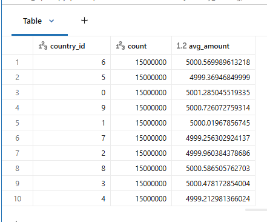
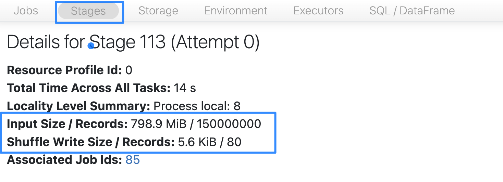

# 5_Aggregations

Aggregations verwenden ebenfalls einen Shuffle, sind jedoch oft deutlich günstiger. Die folgende Zelle führt eine Abfrage aus, die dies demonstriert.

```sql
SELECT 
  country_id, 
  COUNT(*) AS count,
  AVG(amount) AS avg_amount
FROM transactions
GROUP BY country_id
ORDER BY count DESC
```

**Ausgabe:**



------

Das ging schnell! Hier passiert eine ganze Menge. Einer der wichtigsten Punkte ist, dass wir nur die Counts und Summen shuffeln, die zur Berechnung der angeforderten Counts und Durchschnittswerte notwendig sind. Dies führt nur zu einem Shuffle von wenigen KB. Verwenden Sie erneut die Spark UI, um dies zu überprüfen.



Der Shuffle ist also im Vergleich zu den Shuffle Joins, bei denen alle Daten geshuffelt werden müssen, günstig. Es hilft außerdem, dass unsere Ausgabe in diesem Fall praktisch 0 ist.