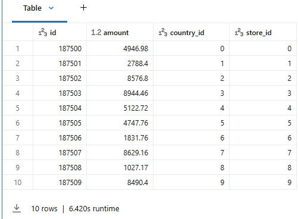
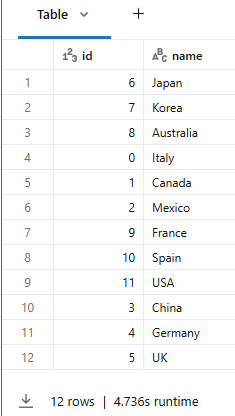
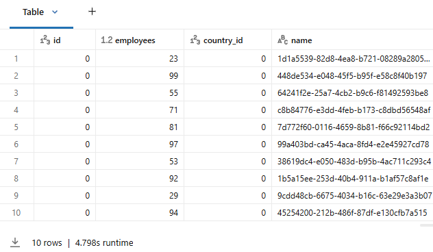

# 3_Creating & Storing Data

## 1_Die Tabelle transactions erstellen

Generieren Sie die **transactions**-Tabelle mit dem unten stehenden Schema und schreiben Sie sie in eine Tabelle. Dies ist die Tabelle mit der größten Datenmenge und enthält 2.000.000 Zeilen.

```python
from pyspark.sql.functions import *

## Tabelle löschen, falls sie bereits existiert
spark.sql('DROP TABLE IF EXISTS transactions')

## Tabelle erstellen
transactions_df = (spark
                   .range(0, 2000000, 1, 32)
                    .select(
                        'id',
                        round(rand() * 10000, 2).alias('amount'),
                        (col('id') % 10).alias('country_id'),
                        (col('id') % 100).alias('store_id')
                    )
                    .write
                    .mode('overwrite')
                    .option("overwriteSchema", "true")
                    .saveAsTable('transactions')
                )

## Tabelle anzeigen
display(spark.sql('SELECT * FROM transactions LIMIT 10'))
```

**Ausgabe:**



------

## 2_Die Tabelle countries erstellen

Generieren Sie die **countries**-Tabelle, um sie später mit der **transactions**-Tabelle zu joinen.

```python
## Tabelle löschen, falls sie bereits existiert
spark.sql('DROP TABLE IF EXISTS countries')

## Tabelle erstellen
countries = [(0, "Italy"),
             (1, "Canada"),
             (2, "Mexico"),
             (3, "China"),
             (4, "Germany"),
             (5, "UK"),
             (6, "Japan"),
             (7, "Korea"),
             (8, "Australia"),
             (9, "France"),
             (10, "Spain"),
             (11, "USA")
            ]
columns = ["id", "name"]

countries_df = (spark
                .createDataFrame(data = countries, schema = columns)
                .write
                .mode('overwrite')
                .saveAsTable("countries")
            )

## Tabelle anzeigen
display(spark.sql('SELECT * FROM countries'))
```

**Ausgabe:**



------

## 3_Die Tabelle stores erstellen

- Generieren Sie die **stores**-Tabelle, um sie später mit der **transactions**-Tabelle zu joinen.
- Die **stores**-Tabelle enthält absichtlich Duplikate des Werts **id**, wodurch ein exploding join mit der **transactions**-Tabelle entsteht.
- Beim Joinen der **transactions**-Tabelle mit der **stores**-Tabelle explodiert eine Reihe von Zeilen aufgrund der duplizierten **ids**.

```python
## Tabelle löschen, falls sie bereits existiert
spark.sql('DROP TABLE IF EXISTS stores')

stores_df = (spark
                .range(0, 9999)
                .select(
                    (col('id') % 100).alias('id'), # IDs absichtlich duplizieren, um den join zu explodieren
                    round(rand() * 100, 0).alias('employees'),
                    (col('id') % 10).alias('country_id'),
                    expr('uuid()').alias('name')
                )
                .write
                .mode('overwrite')
                .saveAsTable('stores')
            )

## Tabelle anzeigen
display(spark.sql('SELECT * FROM stores ORDER BY id LIMIT 10'))
```

**Ausgabe:**



------

