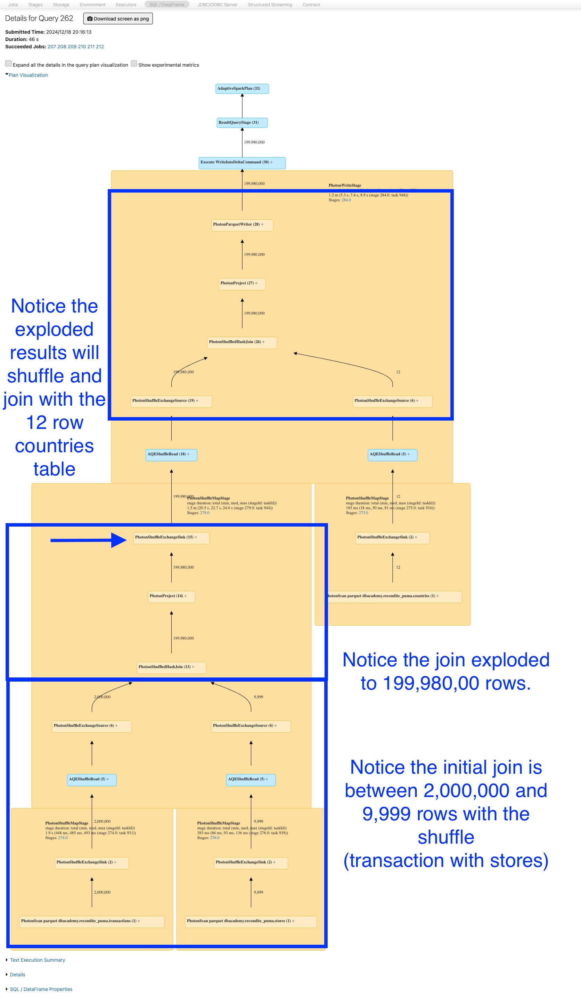
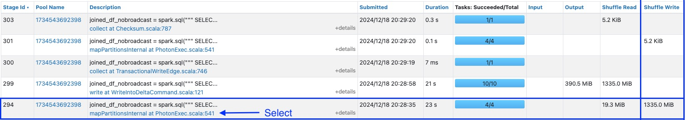
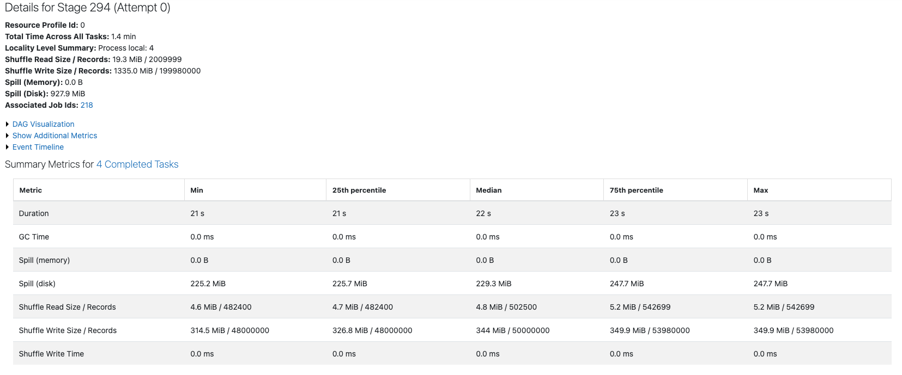

# 4_Einen Exploding Join ausführen

Deaktivieren Sie in dieser Zelle broadcast joins, um die Performance-Verbesserungen durch die Anpassung der join-Strategie schrittweise zu demonstrieren.

- [spark.sql.autoBroadcastJoinThreshold](https://spark.apache.org/docs/latest/sql-performance-tuning.html#automatically-broadcasting-joins) Dokumentation
- [spark.databricks.adaptive.autoBroadcastJoinThreshold](https://spark.apache.org/docs/latest/sql-performance-tuning.html#converting-sort-merge-join-to-broadcast-join) Dokumentation

```python
## Deaktiviert den automatischen broadcast join vollständig. Das heißt, Spark wird für joins niemals ein Dataset per broadcast versenden, unabhängig von dessen Größe.
spark.conf.set("spark.sql.autoBroadcastJoinThreshold", -1)

# Deaktiviert die broadcast-join-Funktion unter AQE, das heißt, selbst bei Verwendung der adaptive query execution wird Spark nicht versuchen, die kleinere Seite eines joins per broadcast zu versenden.
spark.conf.set("spark.databricks.adaptive.autoBroadcastJoinThreshold", -1)
```

Wir werden die **transactions**-Tabelle mit den Daten von **countries** und **stores** joinen und die Aktion auslösen, indem wir das Ergebnis in eine Tabelle namens **transact_countries** schreiben. Die Query wurde bereits für Sie geschrieben.

Führen Sie die Zelle aus, notieren Sie sich die Ausführungszeit der Query und vergleichen Sie diese mit jeder Optimierung.

**HINWEIS:** Dies sollte etwa ~1 Minute dauern.

```python
joined_df_nobroadcast = spark.sql("""
    SELECT 
        transactions.id,
        amount,
        countries.name as country_name,
        employees,
        stores.name as store_name
    FROM
        transactions
    JOIN
        stores
        ON
            transactions.store_id = stores.id
    JOIN
        countries
        ON
            transactions.country_id = countries.id
""")

(joined_df_nobroadcast
 .write
 .mode('overwrite')
 .saveAsTable('transact_countries')
)
```

------

## 1_TODO: Den Exploding Join ansehen

Öffnen Sie die Spark UI und navigieren Sie zur Seite **Stages**. Identifizieren Sie die Explosion der Zeilen im DAG der Spark UI. Um den DAG anzuzeigen, gehen Sie wie folgt vor:

1. Erweitern Sie in der obigen Zelle **Spark Jobs**.

2. Klicken Sie beim ersten job mit der rechten Maustaste auf **View** und wählen Sie *Open in a New Tab*.

   - **Wenn der erste job nicht die korrekten Informationen anzeigt, versuchen Sie es mit dem zweiten**.

**HINWEISE:** In der Vocareum-Lab-Umgebung wird ein Fehler im Pop-up-Fenster angezeigt, wenn Sie auf **View** klicken, ohne es in einem neuen Tab zu öffnen.

3. Suchen Sie im neuen Fenster oben die Überschrift **Jobs** und klicken Sie auf die Zahl unter **Associated SQL Query**.

4. Hier sollten Sie den gesamten query plan sehen. Lesen Sie den DAG-Graphen von unten nach oben, um die Details des Ausführungsplans besser zu verstehen.



5. Erweitern Sie im query plan unterhalb der Zeilenzahl (199.980.000) das Feld **PhotonShuffleExchangeSink** (der Pfeil im obigen Bild zeigt Ihnen, was Sie erweitern sollen). Beachten Sie, dass die **metric** für *estimated rows output* nach dem Joinen der **transactions**-Tabelle mit der **stores**-Tabelle um das 100-fache explodiert ist, was durch Duplikate der store-id in der stores-Tabelle verursacht wird.

6. Betrachten Sie an derselben Stelle die **metric** **num bytes spilled to disk due to memory pressure total (min, med, max)**. Beachten Sie, dass *927,6 MiB* (Wert kann variieren) auf die Festplatte gespillt wurden.

7. Lassen Sie die Spark UI geöffnet.

------

## 2_TODO: Den Spill ansehen

Betrachten Sie in der Spark UI den memory spill.

1. Wählen Sie in der Spark UI in der oberen Navigationsleiste **Stages**. Hier sehen Sie alle auf dem cluster ausgeführten stages.
2. Suchen Sie die stage mit der größten Menge an **Shuffle Writes** (sollte etwa 1335,0 MiB betragen, kann aber variieren) für die Query in der Spalte **Description**, die mit `joined_df_nobroadcast = spark("""SELECT...)` beginnt.
3. Nachdem Sie diese stage gefunden haben, wählen Sie den Link im Feld **Description** aus.



4. Betrachten Sie das Feld **Spill (Disk)** für die stage. Beachten Sie, dass diese Query auf die Festplatte gespillt hat.

​	**HINWEIS:** In Apache Spark werden, wenn mehr Daten vorhanden sind, als im Speicher verarbeitet werden können, einige der 	zusätzlichen Daten auf die Festplatte ausgelagert. Dies wird als *spilling to disk* bezeichnet, und die 927,9 MiB bedeuten, 	dass etwa 927,9 Megabyte an Daten auf die Festplatte verschoben werden mussten, um die Verarbeitung fortzusetzen.



5. Betrachten Sie auf derselben Seite die **Locality Level Summary**. Dies bedeutet, dass die Anzahl der partitions in dieser stage 4 beträgt. Überlegen Sie: Ist dies eine gute Einstellung?
6. Schließen Sie den Spark-UI-Browser.

